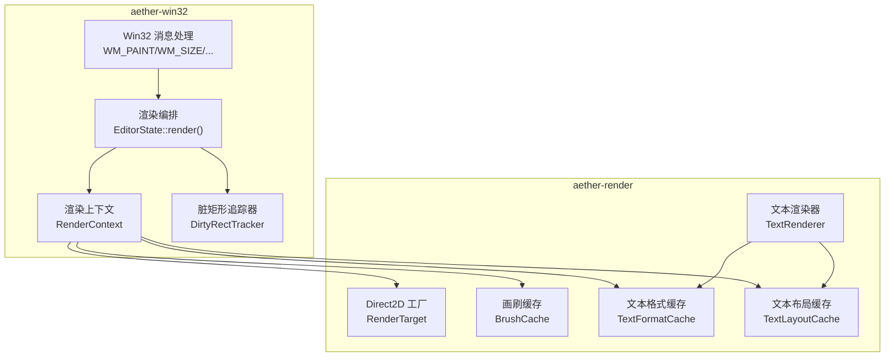
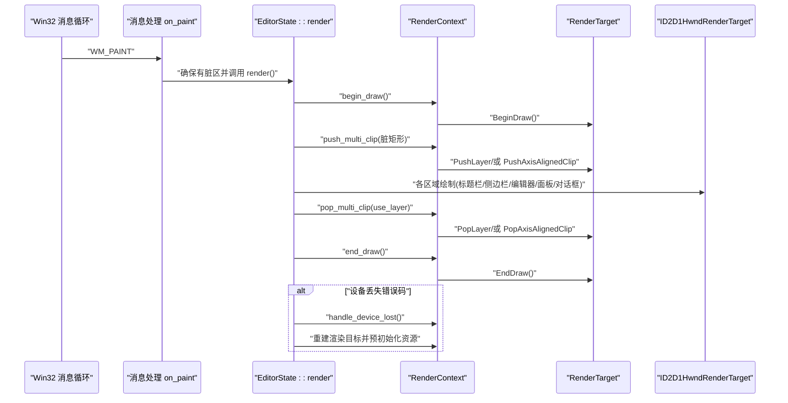
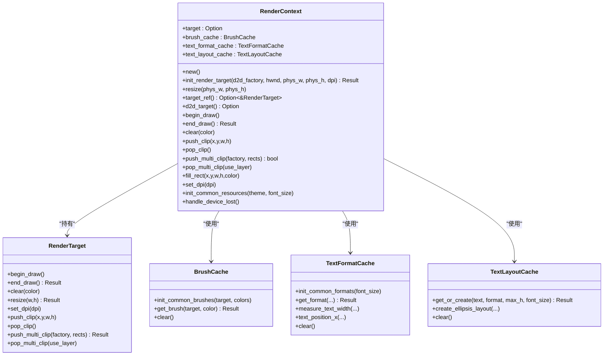
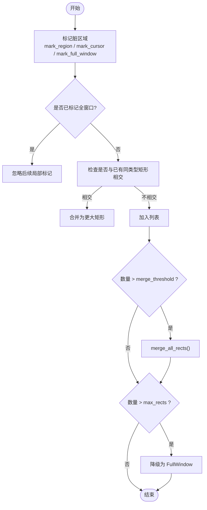
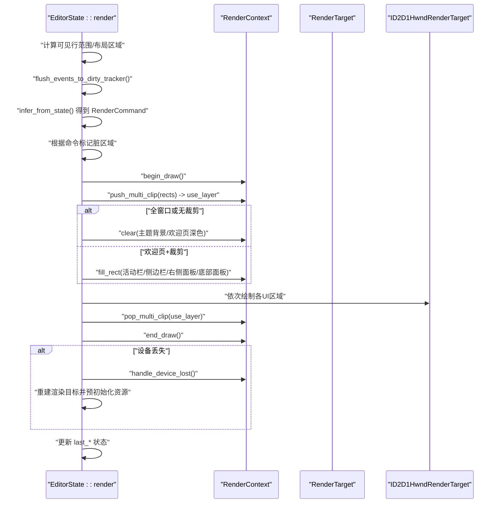
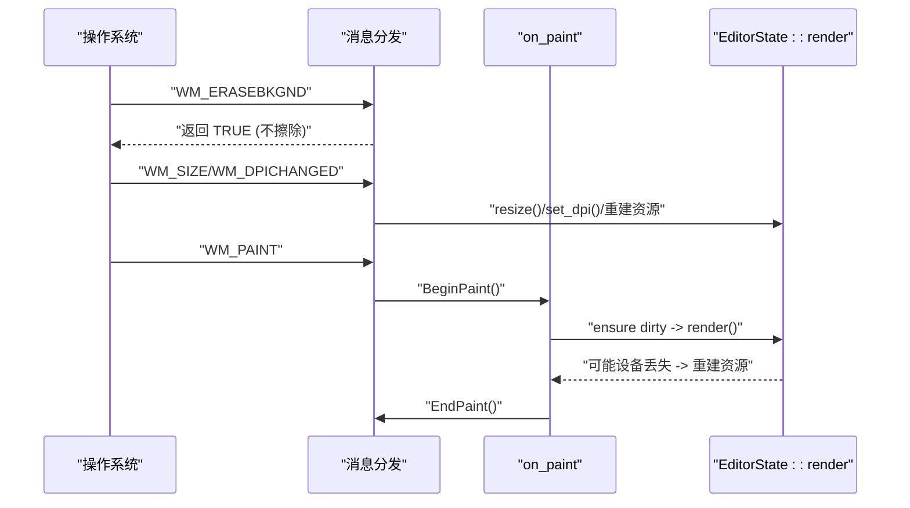
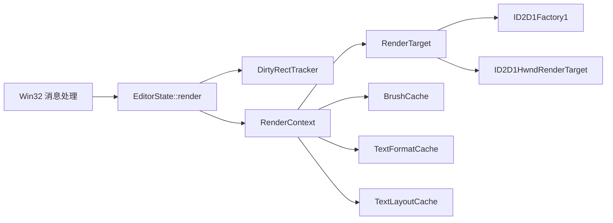

# 渲染上下文管理

<cite>
**本文引用的文件**   
- [render_context.rs](file://crates/aether-win32/src/render_context.rs)
- [factory.rs](file://crates/aether-render/src/d2d/factory.rs)
- [brush_cache.rs](file://crates/aether-render/src/d2d/brush_cache.rs)
- [text.rs](file://crates/aether-render/src/d2d/text.rs)
- [dirty_rect.rs](file://crates/aether-win32/src/dirty_rect.rs)
- [render.rs](file://crates/aether-win32/src/render.rs)
- [window_messages.rs](file://crates/aether-win32/src/window/window_messages.rs)
- [window_setup.rs](file://crates/aether-win32/src/window/window_setup.rs)
- [window.rs](file://crates/aether-win32/src/window.rs)
</cite>

## 目录
1. [简介](#简介)
2. [项目结构](#项目结构)
3. [核心组件](#核心组件)
4. [架构总览](#架构总览)
5. [详细组件分析](#详细组件分析)
6. [依赖关系分析](#依赖关系分析)
7. [性能考量](#性能考量)
8. [故障排查指南](#故障排查指南)
9. [结论](#结论)
10. [附录](#附录)

## 简介
本技术文档围绕渲染上下文管理系统，系统性阐述 Direct2D 设备上下文与交换链（HWND 渲染目标）的创建、初始化与销毁流程；深入解析绘制批处理与脏矩形计算算法（区域合并、增量更新、重绘优化）；说明渲染状态管理机制（变换矩阵、裁剪区域、绘制属性保存恢复）；解释与 Win32 窗口消息循环的集成方式（WM_PAINT 处理与双缓冲渲染）；并提供自定义渲染组件的实现思路、性能监控与调试建议，以及高效渲染架构的设计模式与优化技巧。

## 项目结构
本项目将渲染相关能力拆分为两个 crate：
- aether-render：封装 Direct2D/DirectWrite 工厂、渲染目标、画刷与文本格式缓存等底层资源。
- aether-win32：实现 UI 层渲染编排、脏矩形追踪、Win32 消息循环集成与窗口生命周期管理。

图表来源
- [factory.rs:1-138](file://crates/aether-render/src/d2d/factory.rs#L1-L138)
- [brush_cache.rs:1-106](file://crates/aether-render/src/d2d/brush_cache.rs#L1-L106)
- [brush_cache.rs:108-374](file://crates/aether-render/src/d2d/brush_cache.rs#L108-L374)
- [text.rs:1-132](file://crates/aether-render/src/d2d/text.rs#L1-L132)
- [render_context.rs:1-226](file://crates/aether-win32/src/render_context.rs#L1-L226)
- [dirty_rect.rs:1-120](file://crates/aether-win32/src/dirty_rect.rs#L1-L120)
- [render.rs:62-780](file://crates/aether-win32/src/render.rs#L62-L780)
- [window_messages.rs:478-514](file://crates/aether-win32/src/window/window_messages.rs#L478-L514)

章节来源
- [factory.rs:1-138](file://crates/aether-render/src/d2d/factory.rs#L1-L138)
- [brush_cache.rs:1-106](file://crates/aether-render/src/d2d/brush_cache.rs#L1-L106)
- [brush_cache.rs:108-374](file://crates/aether-render/src/d2d/brush_cache.rs#L108-L374)
- [text.rs:1-132](file://crates/aether-render/src/d2d/text.rs#L1-L132)
- [render_context.rs:1-226](file://crates/aether-win32/src/render_context.rs#L1-L226)
- [dirty_rect.rs:1-120](file://crates/aether-win32/src/dirty_rect.rs#L1-L120)
- [render.rs:62-780](file://crates/aether-win32/src/render.rs#L62-L780)
- [window_messages.rs:478-514](file://crates/aether-win32/src/window/window_messages.rs#L478-L514)

## 核心组件
- 渲染上下文 RenderContext：封装 D2D 渲染目标、画刷缓存、文本格式与布局缓存，提供 begin/end_draw、clear、push/pop_clip、多矩形裁剪、fill_rect、set_dpi、init_common_resources、handle_device_lost 等统一接口。
- Direct2D 工厂与渲染目标：D2DFactory 负责创建 ID2D1Factory1 与 HWND 渲染目标；RenderTarget 封装 BeginDraw/EndDraw/Clear/Resize/SetDpi/Clip/Layer 等。
- 资源缓存：BrushCache 预存常用颜色画刷并回退 HashMap；TextFormatCache 预存常用文本格式；TextLayoutCache 缓存 TextLayout 避免重复创建 COM 对象。
- 脏矩形追踪 DirtyRectTracker：记录需要重绘的区域，支持按区域类型标记、重叠合并、阈值降级为全窗口重绘，并提供 is_*_dirty 查询。
- 渲染编排 EditorState::render：根据状态变化推断渲染命令、设置裁剪、按需清除背景、分区域绘制、处理设备丢失与 DPI 切换。
- Win32 消息集成：on_paint 触发渲染，on_size/on_dpichanged 调整尺寸与 DPI，on_erasebkgnd 阻止系统擦除背景，invalidate_window 驱动 WM_PAINT。

章节来源
- [render_context.rs:1-226](file://crates/aether-win32/src/render_context.rs#L1-L226)
- [factory.rs:1-138](file://crates/aether-render/src/d2d/factory.rs#L1-L138)
- [brush_cache.rs:1-106](file://crates/aether-render/src/d2d/brush_cache.rs#L1-L106)
- [brush_cache.rs:108-374](file://crates/aether-render/src/d2d/brush_cache.rs#L108-L374)
- [dirty_rect.rs:1-120](file://crates/aether-win32/src/dirty_rect.rs#L1-L120)
- [render.rs:62-780](file://crates/aether-win32/src/render.rs#L62-L780)
- [window_messages.rs:478-514](file://crates/aether-win32/src/window/window_messages.rs#L478-L514)

## 架构总览
下图展示从 Win32 消息到 Direct2D 渲染目标的端到端调用路径，包括设备丢失恢复与 DPI 变更处理。

图表来源
- [window_messages.rs:478-514](file://crates/aether-win32/src/window/window_messages.rs#L478-L514)
- [render.rs:386-746](file://crates/aether-win32/src/render.rs#L386-L746)
- [render_context.rs:66-155](file://crates/aether-win32/src/render_context.rs#L66-L155)
- [factory.rs:90-125](file://crates/aether-render/src/d2d/factory.rs#L90-L125)

## 详细组件分析

### 渲染上下文 RenderContext
职责与关键点：
- 封装 ID2D1HwndRenderTarget 的生命周期：new/init_render_target/resize/set_dpi/handle_device_lost。
- 提供 begin/end_draw/clear/push/pop_clip 等基础绘制状态操作。
- 多矩形裁剪 push_multi_clip/pop_multi_clip：单矩形走快路径，多矩形使用 GeometryGroup + PushLayer，失败时回退到包围盒 AxisAlignedClip。
- 局部背景填充 fill_rect：用于欢迎页+脏矩形裁剪时的面板背景补色。
- 预初始化常用资源 init_common_resources：在渲染目标就绪后批量创建常用画刷与文本格式。

图表来源
- [render_context.rs:1-226](file://crates/aether-win32/src/render_context.rs#L1-L226)
- [factory.rs:66-271](file://crates/aether-render/src/d2d/factory.rs#L66-L271)
- [brush_cache.rs:1-106](file://crates/aether-render/src/d2d/brush_cache.rs#L1-L106)
- [brush_cache.rs:108-374](file://crates/aether-render/src/d2d/brush_cache.rs#L108-L374)

章节来源
- [render_context.rs:1-226](file://crates/aether-win32/src/render_context.rs#L1-L226)
- [factory.rs:66-271](file://crates/aether-render/src/d2d/factory.rs#L66-L271)
- [brush_cache.rs:1-106](file://crates/aether-render/src/d2d/brush_cache.rs#L1-L106)
- [brush_cache.rs:108-374](file://crates/aether-render/src/d2d/brush_cache.rs#L108-L374)

### 脏矩形追踪与绘制批处理
关键策略：
- 区域类型化标记：TitleBar/MenuBar/ActivityBar/Sidebar/EditorContent/TabBar/StatusBar/RightPanel/BottomPanel/FindReplace/Dialog/FullWindow。
- 同类型重叠合并：相同 region_type 且相交则合并，减少绘制调用。
- 阈值控制：当脏矩形数量超过 merge_threshold 触发 merge_all_rects；超过 max_rects 降级为 FullWindow。
- 快速判断：is_editor_dirty/is_sidebar_dirty/is_status_bar_dirty 等便捷方法。
- 渲染命令推断：根据光标移动、选择变化、滚动、面板可见性变化等推断最小必要重绘范围。

图表来源
- [dirty_rect.rs:102-162](file://crates/aether-win32/src/dirty_rect.rs#L102-L162)
- [dirty_rect.rs:336-356](file://crates/aether-win32/src/dirty_rect.rs#L336-L356)
- [dirty_rect.rs:387-426](file://crates/aether-win32/src/dirty_rect.rs#L387-L426)

章节来源
- [dirty_rect.rs:1-120](file://crates/aether-win32/src/dirty_rect.rs#L1-L120)
- [dirty_rect.rs:336-356](file://crates/aether-win32/src/dirty_rect.rs#L336-L356)
- [dirty_rect.rs:387-426](file://crates/aether-win32/src/dirty_rect.rs#L387-L426)

### 渲染编排与状态管理
- 首帧与设备丢失恢复：若 target 为空则重建渲染目标并预初始化常用资源；end_draw 捕获设备丢失错误码后清理并重建。
- 裁剪与多矩形：非全窗口且有脏区时，使用 push_multi_clip 设置几何掩膜裁剪；use_layer 标志决定 pop_multi_clip 使用 PopLayer 还是 PopAxisAlignedClip。
- 背景清除策略：仅在全窗口或无裁剪时执行 clear；欢迎页+脏矩形裁剪时需手动填充侧边栏/活动栏/右侧面板/底部面板背景，避免黑色空洞。
- 区域绘制顺序：标题栏 → 菜单栏 → 活动栏 → 侧边栏 → 标签栏 → 编辑器/欢迎页/空占位/图片预览/设置 → 查找替换 → 右侧面板 → 底部面板 → 状态栏 → 子菜单 → 命令面板 → 对话框 → 用户下拉菜单 → 各种上下文菜单 → Tooltip。
- 状态追踪更新：每帧末尾同步 last_* 字段，避免下一帧误判变化。

图表来源
- [render.rs:62-780](file://crates/aether-win32/src/render.rs#L62-L780)
- [render_context.rs:66-155](file://crates/aether-win32/src/render_context.rs#L66-L155)

章节来源
- [render.rs:62-780](file://crates/aether-win32/src/render.rs#L62-L780)
- [render_context.rs:66-155](file://crates/aether-win32/src/render_context.rs#L66-L155)

### Win32 消息循环集成与双缓冲
- WM_ERASEBKGND：返回 TRUE 阻止系统擦除背景，避免白色闪烁。
- WM_PAINT：BeginPaint 后强制确保有脏区（若无则标记全窗口），catch_unwind 包裹 render 以优雅处理设备丢失导致的 panic，EndPaint 完成。
- WM_SIZE：获取客户区尺寸，若非最小化则调用 resize 并 invalidate。
- WM_DPICHANGED：更新 DPI 缩放因子、重建渲染目标、重建文本格式与画刷缓存、应用 DPI 到布局与 IME，最后 invalidate。
- InvalidateRect：通过 invalidate_window 触发 WM_PAINT，Windows 自动合并多次失效，天然消除双重渲染。

图表来源
- [window_messages.rs:467-514](file://crates/aether-win32/src/window/window_messages.rs#L467-L514)
- [window_messages.rs:320-394](file://crates/aether-win32/src/window/window_messages.rs#L320-L394)
- [window.rs:66-75](file://crates/aether-win32/src/window.rs#L66-L75)

章节来源
- [window_messages.rs:467-514](file://crates/aether-win32/src/window/window_messages.rs#L467-L514)
- [window_messages.rs:320-394](file://crates/aether-win32/src/window/window_messages.rs#L320-L394)
- [window.rs:66-75](file://crates/aether-win32/src/window.rs#L66-L75)

### 文本与图形资源缓存
- BrushCache：预存常用颜色画刷（线性扫描优先），未命中回退 HashMap，超出最大条目数清空回退缓存。
- TextFormatCache：预存三种常用格式（代码左对齐、行号右对齐、居中），其余回退 HashMap；提供 measure_text_width 与 text_position_x 辅助测量。
- TextLayoutCache：按文本内容缓存 TextLayout，字体大小变化时清空；提供 create_ellipsis_layout 用于单行省略。
- TextRenderer：基于 DirectWrite 实测等宽字符宽度与行高，支持 DPI 缩放与字体大小动态调整。

章节来源
- [brush_cache.rs:1-106](file://crates/aether-render/src/d2d/brush_cache.rs#L1-L106)
- [brush_cache.rs:108-374](file://crates/aether-render/src/d2d/brush_cache.rs#L108-L374)
- [brush_cache.rs:376-477](file://crates/aether-render/src/d2d/brush_cache.rs#L376-L477)
- [text.rs:1-132](file://crates/aether-render/src/d2d/text.rs#L1-L132)

## 依赖关系分析
- RenderContext 依赖 RenderTarget、BrushCache、TextFormatCache、TextLayoutCache。
- RenderTarget 依赖 ID2D1Factory1 与 ID2D1HwndRenderTarget。
- EditorState::render 依赖 DirtyRectTracker 与 RenderContext。
- Win32 消息处理依赖 EditorState 与 RenderContext。

图表来源
- [render.rs:62-780](file://crates/aether-win32/src/render.rs#L62-L780)
- [render_context.rs:1-226](file://crates/aether-win32/src/render_context.rs#L1-L226)
- [factory.rs:1-138](file://crates/aether-render/src/d2d/factory.rs#L1-L138)

章节来源
- [render.rs:62-780](file://crates/aether-win32/src/render.rs#L62-L780)
- [render_context.rs:1-226](file://crates/aether-win32/src/render_context.rs#L1-L226)
- [factory.rs:1-138](file://crates/aether-render/src/d2d/factory.rs#L1-L138)

## 性能考量
- 脏矩形合并与阈值降级：避免过多小矩形导致绘制开销上升，必要时降级为全窗口重绘。
- 多矩形裁剪：使用 GeometryGroup + PushLayer 精确裁剪，避免合并为单一包围盒造成重绘面积膨胀。
- 资源缓存：画刷、文本格式与布局缓存显著降低 COM 对象创建频率。
- 文本测量：使用 DirectWrite 实测等宽字符宽度与行高，避免硬编码误差。
- 双缓冲与无效区域合并：InvalidateRect 由系统合并，避免双重渲染；BeginPaint/EndPaint 配合 D2D 双缓冲。
- 设备丢失恢复：捕获错误码并重建渲染目标与资源，保证稳定性。

[本节为通用指导，无需特定文件引用]

## 故障排查指南
- 设备丢失（D2DERR_RECREATE_TARGET）：在 end_draw 捕获错误码，清理所有资源并重建渲染目标与缓存；同时清理 IconCache 等依赖 factory 的对象。
- 白色闪烁：确保 WM_ERASEBKGND 返回 TRUE，禁止系统擦除背景。
- 重影问题：WM_PAINT 中若内部脏区为空，强制标记全窗口重绘，避免上一帧残留。
- DPI 切换异常：在 WM_DPICHANGED 中重建渲染目标、文本格式与画刷缓存，并应用新 DPI 到布局与 IME。
- 面板背景黑块：欢迎页+脏矩形裁剪时，需手动填充活动栏/侧边栏/右侧面板/底部面板背景。

章节来源
- [render.rs:704-746](file://crates/aether-win32/src/render.rs#L704-L746)
- [window_messages.rs:467-514](file://crates/aether-win32/src/window/window_messages.rs#L467-L514)
- [window_messages.rs:320-394](file://crates/aether-win32/src/window/window_messages.rs#L320-L394)
- [render.rs:411-474](file://crates/aether-win32/src/render.rs#L411-L474)

## 结论
本渲染上下文管理系统通过分层设计将 Direct2D 资源管理与 UI 渲染编排解耦，结合脏矩形追踪与多矩形裁剪实现了高效的增量更新；借助画刷、文本格式与布局缓存显著降低 COM 对象创建开销；在 Win32 消息循环中采用 InvalidateRect 与 catch_unwind 保障稳定性与流畅度。整体架构具备良好的可扩展性与可维护性，适合构建高性能桌面编辑器。

[本节为总结，无需特定文件引用]

## 附录

### 自定义渲染组件实现要点
- 在 EditorState::render 的流程中插入新的绘制阶段，遵循“先背景后前景”的顺序。
- 使用 RenderContext.push_multi_clip/pop_multi_clip 进行裁剪，确保只重绘必要区域。
- 复用 BrushCache/TextFormatCache/TextLayoutCache 获取画刷与文本格式，避免频繁创建 COM 对象。
- 若新增区域涉及布局变化，需在布局管理器中定义 Region 并在 render 中计算其位置与尺寸。
- 若组件需要独立刷新，可通过 DirtyRectTracker.mark_region 标记对应区域类型，或在状态变化时触发 invalidate_window。

章节来源
- [render.rs:482-702](file://crates/aether-win32/src/render.rs#L482-L702)
- [dirty_rect.rs:102-162](file://crates/aether-win32/src/dirty_rect.rs#L102-L162)
- [brush_cache.rs:1-106](file://crates/aether-render/src/d2d/brush_cache.rs#L1-L106)
- [brush_cache.rs:108-374](file://crates/aether-render/src/d2d/brush_cache.rs#L108-L374)

### 性能监控与调试工具建议
- 日志与跟踪：在关键绘制阶段前后添加 tracing::trace 输出，便于定位瓶颈。
- 命中区域写入：测试阶段可将命中区域写入文件，辅助验证交互与裁剪效果。
- 脏矩形统计：使用 dirty_count 与 rects 长度观察增量更新效果，必要时调整阈值。
- 资源命中率：统计 BrushCache/TextFormatCache/TextLayoutCache 的命中率，评估缓存有效性。

章节来源
- [render.rs:94-98](file://crates/aether-win32/src/render.rs#L94-L98)
- [render.rs:776-780](file://crates/aether-win32/src/render.rs#L776-L780)
- [dirty_rect.rs:358-366](file://crates/aether-win32/src/dirty_rect.rs#L358-L366)