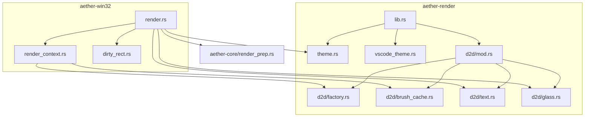
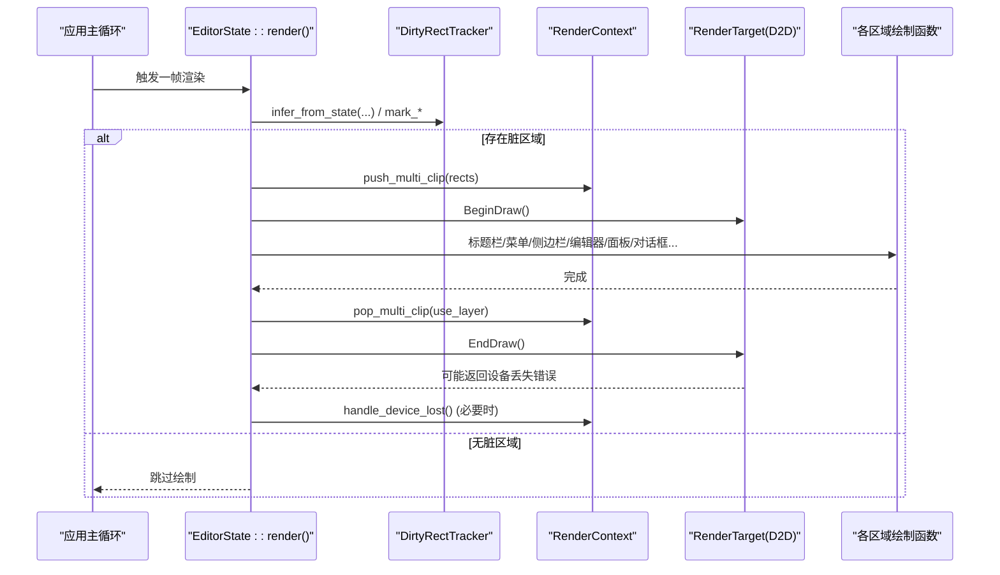
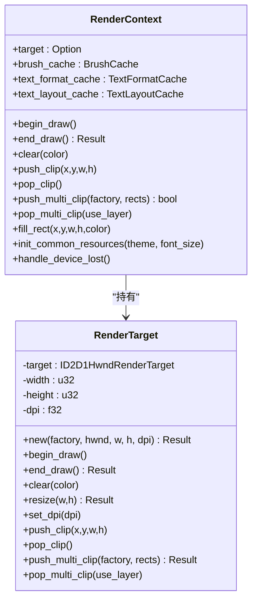
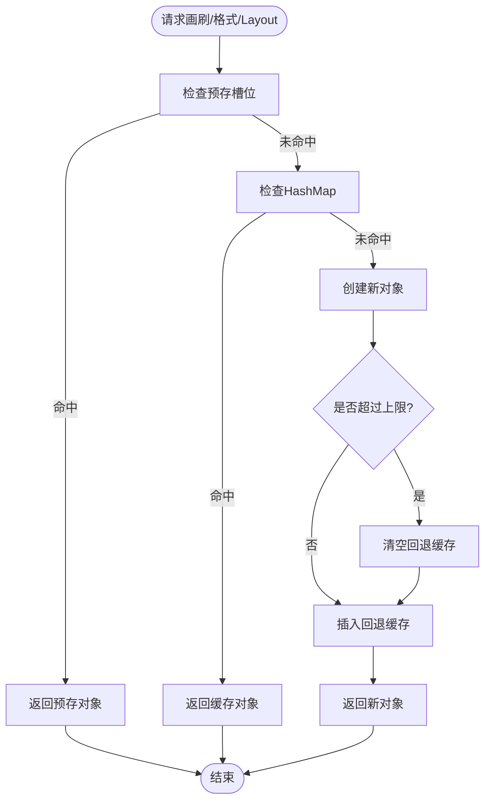
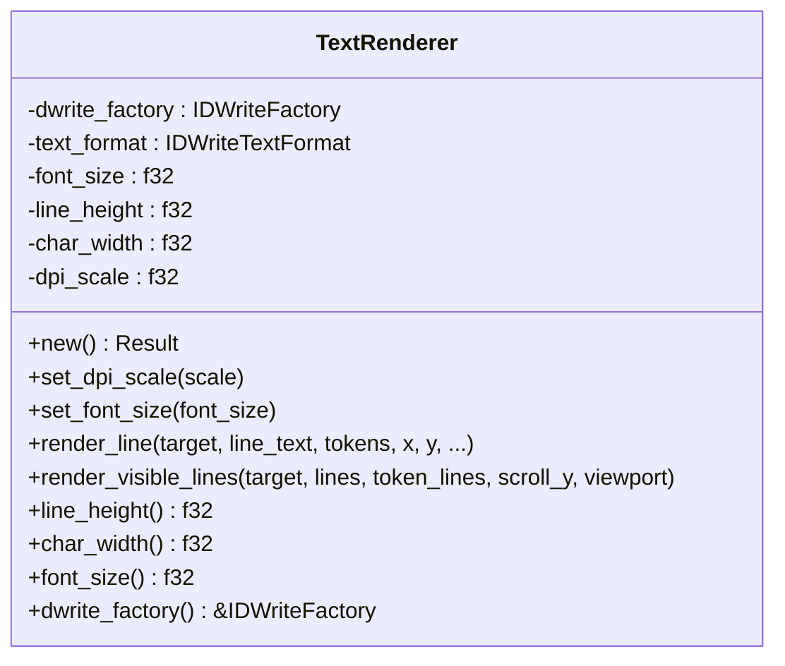
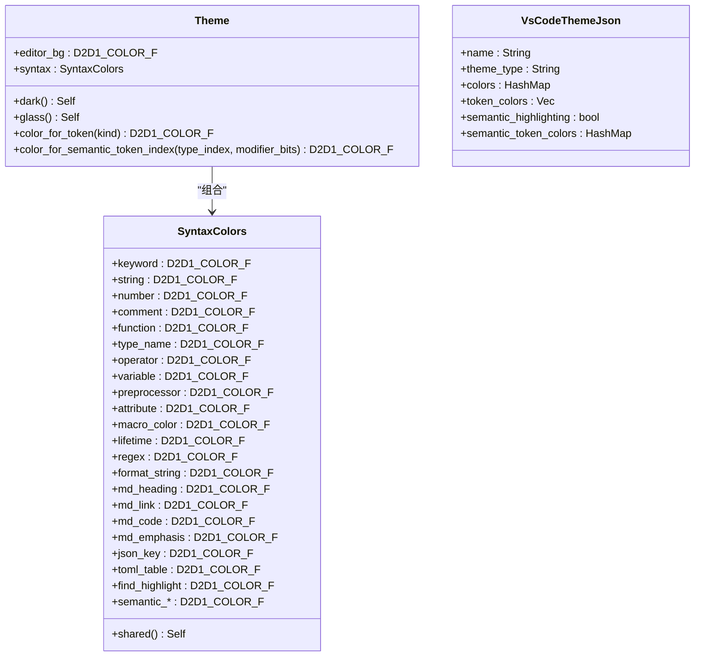
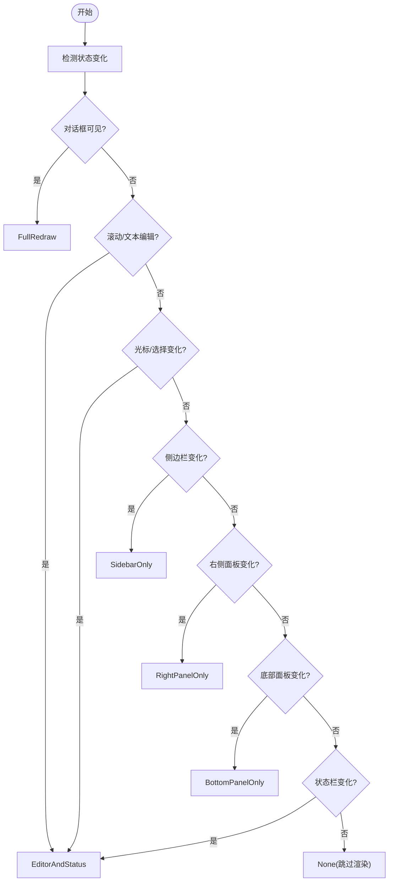
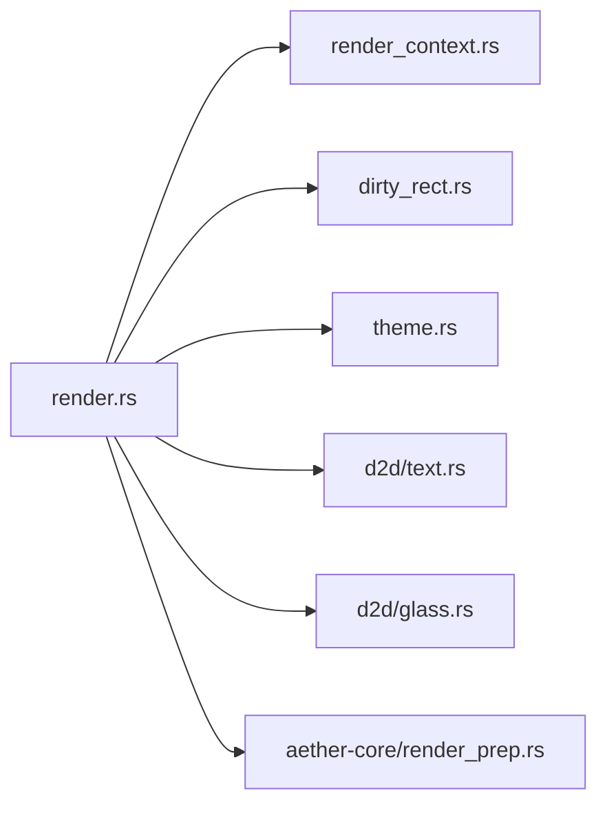

# 渲染引擎

<cite>
**本文引用的文件**   
- [crates/aether-render/src/lib.rs](file://crates/aether-render/src/lib.rs)
- [crates/aether-render/src/theme.rs](file://crates/aether-render/src/theme.rs)
- [crates/aether-render/src/vscode_theme.rs](file://crates/aether-render/src/vscode_theme.rs)
- [crates/aether-render/src/d2d/mod.rs](file://crates/aether-render/src/d2d/mod.rs)
- [crates/aether-render/src/d2d/factory.rs](file://crates/aether-render/src/d2d/factory.rs)
- [crates/aether-render/src/d2d/brush_cache.rs](file://crates/aether-render/src/d2d/brush_cache.rs)
- [crates/aether-render/src/d2d/text.rs](file://crates/aether-render/src/d2d/text.rs)
- [crates/aether-render/src/d2d/glass.rs](file://crates/aether-render/src/d2d/glass.rs)
- [crates/aether-win32/src/render_context.rs](file://crates/aether-win32/src/render_context.rs)
- [crates/aether-win32/src/render.rs](file://crates/aether-win32/src/render.rs)
- [crates/aether-win32/src/dirty_rect.rs](file://crates/aether-win32/src/dirty_rect.rs)
- [crates/aether-core/src/render_prep.rs](file://crates/aether-core/src/render_prep.rs)
</cite>

## 目录
1. [简介](#简介)
2. [项目结构](#项目结构)
3. [核心组件](#核心组件)
4. [架构总览](#架构总览)
5. [详细组件分析](#详细组件分析)
6. [依赖分析](#依赖分析)
7. [性能考虑](#性能考虑)
8. [故障排查指南](#故障排查指南)
9. [结论](#结论)
10. [附录](#附录)

## 简介
本技术文档面向牧羊人编辑器的渲染子系统，聚焦于 Direct2D 渲染管线、主题系统与高性能优化策略。内容涵盖：
- 绘制上下文管理、图形对象生命周期与资源缓存策略
- 主题系统（颜色管理、样式继承、动态切换）
- 脏矩形计算、批量绘制与 GPU 加速路径
- 自定义渲染组件与主题样式的接入方式
- DirectWrite 文本渲染高级特性与字体处理
- UI 开发者最佳实践与调试技巧

## 项目结构
渲染相关代码主要分布在两个 crate：
- aether-render：提供 Direct2D/DirectWrite 抽象、画刷与文本格式缓存、主题模型与 VS Code 主题解析
- aether-win32：窗口层集成，封装渲染上下文、脏矩形追踪、主渲染循环与各区域绘制

**图表来源**
- [crates/aether-render/src/lib.rs:1-4](file://crates/aether-render/src/lib.rs#L1-L4)
- [crates/aether-render/src/d2d/mod.rs:1-5](file://crates/aether-render/src/d2d/mod.rs#L1-L5)
- [crates/aether-render/src/d2d/factory.rs:1-63](file://crates/aether-render/src/d2d/factory.rs#L1-L63)
- [crates/aether-render/src/d2d/brush_cache.rs:1-106](file://crates/aether-render/src/d2d/brush_cache.rs#L1-L106)
- [crates/aether-render/src/d2d/text.rs:1-57](file://crates/aether-render/src/d2d/text.rs#L1-L57)
- [crates/aether-render/src/d2d/glass.rs:1-62](file://crates/aether-render/src/d2d/glass.rs#L1-L62)
- [crates/aether-win32/src/render_context.rs:1-31](file://crates/aether-win32/src/render_context.rs#L1-L31)
- [crates/aether-win32/src/render.rs:62-134](file://crates/aether-win32/src/render.rs#L62-L134)
- [crates/aether-win32/src/dirty_rect.rs:1-35](file://crates/aether-win32/src/dirty_rect.rs#L1-L35)
- [crates/aether-core/src/render_prep.rs:69-95](file://crates/aether-core/src/render_prep.rs#L69-L95)

**章节来源**
- [crates/aether-render/src/lib.rs:1-4](file://crates/aether-render/src/lib.rs#L1-L4)
- [crates/aether-render/src/d2d/mod.rs:1-5](file://crates/aether-render/src/d2d/mod.rs#L1-L5)
- [crates/aether-win32/src/render_context.rs:1-31](file://crates/aether-win32/src/render_context.rs#L1-L31)
- [crates/aether-win32/src/render.rs:62-134](file://crates/aether-win32/src/render.rs#L62-L134)
- [crates/aether-win32/src/dirty_rect.rs:1-35](file://crates/aether-win32/src/dirty_rect.rs#L1-L35)
- [crates/aether-core/src/render_prep.rs:69-95](file://crates/aether-core/src/render_prep.rs#L69-L95)

## 核心组件
- 渲染上下文（RenderContext）：封装 HWND 渲染目标、画刷缓存、文本格式与布局缓存，统一 begin/end_draw、裁剪、设备丢失恢复等
- 工厂与渲染目标（D2DFactory/RenderTarget）：创建硬件加速的 ID2D1HwndRenderTarget，支持 DPI 调整、多矩形并集裁剪
- 资源缓存（BrushCache/TextFormatCache/TextLayoutCache）：避免每帧重复创建 COM 对象，预置常用槽位 + HashMap 回退，容量上限保护
- 文本渲染器（TextRenderer）：基于 DirectWrite 的等宽字体测量、行高/字符宽度计算、按 token 着色绘制
- 主题系统（Theme/SyntaxColors/VsCodeThemeJson）：内置暗色/毛玻璃主题，支持从 VS Code JSON 主题加载覆盖
- 脏矩形追踪（DirtyRectTracker/RenderCommand）：状态变化推断最优重绘命令，合并重叠区域，必要时降级为全窗口重绘
- 毛玻璃效果（glass）：半透明面板、柔和边框、光晕选择、阴影等辅助绘制

**章节来源**
- [crates/aether-win32/src/render_context.rs:1-31](file://crates/aether-win32/src/render_context.rs#L1-L31)
- [crates/aether-render/src/d2d/factory.rs:14-88](file://crates/aether-render/src/d2d/factory.rs#L14-L88)
- [crates/aether-render/src/d2d/brush_cache.rs:25-106](file://crates/aether-render/src/d2d/brush_cache.rs#L25-L106)
- [crates/aether-render/src/d2d/text.rs:14-57](file://crates/aether-render/src/d2d/text.rs#L14-L57)
- [crates/aether-render/src/theme.rs:7-86](file://crates/aether-render/src/theme.rs#L7-L86)
- [crates/aether-render/src/vscode_theme.rs:10-31](file://crates/aether-render/src/vscode_theme.rs#L10-L31)
- [crates/aether-win32/src/dirty_rect.rs:8-35](file://crates/aether-win32/src/dirty_rect.rs#L8-L35)
- [crates/aether-render/src/d2d/glass.rs:1-62](file://crates/aether-render/src/d2d/glass.rs#L1-L62)

## 架构总览
Direct2D 渲染管线在窗口层组织，自上而下流程如下：
- 事件驱动的状态更新 → 脏矩形推断 → 可选多矩形裁剪 → 逐区域绘制 → 结束绘制与设备丢失恢复

**图表来源**
- [crates/aether-win32/src/render.rs:62-134](file://crates/aether-win32/src/render.rs#L62-L134)
- [crates/aether-win32/src/render.rs:385-410](file://crates/aether-win32/src/render.rs#L385-L410)
- [crates/aether-win32/src/render.rs:698-746](file://crates/aether-win32/src/render.rs#L698-L746)
- [crates/aether-win32/src/render_context.rs:65-79](file://crates/aether-win32/src/render_context.rs#L65-L79)
- [crates/aether-win32/src/render_context.rs:107-155](file://crates/aether-win32/src/render_context.rs#L107-L155)
- [crates/aether-win32/src/dirty_rect.rs:368-426](file://crates/aether-win32/src/dirty_rect.rs#L368-L426)

## 详细组件分析

### 绘制上下文与渲染目标
- RenderContext 统一管理 ID2D1HwndRenderTarget、BrushCache、TextFormatCache、TextLayoutCache，并提供 begin/end_draw、clear、push/pop_clip、多矩形裁剪、设备丢失处理等能力
- RenderTarget 封装硬件渲染目标创建、Resize、DPI 设置、轴对齐裁剪与多矩形几何裁剪（GeometryGroup + PushLayer），失败时回退到包围盒裁剪

**图表来源**
- [crates/aether-win32/src/render_context.rs:10-31](file://crates/aether-win32/src/render_context.rs#L10-L31)
- [crates/aether-win32/src/render_context.rs:33-79](file://crates/aether-win32/src/render_context.rs#L33-L79)
- [crates/aether-win32/src/render_context.rs:107-155](file://crates/aether-win32/src/render_context.rs#L107-L155)
- [crates/aether-render/src/d2d/factory.rs:65-141](file://crates/aether-render/src/d2d/factory.rs#L65-L141)
- [crates/aether-render/src/d2d/factory.rs:172-263](file://crates/aether-render/src/d2d/factory.rs#L172-L263)

**章节来源**
- [crates/aether-win32/src/render_context.rs:1-31](file://crates/aether-win32/src/render_context.rs#L1-L31)
- [crates/aether-render/src/d2d/factory.rs:14-88](file://crates/aether-render/src/d2d/factory.rs#L14-L88)
- [crates/aether-render/src/d2d/factory.rs:172-263](file://crates/aether-render/src/d2d/factory.rs#L172-L263)

### 资源缓存策略（画刷/文本格式/文本布局）
- BrushCache：预存常用画笔槽位（线性扫描优先），未命中回退 HashMap；超过最大条目数清空回退缓存，防止无界增长
- TextFormatCache：预置 code/line_number/center 三种常用格式；获取时先查预存数组再查 HashMap；超出上限清空回退缓存
- TextLayoutCache：按文本内容缓存 IDWriteTextLayout，字体大小变化时自动失效；单行省略号布局专用接口

**图表来源**
- [crates/aether-render/src/d2d/brush_cache.rs:51-99](file://crates/aether-render/src/d2d/brush_cache.rs#L51-L99)
- [crates/aether-render/src/d2d/brush_cache.rs:129-269](file://crates/aether-render/src/d2d/brush_cache.rs#L129-L269)
- [crates/aether-render/src/d2d/brush_cache.rs:392-442](file://crates/aether-render/src/d2d/brush_cache.rs#L392-L442)

**章节来源**
- [crates/aether-render/src/d2d/brush_cache.rs:16-106](file://crates/aether-render/src/d2d/brush_cache.rs#L16-L106)
- [crates/aether-render/src/d2d/brush_cache.rs:108-269](file://crates/aether-render/src/d2d/brush_cache.rs#L108-L269)
- [crates/aether-render/src/d2d/brush_cache.rs:376-447](file://crates/aether-render/src/d2d/brush_cache.rs#L376-L447)

### 文本渲染与字体处理（DirectWrite）
- TextRenderer 使用 Consolas 等宽字体，通过 IDWriteTextLayout 实测单字符推进宽度，避免硬编码比例
- 支持 DPI 缩放与基础字号调整，动态重建文本格式并重新测量字符宽度与行高
- 行渲染按 token 分段着色，结合 Viewport 仅绘制可见区域

**图表来源**
- [crates/aether-render/src/d2d/text.rs:14-57](file://crates/aether-render/src/d2d/text.rs#L14-L57)
- [crates/aether-render/src/d2d/text.rs:74-132](file://crates/aether-render/src/d2d/text.rs#L74-L132)
- [crates/aether-render/src/d2d/text.rs:138-221](file://crates/aether-render/src/d2d/text.rs#L138-L221)

**章节来源**
- [crates/aether-render/src/d2d/text.rs:14-57](file://crates/aether-render/src/d2d/text.rs#L14-L57)
- [crates/aether-render/src/d2d/text.rs:74-132](file://crates/aether-render/src/d2d/text.rs#L74-L132)
- [crates/aether-render/src/d2d/text.rs:138-221](file://crates/aether-render/src/d2d/text.rs#L138-L221)

### 主题系统（颜色管理、样式继承、动态切换）
- Theme 包含 UI 通用色与语法高亮色（SyntaxColors），提供 dark()/glass() 两种预设，默认 glass
- SyntaxColors::shared() 复用相同语法颜色构造，消除重复
- color_for_token/color_for_semantic_token_index 将 TokenKind/语义索引映射到具体颜色
- VsCodeThemeJson 支持从 VS Code 主题 JSON 加载，覆盖 editor.* 与 tokenColors 映射至 SyntaxColors

**图表来源**
- [crates/aether-render/src/theme.rs:7-86](file://crates/aether-render/src/theme.rs#L7-L86)
- [crates/aether-render/src/theme.rs:88-146](file://crates/aether-render/src/theme.rs#L88-L146)
- [crates/aether-render/src/theme.rs:148-277](file://crates/aether-render/src/theme.rs#L148-L277)
- [crates/aether-render/src/vscode_theme.rs:10-31](file://crates/aether-render/src/vscode_theme.rs#L10-L31)
- [crates/aether-render/src/vscode_theme.rs:103-176](file://crates/aether-render/src/vscode_theme.rs#L103-L176)

**章节来源**
- [crates/aether-render/src/theme.rs:7-86](file://crates/aether-render/src/theme.rs#L7-L86)
- [crates/aether-render/src/theme.rs:88-146](file://crates/aether-render/src/theme.rs#L88-L146)
- [crates/aether-render/src/theme.rs:148-277](file://crates/aether-render/src/theme.rs#L148-L277)
- [crates/aether-render/src/vscode_theme.rs:10-31](file://crates/aether-render/src/vscode_theme.rs#L10-L31)
- [crates/aether-render/src/vscode_theme.rs:103-176](file://crates/aether-render/src/vscode_theme.rs#L103-L176)

### 脏矩形与渲染命令推断
- DirtyRectTracker 维护当前帧脏矩形列表，支持按区域类型标记、合并重叠、阈值降级为全窗口重绘
- RenderCommand::infer_from_state 根据光标移动、选择变化、滚动、面板可见性、对话框显示等状态推断最小必要重绘范围

**图表来源**
- [crates/aether-win32/src/dirty_rect.rs:368-426](file://crates/aether-win32/src/dirty_rect.rs#L368-L426)

**章节来源**
- [crates/aether-win32/src/dirty_rect.rs:87-162](file://crates/aether-win32/src/dirty_rect.rs#L87-L162)
- [crates/aether-win32/src/dirty_rect.rs:368-426](file://crates/aether-win32/src/dirty_rect.rs#L368-L426)

### 毛玻璃与视觉效果
- glass 模块提供半透明面板、柔和边框、光晕选择、阴影等绘制工具，配合 BrushCache 减少画刷创建开销

**章节来源**
- [crates/aether-render/src/d2d/glass.rs:1-161](file://crates/aether-render/src/d2d/glass.rs#L1-L161)

## 依赖分析
- aether-win32/render.rs 作为主渲染入口，依赖：
  - render_context（上下文与裁剪）
  - dirty_rect（脏矩形与命令推断）
  - theme（颜色与主题）
  - d2d/text（文本渲染）
  - d2d/glass（毛玻璃效果）
  - aether-core/render_prep（并行预处理与可见行缓存）

**图表来源**
- [crates/aether-win32/src/render.rs:62-134](file://crates/aether-win32/src/render.rs#L62-L134)
- [crates/aether-core/src/render_prep.rs:69-95](file://crates/aether-core/src/render_prep.rs#L69-L95)

**章节来源**
- [crates/aether-win32/src/render.rs:62-134](file://crates/aether-win32/src/render.rs#L62-L134)
- [crates/aether-core/src/render_prep.rs:69-95](file://crates/aether-core/src/render_prep.rs#L69-L95)

## 性能考虑
- 脏矩形与多矩形裁剪
  - 仅在存在脏区域时绘制；非全窗口时使用多矩形并集裁剪（GeometryGroup + PushLayer），失败回退到包围盒裁剪，避免大面积无效绘制
- 资源缓存
  - 画刷/文本格式/文本布局均具备“预存 + HashMap”两级缓存，并在超限时清空回退缓存，降低 COM 对象分配压力
- 可见行增量渲染
  - 基于视口与行高计算可见行范围，仅对可见区域进行 token 着色与绘制
- 并行预处理
  - 使用 rayon 并行 map-reduce 对各行进行词法分析，减少主线程阻塞
- GPU 加速
  - 渲染目标类型为硬件加速（D2D1_RENDER_TARGET_TYPE_HARDWARE），充分利用 GPU 管线

**章节来源**
- [crates/aether-win32/src/render.rs:385-410](file://crates/aether-win32/src/render.rs#L385-L410)
- [crates/aether-render/src/d2d/factory.rs:43-62](file://crates/aether-render/src/d2d/factory.rs#L43-L62)
- [crates/aether-render/src/d2d/brush_cache.rs:16-106](file://crates/aether-render/src/d2d/brush_cache.rs#L16-L106)
- [crates/aether-render/src/d2d/text.rs:189-221](file://crates/aether-render/src/d2d/text.rs#L189-L221)
- [crates/aether-core/src/render_prep.rs:44-61](file://crates/aether-core/src/render_prep.rs#L44-L61)

## 故障排查指南
- 设备丢失（D2DERR_RECREATE_TARGET）
  - 现象：EndDraw 返回特定错误码
  - 处理：调用 handle_device_lost 清理资源，重建渲染目标与常用缓存
- 多矩形裁剪失败
  - 现象：PushLayer 失败或异常
  - 处理：回退到单个包围盒裁剪，确保渲染不中断
- 主题颜色异常
  - 现象：VS Code 主题 JSON 中颜色格式非法
  - 处理：解析失败时保留默认值，避免崩溃
- 文本测量偏差
  - 现象：光标/点击位置与渲染不一致
  - 处理：确保 TextLayout 创建不带 null 终止符，与 monospace 测量保持一致

**章节来源**
- [crates/aether-win32/src/render.rs:704-746](file://crates/aether-win32/src/render.rs#L704-L746)
- [crates/aether-win32/src/render_context.rs:219-225](file://crates/aether-win32/src/render_context.rs#L219-L225)
- [crates/aether-render/src/d2d/factory.rs:172-263](file://crates/aether-render/src/d2d/factory.rs#L172-L263)
- [crates/aether-render/src/vscode_theme.rs:236-281](file://crates/aether-render/src/vscode_theme.rs#L236-L281)
- [crates/aether-render/src/d2d/brush_cache.rs:429-442](file://crates/aether-render/src/d2d/brush_cache.rs#L429-L442)

## 结论
该渲染引擎以 Direct2D 为核心，结合 DirectWrite 文本能力，构建了高效、可扩展的 UI 渲染体系。通过脏矩形与多矩形裁剪、资源缓存、可见行增量渲染与并行预处理，实现了在高 DPI 与复杂界面下的流畅体验。主题系统支持内置预设与 VS Code 主题导入，便于快速定制外观。建议在实际开发中遵循本文的最佳实践与调试要点，以获得稳定且高性能的渲染表现。

## 附录

### 自定义渲染组件示例（路径指引）
- 新增区域绘制：参考 render.rs 中的区域绘制函数组织方式，按需添加 draw_* 方法并在主渲染流程中调用
- 使用 BrushCache 获取画刷：参考 brush_cache.rs 的 get_brush 用法，避免每帧创建 COM 对象
- 使用 TextFormatCache/TextLayoutCache：参考 brush_cache.rs 的文本格式与布局缓存接口，提升文本绘制性能

**章节来源**
- [crates/aether-win32/src/render.rs:482-616](file://crates/aether-win32/src/render.rs#L482-L616)
- [crates/aether-render/src/d2d/brush_cache.rs:71-99](file://crates/aether-render/src/d2d/brush_cache.rs#L71-L99)
- [crates/aether-render/src/d2d/brush_cache.rs:226-269](file://crates/aether-render/src/d2d/brush_cache.rs#L226-L269)
- [crates/aether-render/src/d2d/brush_cache.rs:405-442](file://crates/aether-render/src/d2d/brush_cache.rs#L405-L442)

### 自定义主题样式示例（路径指引）
- 修改内置主题：参考 theme.rs 的 dark()/glass() 实现，调整 UI 与语法颜色字段
- 从 VS Code 主题加载：参考 vscode_theme.rs 的 from_vscode_json/from_vscode_json_str，解析 colors 与 tokenColors 映射

**章节来源**
- [crates/aether-render/src/theme.rs:148-209](file://crates/aether-render/src/theme.rs#L148-L209)
- [crates/aether-render/src/vscode_theme.rs:103-176](file://crates/aether-render/src/vscode_theme.rs#L103-L176)

### DirectWrite 文本高级特性（路径指引）
- 精确测量与命中测试：参考 brush_cache.rs 的 measure_text_width 与 text_position_x，用于子菜单宽度自适应与光标定位
- 省略号截断：参考 create_ellipsis_layout，配置 Trimming 与 WordWrapping 实现单行省略

**章节来源**
- [crates/aether-render/src/d2d/brush_cache.rs:316-373](file://crates/aether-render/src/d2d/brush_cache.rs#L316-L373)
- [crates/aether-render/src/d2d/brush_cache.rs:449-476](file://crates/aether-render/src/d2d/brush_cache.rs#L449-L476)