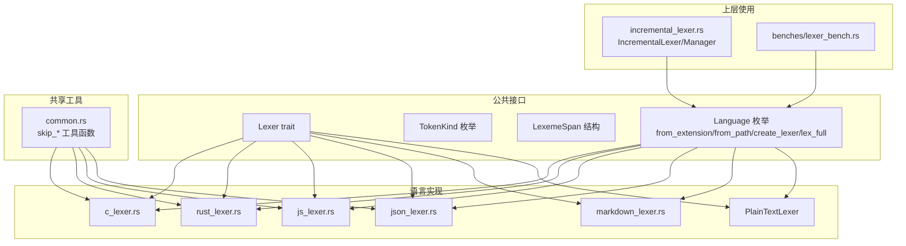
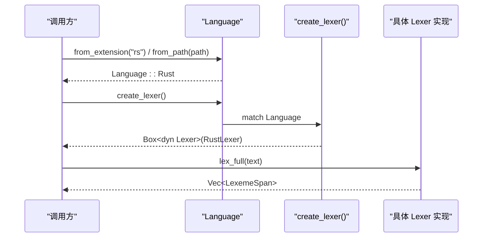
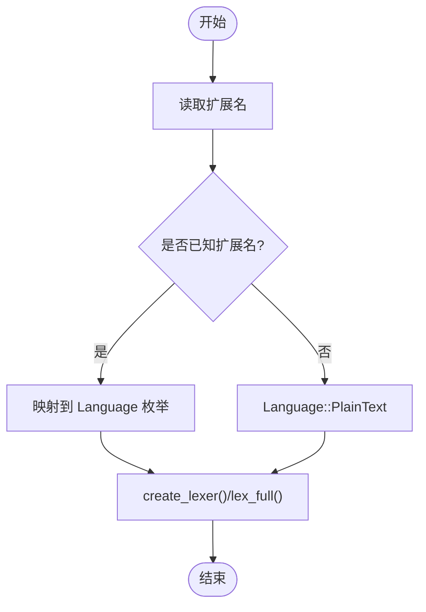
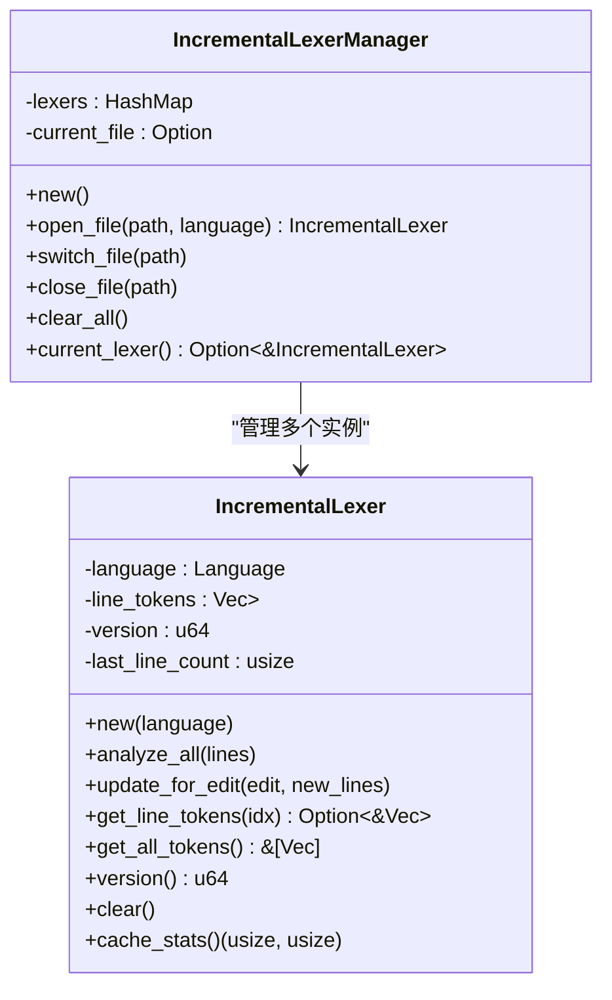
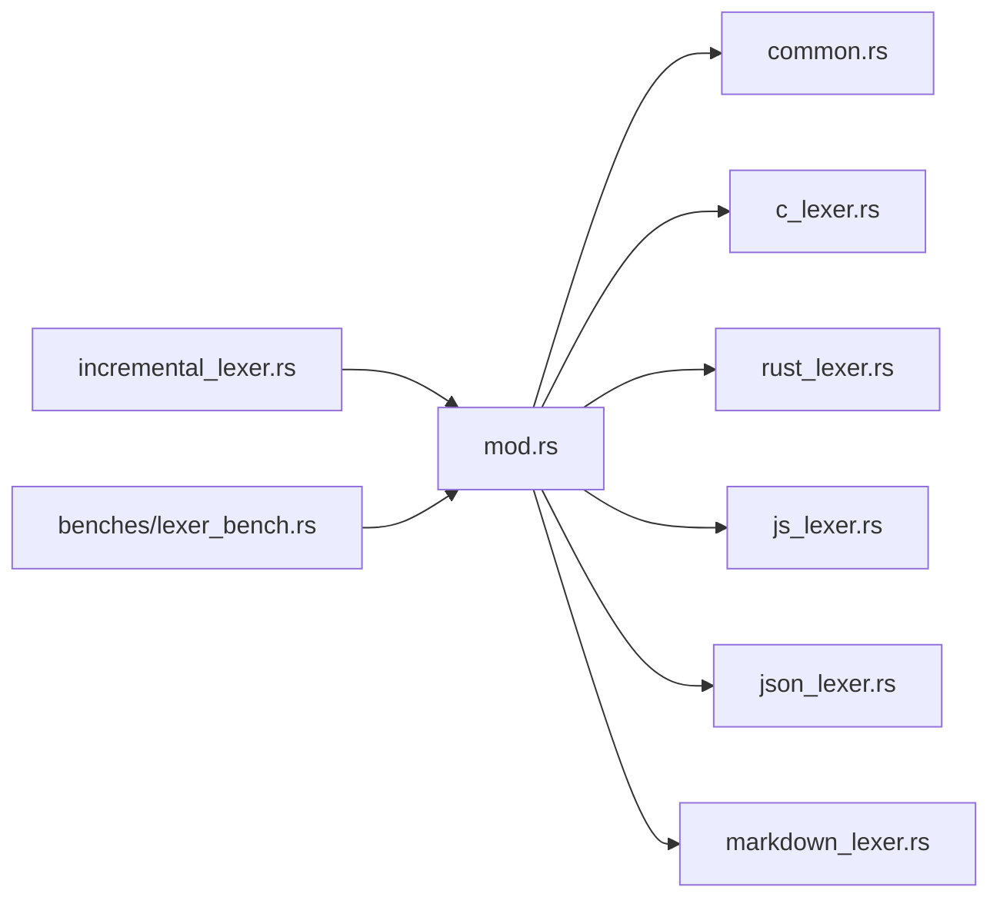

# Lexer Trait 设计与核心接口

<cite>
**本文引用的文件**
- [crates/aether-core/src/lexer/mod.rs](file://crates/aether-core/src/lexer/mod.rs)
- [crates/aether-core/src/lexer/common.rs](file://crates/aether-core/src/lexer/common.rs)
- [crates/aether-core/src/lexer/c_lexer.rs](file://crates/aether-core/src/lexer/c_lexer.rs)
- [crates/aether-core/src/lexer/rust_lexer.rs](file://crates/aether-core/src/lexer/rust_lexer.rs)
- [crates/aether-core/src/lexer/markdown_lexer.rs](file://crates/aether-core/src/lexer/markdown_lexer.rs)
- [crates/aether-core/src/lexer/js_lexer.rs](file://crates/aether-core/src/lexer/js_lexer.rs)
- [crates/aether-core/src/lexer/json_lexer.rs](file://crates/aether-core/src/lexer/json_lexer.rs)
- [crates/aether-core/src/incremental_lexer.rs](file://crates/aether-core/src/incremental_lexer.rs)
- [crates/aether-core/benches/lexer_bench.rs](file://crates/aether-core/benches/lexer_bench.rs)
</cite>

## 目录
1. [简介](#简介)
2. [项目结构](#项目结构)
3. [核心组件](#核心组件)
4. [架构总览](#架构总览)
5. [详细组件分析](#详细组件分析)
6. [依赖关系分析](#依赖关系分析)
7. [性能考量](#性能考量)
8. [故障排查指南](#故障排查指南)
9. [结论](#结论)
10. [附录：扩展词法分析器开发指南与最佳实践](#附录扩展词法分析器开发指南与最佳实践)

## 简介
本文件围绕 Lexer trait 的统一接口设计，系统阐述以下要点：
- lex_full 方法的设计原理与返回值结构
- TokenKind 枚举的完整分类体系（通用类别与特定语言类别）
- LexemeSpan 数据结构的设计考虑（位置、长度、标志位）
- Language 枚举的语言检测机制与工厂模式实现
- 自定义 Lexer 的最小实现与完整实现差异
- 插件开发者扩展词法分析器的指南与最佳实践

## 项目结构
aether-core 的 lexer 子系统采用“统一接口 + 多语言实现”的分层组织方式：
- 公共接口与类型定义集中在 mod.rs
- 共享工具函数集中在 common.rs
- 各语言具体实现以独立模块提供（C/Rust/JS/JSON/Markdown 等）
- 增量词法分析器在 incremental_lexer.rs 中基于 Language 工厂进行行级缓存与更新

图表来源
- [crates/aether-core/src/lexer/mod.rs:1-182](file://crates/aether-core/src/lexer/mod.rs#L1-L182)
- [crates/aether-core/src/lexer/common.rs:1-151](file://crates/aether-core/src/lexer/common.rs#L1-L151)
- [crates/aether-core/src/lexer/c_lexer.rs:1-236](file://crates/aether-core/src/lexer/c_lexer.rs#L1-L236)
- [crates/aether-core/src/lexer/rust_lexer.rs:1-359](file://crates/aether-core/src/lexer/rust_lexer.rs#L1-L359)
- [crates/aether-core/src/lexer/js_lexer.rs:1-200](file://crates/aether-core/src/lexer/js_lexer.rs#L1-L200)
- [crates/aether-core/src/lexer/json_lexer.rs:1-133](file://crates/aether-core/src/lexer/json_lexer.rs#L1-L133)
- [crates/aether-core/src/lexer/markdown_lexer.rs:1-215](file://crates/aether-core/src/lexer/markdown_lexer.rs#L1-L215)
- [crates/aether-core/src/incremental_lexer.rs:1-129](file://crates/aether-core/src/incremental_lexer.rs#L1-L129)
- [crates/aether-core/benches/lexer_bench.rs:136-161](file://crates/aether-core/benches/lexer_bench.rs#L136-L161)

章节来源
- [crates/aether-core/src/lexer/mod.rs:1-182](file://crates/aether-core/src/lexer/mod.rs#L1-L182)
- [crates/aether-core/src/lexer/common.rs:1-151](file://crates/aether-core/src/lexer/common.rs#L1-L151)
- [crates/aether-core/src/incremental_lexer.rs:1-129](file://crates/aether-core/src/incremental_lexer.rs#L1-L129)
- [crates/aether-core/benches/lexer_bench.rs:136-161](file://crates/aether-core/benches/lexer_bench.rs#L136-L161)

## 核心组件
本节聚焦 Lexer trait、TokenKind、LexemeSpan、Language 四大核心构件。

- Lexer trait
  - 统一接口：仅暴露 lex_full(text: &str) -> Vec<LexemeSpan>，对调用方屏蔽语言差异。
  - 设计原则：单行全量扫描，返回按顺序排列的词法单元跨度列表；便于上层行级渲染与增量更新。

- TokenKind 枚举
  - 通用类别：关键字、标识符、字符串字面量、字符字面量、数字字面量、注释（行/块/文档）、运算符、标点、预处理指令、属性/注解、类型名、函数名、宏、正则表达式字面量、格式化字符串、空白、换行、未知、EOF。
  - 特定语言类别：生命周期（Rust）、泛型参数（预留标记）、Markdown 标题/链接/代码/强调、JSON 键、TOML 表头。
  - 用途：为高亮、语义信息、编辑器功能提供稳定分类依据。

- LexemeSpan 结构
  - start: usize，文本起始字节偏移
  - len: usize，token 长度（字节数）
  - kind: TokenKind，token 种类
  - flags: u8，扩展标志位（当前多数实现置 0；部分场景如 Markdown 标题级别暂用 flags 承载）
  - 设计考虑：以字节偏移和长度定位，避免 UTF-8 解码开销；flags 保留扩展空间。

- Language 枚举
  - 支持语言：C/C++、Rust、Python、JavaScript、TypeScript、Go、Java、JSON、Markdown、TOML、HTML、CSS、纯文本、图片（用于路由/图标）。
  - 语言检测：from_extension 将扩展名映射到语言；from_path 从路径提取扩展名并委托 from_extension。
  - 工厂模式：create_lexer() 返回 Box<dyn Lexer>；lex_full() 静态分发直接调用具体实现，避免动态分配与虚调用开销。
  - 回退策略：无独立 lexer 的语言复用相近语言的实现（如 Go/Java 复用 C；CSS 复用 HTML），保证任何文本可被查看。

章节来源
- [crates/aether-core/src/lexer/mod.rs:1-182](file://crates/aether-core/src/lexer/mod.rs#L1-L182)

## 架构总览
下图展示语言检测、工厂创建与 lex_full 调用的整体流程。

图表来源
- [crates/aether-core/src/lexer/mod.rs:98-182](file://crates/aether-core/src/lexer/mod.rs#L98-L182)

## 详细组件分析

### Lexer trait 与 lex_full 设计
- 输入输出
  - 输入：&str 文本（通常为单行）
  - 输出：Vec<LexemeSpan>，按从左到右顺序覆盖整行
- 设计动机
  - 简化上层逻辑：无需关心语言细节
  - 便于行级增量更新：每行独立 token 列表，易于缓存与失效
- 典型实现模式
  - 内部维护 pos 指针，循环调用 lex_next 生成单个 LexemeSpan 并推进 pos
  - 预分配 Vec 容量以减少扩容开销
  - 边界处理：遇到 EOF 返回空长度 token，确保循环终止

章节来源
- [crates/aether-core/src/lexer/c_lexer.rs:216-236](file://crates/aether-core/src/lexer/c_lexer.rs#L216-L236)
- [crates/aether-core/src/lexer/rust_lexer.rs:339-359](file://crates/aether-core/src/lexer/rust_lexer.rs#L339-L359)
- [crates/aether-core/src/lexer/markdown_lexer.rs:195-215](file://crates/aether-core/src/lexer/markdown_lexer.rs#L195-L215)
- [crates/aether-core/src/lexer/js_lexer.rs:1-200](file://crates/aether-core/src/lexer/js_lexer.rs#L1-L200)
- [crates/aether-core/src/lexer/json_lexer.rs:113-133](file://crates/aether-core/src/lexer/json_lexer.rs#L113-L133)

### TokenKind 分类体系
- 通用类别
  - 关键字、标识符、字符串/字符字面量、数字字面量、注释（行/块/文档）、运算符、标点、预处理指令、属性/注解、类型名、函数名、宏、正则表达式字面量、格式化字符串、空白、换行、未知、EOF
- 特定语言类别
  - 生命周期（Rust）
  - 泛型参数（预留）
  - Markdown：标题、链接、代码、强调
  - JSON：键
  - TOML：表头
- 使用建议
  - 高亮层根据 TokenKind 选择样式
  - 语义层可结合上下文进一步细化（例如区分函数名与方法名）

章节来源
- [crates/aether-core/src/lexer/mod.rs:7-68](file://crates/aether-core/src/lexer/mod.rs#L7-L68)

### LexemeSpan 数据结构
- 字段说明
  - start/len：字节级定位，避免 UTF-8 解码成本
  - kind：token 分类
  - flags：扩展位（当前多为 0；Markdown 标题级别示例见下）
- 长度计算
  - 通过 end - start 得到 len，确保与文本切片一致
- 标志位使用
  - 当前大多数实现 flags=0
  - Markdown 标题将级别写入 flags（作为 u8）

章节来源
- [crates/aether-core/src/lexer/mod.rs:70-77](file://crates/aether-core/src/lexer/mod.rs#L70-L77)
- [crates/aether-core/src/lexer/markdown_lexer.rs:40-58](file://crates/aether-core/src/lexer/markdown_lexer.rs#L40-L58)

### Language 语言检测与工厂
- 扩展名映射
  - from_extension 将常见扩展名归入对应语言，未知扩展名归入 PlainText
- 路径检测
  - from_path 从路径提取扩展名并委托 from_extension
- 工厂模式
  - create_lexer 返回 Box<dyn Lexer>，供需要动态分发的场景使用
  - lex_full 直接静态分发，避免 Box 分配与虚调用开销
- 回退策略
  - 无独立 lexer 的语言复用相近实现，保证可用性

图表来源
- [crates/aether-core/src/lexer/mod.rs:98-182](file://crates/aether-core/src/lexer/mod.rs#L98-L182)

章节来源
- [crates/aether-core/src/lexer/mod.rs:98-182](file://crates/aether-core/src/lexer/mod.rs#L98-L182)

### 具体语言实现要点

#### C 语言词法分析器
- 识别能力
  - 关键字、标识符、字符串/字符字面量、数字字面量（含进制前缀与后缀）、注释（行/块/文档）、预处理指令、运算符、标点、未知 UTF-8 字符
- 关键算法
  - skip_number 处理十六进制/二进制前缀、小数点、指数与后缀
  - skip_operator 合并复合运算符（如 +=, ->, <<, >> 等）
  - is_keyword_bytes 匹配 C 关键字集合

章节来源
- [crates/aether-core/src/lexer/c_lexer.rs:1-236](file://crates/aether-core/src/lexer/c_lexer.rs#L1-L236)
- [crates/aether-core/src/lexer/c_lexer.rs:302-410](file://crates/aether-core/src/lexer/c_lexer.rs#L302-L410)

#### Rust 词法分析器
- 识别能力
  - 关键字、内置类型名、宏、生命周期、属性、字符串/字符字面量、数字字面量（含进制前缀与下划线分隔）、注释（行/块/文档）、运算符、标点
- 特殊处理
  - 生命周期 vs 字符字面量：优先判断转义或单字符形式，再判定生命周期
  - 嵌套块注释深度计数，未闭合时安全推进至末尾
  - 属性 #! 与 #[...] 解析

章节来源
- [crates/aether-core/src/lexer/rust_lexer.rs:1-359](file://crates/aether-core/src/lexer/rust_lexer.rs#L1-L359)
- [crates/aether-core/src/lexer/rust_lexer.rs:461-511](file://crates/aether-core/src/lexer/rust_lexer.rs#L461-L511)

#### JavaScript/TypeScript 词法分析器
- 识别能力
  - 注释（行/块）、正则表达式字面量（上下文启发式）、模板字符串、字符串/字符字面量、数字字面量、关键字/标识符、运算符、标点
- 关键算法
  - 正则上下文判断：向前查找最近非空白字符，若处于操作数/括号/逗号/赋值等位置则视为正则
  - 模板字符串跳过，支持插值占位

章节来源
- [crates/aether-core/src/lexer/js_lexer.rs:1-200](file://crates/aether-core/src/lexer/js_lexer.rs#L1-L200)

#### JSON 词法分析器
- 识别能力
  - 键（紧跟 : 的字符串）、值（字符串/数字/布尔/空）、标点
- 关键算法
  - is_json_key 检查字符串后是否存在冒号

章节来源
- [crates/aether-core/src/lexer/json_lexer.rs:1-133](file://crates/aether-core/src/lexer/json_lexer.rs#L1-L133)

#### Markdown 词法分析器
- 识别能力
  - 标题（# 序列）、代码块/行内代码、链接、强调（* 或 _）、无序/有序列表、HTML 标签、普通文本
- 关键算法
  - 标题级别通过 flags 记录
  - 强调闭合匹配失败时不吞掉整行，避免误判

章节来源
- [crates/aether-core/src/lexer/markdown_lexer.rs:1-215](file://crates/aether-core/src/lexer/markdown_lexer.rs#L1-L215)

### 增量词法分析器
- 设计目标
  - 缓存每行的 token 结果，编辑时仅重新分析受影响行
- 核心 API
  - analyze_all(lines): 首次全量分析
  - update_for_edit(edit, new_lines): 增量更新
  - get_line_tokens(line_idx): 获取某行 token
  - version(): 缓存版本，用于失效检测
- 管理多个文件
  - IncrementalLexerManager 维护多文件的增量 lexer，限制缓存数量

图表来源
- [crates/aether-core/src/incremental_lexer.rs:1-129](file://crates/aether-core/src/incremental_lexer.rs#L1-L129)

章节来源
- [crates/aether-core/src/incremental_lexer.rs:1-129](file://crates/aether-core/src/incremental_lexer.rs#L1-L129)

## 依赖关系分析
- 模块耦合
  - 所有语言实现均依赖 Lexer trait、TokenKind、LexemeSpan 以及 utf8_char_len 工具
  - 共享工具 common.rs 提供 skip_* 函数，降低重复实现
- 外部依赖
  - 上层使用通过 Language 工厂或直接调用具体实现
  - 基准测试 benches/lexer_bench.rs 验证不同语言的 lex_full 性能

图表来源
- [crates/aether-core/src/lexer/mod.rs:184-192](file://crates/aether-core/src/lexer/mod.rs#L184-L192)
- [crates/aether-core/src/incremental_lexer.rs:1-129](file://crates/aether-core/src/incremental_lexer.rs#L1-L129)
- [crates/aether-core/benches/lexer_bench.rs:136-161](file://crates/aether-core/benches/lexer_bench.rs#L136-L161)

章节来源
- [crates/aether-core/src/lexer/mod.rs:184-192](file://crates/aether-core/src/lexer/mod.rs#L184-L192)
- [crates/aether-core/src/incremental_lexer.rs:1-129](file://crates/aether-core/src/incremental_lexer.rs#L1-L129)
- [crates/aether-core/benches/lexer_bench.rs:136-161](file://crates/aether-core/benches/lexer_bench.rs#L136-L161)

## 性能考量
- 静态分发优化
  - Language::lex_full 直接调用具体实现，避免 Box 分配与虚调用
- 内存分配
  - lex_full 通常预分配 Vec 容量，减少扩容
- 扫描效率
  - 共享 skip_* 函数避免重复实现，但均为逐字节扫描
  - 未来可引入 SIMD、memchr、查找表等技术提升批量扫描性能
- 基准测试
  - benches/lexer_bench.rs 对不同语言样本进行吞吐测量，验证 lex_full 性能

章节来源
- [crates/aether-core/src/lexer/mod.rs:165-182](file://crates/aether-core/src/lexer/mod.rs#L165-L182)
- [crates/aether-core/benches/lexer_bench.rs:136-161](file://crates/aether-core/benches/lexer_bench.rs#L136-L161)

## 故障排查指南
- 常见问题
  - 未知 UTF-8 字符被拆分为多个 Unknown token，导致高亮错位
  - 数字解析贪婪导致范围语法 1..2 被错误合并
  - 正则上下文判断启发式存在误判
  - 未闭合注释/字符串导致后续 token 偏移异常
- 排查建议
  - 检查 lex_next 分支优先级与边界条件
  - 确认 skip_* 函数的越界保护与终止条件
  - 针对特定语言增加单元测试覆盖边缘用例
  - 使用 IncrementalLexer 的版本号与缓存统计辅助定位问题

章节来源
- [crates/aether-core/src/lexer/c_lexer.rs:200-213](file://crates/aether-core/src/lexer/c_lexer.rs#L200-L213)
- [crates/aether-core/src/lexer/rust_lexer.rs:461-481](file://crates/aether-core/src/lexer/rust_lexer.rs#L461-L481)
- [crates/aether-core/src/lexer/js_lexer.rs:77-140](file://crates/aether-core/src/lexer/js_lexer.rs#L77-L140)
- [crates/aether-core/src/incremental_lexer.rs:114-129](file://crates/aether-core/src/incremental_lexer.rs#L114-L129)

## 结论
Lexer trait 提供了跨语言的统一词法接口，配合 TokenKind 分类与 LexemeSpan 定位，使上层渲染与语义分析得以解耦。Language 枚举实现了语言检测与工厂模式，既支持动态分发也提供静态分发的高效路径。增量词法分析器在此基础上实现了行级缓存与高效更新，满足编辑器实时交互需求。

## 附录：扩展词法分析器开发指南与最佳实践

### 最小实现
- 目标：快速接入新语言，至少能正确切分空白、换行与未知字符
- 步骤
  - 新建模块文件（如 my_lexer.rs）
  - 实现 Lexer trait，提供 lex_full 方法
  - 内部维护 pos 指针，循环调用 lex_next 生成 LexemeSpan
  - 对于未知字符，使用 utf8_char_len 推进，避免死循环
- 参考路径
  - [PlainTextLexer 实现:194-221](file://crates/aether-core/src/lexer/mod.rs#L194-L221)

### 完整实现
- 目标：支持该语言的关键语法元素（关键字、字符串、数字、注释、运算符等）
- 步骤
  - 在 lex_next 中按首字节分支处理各类 token
  - 复用 common.rs 的 skip_* 工具函数
  - 实现语言特定的 skip_* 函数（如 skip_number、skip_identifier、skip_operator）
  - 在 Language::from_extension 中添加扩展名映射
  - 在 Language::create_lexer 与 Language::lex_full 中注册新实现
- 参考路径
  - [C 语言实现:1-236](file://crates/aether-core/src/lexer/c_lexer.rs#L1-L236)
  - [Rust 语言实现:1-359](file://crates/aether-core/src/lexer/rust_lexer.rs#L1-L359)
  - [JS/TS 语言实现:1-200](file://crates/aether-core/src/lexer/js_lexer.rs#L1-L200)
  - [JSON 语言实现:1-133](file://crates/aether-core/src/lexer/json_lexer.rs#L1-L133)
  - [Markdown 语言实现:1-215](file://crates/aether-core/src/lexer/markdown_lexer.rs#L1-L215)
  - [Language 工厂与映射:98-182](file://crates/aether-core/src/lexer/mod.rs#L98-L182)

### 最佳实践
- 边界安全
  - 所有 skip_* 函数需严格检查 i+1 < bytes.len()，防止越界
- 性能优化
  - 预分配 Vec 容量
  - 尽量复用 common.rs 工具函数
  - 避免不必要的 UTF-8 转换，仅在必要时进行
- 可扩展性
  - 合理使用 TokenKind 与 LexemeSpan.flags 传递额外信息（如 Markdown 标题级别）
  - 保持 lex_next 分支清晰，便于维护与测试
- 测试覆盖
  - 为每种语言编写单元测试，覆盖关键字、字符串、数字、注释、运算符、边界情况
  - 使用 IncrementalLexer 的缓存统计与版本号验证增量更新正确性

章节来源
- [crates/aether-core/src/lexer/mod.rs:194-221](file://crates/aether-core/src/lexer/mod.rs#L194-L221)
- [crates/aether-core/src/lexer/c_lexer.rs:1-236](file://crates/aether-core/src/lexer/c_lexer.rs#L1-L236)
- [crates/aether-core/src/lexer/rust_lexer.rs:1-359](file://crates/aether-core/src/lexer/rust_lexer.rs#L1-L359)
- [crates/aether-core/src/lexer/js_lexer.rs:1-200](file://crates/aether-core/src/lexer/js_lexer.rs#L1-L200)
- [crates/aether-core/src/lexer/json_lexer.rs:1-133](file://crates/aether-core/src/lexer/json_lexer.rs#L1-L133)
- [crates/aether-core/src/lexer/markdown_lexer.rs:1-215](file://crates/aether-core/src/lexer/markdown_lexer.rs#L1-L215)
- [crates/aether-core/src/lexer/mod.rs:98-182](file://crates/aether-core/src/lexer/mod.rs#L98-L182)
- [crates/aether-core/src/incremental_lexer.rs:1-129](file://crates/aether-core/src/incremental_lexer.rs#L1-L129)