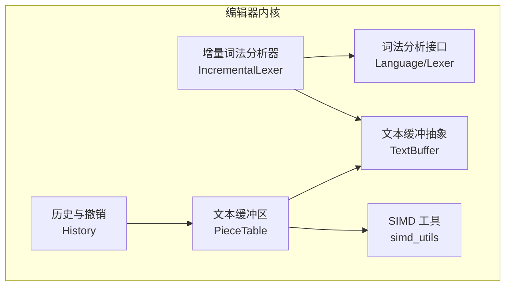
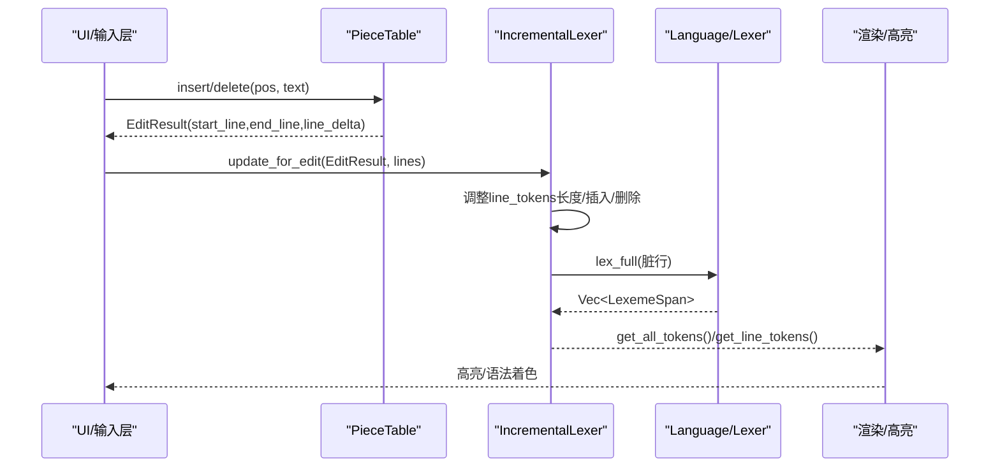
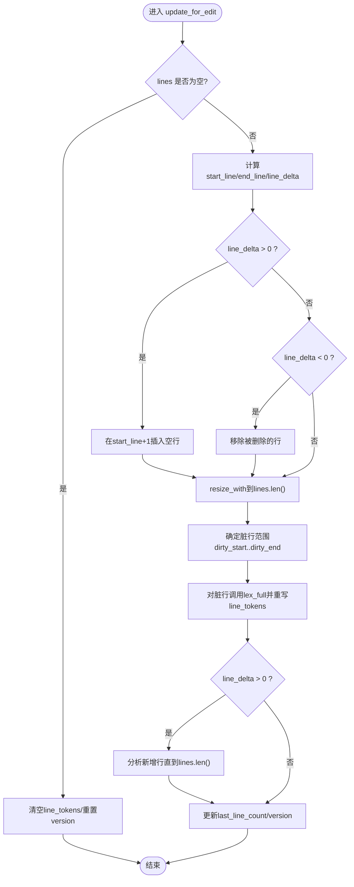
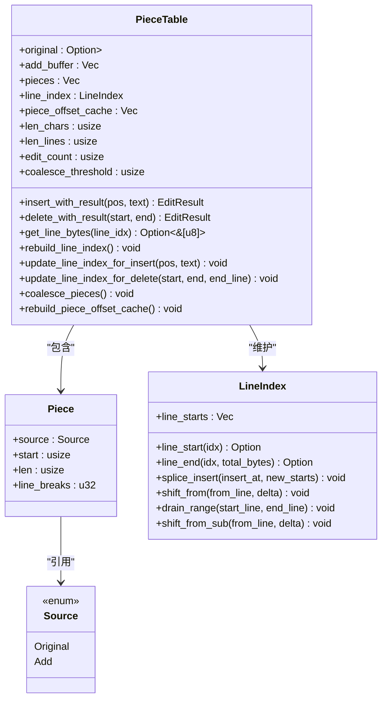
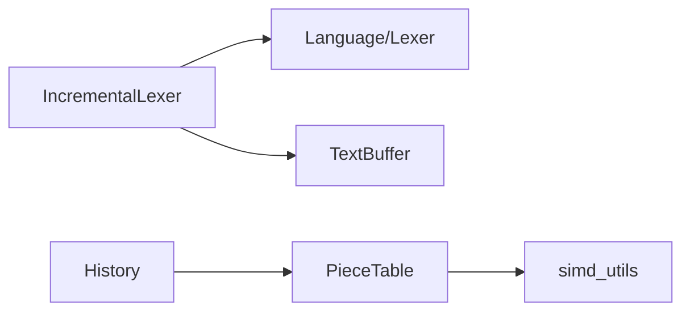

# 增量词法分析优化

<cite>
**本文引用的文件列表**
- [crates/aether-core/src/incremental_lexer.rs](file://crates/aether-core/src/incremental_lexer.rs)
- [crates/aether-core/src/buffer/piece_table.rs](file://crates/aether-core/src/buffer/piece_table.rs)
- [crates/aether-core/src/buffer/text_buffer.rs](file://crates/aether-core/src/buffer/text_buffer.rs)
- [crates/aether-core/src/lexer/mod.rs](file://crates/aether-core/src/lexer/mod.rs)
- [crates/aether-core/src/simd_utils.rs](file://crates/aether-core/src/simd_utils.rs)
- [crates/aether-core/src/buffer/history.rs](file://crates/aether-core/src/buffer/history.rs)
- [crates/aether-core/src/benchmarks.rs](file://crates/aether-core/src/benchmarks.rs)
- [crates/aether-core/benches/lexer_bench.rs](file://crates/aether-core/benches/lexer_bench.rs)
</cite>

## 目录
1. [简介](#简介)
2. [项目结构](#项目结构)
3. [核心组件](#核心组件)
4. [架构总览](#架构总览)
5. [详细组件分析](#详细组件分析)
6. [依赖关系分析](#依赖关系分析)
7. [性能考量](#性能考量)
8. [故障排除指南](#故障排除指南)
9. [结论](#结论)
10. [附录](#附录)

## 简介
本技术文档围绕“增量词法分析优化机制”展开，系统性阐述以下方面：
- 增量分析的核心算法：变更检测策略与局部重分析技术
- Piece Table 集成方案：利用文本缓冲区的增量更新避免全量重新分析
- 缓存机制设计：Token 结果缓存、依赖关系追踪与失效策略
- 性能优化技巧：并行分析、懒加载与内存池使用（结合现有实现与可落地建议）
- 触发条件与执行流程：以用户输入处理时的实时高亮更新为例
- 场景化性能表现：大文件编辑、频繁修改、长文档浏览的优化效果
- 配置调优与故障排除：面向开发者的实践指南

## 项目结构
本项目采用模块化组织，增量词法分析与文本缓冲区分别位于 aether-core 子模块中。关键路径如下：
- 增量词法分析器：按行缓存 Token，基于 EditResult 进行局部重分析
- 文本缓冲区：Piece Table 提供 O(1) 插入/删除、零拷贝读取与高效行索引维护
- 词法分析接口：统一 Lexer trait 与 Language 静态分发，支持多语言
- SIMD 工具：批量查找换行符、空白跳过等加速原语
- 历史与撤销：基于 Piece 元数据快照的高效 Undo/Redo

图表来源
- [crates/aether-core/src/incremental_lexer.rs:1-130](file://crates/aether-core/src/incremental_lexer.rs#L1-L130)
- [crates/aether-core/src/buffer/piece_table.rs:117-781](file://crates/aether-core/src/buffer/piece_table.rs#L117-L781)
- [crates/aether-core/src/buffer/text_buffer.rs:1-172](file://crates/aether-core/src/buffer/text_buffer.rs#L1-L172)
- [crates/aether-core/src/lexer/mod.rs:1-182](file://crates/aether-core/src/lexer/mod.rs#L1-L182)
- [crates/aether-core/src/simd_utils.rs:1-171](file://crates/aether-core/src/simd_utils.rs#L1-L171)
- [crates/aether-core/src/buffer/history.rs:1-327](file://crates/aether-core/src/buffer/history.rs#L1-L327)

章节来源
- [crates/aether-core/src/incremental_lexer.rs:1-130](file://crates/aether-core/src/incremental_lexer.rs#L1-L130)
- [crates/aether-core/src/buffer/piece_table.rs:117-781](file://crates/aether-core/src/buffer/piece_table.rs#L117-L781)
- [crates/aether-core/src/buffer/text_buffer.rs:1-172](file://crates/aether-core/src/buffer/text_buffer.rs#L1-L172)
- [crates/aether-core/src/lexer/mod.rs:1-182](file://crates/aether-core/src/lexer/mod.rs#L1-L182)
- [crates/aether-core/src/simd_utils.rs:1-171](file://crates/aether-core/src/simd_utils.rs#L1-L171)
- [crates/aether-core/src/buffer/history.rs:1-327](file://crates/aether-core/src/buffer/history.rs#L1-L327)

## 核心组件
- 增量词法分析器 IncrementalLexer
  - 按行缓存 LexemeSpan 向量，行号即 Vec 索引，O(1) 访问
  - 通过 EditResult 计算受影响行范围，仅对脏行重分析
  - 版本计数器 version 用于外部失效检测
- 增量管理器 IncrementalLexerManager
  - 管理多个文件的增量 lexer，限制最大缓存文件数，避免无界增长
- 文本缓冲区 TextBuffer 与 PieceTable
  - 基于 Piece 的追加式缓冲区，支持 O(1) 插入/删除
  - 维护行索引 LineIndex 与前缀和 piece_offset_cache，O(log n)/O(1) 定位
  - 提供 get_line_bytes 零拷贝路径，跨 piece 回退拼接
- 词法分析接口 Language/Lexer
  - 统一 Lexer trait，Language 提供静态分发 lex_full，避免 Box 分配
- SIMD 工具 simd_utils
  - 批量查找换行符、空白跳过、前缀匹配等，提升扫描速度
- 历史与撤销 History
  - 基于 Piece 元数据快照，支持合并窗口与撤销组

章节来源
- [crates/aether-core/src/incremental_lexer.rs:1-130](file://crates/aether-core/src/incremental_lexer.rs#L1-L130)
- [crates/aether-core/src/buffer/piece_table.rs:117-781](file://crates/aether-core/src/buffer/piece_table.rs#L117-L781)
- [crates/aether-core/src/buffer/text_buffer.rs:1-172](file://crates/aether-core/src/buffer/text_buffer.rs#L1-L172)
- [crates/aether-core/src/lexer/mod.rs:1-182](file://crates/aether-core/src/lexer/mod.rs#L1-L182)
- [crates/aether-core/src/simd_utils.rs:1-171](file://crates/aether-core/src/simd_utils.rs#L1-L171)
- [crates/aether-core/src/buffer/history.rs:1-327](file://crates/aether-core/src/buffer/history.rs#L1-L327)

## 架构总览
增量词法分析的整体流程：
- 文本编辑由 PieceTable 完成，返回 EditResult（受影响的行范围与行数变化）
- IncrementalLexer 根据 EditResult 调整内部 line_tokens 并仅重分析脏行
- 渲染或高亮时从 IncrementalLexer 获取每行的 LexemeSpan 进行着色
- 历史系统记录 Piece 元数据快照，支持撤销/重做；不直接参与增量分析

图表来源
- [crates/aether-core/src/buffer/piece_table.rs:170-413](file://crates/aether-core/src/buffer/piece_table.rs#L170-L413)
- [crates/aether-core/src/incremental_lexer.rs:36-101](file://crates/aether-core/src/incremental_lexer.rs#L36-L101)
- [crates/aether-core/src/lexer/mod.rs:144-182](file://crates/aether-core/src/lexer/mod.rs#L144-L182)

## 详细组件分析

### 增量词法分析器 IncrementalLexer
- 数据结构
  - line_tokens: Vec<Vec<LexemeSpan>>，行号即索引，连续内存布局，O(1) 访问
  - version: u64 版本号，用于外部失效检测
  - last_line_count: usize 上次分析的行数，辅助统计
- 核心方法
  - analyze_all(lines): 首次打开文件时全量分析所有行
  - update_for_edit(edit_result, lines): 增量更新，依据 EditResult 调整 line_tokens 并仅重分析脏行
  - get_line_tokens/get_all_tokens: 提供行级或全部 token 视图
  - clear/version/cache_stats: 清理、版本查询与缓存统计
- 变更检测策略
  - start_line..end_line 为内容可能变化的行范围
  - line_delta > 0 时在 start_line+1 处插入空行；< 0 则移除对应行
  - 若行数增加，继续分析新增行（确保 line_tokens 与 lines 一致）
- 失效策略
  - 每次编辑后 version += 1，上层可通过版本比较决定是否刷新高亮
  - 文件切换时调用 clear 清空缓存

图表来源
- [crates/aether-core/src/incremental_lexer.rs:36-101](file://crates/aether-core/src/incremental_lexer.rs#L36-L101)

章节来源
- [crates/aether-core/src/incremental_lexer.rs:1-130](file://crates/aether-core/src/incremental_lexer.rs#L1-L130)

### 增量管理器 IncrementalLexerManager
- 职责
  - 管理多个文件的 IncrementalLexer，支持 open_file/current_lexer/close_file/switch_file/clear_all
- 缓存上限保护
  - MAX_INCREMENTAL_LEXER_FILES = 32，超过上限且目标文件不在缓存时清空旧缓存，避免长时间运行后无界增长

章节来源
- [crates/aether-core/src/incremental_lexer.rs:131-193](file://crates/aether-core/src/incremental_lexer.rs#L131-L193)

### 文本缓冲区 PieceTable
- 数据结构
  - original: Arc<Mmap> 原始文件只读映射
  - add_buffer: Vec<u8> 追加缓冲区（只追加不删除）
  - pieces: Vec<Piece> 有序片段表
  - line_index: LineIndex 行起始字节偏移索引
  - piece_offset_cache: Vec<usize> 前缀和缓存，O(1) 获取 piece 起始偏移与总字节数
  - len_chars/len_lines/edit_count/coalesce_threshold: 元数据与自动合并阈值
- 关键操作
  - insert_with_result/delete_with_result: 返回 EditResult，包含受影响行范围与行数变化
  - get_line_bytes: 优先零拷贝单 piece 命中，跨 piece 回退拼接
  - rebuild_line_index/update_line_index_for_insert/update_line_index_for_delete: 重建或增量更新行索引
  - coalesce_pieces/rebuild_piece_offset_cache: 碎片合并与前缀和缓存重建
- 性能要点
  - 使用 SIMD 加速换行符计数与查找
  - 二分查找 + 前缀和缓存将 find_piece_at_byte 降至 O(log n)
  - 写入路径 write_to 避免中间 String 分配

图表来源
- [crates/aether-core/src/buffer/piece_table.rs:117-781](file://crates/aether-core/src/buffer/piece_table.rs#L117-L781)

章节来源
- [crates/aether-core/src/buffer/piece_table.rs:117-781](file://crates/aether-core/src/buffer/piece_table.rs#L117-L781)

### 词法分析接口 Language/Lexer
- Lexer trait 定义 lex_full(text) -> Vec<LexemeSpan>
- Language 提供 from_extension/from_path 语言检测与 create_lexer/lex_full 静态分发
- 支持多种语言（C/Rust/Python/JS/TS/Json/Markdown/Toml/Html/Css/PlainText/Image），未知扩展名归入 PlainText

章节来源
- [crates/aether-core/src/lexer/mod.rs:1-182](file://crates/aether-core/src/lexer/mod.rs#L1-L182)

### SIMD 工具 simd_utils
- count_newlines_simd: 16/8 字节批量处理，SWAR 快速检测含换行块，再逐字节精确计数
- find_byte_simd: 批量查找目标字节，假阳性后逐字节验证
- skip_whitespace_simd: 批量跳过空格、制表符、回车
- starts_with_simd/line_length_simd/classify_chars_simd: 关键字前缀匹配、行长度计算、字符分类

章节来源
- [crates/aether-core/src/simd_utils.rs:1-171](file://crates/aether-core/src/simd_utils.rs#L1-L171)

### 历史与撤销 History
- 基于 Piece 元数据快照，记录 prev_pieces/prev_add_len/cursor_before/after/op_type/timestamp
- 合并窗口：同位置快速连续插入/删除在 500ms 内合并为一条记录
- 撤销组：begin_group/end_group 标记组首与成员，一次 undo 撤销整个组
- 限制记录数量，VecDeque 支持 O(1) 淘汰

章节来源
- [crates/aether-core/src/buffer/history.rs:1-327](file://crates/aether-core/src/buffer/history.rs#L1-L327)

## 依赖关系分析
- IncrementalLexer 依赖 Language/Lexer 进行行级全量分析
- IncrementalLexer 依赖 TextBuffer 提供的行文本与 EditResult
- PieceTable 依赖 simd_utils 进行换行符计数与查找
- History 依赖 PieceTable 的 Piece 元数据进行快照恢复

图表来源
- [crates/aether-core/src/incremental_lexer.rs:1-130](file://crates/aether-core/src/incremental_lexer.rs#L1-L130)
- [crates/aether-core/src/buffer/piece_table.rs:117-781](file://crates/aether-core/src/buffer/piece_table.rs#L117-L781)
- [crates/aether-core/src/buffer/text_buffer.rs:1-172](file://crates/aether-core/src/buffer/text_buffer.rs#L1-L172)
- [crates/aether-core/src/simd_utils.rs:1-171](file://crates/aether-core/src/simd_utils.rs#L1-L171)
- [crates/aether-core/src/buffer/history.rs:1-327](file://crates/aether-core/src/buffer/history.rs#L1-L327)

章节来源
- [crates/aether-core/src/incremental_lexer.rs:1-130](file://crates/aether-core/src/incremental_lexer.rs#L1-L130)
- [crates/aether-core/src/buffer/piece_table.rs:117-781](file://crates/aether-core/src/buffer/piece_table.rs#L117-L781)
- [crates/aether-core/src/buffer/text_buffer.rs:1-172](file://crates/aether-core/src/buffer/text_buffer.rs#L1-L172)
- [crates/aether-core/src/simd_utils.rs:1-171](file://crates/aether-core/src/simd_utils.rs#L1-L171)
- [crates/aether-core/src/buffer/history.rs:1-327](file://crates/aether-core/src/buffer/history.rs#L1-L327)

## 性能考量
- 变更检测与局部重分析
  - 通过 EditResult 精准定位脏行，避免全量重分析
  - 行级缓存使用 Vec 连续内存布局，减少缓存抖动与分配开销
- Piece Table 优化
  - 前缀和缓存使 byte_offset_of_piece 与 len_bytes 达到 O(1)
  - 行索引增量更新避免全量重建
  - 零拷贝 get_line_bytes 减少字符串分配
- SIMD 加速
  - 换行符计数与查找使用 SWAR 批量处理，显著降低 CPU 周期
- 缓存上限与失效
  - IncrementalLexerManager 限制最大缓存文件数，防止内存无界增长
  - version 计数器便于上层按需刷新高亮
- 基准测试
  - benchmarks.rs 提供增量词法分析对比测试（全量 vs 增量）
  - benches/lexer_bench.rs 提供各语言 lexer 吞吐基准

章节来源
- [crates/aether-core/src/buffer/piece_table.rs:420-710](file://crates/aether-core/src/buffer/piece_table.rs#L420-L710)
- [crates/aether-core/src/incremental_lexer.rs:131-193](file://crates/aether-core/src/incremental_lexer.rs#L131-L193)
- [crates/aether-core/src/benchmarks.rs:415-442](file://crates/aether-core/src/benchmarks.rs#L415-L442)
- [crates/aether-core/benches/lexer_bench.rs:136-162](file://crates/aether-core/benches/lexer_bench.rs#L136-L162)

## 故障排除指南
- 症状：高亮延迟或卡顿
  - 检查是否频繁触发全量分析（确认 EditResult 是否正确传递）
  - 查看 IncrementalLexer.version 是否稳定递增，确认脏行范围合理
  - 观察 PieceTable 的 edit_count 是否频繁触发 coalesce_pieces，适当调整阈值
- 症状：行号错乱或越界
  - 校验 line_index 的 shift/drain 边界条件，确保 drain_range 与 shift_from_sub 参数正确
  - 确认 get_line_bytes 跨 piece 回退逻辑未被误用
- 症状：内存持续增长
  - 检查 IncrementalLexerManager 的缓存上限保护是否生效
  - 确认文件切换时是否调用 clear/clear_all
- 症状：撤销/重做异常
  - 核对 History 的合并窗口与撤销组逻辑，确保 begin_group/end_group 成对出现
  - 验证 record 的 op_type 与 edit_pos/edit_len 传入值是否符合预期

章节来源
- [crates/aether-core/src/incremental_lexer.rs:131-193](file://crates/aether-core/src/incremental_lexer.rs#L131-L193)
- [crates/aether-core/src/buffer/piece_table.rs:746-781](file://crates/aether-core/src/buffer/piece_table.rs#L746-L781)
- [crates/aether-core/src/buffer/history.rs:1-327](file://crates/aether-core/src/buffer/history.rs#L1-L327)

## 结论
增量词法分析在本项目中通过“行级 Token 缓存 + EditResult 驱动的局部重分析”实现了高效的实时高亮体验。Piece Table 提供了高性能的文本缓冲区与行索引维护，配合 SIMD 加速与缓存上限保护，整体性能在大文件编辑、频繁修改与长文档浏览场景中具备良好表现。开发者可基于现有接口进一步引入并行分析、懒加载与内存池等优化手段，以获得更佳的交互响应与资源利用率。

## 附录

### 代码示例路径（触发条件与执行流程）
- 增量分析触发条件
  - 文本编辑后获得 EditResult，将其传递给 IncrementalLexer.update_for_edit
  - 参考路径：[crates/aether-core/src/incremental_lexer.rs:36-101](file://crates/aether-core/src/incremental_lexer.rs#L36-L101)
- 执行流程
  - 调整 line_tokens 长度/插入/删除 → 计算脏行范围 → 对脏行调用 lex_full → 更新版本
  - 参考路径：[crates/aether-core/src/incremental_lexer.rs:36-101](file://crates/aether-core/src/incremental_lexer.rs#L36-L101)
- 用户输入处理时的实时高亮更新
  - UI 调用 PieceTable.insert/delete → 得到 EditResult → 调用 IncrementalLexer.update_for_edit → 渲染层读取 tokens 高亮
  - 参考路径：
    - [crates/aether-core/src/buffer/piece_table.rs:170-413](file://crates/aether-core/src/buffer/piece_table.rs#L170-L413)
    - [crates/aether-core/src/incremental_lexer.rs:36-101](file://crates/aether-core/src/incremental_lexer.rs#L36-L101)
    - [crates/aether-core/src/lexer/mod.rs:144-182](file://crates/aether-core/src/lexer/mod.rs#L144-L182)

### 配置调优指南
- 增量管理器缓存上限
  - MAX_INCREMENTAL_LEXER_FILES 控制最大缓存文件数，避免内存无界增长
  - 参考路径：[crates/aether-core/src/incremental_lexer.rs:139-142](file://crates/aether-core/src/incremental_lexer.rs#L139-L142)
- Piece Table 自动合并阈值
  - coalesce_threshold 控制碎片合并频率，影响后续操作性能与内存占用平衡
  - 参考路径：[crates/aether-core/src/buffer/piece_table.rs:30-34](file://crates/aether-core/src/buffer/piece_table.rs#L30-L34)
- 历史合并窗口
  - 500ms 同位置连续插入/删除合并为一条记录，减少撤销栈膨胀
  - 参考路径：[crates/aether-core/src/buffer/history.rs:124-151](file://crates/aether-core/src/buffer/history.rs#L124-L151)

### 性能基准与对比
- 增量词法分析对比
  - 全量 vs 增量性能对比测试，评估不同场景下的耗时与吞吐量
  - 参考路径：[crates/aether-core/src/benchmarks.rs:423-427](file://crates/aether-core/src/benchmarks.rs#L423-L427)
- 各语言 Lexer 吞吐基准
  - Rust/JS/Python/C 样本的 lex_full 吞吐测试
  - 参考路径：[crates/aether-core/benches/lexer_bench.rs:136-162](file://crates/aether-core/benches/lexer_bench.rs#L136-L162)