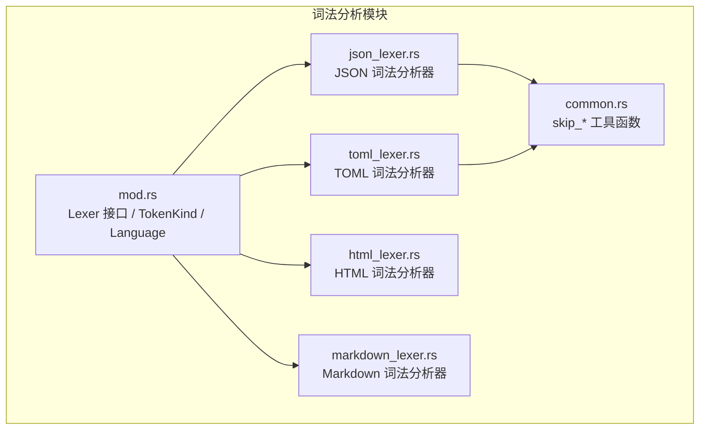
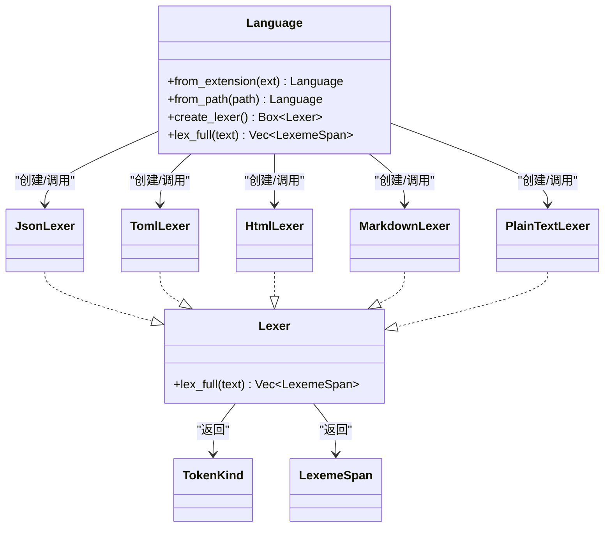
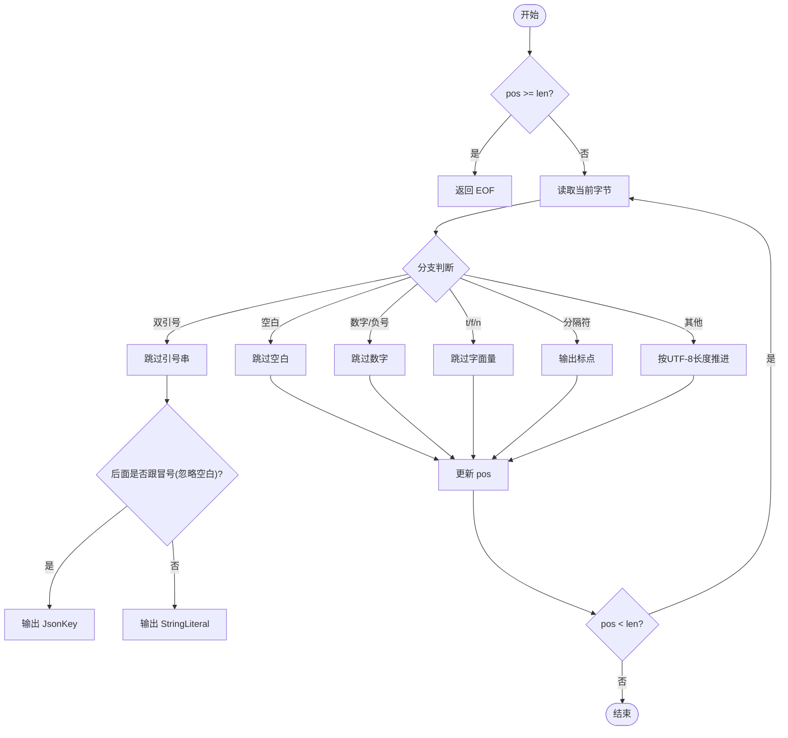
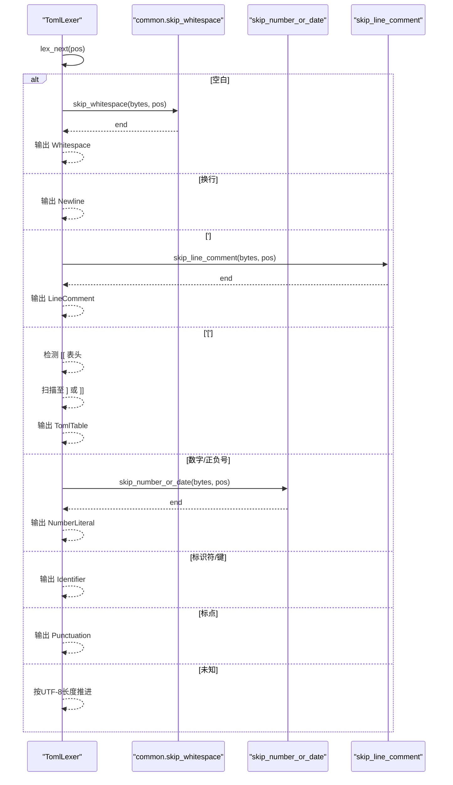
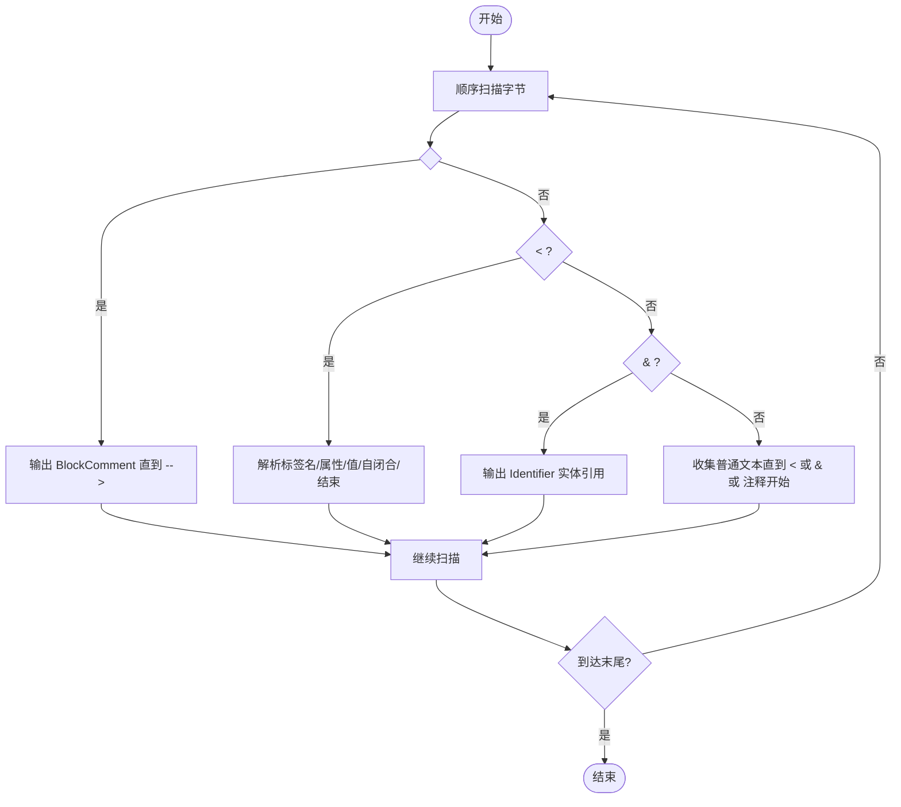
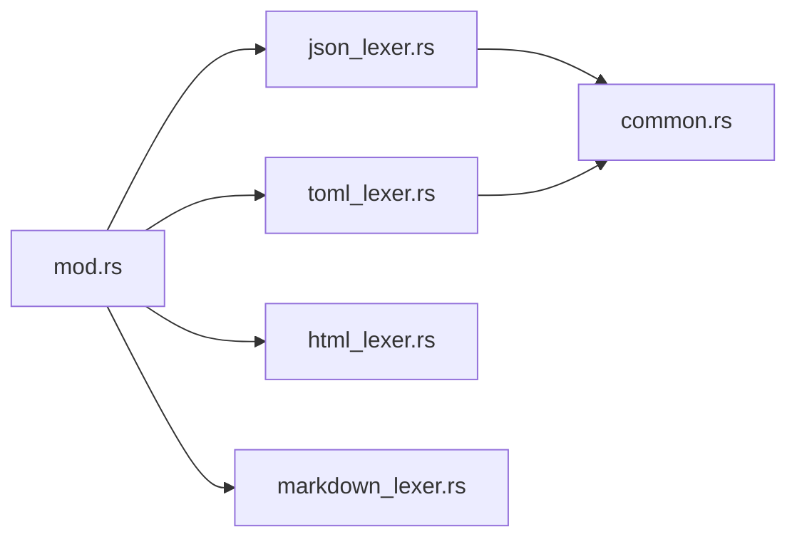

# 数据格式词法分析器

<cite>
**本文引用的文件列表**
- [mod.rs](file://crates/aether-core/src/lexer/mod.rs)
- [json_lexer.rs](file://crates/aether-core/src/lexer/json_lexer.rs)
- [toml_lexer.rs](file://crates/aether-core/src/lexer/toml_lexer.rs)
- [html_lexer.rs](file://crates/aether-core/src/lexer/html_lexer.rs)
- [markdown_lexer.rs](file://crates/aether-core/src/lexer/markdown_lexer.rs)
- [common.rs](file://crates/aether-core/src/lexer/common.rs)
</cite>

## 目录
1. [简介](#简介)
2. [项目结构](#项目结构)
3. [核心组件](#核心组件)
4. [架构总览](#架构总览)
5. [详细组件分析](#详细组件分析)
6. [依赖关系分析](#依赖关系分析)
7. [性能考量](#性能考量)
8. [故障排查指南](#故障排查指南)
9. [结论](#结论)
10. [附录](#附录)

## 简介
本技术文档聚焦于数据格式的词法分析器实现，覆盖 JSON、TOML、HTML 与 Markdown 四类语言/格式的专用词法分析器。文档深入解释：
- JSON 词法分析器的键值对识别、嵌套对象处理与注释支持现状
- TOML 词法分析器的表头声明、数组语法与日期时间字面量处理
- HTML 词法分析器的标签解析机制（自闭合、属性、嵌套）
- Markdown 词法分析器的标题、列表、链接、代码块与强调文本的高亮规则
同时对比数据格式与编程语言在词法分析上的差异与优化策略，并提供复杂嵌套结构与边界情况的处理思路及错误恢复建议。

## 项目结构
词法分析模块位于 aether-core 的 lexer 子模块中，采用“统一接口 + 多语言实现”的组织方式：
- 公共接口与类型定义集中在 mod.rs
- 各语言/格式的具体实现以独立文件组织
- 通用扫描工具函数集中在 common.rs，供多个 lexer 复用



图表来源
- [mod.rs:1-182](file://crates/aether-core/src/lexer/mod.rs#L1-L182)
- [common.rs:1-151](file://crates/aether-core/src/lexer/common.rs#L1-L151)

章节来源
- [mod.rs:1-182](file://crates/aether-core/src/lexer/mod.rs#L1-L182)
- [common.rs:1-151](file://crates/aether-core/src/lexer/common.rs#L1-L151)

## 核心组件
- Lexer trait：定义统一的 lex_full(text) -> Vec<LexemeSpan> 接口，用于单行或全量文本的词法分析。
- TokenKind：跨语言的统一 token 分类，包含关键字、标识符、字符串、数字、注释、运算符、分隔符、预处理指令、属性、类型名、函数名、宏、生命周期、泛型、正则、格式化字符串、Markdown 标题/链接/代码/强调、JSON 键、TOML 表头、空白、换行、未知、EOF 等。
- LexemeSpan：记录每个 token 的起始位置、长度、种类与标志位。
- Language：根据扩展名或路径选择具体 lexer，并支持静态分发调用 lex_full，避免动态分配与虚函数开销。
- PlainTextLexer：无高亮的纯文本 fallback。

这些组件为后续各数据格式的词法分析提供了统一抽象与高效调度能力。

章节来源
- [mod.rs:1-182](file://crates/aether-core/src/lexer/mod.rs#L1-L182)

## 架构总览
整体架构遵循“统一接口 + 多实现 + 共享工具”的模式：
- 上层通过 Language::lex_full 直接调用对应语言的 lex_full，避免 Box 分配与动态分发
- 各语言 lexer 内部使用字节切片进行快速扫描，减少 UTF-8 解码成本
- 通用跳过逻辑（如空白、引号、注释）抽取到 common.rs，提高复用性与一致性



图表来源
- [mod.rs:1-182](file://crates/aether-core/src/lexer/mod.rs#L1-L182)

## 详细组件分析

### JSON 词法分析器
- 目标与特性
  - 识别字符串、数字、布尔与 null、分隔符与空白
  - 将紧跟冒号的字符串识别为 JSON 键（JsonKey），其余字符串为普通字符串
  - 未实现注释；遇到未知字符按 Unknown 推进，保证鲁棒性
- 关键流程
  - 主循环逐字节扫描，按首字节分支进入不同 skip_* 函数
  - 字符串后检查是否跟随冒号（忽略空白）以判定是否为键
  - 数字支持负号、小数点与指数形式
  - true/false/null 归为 Keyword，其他字母序列归为 Identifier
- 嵌套与容错
  - 不维护状态栈，仅做扁平化 token 流；嵌套语义由上层解析器负责
  - 未知字符按 UTF-8 字符长度推进，避免死循环
- 示例参考
  - 键识别测试、空输入、空白、数字、字符串、标点、未知字符、非法字面量等用例



图表来源
- [json_lexer.rs:1-278](file://crates/aether-core/src/lexer/json_lexer.rs#L1-L278)

章节来源
- [json_lexer.rs:1-278](file://crates/aether-core/src/lexer/json_lexer.rs#L1-L278)

### TOML 词法分析器
- 目标与特性
  - 支持表头声明 [table] 与 [[array_table]]，统一标记为 TomlTable
  - 支持双引号与单引号字符串、布尔、数字与日期时间混合扫描
  - 支持 # 行注释、换行、标识符键（Identifier）、标点
- 特殊语法处理
  - 表头：检测 [ 后是否紧接 [，若是则视为数组表头；扫描至 ] 或 ]] 结束
  - 数字/日期：允许数字、连字符、冒号、T、Z、+、.、e/E 等组合，兼容 ISO 8601 风格
  - 键：统一使用 Identifier，而非 JsonKey
- 容错与边界
  - 未闭合表头仍会产出 TomlTable token，便于上层提示
  - 未知字符按 UTF-8 长度推进



图表来源
- [toml_lexer.rs:1-374](file://crates/aether-core/src/lexer/toml_lexer.rs#L1-L374)
- [common.rs:1-151](file://crates/aether-core/src/lexer/common.rs#L1-L151)

章节来源
- [toml_lexer.rs:1-374](file://crates/aether-core/src/lexer/toml_lexer.rs#L1-L374)

### HTML 词法分析器
- 目标与特性
  - 识别 HTML 注释 <!-- ... -->
  - 识别标签 <tag .../> 与 </tag>，包括标签名、属性名、赋值符 =、属性值（带或不带引号）
  - 识别实体引用 &...;
  - 普通文本作为 Unknown 输出
- 标签解析机制
  - 标签名：ASCII 字母数字、连字符、下划线、冒号
  - 属性：名称后可选 = 与值；值可为双引号或单引号包裹，也可为无引号连续非空白字符
  - 自闭合：/ 与 > 分别作为标点输出
  - 嵌套：不维护栈，仅做扁平 token 流；嵌套语义由上层处理
- 容错与边界
  - 未闭合标签仍会产出 Keyword 与 Punctuation
  - 裸小于号 < 在非标签上下文时作为标点处理



图表来源
- [html_lexer.rs:1-310](file://crates/aether-core/src/lexer/html_lexer.rs#L1-L310)

章节来源
- [html_lexer.rs:1-310](file://crates/aether-core/src/lexer/html_lexer.rs#L1-L310)

### Markdown 词法分析器
- 目标与特性
  - 标题：以 # 开头且最多 6 个 #，flags 存储级别
  - 代码块：``` 行内代码与 ``` 代码块均标记为 MdCode
  - 链接：[text](url) 整体标记为 MdLink
  - 强调：*text*、**bold**、_under_、__u__ 等，flags 存储星号/下划线数量
  - 列表：无序（-、*、+ 后跟空格）与有序（数字. 后跟空格）整行标记为 Punctuation
  - HTML 标签：行内 <tag ...> 整体标记为 MdCode
  - 普通文本：Unknown；显式换行产生 Newline
- 强调闭合策略
  - 若换行前未找到闭合标记，仅消耗开放标记，避免整行被误标为强调（CORE-M03）
- 容错与边界
  - 未闭合强调不会吞掉整行
  - 过多 # 仍会被识别为标题（当前实现未严格限制级别上限）

```mermaid
flowchart TD
Start(["开始"]) --> Ch{"当前字符"}
Ch --> |'\n'| Newline["输出 Newline"]
Ch --> |'#'| Heading["统计 # 数并检查空格/换行"]
Heading --> |有效| MdHeading["输出 MdHeading (flags=级别)"]
Heading --> |无效| Fallback["回退到普通文本"]
Ch --> |'`'| Code["行内或代码块"]
Code --> MdCode["输出 MdCode"]
Ch --> |'['| Link["匹配 [text](url)"]
Link --> |成功| MdLink["输出 MdLink"]
Link --> |失败| Fallback
Ch --> |'*'/'_'| Emphasis["匹配 * 或 _ 强调"]
Emphasis --> |闭合| MdEmphasis["输出 MdEmphasis (flags=数量)"]
Emphasis --> |未闭合| OpenMarker["仅输出开放标记"]
Ch --> |列表前缀| ListLine["整行输出 Punctuation"]
Ch --> |'<'| HtmlTag["识别 HTML 标签"]
HtmlTag --> MdCode
Ch --> |其他| Plain["普通文本"]
Plain --> Next["继续扫描"]
MdHeading --> Next
MdCode --> Next
MdLink --> Next
MdEmphasis --> Next
OpenMarker --> Next
ListLine --> Next
Fallback --> Next
Next --> End{"到达末尾?"}
End --> |否| Start
End --> |是| Done(["结束"])
```

图表来源
- [markdown_lexer.rs:1-470](file://crates/aether-core/src/lexer/markdown_lexer.rs#L1-L470)

章节来源
- [markdown_lexer.rs:1-470](file://crates/aether-core/src/lexer/markdown_lexer.rs#L1-L470)

### 通用工具与公共逻辑
- 空白跳过：skip_whitespace 支持空格、制表符、回车
- 注释跳过：skip_line_comment、skip_block_comment
- 引号串跳过：skip_quoted 正确处理转义与末尾反斜杠
- 标识符与数字通用框架：skip_identifier_ascii、skip_identifier_with、skip_number_generic
- UTF-8 字符长度推断：utf8_char_len 确保未知字符按完整字符推进

章节来源
- [common.rs:1-151](file://crates/aether-core/src/lexer/common.rs#L1-L151)
- [mod.rs:223-233](file://crates/aether-core/src/lexer/mod.rs#L223-L233)

## 依赖关系分析
- 耦合与内聚
  - 各语言 lexer 高度内聚，仅依赖公共工具与统一接口
  - Language 集中管理语言到 lexer 的映射与静态分发，降低运行时开销
- 外部依赖
  - 仅依赖标准库与同一 crate 内的公共模块，无第三方运行时依赖
- 潜在循环依赖
  - 当前结构清晰，无循环导入风险



图表来源
- [mod.rs:1-182](file://crates/aether-core/src/lexer/mod.rs#L1-L182)
- [common.rs:1-151](file://crates/aether-core/src/lexer/common.rs#L1-L151)

章节来源
- [mod.rs:1-182](file://crates/aether-core/src/lexer/mod.rs#L1-L182)

## 性能考量
- 字节级扫描：所有 lexer 均以 &[u8] 操作，避免频繁 UTF-8 解码
- 预分配容量：Vec 初始容量按 text.len()/4+1 估算，减少扩容
- 静态分发：Language::lex_full 直接调用具体实现，避免 Box 分配与虚函数调用
- 跳过函数复用：common.rs 提供高效跳过逻辑，减少重复代码
- 未知字符推进：基于 utf8_char_len 保证安全前进，避免死循环

[本节为通用指导，无需特定文件来源]

## 故障排查指南
- JSON
  - 未闭合字符串：skip_quoted 会吞到末尾，token 类型为 StringLiteral；上层应报告语法错误
  - 非法字面量：如 truish 会被识别为 Identifier，需上层校验
- TOML
  - 未闭合表头：仍输出 TomlTable，但缺少闭合括号；上层可提示修复
  - 日期时间混入数字：skip_number_or_date 可能将日期片段纳入 NumberLiteral，上层需区分
- HTML
  - 未闭合标签：仍输出 Keyword 与 Punctuation；上层需构建 DOM 树时进行修复
  - 裸小于号：在非标签上下文中作为标点，避免误判
- Markdown
  - 未闭合强调：仅消耗开放标记，避免整行误标；上层可在渲染阶段提示
  - 过多 #：当前实现仍识别为标题，可按需增强校验

章节来源
- [json_lexer.rs:1-278](file://crates/aether-core/src/lexer/json_lexer.rs#L1-L278)
- [toml_lexer.rs:1-374](file://crates/aether-core/src/lexer/toml_lexer.rs#L1-L374)
- [html_lexer.rs:1-310](file://crates/aether-core/src/lexer/html_lexer.rs#L1-L310)
- [markdown_lexer.rs:1-470](file://crates/aether-core/src/lexer/markdown_lexer.rs#L1-L470)

## 结论
该词法分析模块通过统一接口与共享工具实现了高效、可扩展的数据格式与语言高亮能力。针对数据格式（JSON、TOML、HTML、Markdown）的特性，各 lexer 在保持轻量与鲁棒性的同时，提供了必要的结构化 token 输出，便于上层进行语法分析与高亮渲染。未来可在以下方面持续优化：
- 增加 JSON 注释支持（jsonc）
- 强化 TOML 数组项与更严格的日期时间识别
- 提升 HTML 标签嵌套语义感知（可选）
- 完善 Markdown 更多语法（任务列表、脚注等）

[本节为总结，无需特定文件来源]

## 附录
- 数据格式与编程语言词法差异与优化策略
  - 数据格式通常更注重字面量与结构的快速识别，较少关注控制流与复杂表达式
  - 优化重点在于：
    - 字节级扫描与跳过函数复用
    - 扁平 token 流设计，将嵌套语义交由上层
    - 容错推进（未知字符按 UTF-8 长度前进）
    - 静态分发减少运行时开销
  - 编程语言通常需要更复杂的上下文敏感识别（如 JS 的正则与除号歧义、Rust 的生命周期与属性），而数据格式更偏向确定性规则与宽松容错

[本节为概念性内容，无需特定文件来源]