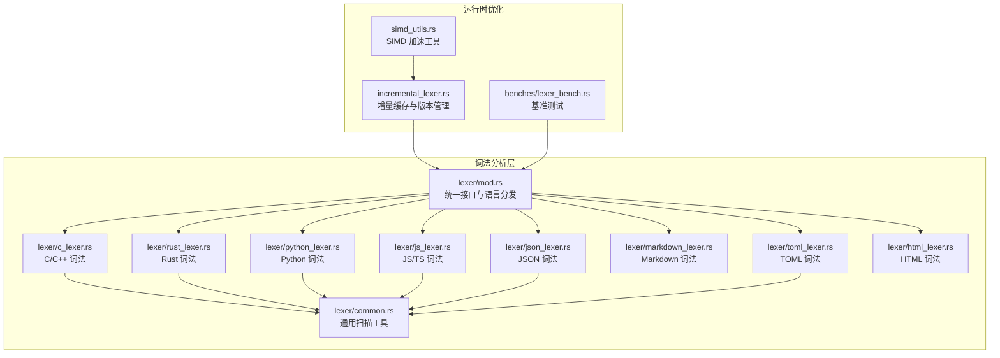
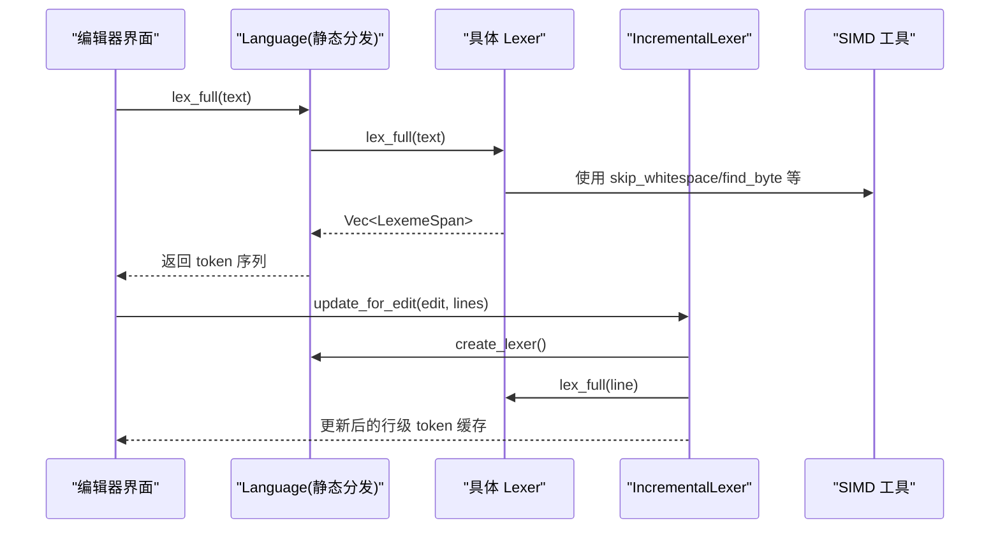
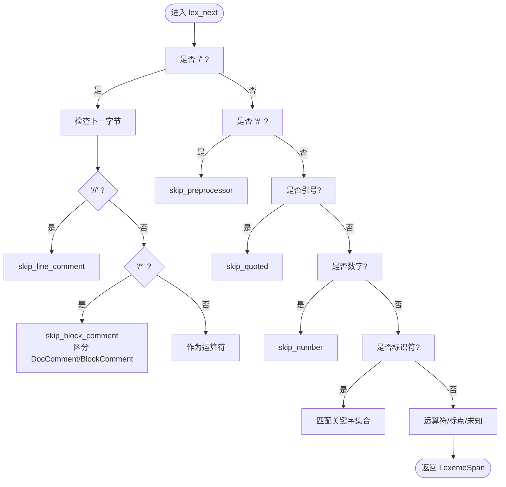
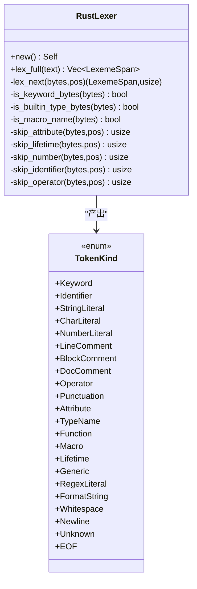
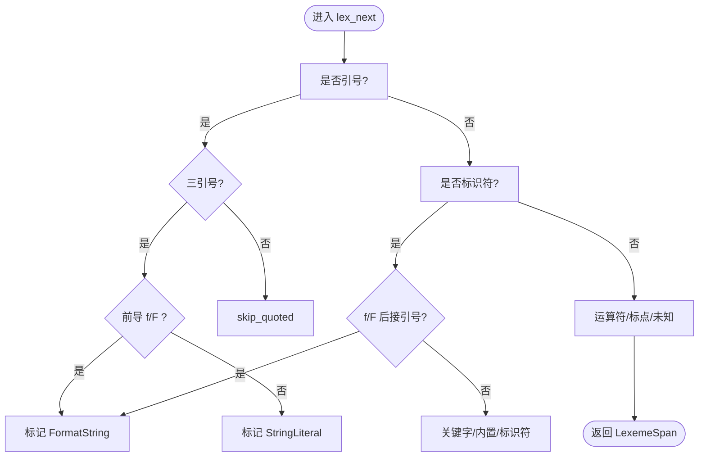
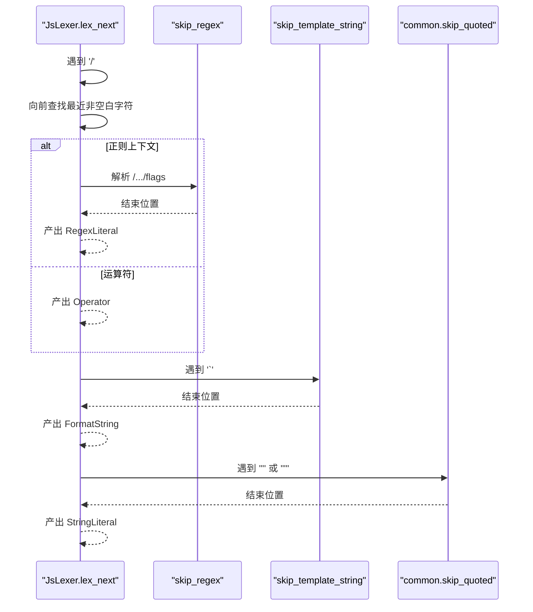
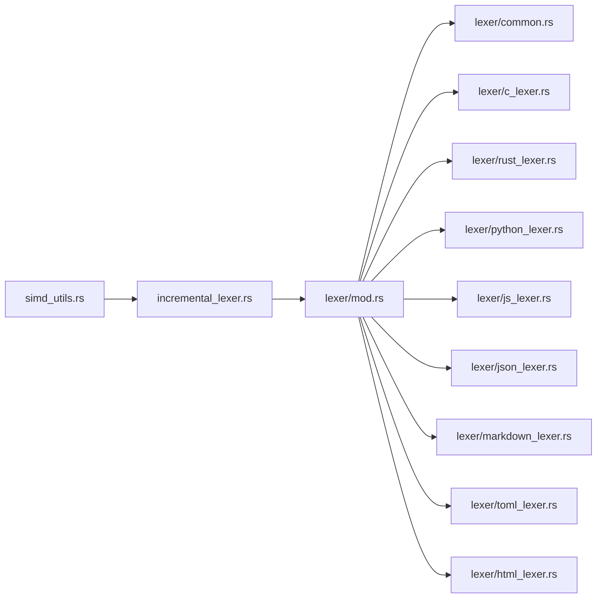

# 编程语言词法分析器实现

<cite>
**本文引用的文件列表**
- [mod.rs](file://crates/aether-core/src/lexer/mod.rs)
- [c_lexer.rs](file://crates/aether-core/src/lexer/c_lexer.rs)
- [rust_lexer.rs](file://crates/aether-core/src/lexer/rust_lexer.rs)
- [python_lexer.rs](file://crates/aether-core/src/lexer/python_lexer.rs)
- [js_lexer.rs](file://crates/aether-core/src/lexer/js_lexer.rs)
- [common.rs](file://crates/aether-core/src/lexer/common.rs)
- [json_lexer.rs](file://crates/aether-core/src/lexer/json_lexer.rs)
- [markdown_lexer.rs](file://crates/aether-core/src/lexer/markdown_lexer.rs)
- [toml_lexer.rs](file://crates/aether-core/src/lexer/toml_lexer.rs)
- [html_lexer.rs](file://crates/aether-core/src/lexer/html_lexer.rs)
- [incremental_lexer.rs](file://crates/aether-core/src/incremental_lexer.rs)
- [simd_utils.rs](file://crates/aether-core/src/simd_utils.rs)
- [lexer_bench.rs](file://crates/aether-core/benches/lexer_bench.rs)
</cite>

## 目录
1. [简介](#简介)
2. [项目结构](#项目结构)
3. [核心组件](#核心组件)
4. [架构总览](#架构总览)
5. [详细组件分析](#详细组件分析)
6. [依赖关系分析](#依赖关系分析)
7. [性能考量](#性能考量)
8. [故障排查指南](#故障排查指南)
9. [结论](#结论)
10. [附录：新增语言支持示例](#附录新增语言支持示例)

## 简介
本仓库为多语言词法分析器实现，提供面向编辑器的轻量级、高性能、可扩展的逐行高亮能力。系统以统一 Token 类型与 Lexer trait 为核心，针对 C/C++、Rust、Python、JavaScript/TypeScript、JSON、Markdown、TOML、HTML 等语言实现了专用词法分析器，并通过增量缓存机制在编辑器交互中实现低延迟更新。同时，SIMD 加速工具用于提升换行计数、空白跳过、字节查找等基础操作的性能。

## 项目结构
词法分析相关代码集中在 aether-core crate 的 lexer 模块下，每个语言一个独立文件；公共工具函数位于 common.rs；Language 枚举负责扩展名到语言的映射与静态分发；增量词法分析器位于 incremental_lexer.rs；SIMD 工具位于 simd_utils.rs；基准测试位于 benches/lexer_bench.rs。



图表来源
- [mod.rs:1-182](file://crates/aether-core/src/lexer/mod.rs#L1-L182)
- [common.rs:1-151](file://crates/aether-core/src/lexer/common.rs#L1-L151)
- [c_lexer.rs:1-230](file://crates/aether-core/src/lexer/c_lexer.rs#L1-L230)
- [rust_lexer.rs:1-353](file://crates/aether-core/src/lexer/rust_lexer.rs#L1-L353)
- [python_lexer.rs:1-219](file://crates/aether-core/src/lexer/python_lexer.rs#L1-L219)
- [js_lexer.rs:1-274](file://crates/aether-core/src/lexer/js_lexer.rs#L1-L274)
- [json_lexer.rs:1-127](file://crates/aether-core/src/lexer/json_lexer.rs#L1-L127)
- [markdown_lexer.rs:1-209](file://crates/aether-core/src/lexer/markdown_lexer.rs#L1-L209)
- [toml_lexer.rs:1-228](file://crates/aether-core/src/lexer/toml_lexer.rs#L1-L228)
- [html_lexer.rs:1-221](file://crates/aether-core/src/lexer/html_lexer.rs#L1-L221)
- [incremental_lexer.rs:1-129](file://crates/aether-core/src/incremental_lexer.rs#L1-L129)
- [simd_utils.rs:1-171](file://crates/aether-core/src/simd_utils.rs#L1-L171)
- [lexer_bench.rs:136-162](file://crates/aether-core/benches/lexer_bench.rs#L136-L162)

章节来源
- [mod.rs:1-182](file://crates/aether-core/src/lexer/mod.rs#L1-L182)
- [common.rs:1-151](file://crates/aether-core/src/lexer/common.rs#L1-L151)

## 核心组件
- 统一接口与类型
  - Lexer trait：定义 lex_full(text) -> Vec<LexemeSpan> 的全量分析接口。
  - TokenKind：跨语言统一的 token 类别（关键字、标识符、字符串、数字、注释、预处理指令、属性、类型名、函数名、宏、生命周期、泛型、正则、格式化字符串、Markdown 标题/链接/代码/强调、JSON 键、TOML 表头、空白、换行、未知、EOF）。
  - LexemeSpan：token 跨度（起始位置、长度、种类、标志位）。
  - Language：按扩展名或路径推断语言，并提供 create_lexer() 动态工厂与 lex_full() 静态分发入口。
- 增量词法分析器
  - IncrementalLexer：按行缓存 token，根据编辑结果只重算受影响行，维护版本号与行数一致性。
  - IncrementalLexerManager：管理多个文件的增量 lexer，限制最大缓存文件数，避免内存无界增长。
- SIMD 工具
  - count_newlines_simd、find_byte_simd、skip_whitespace_simd、starts_with_simd、line_length_simd、classify_chars_simd：基于 u128/u64 批量比较与 SWAR 技巧，提高文本处理速度。

章节来源
- [mod.rs:1-182](file://crates/aether-core/src/lexer/mod.rs#L1-L182)
- [incremental_lexer.rs:1-129](file://crates/aether-core/src/incremental_lexer.rs#L1-L129)
- [simd_utils.rs:1-171](file://crates/aether-core/src/simd_utils.rs#L1-L171)

## 架构总览
整体采用“统一接口 + 语言特定实现 + 增量缓存 + SIMD 加速”的分层架构。上层通过 Language 选择具体 Lexer，底层各 Lexer 复用 common 中的通用扫描函数，增量层对每行结果进行缓存与失效更新，SIMD 工具在需要时提供批量处理优化。



图表来源
- [mod.rs:145-181](file://crates/aether-core/src/lexer/mod.rs#L145-L181)
- [incremental_lexer.rs:28-101](file://crates/aether-core/src/incremental_lexer.rs#L28-L101)
- [simd_utils.rs:176-258](file://crates/aether-core/src/simd_utils.rs#L176-L258)

## 详细组件分析

### C/C++ 词法分析器（CLexer）
- 设计要点
  - DFA 风格的状态推进：lex_next 根据首字节分支，调用通用跳过函数识别注释、字符串、字符、数字、标识符、运算符、预处理指令等。
  - 预处理指令：#include/#define 等整行识别，支持续行符 \+换行。
  - 注释区分：/** ... */ 文档注释与普通块注释；// 行注释。
  - 数字字面量：支持十进制、十六进制、二进制前缀，指数后缀与浮点后缀，阻止 1..2 范围语法被误合并。
  - 运算符：支持复合赋值与移位等组合。
  - UTF-8 安全：未知字符按完整 UTF-8 字符推进，避免错位。
- 关键流程
  - 遇到 / 时判断 // 或 /*，并分别调用 skip_line_comment/skip_block_comment。
  - 遇到 # 时调用 skip_preprocessor 整行识别。
  - 标识符后匹配关键字集合，否则归为 Identifier。
- 复杂度与内存
  - 时间 O(n)，空间 O(n) 输出 token 向量；预分配容量 text.len()/4+1 减少扩容。
- 错误处理
  - 未闭合块注释会推进到末尾，避免残留字节导致后续 token 异常。



图表来源
- [c_lexer.rs:12-213](file://crates/aether-core/src/lexer/c_lexer.rs#L12-L213)
- [c_lexer.rs:288-350](file://crates/aether-core/src/lexer/c_lexer.rs#L288-L350)
- [c_lexer.rs:238-286](file://crates/aether-core/src/lexer/c_lexer.rs#L238-L286)

章节来源
- [c_lexer.rs:1-542](file://crates/aether-core/src/lexer/c_lexer.rs#L1-L542)
- [common.rs:1-151](file://crates/aether-core/src/lexer/common.rs#L1-L151)

### Rust 词法分析器（RustLexer）
- 设计要点
  - 生命周期标注：单引号后跟小写字母标识符识别为 Lifetime，与字符字面量冲突通过前瞻与转义规则解决。
  - 属性注解：#[...] 与#![...] 整段识别为 Attribute。
  - 宏系统：macro/macro_rules! 等宏声明与 ident! 宏调用识别为 Macro。
  - 内置类型：i8/i16/.../Vec/Option/Result 等识别为 TypeName。
  - 注释：/// 与 //! 文档注释，/** ... */ 文档注释，普通块注释。
  - 数字：支持 0x/0o/0b 前缀与下划线分隔，阻止 1..2 范围语法合并。
- 关键流程
  - ' 分支：若下一个字符为反斜杠或单字符则识别为 CharLiteral；若为小写字母则识别为 Lifetime；否则回退为 CharLiteral。
  - # 分支：skip_attribute 支持 ! 与嵌套 [...]。
  - 标识符分支：关键字 > 内置类型 > 宏名 > 标识符。
- 复杂度与内存
  - 同 C 词法分析器，O(n)/O(n)。



图表来源
- [rust_lexer.rs:1-353](file://crates/aether-core/src/lexer/rust_lexer.rs#L1-L353)
- [rust_lexer.rs:361-459](file://crates/aether-core/src/lexer/rust_lexer.rs#L361-L459)
- [rust_lexer.rs:483-511](file://crates/aether-core/src/lexer/rust_lexer.rs#L483-L511)

章节来源
- [rust_lexer.rs:1-769](file://crates/aether-core/src/lexer/rust_lexer.rs#L1-L769)

### Python 词法分析器（PythonLexer）
- 设计要点
  - 缩进感知：当前实现不解析缩进语义，但将换行与空白作为独立 token，便于上层渲染与后续语法分析。
  - 装饰器语法：@ 作为 Punctuation，配合标识符形成装饰器链。
  - 多行字符串：支持三引号 """ 与 '''，f-string 前缀 f/F 在引号之前识别为 FormatString。
  - 数字：支持整数、浮点、科学计数法、虚数 j/J、下划线分隔。
  - 关键字与内置：False/True/None 及常用内置如 int/str/list/dict 等。
- 关键流程
  - 引号分支：检测三引号与 f-string 前缀；普通引号走 skip_quoted。
  - 标识符分支：若 f/F 紧跟引号则识别为 FormatString；否则匹配关键字/内置/标识符。
- 复杂度与内存
  - O(n)/O(n)。



图表来源
- [python_lexer.rs:12-202](file://crates/aether-core/src/lexer/python_lexer.rs#L12-L202)
- [python_lexer.rs:227-303](file://crates/aether-core/src/lexer/python_lexer.rs#L227-L303)

章节来源
- [python_lexer.rs:1-545](file://crates/aether-core/src/lexer/python_lexer.rs#L1-L545)

### JavaScript/TypeScript 词法分析器（JsLexer）
- 设计要点
  - 现代语法：箭头函数、解构赋值、模板字面量、可选链 ?.、空值合并 ??、??=、**=、===、!==、>>> 等。
  - 正则表达式：在上下文敏感的位置识别 /.../flags，支持字符类与转义。
  - 模板字面量：`...${expr}` 支持嵌套与转义，标记为 FormatString。
  - 数字：支持 BigInt 后缀 n，十六进制/八进制/二进制前缀，下划线分隔。
  - 关键字与内置：包含 JS/TS 关键字与常见内置类型/工具类型。
- 关键流程
  - / 分支：向前查找最近非空白字符，判断是否为正则上下文；若是则尝试 skip_regex，否则作为运算符。
  - ` 分支：skip_template_string 处理 ${...} 嵌套与转义。
  - 标识符分支：关键字 > 内置类型 > 标识符。
- 复杂度与内存
  - O(n)/O(n)。



图表来源
- [js_lexer.rs:49-153](file://crates/aether-core/src/lexer/js_lexer.rs#L49-L153)
- [js_lexer.rs:421-473](file://crates/aether-core/src/lexer/js_lexer.rs#L421-L473)
- [js_lexer.rs:154-165](file://crates/aether-core/src/lexer/js_lexer.rs#L154-L165)
- [common.rs:42-55](file://crates/aether-core/src/lexer/common.rs#L42-L55)

章节来源
- [js_lexer.rs:1-778](file://crates/aether-core/src/lexer/js_lexer.rs#L1-L778)

### JSON、Markdown、TOML、HTML 词法分析器
- JSON
  - 键值区分：字符串后紧跟冒号视为 JsonKey，否则为 StringLiteral。
  - 数值与布尔/空：true/false/null 标记为 Keyword。
- Markdown
  - 标题：连续 # 后接空格/换行，level 记录在 flags。
  - 代码块与行内代码：``` 与 ` 识别为 MdCode。
  - 链接：[text](url) 识别为 MdLink。
  - 强调：**text** 或 *text* 或 __text__ 或 _text_，flags 记录强度。
  - 列表与 HTML 标签：行首 -/*/+ 或数字. 识别为 Punctuation；<tag> 识别为 MdCode。
- TOML
  - 表头：[table] 与 [[array]] 识别为 TomlTable。
  - 键：统一使用 Identifier（CORE-L01）。
  - 数值与日期：支持负数、小数、科学计数法、ISO 日期时间。
  - 布尔：true/false 标记为 Keyword。
- HTML
  - 注释：<!-- ... --> 标记为 BlockComment。
  - 标签：<tag attr="value"> 解析标签名、属性名、属性值与自闭合符号。
  - 实体引用：&name; 标记为 Identifier。

章节来源
- [json_lexer.rs:1-278](file://crates/aether-core/src/lexer/json_lexer.rs#L1-L278)
- [markdown_lexer.rs:1-470](file://crates/aether-core/src/lexer/markdown_lexer.rs#L1-L470)
- [toml_lexer.rs:1-374](file://crates/aether-core/src/lexer/toml_lexer.rs#L1-L374)
- [html_lexer.rs:1-310](file://crates/aether-core/src/lexer/html_lexer.rs#L1-L310)

## 依赖关系分析
- 耦合与内聚
  - 各 Lexer 仅依赖 common 中的通用跳过函数，保持高内聚与低耦合。
  - Language 集中管理语言到 Lexer 的映射与静态分发，降低上层调用复杂度。
- 外部依赖
  - 无第三方依赖，全部基于标准库与纯 Rust 实现。
- 循环依赖
  - 未发现循环导入；lexer 模块内部按功能划分清晰。



图表来源
- [mod.rs:184-192](file://crates/aether-core/src/lexer/mod.rs#L184-L192)
- [incremental_lexer.rs:1-129](file://crates/aether-core/src/incremental_lexer.rs#L1-L129)
- [simd_utils.rs:1-171](file://crates/aether-core/src/simd_utils.rs#L1-L171)

章节来源
- [mod.rs:184-192](file://crates/aether-core/src/lexer/mod.rs#L184-L192)
- [incremental_lexer.rs:1-129](file://crates/aether-core/src/incremental_lexer.rs#L1-L129)

## 性能考量
- 算法与数据结构
  - 线性扫描：所有 Lexer 均为 O(n) 单次遍历，避免回溯与复杂状态机。
  - 预分配容量：Vec::with_capacity(text.len()/4+1) 减少扩容开销。
  - 增量缓存：IncrementalLexer 按行缓存，编辑后仅重算受影响行，显著降低交互延迟。
- SIMD 加速
  - 换行计数、空白跳过、字节查找、前缀匹配均使用 u128/u64 批量比较与 SWAR 技巧，提升吞吐。
  - 注意 SWAR 假阳性场景，命中后进行逐字节验证，确保正确性。
- 基准测试
  - benches/lexer_bench.rs 覆盖 Rust/JS/Python/C 样本，统计 Bytes/s 指标，便于回归评估。

章节来源
- [c_lexer.rs:216-229](file://crates/aether-core/src/lexer/c_lexer.rs#L216-L229)
- [incremental_lexer.rs:28-101](file://crates/aether-core/src/incremental_lexer.rs#L28-L101)
- [simd_utils.rs:11-82](file://crates/aether-core/src/simd_utils.rs#L11-L82)
- [lexer_bench.rs:136-162](file://crates/aether-core/benches/lexer_bench.rs#L136-L162)

## 故障排查指南
- 常见问题
  - 未闭合注释：Rust/C 块注释未闭合时会推进到文本末尾，避免残留字节导致后续 token 错位。
  - 正则上下文误判：JS 中 / 在标识符后应识别为运算符而非正则，需检查向前查找最近非空白字符逻辑。
  - 三引号与 f-string：Python 中 f""" 前缀需在引号前检测，避免误分类。
  - 范围语法 1..2：C/Rust/JS 数字解析需阻止双点合并为单个数字。
  - 大文件与内存：IncrementalLexerManager 限制最大缓存文件数，防止长时间运行后内存增长。
- 调试建议
  - 使用 IncrementalLexer.version() 与 cache_stats() 观察缓存命中率与版本变化。
  - 借助单元测试断言 token 数量与种类，快速定位边界情况。
  - 使用基准测试对比修改前后性能，确保优化有效且无退化。

章节来源
- [rust_lexer.rs:461-481](file://crates/aether-core/src/lexer/rust_lexer.rs#L461-L481)
- [js_lexer.rs:77-140](file://crates/aether-core/src/lexer/js_lexer.rs#L77-L140)
- [python_lexer.rs:62-90](file://crates/aether-core/src/lexer/python_lexer.rs#L62-L90)
- [c_lexer.rs:302-350](file://crates/aether-core/src/lexer/c_lexer.rs#L302-L350)
- [incremental_lexer.rs:139-187](file://crates/aether-core/src/incremental_lexer.rs#L139-L187)

## 结论
该词法分析器体系以简洁高效的 DFA 风格实现为基础，结合统一接口、增量缓存与 SIMD 加速，在多语言高亮场景中提供了良好的性能与可维护性。针对不同语言的语法特性（如 Rust 生命周期与属性、Python 装饰器与 f-string、JS/TS 模板与正则），实现了精确的 token 分类，满足编辑器实时交互需求。

## 附录：新增语言支持示例
- 步骤概览
  - 在 lexer 目录下新增 language_lexer.rs，实现 Lexer trait 与 lex_full。
  - 在 mod.rs 的 Language 枚举中添加新语言，并在 from_extension/create_lexer/lex_full 中注册。
  - 复用 common 中的通用跳过函数，减少重复实现。
  - 编写单元测试覆盖关键字、字符串、数字、注释、特殊语法等。
  - 如需性能优化，可在必要处引入 simd_utils 工具。
- 示例参考路径
  - 新增 Lexer 文件：[language_lexer.rs](file://crates/aether-core/src/lexer/language_lexer.rs)
  - 语言注册与分发：[mod.rs](file://crates/aether-core/src/lexer/mod.rs)
  - 通用工具：[common.rs](file://crates/aether-core/src/lexer/common.rs)
  - 增量缓存集成：[incremental_lexer.rs](file://crates/aether-core/src/incremental_lexer.rs)
  - 基准测试接入：[lexer_bench.rs](file://crates/aether-core/benches/lexer_bench.rs)

章节来源
- [mod.rs:98-182](file://crates/aether-core/src/lexer/mod.rs#L98-L182)
- [common.rs:1-151](file://crates/aether-core/src/lexer/common.rs#L1-L151)
- [incremental_lexer.rs:1-129](file://crates/aether-core/src/incremental_lexer.rs#L1-L129)
- [lexer_bench.rs:136-162](file://crates/aether-core/benches/lexer_bench.rs#L136-L162)