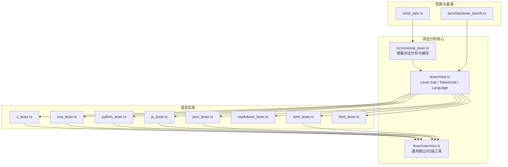
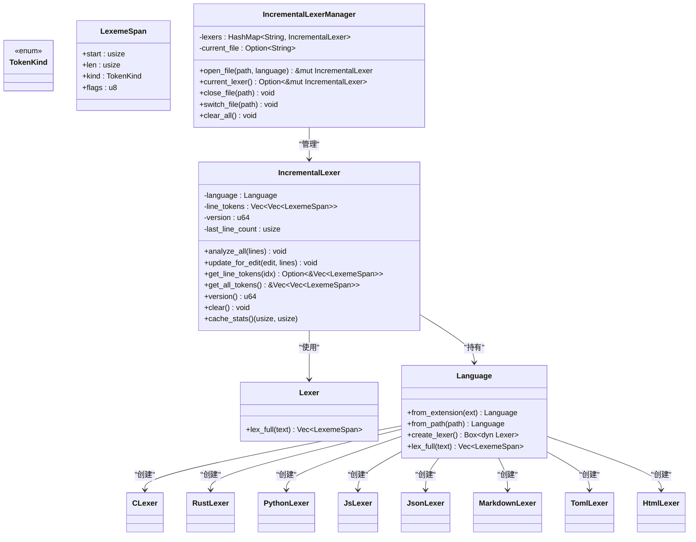
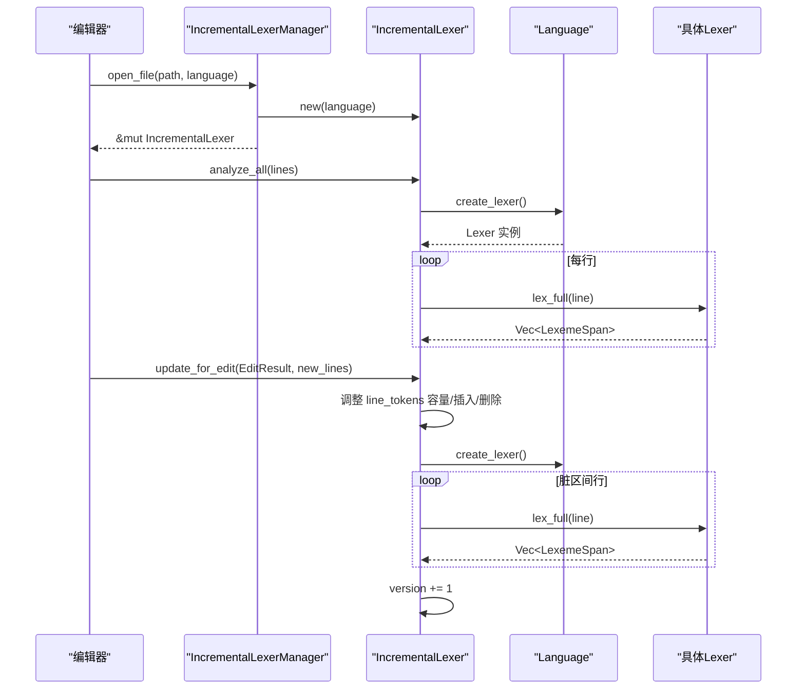
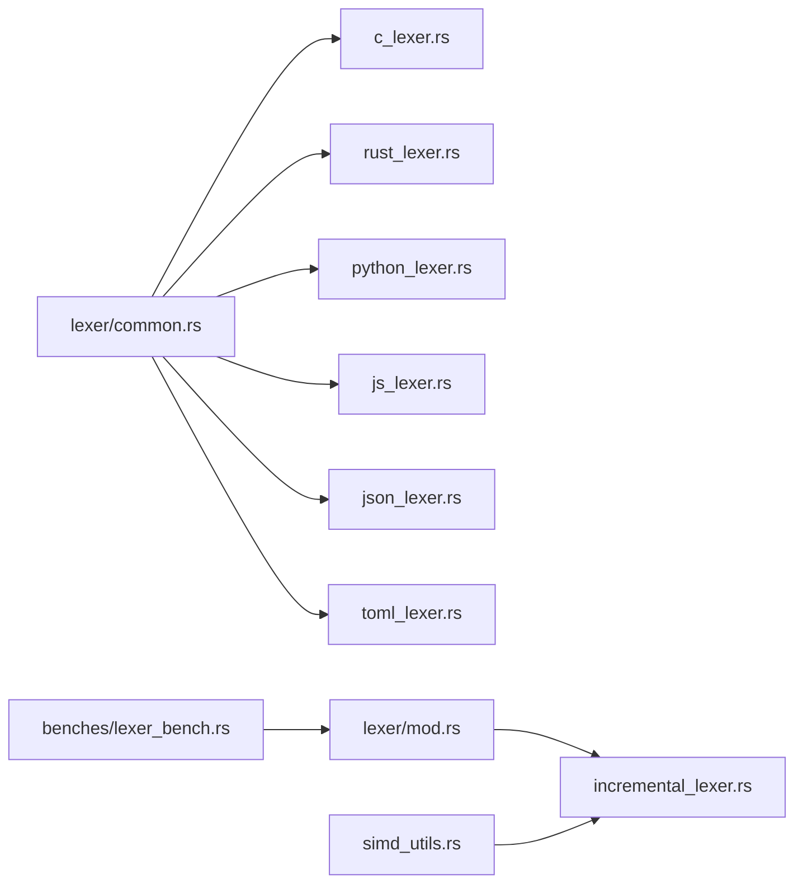

# 词法分析器框架

<cite>
**本文引用的文件**
- [crates/aether-core/src/lexer/mod.rs](file://crates/aether-core/src/lexer/mod.rs)
- [crates/aether-core/src/incremental_lexer.rs](file://crates/aether-core/src/incremental_lexer.rs)
- [crates/aether-core/src/lexer/common.rs](file://crates/aether-core/src/lexer/common.rs)
- [crates/aether-core/src/lexer/c_lexer.rs](file://crates/aether-core/src/lexer/c_lexer.rs)
- [crates/aether-core/src/lexer/rust_lexer.rs](file://crates/aether-core/src/lexer/rust_lexer.rs)
- [crates/aether-core/src/lexer/python_lexer.rs](file://crates/aether-core/src/lexer/python_lexer.rs)
- [crates/aether-core/src/lexer/js_lexer.rs](file://crates/aether-core/src/lexer/js_lexer.rs)
- [crates/aether-core/src/lexer/json_lexer.rs](file://crates/aether-core/src/lexer/json_lexer.rs)
- [crates/aether-core/src/lexer/markdown_lexer.rs](file://crates/aether-core/src/lexer/markdown_lexer.rs)
- [crates/aether-core/src/lexer/toml_lexer.rs](file://crates/aether-core/src/lexer/toml_lexer.rs)
- [crates/aether-core/src/lexer/html_lexer.rs](file://crates/aether-core/src/lexer/html_lexer.rs)
- [crates/aether-core/benches/lexer_bench.rs](file://crates/aether-core/benches/lexer_bench.rs)
- [crates/aether-core/src/simd_utils.rs](file://crates/aether-core/src/simd_utils.rs)
</cite>

## 目录
1. [简介](#简介)
2. [项目结构](#项目结构)
3. [核心组件](#核心组件)
4. [架构总览](#架构总览)
5. [详细组件分析](#详细组件分析)
6. [依赖关系分析](#依赖关系分析)
7. [性能考量](#性能考量)
8. [故障排查指南](#故障排查指南)
9. [结论](#结论)
10. [附录：扩展新语言开发指南](#附录扩展新语言开发指南)

## 简介
本技术文档面向牧羊人编辑器的词法分析器框架，系统性阐述 Lexer trait 的统一接口设计、Token 类型系统与语言检测机制；详述多语言支持（C、Rust、Python、JavaScript、JSON、Markdown、TOML、HTML）的实现差异与共性；解释增量词法分析的变更检测与局部重分析策略；并提供扩展新语言的实践路径、性能优化技巧与内存管理建议，以及插件开发者自定义词法分析器的指南。

## 项目结构
词法分析相关代码集中在 aether-core 包中，采用“统一接口 + 多实现”的模块化组织方式：
- 统一接口与类型定义位于 lexer 模块入口
- 各语言专用词法分析器以独立文件提供
- 公共扫描工具函数集中存放于 common 模块
- 增量词法分析器与管理器在独立文件中实现
- 基准测试与 SIMD 加速工具辅助性能验证与优化

图表来源
- [crates/aether-core/src/lexer/mod.rs:1-182](file://crates/aether-core/src/lexer/mod.rs#L1-L182)
- [crates/aether-core/src/incremental_lexer.rs:1-193](file://crates/aether-core/src/incremental_lexer.rs#L1-L193)
- [crates/aether-core/src/lexer/common.rs:1-151](file://crates/aether-core/src/lexer/common.rs#L1-L151)
- [crates/aether-core/benches/lexer_bench.rs:1-162](file://crates/aether-core/benches/lexer_bench.rs#L1-L162)
- [crates/aether-core/src/simd_utils.rs:1-553](file://crates/aether-core/src/simd_utils.rs#L1-L553)

章节来源
- [crates/aether-core/src/lexer/mod.rs:1-182](file://crates/aether-core/src/lexer/mod.rs#L1-L182)
- [crates/aether-core/src/incremental_lexer.rs:1-193](file://crates/aether-core/src/incremental_lexer.rs#L1-L193)

## 核心组件
- Lexer trait：统一的单行全量词法分析接口，返回 LexemeSpan 序列。
- TokenKind：跨语言统一的 token 种类枚举，覆盖关键字、标识符、字符串、注释、运算符、分隔符、预处理指令、属性、类型名、函数名、宏、生命周期、泛型、正则、格式化字符串、Markdown 元素、JSON 键、TOML 表头、空白、换行、未知、EOF 等。
- LexemeSpan：token 跨度信息，包含起始位置、长度、种类与标志位。
- Language：语言枚举及从扩展名/路径推断语言、创建具体 Lexer 实例、静态分发 lex_full 的能力。
- 公共工具：common 模块提供基于字节切片的跳过/扫描函数，避免重复实现。
- 增量词法分析：IncrementalLexer 按行缓存 token，增量更新受影响的行；IncrementalLexerManager 管理多个文件的增量分析器并限制缓存规模。

章节来源
- [crates/aether-core/src/lexer/mod.rs:1-182](file://crates/aether-core/src/lexer/mod.rs#L1-L182)
- [crates/aether-core/src/lexer/common.rs:1-151](file://crates/aether-core/src/lexer/common.rs#L1-L151)
- [crates/aether-core/src/incremental_lexer.rs:1-193](file://crates/aether-core/src/incremental_lexer.rs#L1-L193)

## 架构总览
整体架构遵循“统一接口 + 多实现 + 增量缓存”的分层设计：
- 上层通过 Language 选择语言并调用 lex_full 或 create_lexer 获取具体实现
- 各语言 Lexer 使用 common 提供的通用扫描函数完成基础识别
- 增量层对每行结果进行缓存，并在编辑后仅重分析受影响行
- 基准测试与 SIMD 工具用于评估与优化关键路径

图表来源
- [crates/aether-core/src/lexer/mod.rs:1-182](file://crates/aether-core/src/lexer/mod.rs#L1-L182)
- [crates/aether-core/src/incremental_lexer.rs:1-193](file://crates/aether-core/src/incremental_lexer.rs#L1-L193)
- [crates/aether-core/src/lexer/c_lexer.rs:1-236](file://crates/aether-core/src/lexer/c_lexer.rs#L1-L236)
- [crates/aether-core/src/lexer/rust_lexer.rs:1-359](file://crates/aether-core/src/lexer/rust_lexer.rs#L1-L359)
- [crates/aether-core/src/lexer/python_lexer.rs:1-225](file://crates/aether-core/src/lexer/python_lexer.rs#L1-L225)
- [crates/aether-core/src/lexer/js_lexer.rs:1-280](file://crates/aether-core/src/lexer/js_lexer.rs#L1-L280)
- [crates/aether-core/src/lexer/json_lexer.rs:1-133](file://crates/aether-core/src/lexer/json_lexer.rs#L1-L133)
- [crates/aether-core/src/lexer/markdown_lexer.rs:1-215](file://crates/aether-core/src/lexer/markdown_lexer.rs#L1-L215)
- [crates/aether-core/src/lexer/toml_lexer.rs:1-234](file://crates/aether-core/src/lexer/toml_lexer.rs#L1-L234)
- [crates/aether-core/src/lexer/html_lexer.rs:1-227](file://crates/aether-core/src/lexer/html_lexer.rs#L1-L227)

## 详细组件分析

### Lexer trait 与 Token 类型系统
- 统一接口：所有语言实现均实现 Lexer::lex_full，输入为单行文本，输出为 LexemeSpan 向量，便于行级增量处理。
- TokenKind 覆盖广泛：包括通用类别（关键字、标识符、字符串、字符、数字、注释、运算符、分隔符、预处理、属性、类型名、函数名、宏）、语言特性（生命周期、泛型、正则、格式化字符串）、标记语言（Markdown 标题/链接/代码/强调）、数据格式（JSON 键、TOML 表头），以及控制流（空白、换行、未知、EOF）。
- LexemeSpan 轻量紧凑：start/len/kind/flags 四字段，适合连续内存存储与快速渲染。

章节来源
- [crates/aether-core/src/lexer/mod.rs:1-182](file://crates/aether-core/src/lexer/mod.rs#L1-L182)

### 语言检测机制
- from_extension：根据小写扩展名映射到 Language 枚举，未匹配时回退至 PlainText，确保任意文本可被查看。
- from_path：从路径提取扩展名并委托 from_extension。
- create_lexer/lex_full：前者返回动态分发实例，后者使用静态分发直接调用具体实现，避免 Box 分配与虚调用开销。

章节来源
- [crates/aether-core/src/lexer/mod.rs:98-182](file://crates/aether-core/src/lexer/mod.rs#L98-L182)

### C 语言词法分析器
- DFA 风格逐字符解析：空白、换行、注释（行/块/文档）、预处理指令、字符串/字符字面量、数字（含进制前缀与后缀）、标识符与关键字、运算符、标点、未知 UTF-8 字符。
- 数字解析注意范围语法 1..2 的边界处理，防止误合并。
- 预处理指令支持续行。

章节来源
- [crates/aether-core/src/lexer/c_lexer.rs:1-542](file://crates/aether-core/src/lexer/c_lexer.rs#L1-L542)

### Rust 语言词法分析器
- 支持文档注释（///、//!、/**/）与嵌套块注释深度计数。
- 属性 #[...] 与内部属性 #![...] 识别。
- 生命周期 'a 与字符字面量区分，转义字符正确归类。
- 内置类型与宏名称识别，范围语法 1..2 保护。
- 操作符集合包含 .. 与 ..=。

章节来源
- [crates/aether-core/src/lexer/rust_lexer.rs:1-769](file://crates/aether-core/src/lexer/rust_lexer.rs#L1-L769)

### Python 语言词法分析器
- 三引号字符串与 f-string 前缀识别（f"..." 与 f'''...'''）。
- 关键字与内置类型识别。
- 数字支持整数、浮点、指数、虚数后缀 j/J 与下划线分隔。
- 运算符包含 **、//、-> 等。

章节来源
- [crates/aether-core/src/lexer/python_lexer.rs:1-545](file://crates/aether-core/src/lexer/python_lexer.rs#L1-L545)

### JavaScript/TypeScript 词法分析器
- 正则表达式上下文判断：向前查找最近非空白字符，依据上下文决定 / 是除号还是正则开始。
- 模板字符串 `...${...}` 支持嵌套表达式。
- 数字支持 BigInt 后缀 n，操作符包含 ??、??=、?.、>>>、**= 等。
- 关键字与内置类型覆盖 JS/TS 常用集合。

章节来源
- [crates/aether-core/src/lexer/js_lexer.rs:1-778](file://crates/aether-core/src/lexer/js_lexer.rs#L1-L778)

### JSON 词法分析器
- 键值区分：字符串后紧跟冒号则标记为 JsonKey，否则为 StringLiteral。
- 支持 true/false/null 作为 Keyword，数字与字符串解析严格遵循 JSON 规范。

章节来源
- [crates/aether-core/src/lexer/json_lexer.rs:1-278](file://crates/aether-core/src/lexer/json_lexer.rs#L1-L278)

### Markdown 词法分析器
- 标题（# 级别 1-6）、代码块与行内代码、链接 [text](url)、强调 *...* 与 _..._、列表项、HTML 标签片段。
- 未闭合强调标记仅消耗开放标记，避免整行误标。

章节来源
- [crates/aether-core/src/lexer/markdown_lexer.rs:1-470](file://crates/aether-core/src/lexer/markdown_lexer.rs#L1-L470)

### TOML 词法分析器
- 表头 [table] 与数组表头 [[array]] 识别。
- 键统一使用 Identifier，数值/日期混合解析，布尔 true/false。
- 注释与字符串（双引号/单引号）支持。

章节来源
- [crates/aether-core/src/lexer/toml_lexer.rs:1-374](file://crates/aether-core/src/lexer/toml_lexer.rs#L1-L374)

### HTML 词法分析器
- 注释 <!-- ... -->、标签 <tag attr="value">、实体引用 &name;。
- 标签名、属性名、属性值（带/不带引号）、自闭合 / 与结束 > 分别标记。

章节来源
- [crates/aether-core/src/lexer/html_lexer.rs:1-310](file://crates/aether-core/src/lexer/html_lexer.rs#L1-L310)

### 增量词法分析器与管理器
- 行级缓存：Vec<Vec<LexemeSpan>>，O(1) 访问，连续内存布局。
- 变更检测：根据 EditResult 的 start_line、end_line、line_delta 计算脏区间，仅重分析受影响行；行数变化时使用 splice/drain 调整缓存。
- 版本控制：每次更新递增 version，供上层失效检测。
- 管理器：维护多文件增量分析器，设置最大缓存数量上限，避免长时间运行无界增长。

图表来源
- [crates/aether-core/src/incremental_lexer.rs:18-129](file://crates/aether-core/src/incremental_lexer.rs#L18-L129)
- [crates/aether-core/src/lexer/mod.rs:144-182](file://crates/aether-core/src/lexer/mod.rs#L144-L182)

章节来源
- [crates/aether-core/src/incremental_lexer.rs:1-193](file://crates/aether-core/src/incremental_lexer.rs#L1-L193)

## 依赖关系分析
- 语言实现依赖 common 工具函数，减少重复逻辑，提升一致性。
- 增量层依赖 Language 抽象，屏蔽具体 Lexer 差异。
- 基准测试直接调用 Language::lex_full，覆盖多种语言样本。
- SIMD 工具提供批量处理能力，可用于后续优化（如空白跳过、换行查找、前缀匹配）。

图表来源
- [crates/aether-core/src/lexer/common.rs:1-151](file://crates/aether-core/src/lexer/common.rs#L1-L151)
- [crates/aether-core/src/lexer/mod.rs:1-182](file://crates/aether-core/src/lexer/mod.rs#L1-L182)
- [crates/aether-core/src/incremental_lexer.rs:1-193](file://crates/aether-core/src/incremental_lexer.rs#L1-L193)
- [crates/aether-core/benches/lexer_bench.rs:1-162](file://crates/aether-core/benches/lexer_bench.rs#L1-L162)
- [crates/aether-core/src/simd_utils.rs:1-553](file://crates/aether-core/src/simd_utils.rs#L1-L553)

章节来源
- [crates/aether-core/src/lexer/common.rs:1-151](file://crates/aether-core/src/lexer/common.rs#L1-L151)
- [crates/aether-core/src/lexer/mod.rs:1-182](file://crates/aether-core/src/lexer/mod.rs#L1-L182)
- [crates/aether-core/src/incremental_lexer.rs:1-193](file://crates/aether-core/src/incremental_lexer.rs#L1-L193)
- [crates/aether-core/benches/lexer_bench.rs:1-162](file://crates/aether-core/benches/lexer_bench.rs#L1-L162)
- [crates/aether-core/src/simd_utils.rs:1-553](file://crates/aether-core/src/simd_utils.rs#L1-L553)

## 性能考量
- 静态分发优先：Language::lex_full 直接调用具体实现，避免 Box 分配与动态分发开销。
- 行级缓存与增量更新：仅重分析脏区间行，降低频繁编辑时的 CPU 压力。
- 预分配与连续内存：lex_full 使用 with_capacity 预估容量，行缓存使用 Vec 连续布局，提高缓存命中率。
- SIMD 加速工具：提供 count_newlines_simd、find_byte_simd、skip_whitespace_simd、starts_with_simd 等，可用于后续优化热点路径（如空白跳过、换行定位、前缀匹配）。
- 基准测试：涵盖 Rust、JS、Python、C 典型代码片段，便于回归与对比。

章节来源
- [crates/aether-core/src/lexer/mod.rs:165-182](file://crates/aether-core/src/lexer/mod.rs#L165-L182)
- [crates/aether-core/src/incremental_lexer.rs:28-129](file://crates/aether-core/src/incremental_lexer.rs#L28-L129)
- [crates/aether-core/src/simd_utils.rs:1-553](file://crates/aether-core/src/simd_utils.rs#L1-L553)
- [crates/aether-core/benches/lexer_bench.rs:1-162](file://crates/aether-core/benches/lexer_bench.rs#L1-L162)

## 故障排查指南
- 未知字符处理：各 Lexer 遇到无法识别的 UTF-8 首字节时，使用 utf8_char_len 推进完整字符，避免错位。
- 未终止注释/字符串：common 的 skip_quoted 与 skip_block_comment 保证不会越界，必要时吞到末尾，保持稳健。
- 范围语法冲突：C/Rust/JS 的数字解析均检查 1..2 场景，防止将两个点合并为一个数字。
- 正则上下文歧义：JS 的 / 在特定上下文才视为正则，其他情况归为运算符。
- 增量缓存一致性：EditResult 的 start/end/delta 需准确传入，否则脏区间计算错误会导致高亮不一致。

章节来源
- [crates/aether-core/src/lexer/mod.rs:223-233](file://crates/aether-core/src/lexer/mod.rs#L223-L233)
- [crates/aether-core/src/lexer/common.rs:42-55](file://crates/aether-core/src/lexer/common.rs#L42-L55)
- [crates/aether-core/src/lexer/c_lexer.rs:302-350](file://crates/aether-core/src/lexer/c_lexer.rs#L302-L350)
- [crates/aether-core/src/lexer/rust_lexer.rs:513-560](file://crates/aether-core/src/lexer/rust_lexer.rs#L513-L560)
- [crates/aether-core/src/lexer/js_lexer.rs:475-524](file://crates/aether-core/src/lexer/js_lexer.rs#L475-L524)
- [crates/aether-core/src/incremental_lexer.rs:43-101](file://crates/aether-core/src/incremental_lexer.rs#L43-L101)

## 结论
该词法分析器框架通过统一接口与丰富 Token 类型，实现了跨语言的高一致性与可扩展性；增量缓存显著提升了交互性能；SIMD 工具与基准测试为持续优化提供了支撑。未来可在更多语言上复用 common 工具与增量策略，并结合 SIMD 进一步优化热点路径。

## 附录：扩展新语言开发指南
- 新增语言步骤
  - 在 lexer 模块新增语言实现文件（例如 mylang_lexer.rs），实现 Lexer trait 的 lex_full。
  - 在 Language 枚举中添加新语言变体，并在 from_extension/from_path/create_lexer/lex_full 中注册。
  - 复用 common 中的 skip_* 工具函数，减少重复逻辑。
  - 编写单元测试覆盖关键字、字符串、注释、数字、运算符、特殊语法等。
  - 在基准测试中加入新语言样本，评估性能。
- 增量适配
  - 确保 lex_full 行为稳定且与行边界一致，以便增量层正确重分析脏区间。
  - 若语言存在跨行语义（如多行字符串），需在增量更新时扩大脏区间或引入状态机。
- 性能优化
  - 使用 with_capacity 预分配结果向量。
  - 利用 SIMD 工具优化空白跳过、换行查找与前缀匹配。
  - 避免不必要的字符串分配，尽量使用字节切片与 span。
- 插件开发
  - 插件可通过 Language 注册新语言，或在运行时注入自定义 Lexer 实现。
  - 插件应遵循统一 TokenKind 语义，确保与编辑器高亮管线兼容。
  - 插件需提供最小化示例与测试用例，便于集成与回归。

章节来源
- [crates/aether-core/src/lexer/mod.rs:98-182](file://crates/aether-core/src/lexer/mod.rs#L98-L182)
- [crates/aether-core/src/lexer/common.rs:1-151](file://crates/aether-core/src/lexer/common.rs#L1-L151)
- [crates/aether-core/benches/lexer_bench.rs:1-162](file://crates/aether-core/benches/lexer_bench.rs#L1-L162)