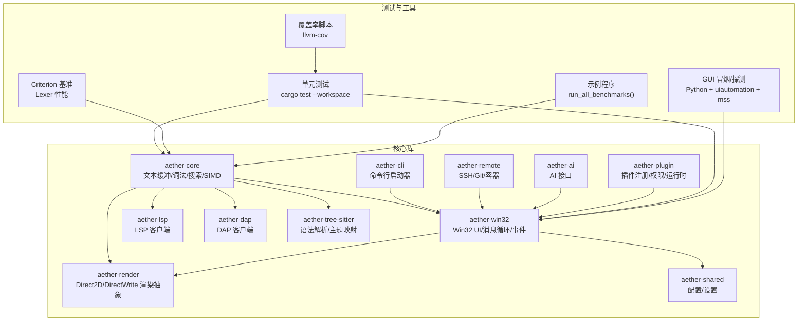
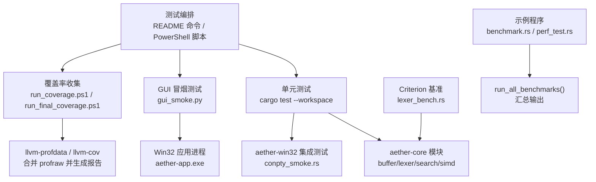
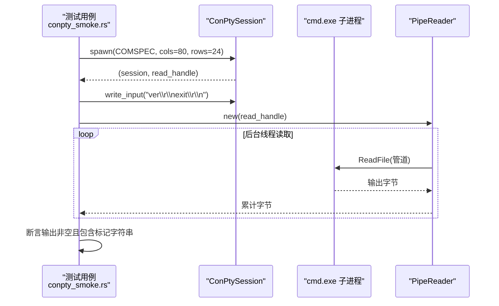
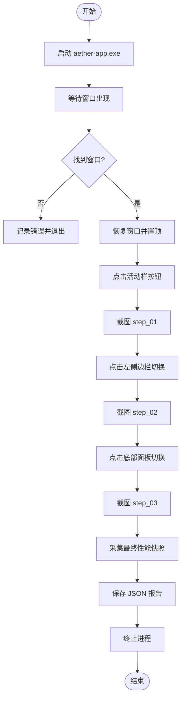
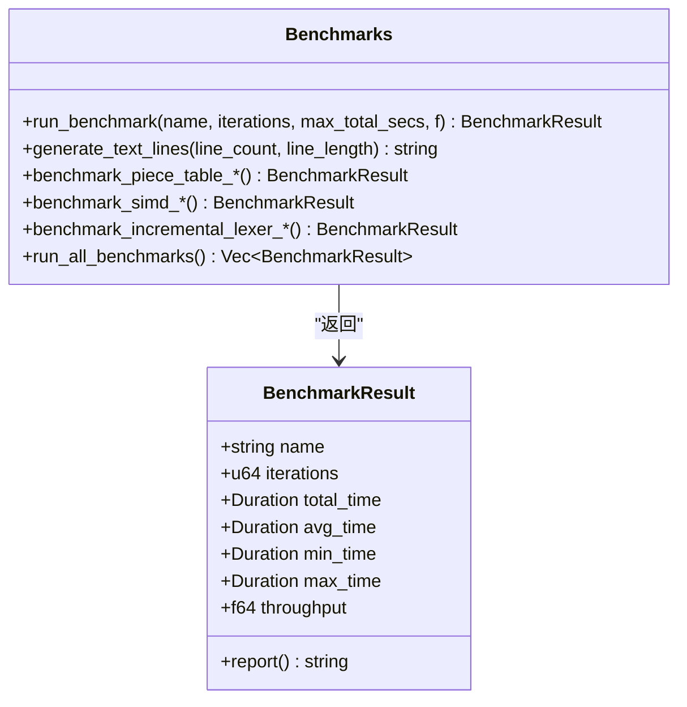
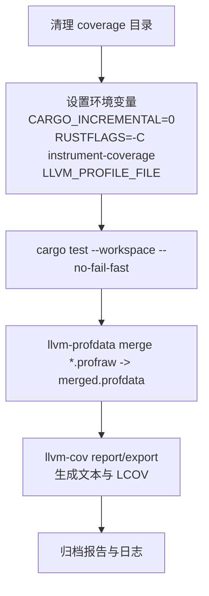
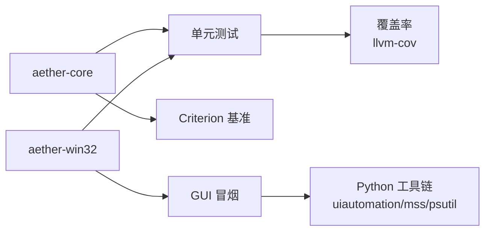

# 测试策略

<cite>
**本文引用的文件**   
- [README.md](file://README.md)
- [TEST_WORKFLOW.md](file://TEST_WORKFLOW.md)
- [crates/aether-core/src/lib.rs](file://crates/aether-core/src/lib.rs)
- [crates/aether-core/src/benchmarks.rs](file://crates/aether-core/src/benchmarks.rs)
- [crates/aether-core/benches/lexer_bench.rs](file://crates/aether-core/benches/lexer_bench.rs)
- [crates/aether-core/examples/benchmark.rs](file://crates/aether-core/examples/benchmark.rs)
- [crates/aether-core/examples/perf_test.rs](file://crates/aether-core/examples/perf_test.rs)
- [tests/gui_smoke.py](file://tests/gui_smoke.py)
- [tests/gui_probe.py](file://tests/gui_probe.py)
- [tests/run_coverage.ps1](file://tests/run_coverage.ps1)
- [tests/generate_coverage_report.ps1](file://tests/generate_coverage_report.ps1)
- [tests/run_final_coverage.ps1](file://tests/run_final_coverage.ps1)
- [crates/aether-win32/tests/conpty_smoke.rs](file://crates/aether-win32/tests/conpty_smoke.rs)
</cite>

## 目录
1. [引言](#引言)
2. [项目结构](#项目结构)
3. [核心组件](#核心组件)
4. [架构总览](#架构总览)
5. [详细组件分析](#详细组件分析)
6. [依赖分析](#依赖分析)
7. [性能考虑](#性能考虑)
8. [故障排查指南](#故障排查指南)
9. [结论](#结论)
10. [附录](#附录)

## 引言
本测试策略面向牧羊人编辑器（Aether Studio），覆盖单元测试、GUI 冒烟测试、性能基准与覆盖率报告，以及 CI/CD 自动化流程。目标是建立可重复、可度量、可持续的质量保障体系，确保在 Windows 原生 UI 与高性能编辑内核的复杂场景下，持续交付稳定版本。

## 项目结构
仓库采用 Cargo Workspace 组织，按职责拆分为多个 Crate。测试相关资源主要分布在：
- crates/*/src 下的模块与示例
- crates/*/benches 下的 Criterion 基准
- tests 目录下的 GUI 自动化脚本与覆盖率脚本
- README 中提供的运行命令与质量指标

图表来源
- [README.md:29-46](file://README.md#L29-L46)
- [crates/aether-core/src/lib.rs:1-12](file://crates/aether-core/src/lib.rs#L1-L12)

章节来源
- [README.md:29-46](file://README.md#L29-L46)
- [crates/aether-core/src/lib.rs:1-12](file://crates/aether-core/src/lib.rs#L1-L12)

## 核心组件
- 单元测试组织
  - 使用 cargo test --workspace 执行全工作区测试；建议关闭增量编译以避免偶发 ICE。
  - 针对 aether-win32 的 ConPTY 集成提供串行化锁，避免并发创建伪控制台互相干扰。
- GUI 冒烟测试
  - 基于 Python + uiautomation + mss，通过坐标点击、窗口截图、进程性能快照生成报告。
  - 支持从 gui_hit_regions.jsonl 读取点击区域，实现“数据驱动”的界面操作。
- 性能基准
  - 使用 Criterion 对 Lexer 进行吞吐基准；同时提供 run_all_benchmarks 示例统一输出结果。
- 覆盖率
  - 使用 llvm-tools-preview 与 llvm-cov 生成文本与 LCOV 报告，过滤第三方依赖路径。

章节来源
- [README.md:92-122](file://README.md#L92-L122)
- [crates/aether-win32/tests/conpty_smoke.rs:1-135](file://crates/aether-win32/tests/conpty_smoke.rs#L1-L135)
- [tests/gui_smoke.py:1-231](file://tests/gui_smoke.py#L1-L231)
- [crates/aether-core/benches/lexer_bench.rs:1-162](file://crates/aether-core/benches/lexer_bench.rs#L1-L162)
- [crates/aether-core/src/benchmarks.rs:398-443](file://crates/aether-core/src/benchmarks.rs#L398-L443)
- [tests/run_coverage.ps1:1-12](file://tests/run_coverage.ps1#L1-L12)
- [tests/generate_coverage_report.ps1:1-57](file://tests/generate_coverage_report.ps1#L1-L57)

## 架构总览
下图展示测试与核心模块的交互关系：单元测试与基准直接作用于 aether-core；GUI 冒烟测试通过 Win32 应用入口验证端到端行为；覆盖率脚本围绕测试二进制与 .profraw 产物生成报告。

图表来源
- [README.md:92-122](file://README.md#L92-L122)
- [tests/run_coverage.ps1:1-12](file://tests/run_coverage.ps1#L1-L12)
- [tests/generate_coverage_report.ps1:1-57](file://tests/generate_coverage_report.ps1#L1-L57)
- [crates/aether-core/benches/lexer_bench.rs:1-162](file://crates/aether-core/benches/lexer_bench.rs#L1-L162)
- [crates/aether-core/examples/benchmark.rs:1-18](file://crates/aether-core/examples/benchmark.rs#L1-L18)
- [crates/aether-core/examples/perf_test.rs:1-18](file://crates/aether-core/examples/perf_test.rs#L1-L18)
- [crates/aether-win32/tests/conpty_smoke.rs:1-135](file://crates/aether-win32/tests/conpty_smoke.rs#L1-L135)

## 详细组件分析

### 单元测试组织与编写规范
- 组织方式
  - 每个 crate 的 src 同级或 tests 目录下放置对应测试；ConPTY 等系统级集成测试放在 aether-win32/tests。
  - 使用 #[test] 标记函数；对需要串行的系统调用使用全局 Mutex 保证顺序执行。
- 编写规范
  - 断言明确、错误信息包含上下文；对阻塞 IO 使用超时保护。
  - 对外部进程/管道读写需处理 EOF 与异常分支，避免死锁。
  - 对平台相关 API 尽量封装为内部类型（如 PipeReader）以隔离 Win32 细节。
- 关键用例设计
  - ConPTY 会话生命周期：spawn 存活、初始 banner 可读、回显往返。
  - 文本缓冲与词法：PieceTable 插入/删除/行读取、增量 lexer 更新对比全量。
  - SIMD 加速：换行计数、字节查找、空白跳过正确性与性能。

图表来源
- [crates/aether-win32/tests/conpty_smoke.rs:56-134](file://crates/aether-win32/tests/conpty_smoke.rs#L56-L134)

章节来源
- [crates/aether-win32/tests/conpty_smoke.rs:1-135](file://crates/aether-win32/tests/conpty_smoke.rs#L1-L135)

### GUI 冒烟测试实现原理
- 目标
  - 验证 GUI 启动、活动栏点击、侧边栏切换、底部面板切换等基础交互，并记录截图与性能快照。
- 实现要点
  - 进程管理：启动 aether-app.exe，等待窗口出现后恢复窗口并置顶。
  - 界面操作：通过 uiautomation 定位窗口句柄，结合 user32 API 发送绝对坐标鼠标事件。
  - 截图验证：mss 截取窗口矩形区域保存 PNG，步骤化命名便于回归比对。
  - 性能采集：psutil 获取 CPU、内存、句柄、线程数，写入 JSON 报告。
  - 数据驱动：从 gui_hit_regions.jsonl 读取 action 前缀匹配的区域，动态选择点击位置。
- 异常捕获
  - 窗口未出现、进程退出、截图失败均记录到报告并安全终止进程。

图表来源
- [tests/gui_smoke.py:135-226](file://tests/gui_smoke.py#L135-L226)

章节来源
- [tests/gui_smoke.py:1-231](file://tests/gui_smoke.py#L1-L231)
- [tests/gui_probe.py:1-163](file://tests/gui_probe.py#L1-L163)

### 性能基准测试方法
- Lexer 性能基准（Criterion）
  - 输入样本：Rust/JS/Python/C 各约 2–3KB 代码片段，覆盖关键字、字符串、注释、泛型等常见 token。
  - 指标：Bytes/s 吞吐量，按语言与样本长度分组。
  - 用法：criterion_group/criterion_main 定义基准组，black_box 防止编译器优化。
- 综合基准（示例程序）
  - 通过 run_all_benchmarks 统一运行 PieceTable、SIMD、增量 Lexer 等多类基准，打印汇总表格。
- 内存与吞吐监控
  - 基准内使用 Instant 计时与迭代次数统计，计算平均/最小/最大耗时与吞吐量。
  - GUI 冒烟阶段使用 psutil 采样进程内存与 CPU，辅助评估 UI 层开销。

图表来源
- [crates/aether-core/src/benchmarks.rs:11-53](file://crates/aether-core/src/benchmarks.rs#L11-L53)
- [crates/aether-core/src/benchmarks.rs:398-443](file://crates/aether-core/src/benchmarks.rs#L398-L443)

章节来源
- [crates/aether-core/benches/lexer_bench.rs:1-162](file://crates/aether-core/benches/lexer_bench.rs#L1-L162)
- [crates/aether-core/src/benchmarks.rs:1-443](file://crates/aether-core/src/benchmarks.rs#L1-L443)
- [crates/aether-core/examples/benchmark.rs:1-18](file://crates/aether-core/examples/benchmark.rs#L1-L18)
- [crates/aether-core/examples/perf_test.rs:1-18](file://crates/aether-core/examples/perf_test.rs#L1-L18)

### 覆盖率报告生成与分析
- 生成流程
  - 清理旧产物，设置 RUSTFLAGS 与 LLVM_PROFILE_FILE，执行 cargo test --workspace。
  - 合并所有 .profraw 为 merged.profdata，筛选项目测试二进制对象，生成文本与 LCOV 报告。
- 指标解读
  - Regions/Lines/Functions 覆盖率反映不同粒度的覆盖情况；整体受 GUI 渲染与外部交互拖累，业务逻辑模块可达 80–100%。
- 改进建议
  - 优先提升核心模块（buffer/lexer/incremental_lexer/simd）的测试覆盖。
  - 将 GUI 渲染与系统交互代码通过抽象与桩替换，提高可测性。
  - 定期回归对比覆盖率趋势，关注热点路径与回归点。

图表来源
- [tests/run_coverage.ps1:1-12](file://tests/run_coverage.ps1#L1-L12)
- [tests/generate_coverage_report.ps1:1-57](file://tests/generate_coverage_report.ps1#L1-L57)
- [tests/run_final_coverage.ps1:1-12](file://tests/run_final_coverage.ps1#L1-L12)

章节来源
- [tests/run_coverage.ps1:1-12](file://tests/run_coverage.ps1#L1-L12)
- [tests/generate_coverage_report.ps1:1-57](file://tests/generate_coverage_report.ps1#L1-L57)
- [tests/run_final_coverage.ps1:1-12](file://tests/run_final_coverage.ps1#L1-L12)
- [README.md:113-122](file://README.md#L113-L122)

### 测试自动化流程与 CI/CD 集成
- 本地快速验证
  - 全工作区测试：cargo test --workspace --no-fail-fast
  - 静态检查：cargo clippy --workspace --all-targets -- -D warnings
  - GUI 冒烟：构建 release 后运行 python tests/gui_smoke.py
  - 覆盖率：powershell -File tests/run_final_coverage.ps1 与 generate_coverage_report.ps1
- CI/CD 建议
  - 在 PR 触发流水线中并行执行：单元测试、Clippy、GUI 冒烟、覆盖率。
  - 缓存依赖与构建产物，缩短反馈时间。
  - 将覆盖率阈值作为门禁（例如 Lines ≥ 40%，Functions ≥ 60%）。
  - 归档截图与报告，便于人工复核与历史回溯。

章节来源
- [README.md:92-122](file://README.md#L92-L122)

## 依赖分析
- 组件耦合与内聚
  - aether-core 高内聚：文本缓冲、词法、搜索、SIMD 与基准集中在同一 crate，便于单元测试与基准复用。
  - aether-win32 与 GUI 脚本解耦：冒烟测试通过外部进程与 UI 自动化访问，不侵入生产代码。
- 外部依赖
  - Python 生态：uiautomation、mss、psutil 用于 GUI 自动化与性能采集。
  - Rust 生态：Criterion 用于基准，llvm-cov 用于覆盖率。
- 潜在循环依赖
  - 当前结构未见明显循环；若引入更多跨 crate 测试夹具，建议使用特征或共享测试 crate 隔离。

图表来源
- [crates/aether-core/src/lib.rs:1-12](file://crates/aether-core/src/lib.rs#L1-L12)
- [crates/aether-core/benches/lexer_bench.rs:1-162](file://crates/aether-core/benches/lexer_bench.rs#L1-L162)
- [tests/gui_smoke.py:1-231](file://tests/gui_smoke.py#L1-L231)
- [tests/generate_coverage_report.ps1:1-57](file://tests/generate_coverage_report.ps1#L1-L57)

章节来源
- [crates/aether-core/src/lib.rs:1-12](file://crates/aether-core/src/lib.rs#L1-L12)
- [crates/aether-core/benches/lexer_bench.rs:1-162](file://crates/aether-core/benches/lexer_bench.rs#L1-L162)
- [tests/gui_smoke.py:1-231](file://tests/gui_smoke.py#L1-L231)
- [tests/generate_coverage_report.ps1:1-57](file://tests/generate_coverage_report.ps1#L1-L57)

## 性能考虑
- 基准稳定性
  - 预热与最大时间限制避免冷启动与极端波动影响；黑盒输入防止编译器优化。
- 内存与吞吐
  - PieceTable 大文件加载与多次编辑吞吐应纳入回归基线；增量 Lexer 对比全量分析，确保显著加速。
- GUI 性能
  - 冒烟阶段采样内存与 CPU，发现异常增长及时告警；截图用于视觉回归。

[本节为通用指导，无需特定文件引用]

## 故障排查指南
- GUI 冒烟失败
  - 确认 release 构建产物存在；检查窗口名称与 DPI 缩放导致的坐标偏移；查看截图与 JSON 报告定位失败步骤。
- ConPTY 测试不稳定
  - 确保串行执行；检查 COMSPEC 路径；增加读取超时；核对 ANSI 控制序列差异。
- 覆盖率缺失
  - 确认 llvm-tools-preview 已安装；检查 .profraw 是否生成；核对忽略正则是否误过滤项目源码。

章节来源
- [tests/gui_smoke.py:135-226](file://tests/gui_smoke.py#L135-L226)
- [crates/aether-win32/tests/conpty_smoke.rs:56-134](file://crates/aether-win32/tests/conpty_smoke.rs#L56-L134)
- [tests/generate_coverage_report.ps1:1-57](file://tests/generate_coverage_report.ps1#L1-L57)

## 结论
本测试策略以“核心逻辑强覆盖 + GUI 冒烟保体验 + 基准与覆盖率促演进”为主线，形成闭环质量保障。建议在后续迭代中持续提升核心模块覆盖率、完善 GUI 自动化用例集，并将性能基线与覆盖率阈值纳入 CI 门禁，确保长期稳定与高效交付。

[本节为总结，无需特定文件引用]

## 附录
- 常用命令速查
  - 全工作区测试：cargo test --workspace --no-fail-fast
  - 静态检查：cargo clippy --workspace --all-targets -- -D warnings
  - GUI 冒烟：cargo build --release -p aether-win32 && python tests/gui_smoke.py
  - 覆盖率：powershell -File tests/run_final_coverage.ps1 && powershell -File tests/generate_coverage_report.ps1

章节来源
- [README.md:92-122](file://README.md#L92-L122)