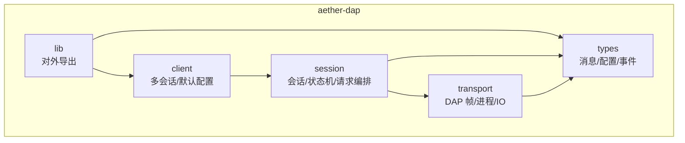
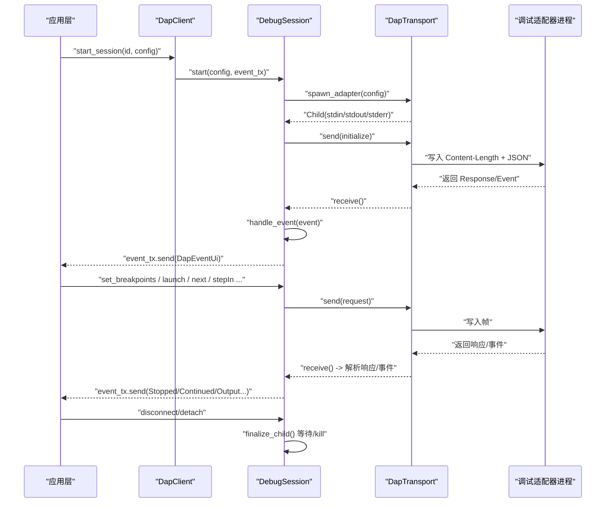
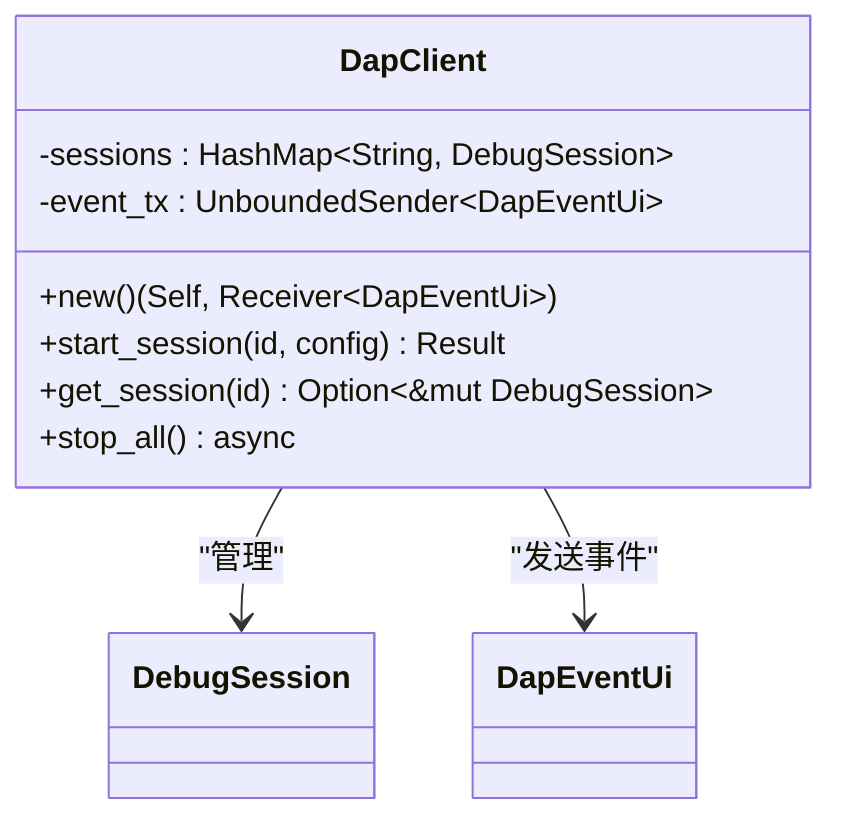
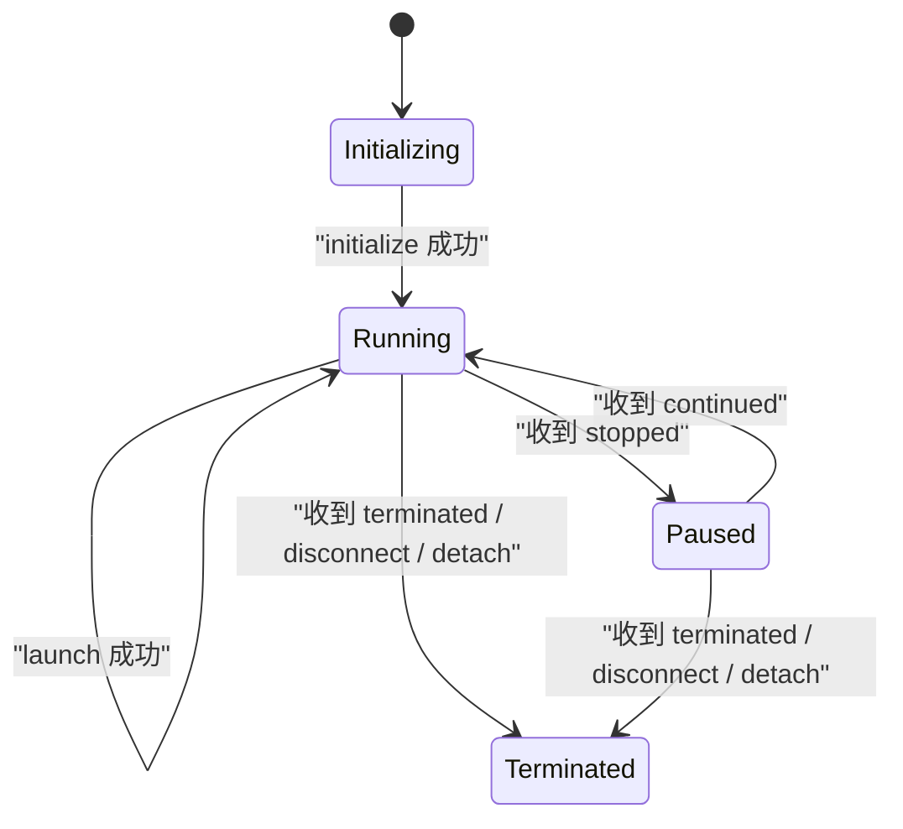
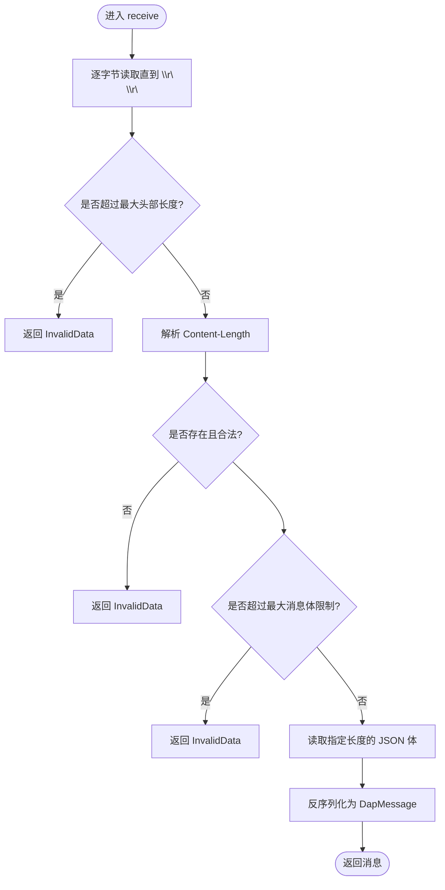
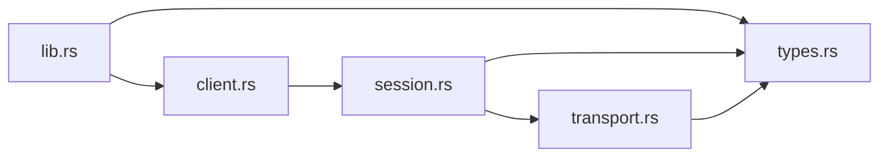

# DAP 调试适配器协议

<cite>
**本文引用的文件**   
- [lib.rs](file://crates/aether-dap/src/lib.rs)
- [client.rs](file://crates/aether-dap/src/client.rs)
- [session.rs](file://crates/aether-dap/src/session.rs)
- [transport.rs](file://crates/aether-dap/src/transport.rs)
- [types.rs](file://crates/aether-dap/src/types.rs)
- [Cargo.toml](file://crates/aether-dap/Cargo.toml)
</cite>

## 目录
1. [简介](#简介)
2. [项目结构](#项目结构)
3. [核心组件](#核心组件)
4. [架构总览](#架构总览)
5. [详细组件分析](#详细组件分析)
6. [依赖关系分析](#依赖关系分析)
7. [性能与可靠性](#性能与可靠性)
8. [故障排查指南](#故障排查指南)
9. [结论](#结论)
10. [附录：使用示例与最佳实践](#附录使用示例与最佳实践)

## 简介
本模块实现基于 Debug Adapter Protocol（DAP）的调试客户端，负责与外部调试适配器进程通信，提供调试会话管理、断点控制、变量监视、程序执行控制以及事件驱动的状态同步。传输层采用标准 DAP 帧格式（Content-Length + JSON），通过本地子进程 stdin/stdout 进行 IPC；同时提供通用传输抽象，便于未来扩展至网络等其它传输方式。

## 项目结构
aether-dap 为独立 crate，按职责划分为以下模块：
- types：定义 DAP 消息、配置、数据结构及 UI 事件类型
- transport：实现 DAP 帧编解码、最大消息限制、子进程启动与 stderr 后台读取
- session：封装单个调试会话生命周期、请求-响应编排、事件处理与状态机
- client：多会话管理与默认适配器发现
- lib：对外暴露公共 API

图表来源
- [lib.rs:1-8](file://crates/aether-dap/src/lib.rs#L1-L8)
- [client.rs:1-43](file://crates/aether-dap/src/client.rs#L1-L43)
- [session.rs:1-78](file://crates/aether-dap/src/session.rs#L1-L78)
- [transport.rs:1-24](file://crates/aether-dap/src/transport.rs#L1-L24)
- [types.rs:1-16](file://crates/aether-dap/src/types.rs#L1-L16)

章节来源
- [lib.rs:1-8](file://crates/aether-dap/src/lib.rs#L1-L8)
- [Cargo.toml:1-19](file://crates/aether-dap/Cargo.toml#L1-L19)

## 核心组件
- DapClient：多会话管理器，维护会话映射与事件通道，提供默认适配器配置发现
- DebugSession：单会话控制器，负责 initialize/launch/控制命令、断点/栈/变量/表达式、事件分发与资源清理
- DapTransport：DAP 帧发送/接收、Content-Length 解析、最大消息体限制、子进程启动与 stderr 排空
- types：DapMessage/DapRequest/DapResponse/DapEvent、AdapterConfig、Breakpoint/Source/StackFrame/Scope/Variable、DebugSessionState、DapEventUi、RequestIdGenerator

章节来源
- [client.rs:1-71](file://crates/aether-dap/src/client.rs#L1-L71)
- [session.rs:24-78](file://crates/aether-dap/src/session.rs#L24-L78)
- [transport.rs:1-162](file://crates/aether-dap/src/transport.rs#L1-L162)
- [types.rs:1-177](file://crates/aether-dap/src/types.rs#L1-L177)

## 架构总览
整体交互流程：上层调用 DapClient 创建并管理多个 DebugSession；每个会话通过 DapTransport 与外部调试适配器进程进行 DAP 帧通信；会话内部维护状态机，将 DAP 事件转换为 UI 事件并通过 mpsc 通道推送给上层。

图表来源
- [client.rs:24-43](file://crates/aether-dap/src/client.rs#L24-L43)
- [session.rs:40-78](file://crates/aether-dap/src/session.rs#L40-L78)
- [transport.rs:118-162](file://crates/aether-dap/src/transport.rs#L118-L162)
- [session.rs:599-681](file://crates/aether-dap/src/session.rs#L599-L681)

## 详细组件分析

### 组件一：DapClient（多会话管理）
- 职责
  - 维护 sessions: HashMap<String, DebugSession>
  - 提供 start_session/get_session/stop_all
  - 提供 default_adapter_config(language_id) 快速生成常见语言适配器配置
- 关键设计
  - 通过 mpsc::UnboundedSender<DapEventUi> 向 UI 层广播事件
  - stop_all 遍历所有会话并调用 disconnect，确保资源回收

图表来源
- [client.rs:9-43](file://crates/aether-dap/src/client.rs#L9-L43)
- [types.rs:126-153](file://crates/aether-dap/src/types.rs#L126-L153)

章节来源
- [client.rs:1-71](file://crates/aether-dap/src/client.rs#L1-L71)

### 组件二：DebugSession（会话与状态机）
- 职责
  - 启动并初始化会话（initialize）
  - 启动被调试程序（launch）
  - 设置断点（set_breakpoints）
  - 执行控制（continue/next/stepIn/stepOut/pause）
  - 查询上下文（stackTrace/scopes/variables/evaluate）
  - 断开/分离（disconnect/detach）
  - 事件处理（stopped/continued/exited/terminated/output/breakpoint）
- 状态机
  - Initializing → Running（initialize/launch 成功）
  - Running ↔ Paused（收到 stopped/continued）
  - 任意状态 → Terminated（收到 terminated 或主动 disconnect/detach）
- 错误与超时
  - 各请求均带超时保护，失败时返回 io::Error
  - send_simple_request 修复了未检查 success 字段的问题
- 资源清理
  - finalize_child：先中止 stderr drain，再等待子进程退出，超时则 kill
  - Drop：在异常路径下尝试 start_kill，避免僵尸进程

图表来源
- [session.rs:117-124](file://crates/aether-dap/src/session.rs#L117-L124)
- [session.rs:80-133](file://crates/aether-dap/src/session.rs#L80-L133)
- [session.rs:135-198](file://crates/aether-dap/src/session.rs#L135-L198)
- [session.rs:487-540](file://crates/aether-dap/src/session.rs#L487-L540)
- [session.rs:599-681](file://crates/aether-dap/src/session.rs#L599-L681)

章节来源
- [session.rs:24-78](file://crates/aether-dap/src/session.rs#L24-L78)
- [session.rs:80-133](file://crates/aether-dap/src/session.rs#L80-L133)
- [session.rs:135-198](file://crates/aether-dap/src/session.rs#L135-L198)
- [session.rs:200-257](file://crates/aether-dap/src/session.rs#L200-L257)
- [session.rs:259-287](file://crates/aether-dap/src/session.rs#L259-L287)
- [session.rs:289-334](file://crates/aether-dap/src/session.rs#L289-L334)
- [session.rs:336-381](file://crates/aether-dap/src/session.rs#L336-L381)
- [session.rs:383-428](file://crates/aether-dap/src/session.rs#L383-L428)
- [session.rs:430-485](file://crates/aether-dap/src/session.rs#L430-L485)
- [session.rs:487-540](file://crates/aether-dap/src/session.rs#L487-L540)
- [session.rs:546-597](file://crates/aether-dap/src/session.rs#L546-L597)
- [session.rs:599-681](file://crates/aether-dap/src/session.rs#L599-L681)
- [session.rs:1114-1127](file://crates/aether-dap/src/session.rs#L1114-L1127)

### 组件三：DapTransport（DAP 帧与进程通信）
- 职责
  - send：序列化 DapMessage，写入 Content-Length 头与 JSON 体
  - receive：读取 Content-Length 头，校验长度上限，反序列化为 DapMessage
  - spawn_adapter：根据 AdapterConfig 启动子进程，配置参数与环境
  - spawn_stderr_drain：后台持续读取 stderr，防止管道阻塞
- 安全与健壮性
  - MAX_CONTENT_LENGTH 限制消息体大小，防止 OOM
  - MAX_HEADER_LEN 限制头部长度，防止恶意构造
  - 缺失 Content-Length 或非法 JSON 返回 InvalidData

图表来源
- [transport.rs:40-93](file://crates/aether-dap/src/transport.rs#L40-L93)
- [transport.rs:118-162](file://crates/aether-dap/src/transport.rs#L118-L162)

章节来源
- [transport.rs:1-162](file://crates/aether-dap/src/transport.rs#L1-L162)

### 组件四：types（数据模型与事件）
- DapMessage：使用 tag = "type" 区分 request/response/event，避免误判
- 配置与实体：AdapterConfig、Breakpoint、Source、StackFrame、Scope、Variable
- 状态与事件：DebugSessionState、DapEventUi（包含 Stopped/Continued/Exited/Terminated/Output/BreakpointValidated 等）
- 工具：RequestIdGenerator 用于递增 seq

章节来源
- [types.rs:1-177](file://crates/aether-dap/src/types.rs#L1-L177)

## 依赖关系分析
- 模块耦合
  - client 依赖 session 和 types
  - session 依赖 transport 和 types
  - transport 依赖 types
  - lib 仅做 re-export
- 外部依赖
  - tokio：异步 IO、进程、时间、任务调度
  - serde/serde_json：JSON 序列化/反序列化
  - tracing/thiserror：日志与错误（已引入，当前代码以 io::Error 为主）

图表来源
- [lib.rs:1-8](file://crates/aether-dap/src/lib.rs#L1-L8)
- [client.rs:1-12](file://crates/aether-dap/src/client.rs#L1-L12)
- [session.rs:1-12](file://crates/aether-dap/src/session.rs#L1-L12)
- [transport.rs:1-5](file://crates/aether-dap/src/transport.rs#L1-L5)
- [types.rs:1-16](file://crates/aether-dap/src/types.rs#L1-L16)

章节来源
- [Cargo.toml:1-19](file://crates/aether-dap/Cargo.toml#L1-L19)

## 性能与可靠性
- 传输层
  - 固定缓冲与长度头解析，避免无界分配
  - 最大消息体限制（64MB）与最大头部限制（8KB）
- 会话层
  - 各请求带超时保护（默认 30s，initialize/launch 更长）
  - 事件处理中忽略终止后延迟事件，避免“复活”
- 进程管理
  - stderr 后台排空，避免管道满导致适配器阻塞
  - disconnect/detach 后强制等待/kill，Drop 兜底 start_kill

[本节为通用指导，不直接分析具体文件]

## 故障排查指南
- 常见问题
  - 初始化/启动超时：检查适配器命令是否正确、环境变量与 cwd 是否有效
  - 断点无效：确认 setBreakpoints 响应 success 与 breakpoints 列表
  - 无法获取变量/作用域：确认当前处于暂停状态，并传入正确的 frameId/variablesReference
  - 进程残留：确认 disconnect/detach 被调用，或依赖 Drop 兜底
- 定位手段
  - 观察 DapEventUi 输出事件（Stopped/Continued/Output/Terminated）
  - 检查 transport 层错误类型（InvalidData/InvalidInput/TimedOut）
  - 关注 finalize_child 的超时与 kill 行为

章节来源
- [session.rs:599-681](file://crates/aether-dap/src/session.rs#L599-L681)
- [transport.rs:40-93](file://crates/aether-dap/src/transport.rs#L40-L93)
- [session.rs:487-540](file://crates/aether-dap/src/session.rs#L487-L540)
- [session.rs:1114-1127](file://crates/aether-dap/src/session.rs#L1114-L1127)

## 结论
该 DAP 客户端实现了完整的调试会话生命周期管理、DAP 消息序列化与事件分发、稳健的传输层与进程管理，并提供多会话与默认适配器配置能力。其状态机清晰、错误与超时处理完善，适合集成到编辑器或 IDE 的调试体验中。

[本节为总结，不直接分析具体文件]

## 附录：使用示例与最佳实践

### 配置调试会话
- 步骤
  - 选择语言并获取默认适配器配置，或自定义 AdapterConfig
  - 调用 DapClient::start_session 启动会话
  - 监听事件通道 DapEventUi 以更新 UI
- 参考路径
  - [default_adapter_config:45-71](file://crates/aether-dap/src/client.rs#L45-L71)
  - [DapClient::start_session:24-29](file://crates/aether-dap/src/client.rs#L24-L29)
  - [DapEventUi 定义:126-153](file://crates/aether-dap/src/types.rs#L126-L153)

### 设置断点
- 步骤
  - 调用 set_breakpoints(source_path, lines)
  - 解析返回的 Breakpoint 列表，结合 breakpoint 事件进行校验
- 参考路径
  - [set_breakpoints:200-257](file://crates/aether-dap/src/session.rs#L200-L257)
  - [breakpoint 事件处理:669-677](file://crates/aether-dap/src/session.rs#L669-L677)

### 执行调试命令
- 继续/单步/步进/暂停
  - continue_execution / next / step_in / step_out / pause
  - 参考路径
    - [continue_execution:259-263](file://crates/aether-dap/src/session.rs#L259-L263)
    - [next:265-269](file://crates/aether-dap/src/session.rs#L265-L269)
    - [step_in:271-275](file://crates/aether-dap/src/session.rs#L271-L275)
    - [step_out:277-281](file://crates/aether-dap/src/session.rs#L277-L281)
    - [pause:283-287](file://crates/aether-dap/src/session.rs#L283-L287)
- 查询上下文
  - stack_trace / scopes / variables / evaluate
  - 参考路径
    - [stack_trace:289-334](file://crates/aether-dap/src/session.rs#L289-L334)
    - [scopes:336-381](file://crates/aether-dap/src/session.rs#L336-L381)
    - [variables:383-428](file://crates/aether-dap/src/session.rs#L383-L428)
    - [evaluate:430-485](file://crates/aether-dap/src/session.rs#L430-L485)

### 处理调试事件
- 事件类型
  - Stopped/Continued/Exited/Terminated/Output/BreakpointValidated
- 参考路径
  - [handle_event:599-681](file://crates/aether-dap/src/session.rs#L599-L681)
  - [DapEventUi:126-153](file://crates/aether-dap/src/types.rs#L126-L153)

### 资源清理与错误恢复
- 断开/分离
  - disconnect（终止被调试进程）/detach（保留被调试进程）
  - 参考路径
    - [disconnect:487-499](file://crates/aether-dap/src/session.rs#L487-L499)
    - [detach:501-516](file://crates/aether-dap/src/session.rs#L501-L516)
- 子进程回收
  - finalize_child 等待/kill，Drop 兜底
  - 参考路径
    - [finalize_child:518-539](file://crates/aether-dap/src/session.rs#L518-L539)
    - [Drop 实现:1114-1127](file://crates/aether-dap/src/session.rs#L1114-L1127)

### 传输层要点
- 帧格式
  - Content-Length 头 + JSON 体
- 安全限制
  - 最大消息体与头部长度
- 参考路径
  - [send/receive:26-93](file://crates/aether-dap/src/transport.rs#L26-93)
  - [spawn_adapter/spawn_stderr_drain:118-162](file://crates/aether-dap/src/transport.rs#L118-162)