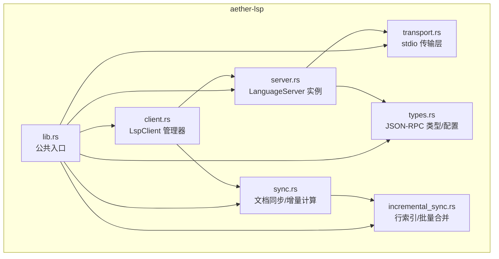
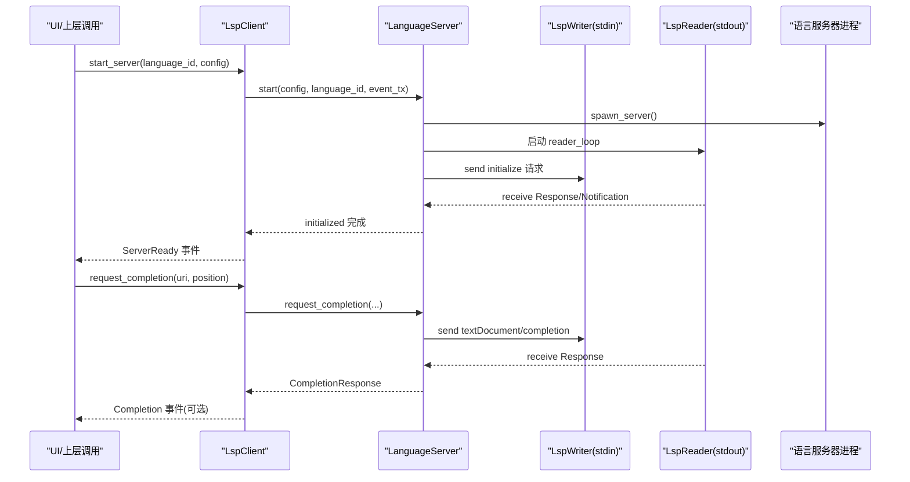
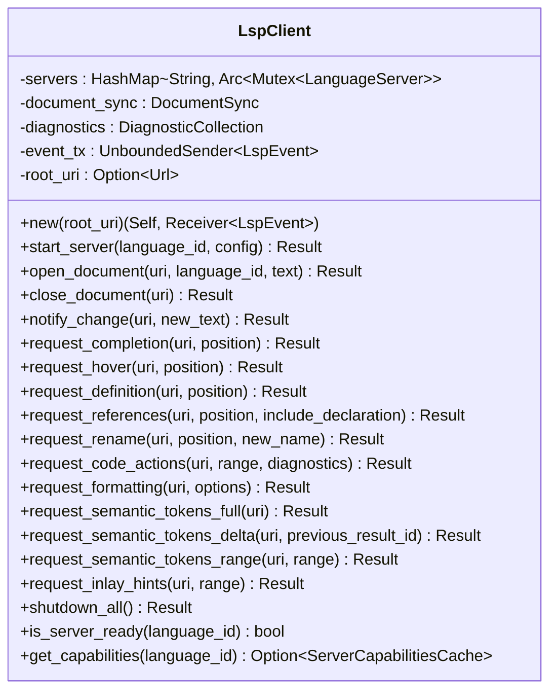
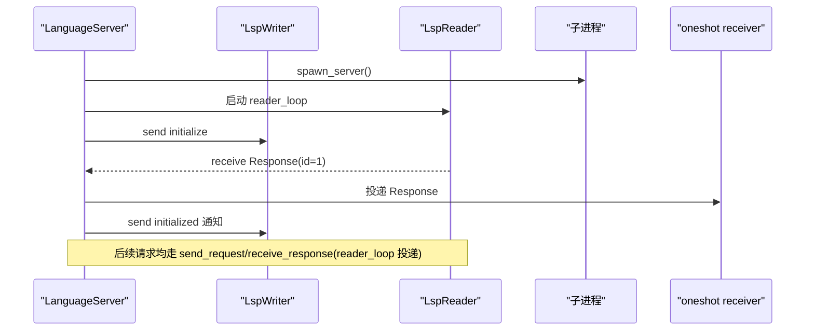
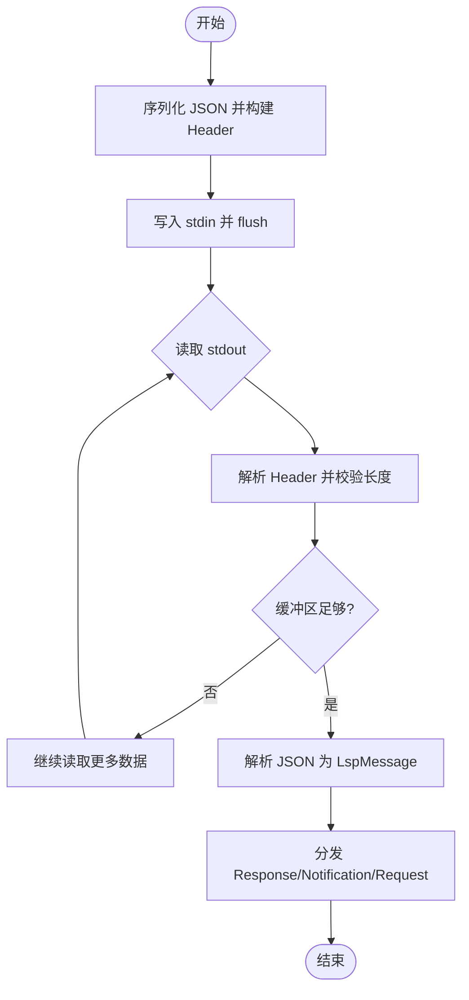
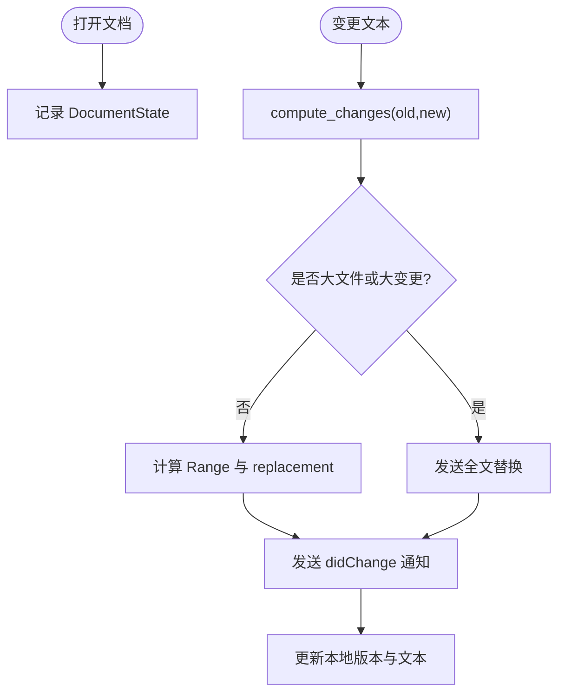
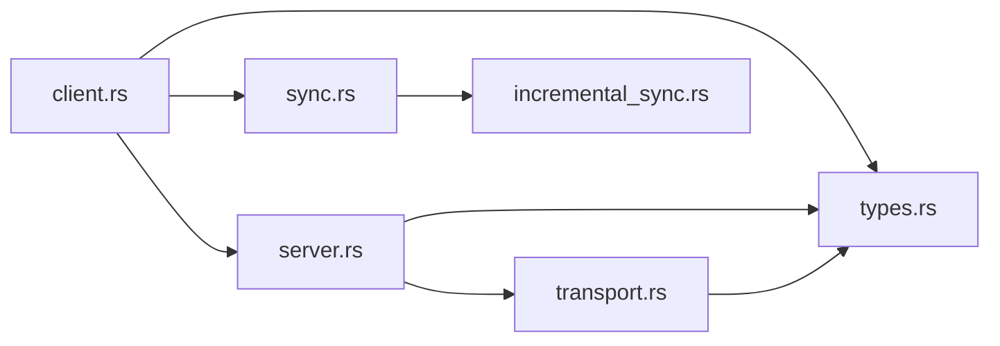

# LSP 客户端实现

<cite>
**本文引用的文件**   
- [lib.rs](file://crates/aether-lsp/src/lib.rs)
- [client.rs](file://crates/aether-lsp/src/client.rs)
- [server.rs](file://crates/aether-lsp/src/server.rs)
- [transport.rs](file://crates/aether-lsp/src/transport.rs)
- [types.rs](file://crates/aether-lsp/src/types.rs)
- [sync.rs](file://crates/aether-lsp/src/sync.rs)
- [incremental_sync.rs](file://crates/aether-lsp/src/incremental_sync.rs)
- [Cargo.toml](file://crates/aether-lsp/Cargo.toml)
</cite>

## 目录
1. [简介](#简介)
2. [项目结构](#项目结构)
3. [核心组件](#核心组件)
4. [架构总览](#架构总览)
5. [详细组件分析](#详细组件分析)
6. [依赖关系分析](#依赖关系分析)
7. [性能与可靠性](#性能与可靠性)
8. [故障排查指南](#故障排查指南)
9. [结论](#结论)
10. [附录：使用示例与最佳实践](#附录使用示例与最佳实践)

## 简介
本模块为语言服务器协议（LSP）客户端实现，负责在编辑器中管理多个语言服务器的生命周期、连接与消息收发、文档同步、诊断推送以及语义令牌等高级能力。其设计重点包括：
- 多语言服务器实例管理与按语言ID路由请求
- 基于标准输入输出的 JSON-RPC over stdio 传输层
- 后台 reader task 持续解析响应与通知，避免阻塞
- 增量文本同步与高效位置计算
- 超时处理、错误映射与优雅关闭

## 项目结构
aether-lsp crate 采用分层组织：
- 顶层 lib.rs 暴露公共 API 并重新导出类型
- client.rs 提供 LspClient 高层接口，封装多服务器管理与事件分发
- server.rs 实现 LanguageServer 单实例生命周期、请求-响应与通知处理
- transport.rs 实现 JSON-RPC over stdio 的编码/解码与进程启动
- types.rs 定义 JSON-RPC 消息、配置、能力缓存等基础类型
- sync.rs 与 incremental_sync.rs 提供文档状态与增量变更计算

图表来源
- [lib.rs:1-16](file://crates/aether-lsp/src/lib.rs#L1-L16)
- [client.rs:1-120](file://crates/aether-lsp/src/client.rs#L1-L120)
- [server.rs:1-125](file://crates/aether-lsp/src/server.rs#L1-L125)
- [transport.rs:1-120](file://crates/aether-lsp/src/transport.rs#L1-L120)
- [types.rs:1-120](file://crates/aether-lsp/src/types.rs#L1-L120)
- [sync.rs:1-120](file://crates/aether-lsp/src/sync.rs#L1-L120)
- [incremental_sync.rs:1-120](file://crates/aether-lsp/src/incremental_sync.rs#L1-L120)

章节来源
- [lib.rs:1-16](file://crates/aether-lsp/src/lib.rs#L1-L16)
- [Cargo.toml:1-20](file://crates/aether-lsp/Cargo.toml#L1-L20)

## 核心组件
- LspClient：多语言服务器实例管理器，维护“语言ID -> 服务器”映射、文档同步状态、诊断集合与事件通道。对外提供打开/关闭文档、变更通知、各类语言服务请求方法。
- LanguageServer：单个语言服务器实例，负责进程启动、初始化握手、请求-响应配对、通知转发、能力缓存与优雅关闭。
- Transport（LspWriter/LspReader/LspTransport）：基于 tokio 的异步 I/O，实现 JSON-RPC over stdio 的消息编解码、Header 解析、Content-Length 校验与最大长度保护。
- Types：JSON-RPC 2.0 消息模型（Request/Response/Notification）、错误码、服务器配置、能力缓存、请求ID生成器等。
- Sync：文档状态跟踪与增量变更计算，包含大文件回退策略与 UTF-16 位置转换。
- IncrementalSync：FastLineIndex 行索引、编辑操作到 LSP 变更的转换、相邻编辑合并与大文件同步策略。

章节来源
- [client.rs:11-120](file://crates/aether-lsp/src/client.rs#L11-L120)
- [server.rs:23-125](file://crates/aether-lsp/src/server.rs#L23-L125)
- [transport.rs:8-120](file://crates/aether-lsp/src/transport.rs#L8-L120)
- [types.rs:1-120](file://crates/aether-lsp/src/types.rs#L1-L120)
- [sync.rs:1-120](file://crates/aether-lsp/src/sync.rs#L1-L120)
- [incremental_sync.rs:1-120](file://crates/aether-lsp/src/incremental_sync.rs#L1-L120)

## 架构总览
整体采用“主线程持有写入器 + 后台 reader task 独占读取”的解耦模式，通过 oneshot channel 将响应投递给等待的请求方；通知直接转发至 UI 事件通道。

图表来源
- [client.rs:87-112](file://crates/aether-lsp/src/client.rs#L87-L112)
- [server.rs:63-125](file://crates/aether-lsp/src/server.rs#L63-L125)
- [transport.rs:256-281](file://crates/aether-lsp/src/transport.rs#L256-L281)
- [server.rs:932-978](file://crates/aether-lsp/src/server.rs#L932-L978)

## 详细组件分析

### LspClient 设计与职责
- 多服务器管理：以 Arc<RwLock<HashMap<String, Arc<Mutex<LanguageServer>>>> 存储，按语言ID路由请求，避免全局写锁跨 await。
- 文档同步：维护 DocumentSync，记录 URI -> 版本/语言ID/文本，支持 open/close/change。
- 诊断缓存：使用 std::Mutex<DiagnosticCollection> 供 UI 主线程安全读取。
- 事件通道：mpsc::UnboundedSender<LspEvent> 向 UI 推送诊断、补全、悬停、日志等事件。
- 默认服务器发现：提供 default_server_config 用于常见语言的默认命令与参数。

图表来源
- [client.rs:11-120](file://crates/aether-lsp/src/client.rs#L11-L120)
- [client.rs:286-565](file://crates/aether-lsp/src/client.rs#L286-L565)
- [client.rs:567-603](file://crates/aether-lsp/src/client.rs#L567-L603)
- [client.rs:605-638](file://crates/aether-lsp/src/client.rs#L605-L638)

章节来源
- [client.rs:11-120](file://crates/aether-lsp/src/client.rs#L11-L120)
- [client.rs:286-565](file://crates/aether-lsp/src/client.rs#L286-L565)
- [client.rs:567-603](file://crates/aether-lsp/src/client.rs#L567-L603)
- [client.rs:605-638](file://crates/aether-lsp/src/client.rs#L605-L638)

### LanguageServer 生命周期与消息流
- 启动流程：spawn_server 创建子进程，捕获 stdin/stdout/stderr；启动 stderr 后台 drain；启动 reader_loop；发送 initialize 请求并缓存能力；发送 initialized 通知。
- 请求-响应：send_request 生成唯一 id，注册 oneshot sender；receive_response 带超时清理 pending sender；reader_loop 收到 Response 时按 id 投递。
- 通知处理：handle_notification 将 publishDiagnostics、window/logMessage 等转发到 UI 事件通道。
- 反向请求：handle_server_request 对 workspace/configuration、registerCapability、applyEdit、workspaceFolders 等返回最小可用响应，避免服务器卡死。
- 优雅关闭：shutdown 发送 shutdown 请求与 exit 通知，等待子进程退出或 kill。

图表来源
- [server.rs:63-125](file://crates/aether-lsp/src/server.rs#L63-L125)
- [server.rs:144-216](file://crates/aether-lsp/src/server.rs#L144-L216)
- [server.rs:932-978](file://crates/aether-lsp/src/server.rs#L932-L978)
- [server.rs:227-293](file://crates/aether-lsp/src/server.rs#L227-L293)
- [server.rs:662-695](file://crates/aether-lsp/src/server.rs#L662-L695)

章节来源
- [server.rs:63-125](file://crates/aether-lsp/src/server.rs#L63-L125)
- [server.rs:144-216](file://crates/aether-lsp/src/server.rs#L144-L216)
- [server.rs:932-978](file://crates/aether-lsp/src/server.rs#L932-L978)
- [server.rs:227-293](file://crates/aether-lsp/src/server.rs#L227-L293)
- [server.rs:662-695](file://crates/aether-lsp/src/server.rs#L662-L695)

### 传输层实现（stdio + JSON-RPC）
- 编码：encode_message 将 LspMessage 序列化为 JSON，附加 Content-Length 与 Content-Type 头，并以 \r\n\r\n 分隔 body。
- 解码：parse_header_buffer 在原始字节中搜索 \r\n\r\n，解析 Content-Length，限制最大 Header 大小与消息体大小，防止 OOM。
- 读写分离：LspWriter 仅持有 stdin，LspReader 仅持有 stdout，避免共享锁竞争；LspTransport 保留双向兼容以便测试。
- 进程管理：spawn_server 根据 ServerConfig 构造 Command 并启动；spawn_stderr_drain 持续读取 stderr 避免管道满导致子进程阻塞。

图表来源
- [transport.rs:212-253](file://crates/aether-lsp/src/transport.rs#L212-L253)
- [transport.rs:128-209](file://crates/aether-lsp/src/transport.rs#L128-L209)
- [transport.rs:256-301](file://crates/aether-lsp/src/transport.rs#L256-L301)

章节来源
- [transport.rs:8-120](file://crates/aether-lsp/src/transport.rs#L8-L120)
- [transport.rs:212-253](file://crates/aether-lsp/src/transport.rs#L212-L253)
- [transport.rs:256-301](file://crates/aether-lsp/src/transport.rs#L256-L301)

### 类型定义与消息格式
- LspMessage：枚举 Request/Response/Notification，使用 serde untagged 自动判别。
- LspRequest/LspResponse/LspNotification：包含 jsonrpc、id/method/params/result/error 等字段。
- LspError：code/message/data，遵循 JSON-RPC 2.0 错误规范。
- ServerConfig：command/args/env/root_uri/initialization_options。
- ServerCapabilitiesCache：缓存服务器能力，便于客户端按需启用功能。
- RequestIdGenerator：单调递增 ID 生成器，确保请求-响应匹配。

章节来源
- [types.rs:1-120](file://crates/aether-lsp/src/types.rs#L1-L120)
- [types.rs:126-268](file://crates/aether-lsp/src/types.rs#L126-L268)

### 文档同步与增量变更
- DocumentSync：维护已打开文档的状态（URI、版本、语言ID、文本），提供 open/close/get_version/update_text 等方法。
- compute_changes：基于共同前缀/后缀的字节级 diff，结合 FastLineIndex 转换为 LSP Position（UTF-16 码元计数）。当变更过大或文件过大时回退为全文替换。
- FastLineIndex：预计算行起始位置，O(log n) 查找行，按 UTF-16 码元计算 character；position_to_byte 将 UTF-16 偏移转回字节偏移。
- 编辑合并：IncrementalChangeCalculator::merge_edits 仅合并真正相邻的编辑，避免丢失中间文本。

图表来源
- [sync.rs:82-148](file://crates/aether-lsp/src/sync.rs#L82-L148)
- [incremental_sync.rs:96-190](file://crates/aether-lsp/src/incremental_sync.rs#L96-L190)
- [incremental_sync.rs:33-79](file://crates/aether-lsp/src/incremental_sync.rs#L33-L79)

章节来源
- [sync.rs:1-148](file://crates/aether-lsp/src/sync.rs#L1-L148)
- [incremental_sync.rs:96-190](file://crates/aether-lsp/src/incremental_sync.rs#L96-L190)
- [incremental_sync.rs:33-79](file://crates/aether-lsp/src/incremental_sync.rs#L33-L79)

## 依赖关系分析
- aether-lsp 依赖 lsp-types 提供 LSP 类型，serde/serde_json 进行 JSON 编解码，tokio 提供异步 I/O、进程管理与任务调度，bytes 用于缓冲，tracing/thiserror 用于日志与错误。
- 模块间耦合：
  - client.rs 依赖 server.rs、sync.rs、types.rs
  - server.rs 依赖 transport.rs、types.rs、client.rs 的事件类型
  - transport.rs 依赖 types.rs
  - sync.rs 依赖 incremental_sync.rs

图表来源
- [client.rs:1-120](file://crates/aether-lsp/src/client.rs#L1-L120)
- [server.rs:1-125](file://crates/aether-lsp/src/server.rs#L1-L125)
- [transport.rs:1-120](file://crates/aether-lsp/src/transport.rs#L1-L120)
- [sync.rs:1-120](file://crates/aether-lsp/src/sync.rs#L1-L120)
- [incremental_sync.rs:1-120](file://crates/aether-lsp/src/incremental_sync.rs#L1-L120)

章节来源
- [Cargo.toml:1-20](file://crates/aether-lsp/Cargo.toml#L1-L20)

## 性能与可靠性
- 并发与锁粒度：
  - servers 使用 RwLock 读多写少，每个服务器用 tokio::sync::Mutex 独立加锁，避免全局写锁跨 await。
  - 诊断集合使用 std::Mutex，适合 UI 主线程快速快照读取。
- 传输层保护：
  - Header 最大 8KB，Content-Length 最大 64MB，防止恶意服务器导致 OOM。
  - 先搜索 \r\n\r\n 再解析 UTF-8，避免 body 中部分 UTF-8 序列干扰。
- 超时与重连：
  - 默认请求超时 30s，initialize 超时 60s；超时后清理 pending sender，避免泄漏。
  - 当前未实现自动重连策略；可在上层根据 is_server_ready 与错误码触发重启。
- 资源释放：
  - Drop 实现会尝试 kill 子进程并 abort reader task，防止僵尸进程。
  - stderr 后台 drain 避免管道满导致子进程阻塞。

章节来源
- [server.rs:16-22](file://crates/aether-lsp/src/server.rs#L16-L22)
- [server.rs:170-216](file://crates/aether-lsp/src/server.rs#L170-L216)
- [server.rs:1027-1037](file://crates/aether-lsp/src/server.rs#L1027-L1037)
- [transport.rs:164-209](file://crates/aether-lsp/src/transport.rs#L164-L209)
- [transport.rs:283-301](file://crates/aether-lsp/src/transport.rs#L283-L301)

## 故障排查指南
- 常见问题
  - 子进程无法启动：检查 ServerConfig.command 是否存在于 PATH，或显式指定绝对路径。
  - 请求无响应：确认 reader_loop 正常运行；若 stdout EOF，所有 pending sender 会被清理，请求将返回 RecvError。
  - 诊断不显示：确认 handle_notification 能正确转发 publishDiagnostics 到 event_tx。
  - 管道阻塞：stderr 未被读取会导致子进程阻塞，确保 spawn_stderr_drain 已启动。
- 定位步骤
  - 查看 LspEvent::Log 事件，获取服务器日志信息。
  - 检查 is_server_ready 与 get_capabilities 判断服务器状态。
  - 对于超时错误，适当增大 DEFAULT_REQUEST_TIMEOUT 或 INITIALIZE_TIMEOUT。
  - 对于大文件，确认 compute_changes 回退为全文替换以避免性能问题。

章节来源
- [server.rs:984-1021](file://crates/aether-lsp/src/server.rs#L984-L1021)
- [server.rs:932-978](file://crates/aether-lsp/src/server.rs#L932-L978)
- [transport.rs:283-301](file://crates/aether-lsp/src/transport.rs#L283-L301)
- [sync.rs:82-148](file://crates/aether-lsp/src/sync.rs#L82-L148)

## 结论
该 LSP 客户端实现了稳定可靠的 JSON-RPC over stdio 通信、后台消息泵、增量同步与能力协商，具备较好的可扩展性与健壮性。建议在应用层补充连接池与自动重连策略，并结合 UI 事件机制提供更丰富的交互体验。

## 附录：使用示例与最佳实践
以下示例展示如何初始化 LSP 客户端、启动服务器、打开文档、发送请求与处理响应结果。为避免泄露具体代码内容，此处仅提供关键路径与说明。

- 初始化客户端与事件通道
  - 参考路径：[client.rs:71-85](file://crates/aether-lsp/src/client.rs#L71-L85)
  - 说明：new 返回 LspClient 与 UnboundedReceiver<LspEvent>，用于消费 UI 事件。

- 启动语言服务器
  - 参考路径：[client.rs:87-112](file://crates/aether-lsp/src/client.rs#L87-L112)
  - 说明：start_server 内部调用 LanguageServer::start，完成后发送 ServerReady 事件。

- 打开/关闭文档与变更通知
  - 参考路径：
    - [client.rs:114-170](file://crates/aether-lsp/src/client.rs#L114-L170)
    - [client.rs:213-284](file://crates/aether-lsp/src/client.rs#L213-L284)
  - 说明：open_document/close_document 维护 DocumentSync；notify_change 计算增量变更并发送 didChange。

- 发送语言服务请求
  - 参考路径：
    - [client.rs:286-334](file://crates/aether-lsp/src/client.rs#L286-L334)
    - [client.rs:336-464](file://crates/aether-lsp/src/client.rs#L336-L464)
    - [client.rs:466-565](file://crates/aether-lsp/src/client.rs#L466-L565)
  - 说明：request_completion/request_hover/request_definition 等方法按语言ID路由到对应服务器。

- 处理响应与事件
  - 参考路径：
    - [server.rs:932-978](file://crates/aether-lsp/src/server.rs#L932-L978)
    - [server.rs:984-1021](file://crates/aether-lsp/src/server.rs#L984-L1021)
  - 说明：reader_loop 分发 Response 与 Notification；handle_notification 转发诊断与日志。

- 关闭与资源清理
  - 参考路径：
    - [client.rs:567-582](file://crates/aether-lsp/src/client.rs#L567-L582)
    - [server.rs:662-695](file://crates/aether-lsp/src/server.rs#L662-L695)
    - [server.rs:1027-1037](file://crates/aether-lsp/src/server.rs#L1027-L1037)
  - 说明：shutdown_all 遍历服务器执行 shutdown；Drop 保证进程与任务终止。

- 默认服务器发现
  - 参考路径：[client.rs:605-638](file://crates/aether-lsp/src/client.rs#L605-L638)
  - 说明：default_server_config 提供 rust-analyzer/pylsp/typescript-language-server/clangd 的默认配置。

- 传输层与类型
  - 参考路径：
    - [transport.rs:212-253](file://crates/aether-lsp/src/transport.rs#L212-L253)
    - [types.rs:1-120](file://crates/aether-lsp/src/types.rs#L1-L120)
  - 说明：encode_message/parse_header_buffer 与 JSON-RPC 消息类型定义。

- 增量同步与位置计算
  - 参考路径：
    - [sync.rs:82-148](file://crates/aether-lsp/src/sync.rs#L82-L148)
    - [incremental_sync.rs:96-190](file://crates/aether-lsp/src/incremental_sync.rs#L96-L190)
  - 说明：compute_changes 与 FastLineIndex 确保精确的 LSP 位置与高效同步。