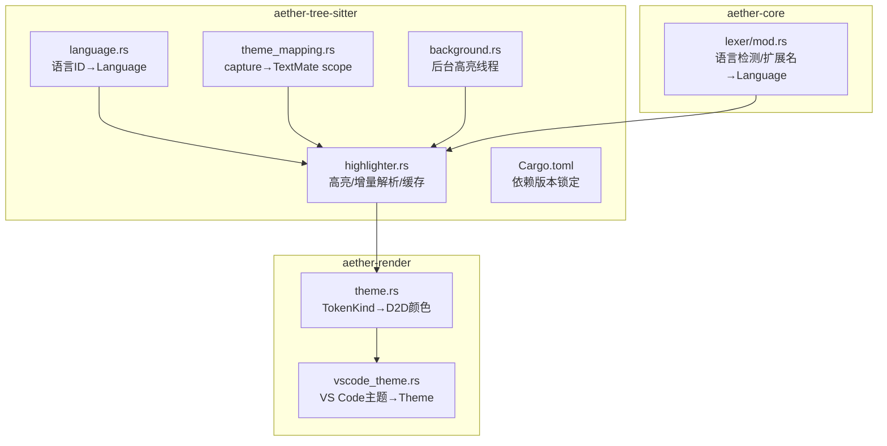
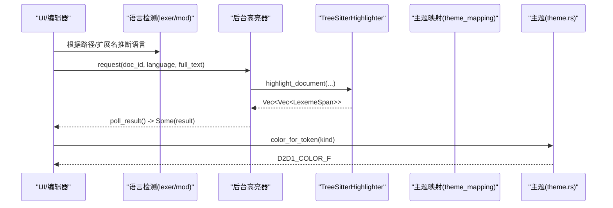
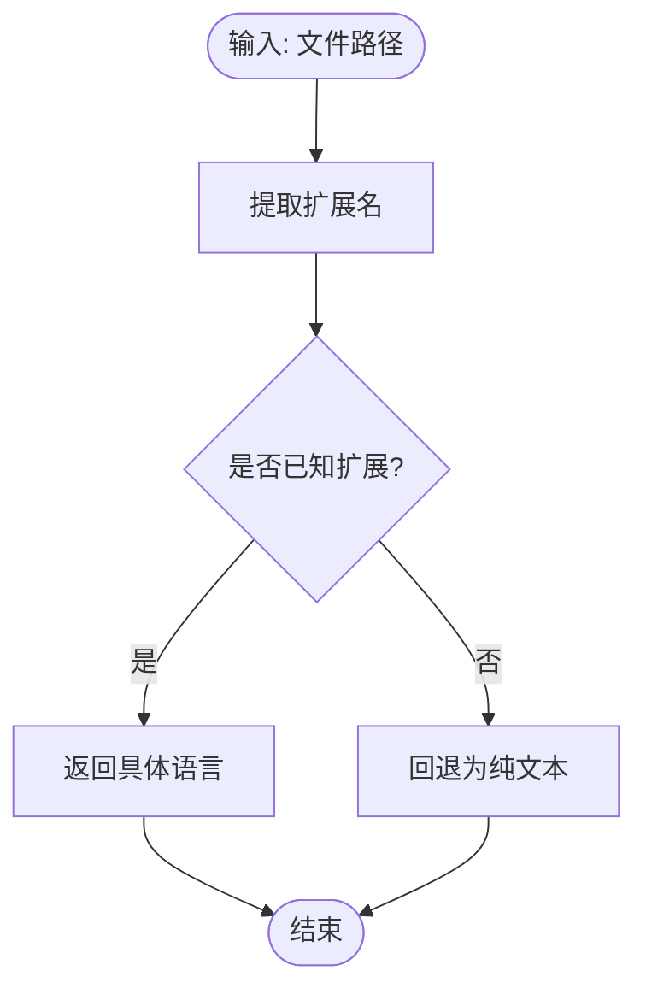
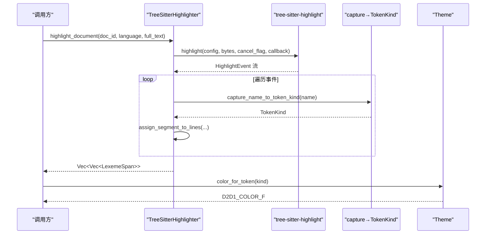
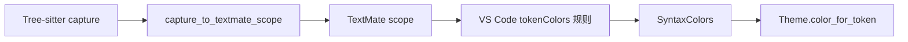
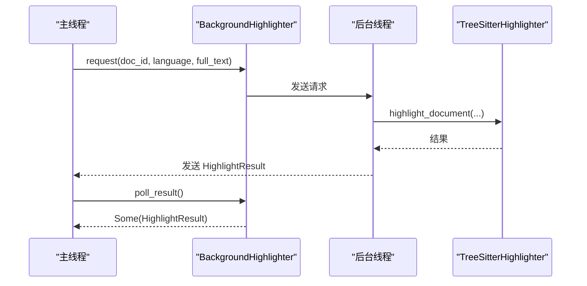
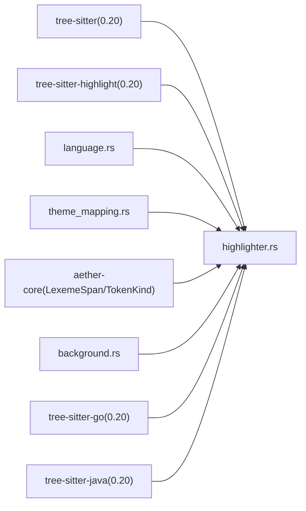

# Tree-sitter 语法解析集成

<cite>
**本文引用的文件**
- [crates/aether-tree-sitter/src/lib.rs](file://crates/aether-tree-sitter/src/lib.rs)
- [crates/aether-tree-sitter/src/language.rs](file://crates/aether-tree-sitter/src/language.rs)
- [crates/aether-tree-sitter/src/highlighter.rs](file://crates/aether-tree-sitter/src/highlighter.rs)
- [crates/aether-tree-sitter/src/theme_mapping.rs](file://crates/aether-tree-sitter/src/theme_mapping.rs)
- [crates/aether-tree-sitter/src/background.rs](file://crates/aether-tree-sitter/src/background.rs)
- [crates/aether-tree-sitter/Cargo.toml](file://crates/aether-tree-sitter/Cargo.toml)
- [crates/aether-core/src/lexer/mod.rs](file://crates/aether-core/src/lexer/mod.rs)
- [crates/aether-render/src/theme.rs](file://crates/aether-render/src/theme.rs)
- [crates/aether-render/src/vscode_theme.rs](file://crates/aether-render/src/vscode_theme.rs)
</cite>

## 更新摘要
**所做更改**
- 新增 Go 和 Java 语言支持，通过 tree-sitter-go 和 tree-sitter-java 依赖（版本 0.20）
- 在 TreeSitterHighlighter 结构体中为两种新语言添加配置字段
- 扩展语言解析逻辑以支持新的语言 ID
- 改进错误处理以实现优雅降级场景
- 更新测试用例以验证新语言的高亮功能

## 目录
1. [简介](#简介)
2. [项目结构](#项目结构)
3. [核心组件](#核心组件)
4. [架构总览](#架构总览)
5. [详细组件分析](#详细组件分析)
6. [依赖关系分析](#依赖关系分析)
7. [性能与内存管理](#性能与内存管理)
8. [故障排查指南](#故障排查指南)
9. [结论](#结论)
10. [附录：扩展指南](#附录扩展指南)

## 简介
本文件面向 Tree-sitter 集成模块，系统性阐述以下方面：
- 语法解析器初始化流程（语言定义加载、解析器实例化、缓存策略）
- 高亮系统实现（语法树遍历、Token 提取、样式应用）
- 语言检测机制（文件扩展名匹配、内容分析与优先级排序）
- 主题映射系统（语法节点到视觉样式的转换、颜色方案适配）
- 增量解析优化、内存管理与性能调优
- 如何配置新语言支持、自定义高亮规则与扩展语法定义

## 项目结构
Tree-sitter 集成位于 aether-tree-sitter crate，围绕四个核心源文件组织：
- language.rs：语言 ID 到 tree-sitter Language 的映射
- highlighter.rs：基于 tree-sitter-highlight 的高亮与增量解析
- theme_mapping.rs：capture name 到 TextMate scope 的映射
- background.rs：后台线程异步高亮，避免阻塞 UI



**图表来源**
- [crates/aether-tree-sitter/src/language.rs:1-22](file://crates/aether-tree-sitter/src/language.rs#L1-L22)
- [crates/aether-tree-sitter/src/highlighter.rs:1-120](file://crates/aether-tree-sitter/src/highlighter.rs#L1-L120)
- [crates/aether-tree-sitter/src/theme_mapping.rs:1-120](file://crates/aether-tree-sitter/src/theme_mapping.rs#L1-L120)
- [crates/aether-tree-sitter/src/background.rs:1-70](file://crates/aether-tree-sitter/src/background.rs#L1-L70)
- [crates/aether-core/src/lexer/mod.rs:98-142](file://crates/aether-core/src/lexer/mod.rs#L98-L142)
- [crates/aether-render/src/theme.rs:244-276](file://crates/aether-render/src/theme.rs#L244-L276)
- [crates/aether-render/src/vscode_theme.rs:103-176](file://crates/aether-render/src/vscode_theme.rs#L103-L176)

**章节来源**
- [crates/aether-tree-sitter/src/lib.rs:1-10](file://crates/aether-tree-sitter/src/lib.rs#L1-L10)
- [crates/aether-tree-sitter/Cargo.toml:1-25](file://crates/aether-tree-sitter/Cargo.toml#L1-L25)

## 核心组件
- 语言映射：提供 get_language(language_id) → Option<Language>，将常见语言 ID 映射到对应 tree-sitter Language。
- 高亮器：TreeSitterHighlighter，封装 Highlighter、各语言 HighlightConfiguration、文档级 Parser 与语法树缓存，并提供单行/全文高亮与增量解析接口。
- 主题映射：capture_to_textmate_scope 将 capture 名称映射为 TextMate scope，便于与 VS Code 主题生态对接。
- 后台高亮：BackgroundHighlighter 通过 mpsc channel 在独立线程执行高亮，主线程非阻塞轮询结果。

**章节来源**
- [crates/aether-tree-sitter/src/language.rs:1-22](file://crates/aether-tree-sitter/src/language.rs#L1-L22)
- [crates/aether-tree-sitter/src/highlighter.rs:1-120](file://crates/aether-tree-sitter/src/highlighter.rs#L1-L120)
- [crates/aether-tree-sitter/src/theme_mapping.rs:1-120](file://crates/aether-tree-sitter/src/theme_mapping.rs#L1-L120)
- [crates/aether-tree-sitter/src/background.rs:1-70](file://crates/aether-tree-sitter/src/background.rs#L1-L70)

## 架构总览
整体数据流从"语言检测"开始，经"高亮器"生成 Token 列表，再经"主题系统"转换为渲染颜色。



**图表来源**
- [crates/aether-core/src/lexer/mod.rs:98-142](file://crates/aether-core/src/lexer/mod.rs#L98-L142)
- [crates/aether-tree-sitter/src/background.rs:79-113](file://crates/aether-tree-sitter/src/background.rs#L79-L113)
- [crates/aether-tree-sitter/src/highlighter.rs:431-495](file://crates/aether-tree-sitter/src/highlighter.rs#L431-L495)
- [crates/aether-tree-sitter/src/theme_mapping.rs:6-120](file://crates/aether-tree-sitter/src/theme_mapping.rs#L6-L120)
- [crates/aether-render/src/theme.rs:244-276](file://crates/aether-render/src/theme.rs#L244-L276)

## 详细组件分析

### 语言检测机制
- 扩展名匹配：Language::from_extension 将扩展名映射到内部 Language 枚举；未知扩展统一回退为 PlainText。
- 路径检测：Language::from_path 从路径提取扩展名并调用 from_extension。
- 优先级策略：按扩展名精确匹配，无匹配则回退 PlainText；HTML/CSS 等使用专用 lexer 或复用通用逻辑。



**图表来源**
- [crates/aether-core/src/lexer/mod.rs:98-142](file://crates/aether-core/src/lexer/mod.rs#L98-L142)

**章节来源**
- [crates/aether-core/src/lexer/mod.rs:98-142](file://crates/aether-core/src/lexer/mod.rs#L98-L142)

### 语法解析器初始化与语言定义加载
- 语言定义加载：language.rs 中 get_language 将语言 ID 映射到 tree-sitter Language。
- 高亮配置初始化：TreeSitterHighlighter::init_configs 为每种语言创建 HighlightConfiguration，并使用固定 capture 名称顺序进行 configure，确保 capture_name_to_token_kind 映射稳定。
- 解析器实例化：parse_document 中按需创建 Parser 并设置 Language，同时维护 parser_cache 与 tree_cache。

**已更新** 新增对 Go 和 Java 语言的完整支持，包括语言定义加载和高亮配置初始化。

```mermaid
classDiagram
class TreeSitterHighlighter {
+new() Self
-init_configs() void
+parse_document(doc_id, language, text) Option<&Tree>
+get_tree(doc_id) Option<&Tree>
+remove_document(doc_id) void
+supports_language(language) bool
+highlight_line(text, language) Vec<LexemeSpan>
+highlight_document(doc_id, language, full_text) Vec<Vec<LexemeSpan>>
-tree_cache HashMap<String,(String,Tree)>
-parser_cache HashMap<String,Parser>
+go_config Option<HighlightConfiguration>
+java_config Option<HighlightConfiguration>
}
class BackgroundHighlighter {
+new() Self
+request(doc_id, language, full_text) void
+poll_result() Option<HighlightResult>
+has_pending() bool
}
BackgroundHighlighter --> TreeSitterHighlighter : "后台线程持有"
```

**图表来源**
- [crates/aether-tree-sitter/src/highlighter.rs:1-120](file://crates/aether-tree-sitter/src/highlighter.rs#L1-L120)
- [crates/aether-tree-sitter/src/background.rs:31-77](file://crates/aether-tree-sitter/src/background.rs#L31-L77)

**章节来源**
- [crates/aether-tree-sitter/src/language.rs:1-22](file://crates/aether-tree-sitter/src/language.rs#L1-L22)
- [crates/aether-tree-sitter/src/highlighter.rs:47-178](file://crates/aether-tree-sitter/src/highlighter.rs#L47-L178)
- [crates/aether-tree-sitter/src/highlighter.rs:285-327](file://crates/aether-tree-sitter/src/highlighter.rs#L285-L327)

### 高亮系统实现
- 单行高亮：highlight_line 基于 HighlightEvent 流，按 Source/HightlightStart/HighlightEnd 事件合并区间，生成 LexemeSpan 列表。
- 全文高亮：highlight_document 先更新语法树缓存，再对全文进行高亮，并将跨行片段分配到对应行，返回每行的 token 列表。
- Token 提取：capture_name_to_token_kind 依据 capture 名称而非索引映射到 TokenKind，兼容不同语言的 highlight query。
- 样式应用：上层通过 Theme::color_for_token 将 TokenKind 映射为 D2D1_COLOR_F 用于渲染。

**已更新** 新增对 Go 和 Java 语言的高亮支持，包括相应的配置处理和测试用例。



**图表来源**
- [crates/aether-tree-sitter/src/highlighter.rs:431-495](file://crates/aether-tree-sitter/src/highlighter.rs#L431-L495)
- [crates/aether-tree-sitter/src/highlighter.rs:559-583](file://crates/aether-tree-sitter/src/highlighter.rs#L559-L583)
- [crates/aether-render/src/theme.rs:244-276](file://crates/aether-render/src/theme.rs#L244-L276)

**章节来源**
- [crates/aether-tree-sitter/src/highlighter.rs:180-283](file://crates/aether-tree-sitter/src/highlighter.rs#L180-L283)
- [crates/aether-tree-sitter/src/highlighter.rs:431-495](file://crates/aether-tree-sitter/src/highlighter.rs#L431-L495)
- [crates/aether-tree-sitter/src/highlighter.rs:498-533](file://crates/aether-tree-sitter/src/highlighter.rs#L498-L533)
- [crates/aether-tree-sitter/src/highlighter.rs:559-583](file://crates/aether-tree-sitter/src/highlighter.rs#L559-L583)
- [crates/aether-render/src/theme.rs:244-276](file://crates/aether-render/src/theme.rs#L244-L276)

### 主题映射系统
- capture_to_textmate_scope：将 Tree-sitter capture 名称映射为 TextMate scope，覆盖变量、常量、类型、函数、关键字、运算符、注释、字符串、数字、标签、标点等广泛类别。
- build_theme_mapping：构建完整映射表，供上层工具链或调试使用。
- VS Code 主题适配：vscode_theme.rs 解析 tokenColors 中的 scope 到 SyntaxColors，从而驱动 Theme 的颜色字段。



**图表来源**
- [crates/aether-tree-sitter/src/theme_mapping.rs:6-120](file://crates/aether-tree-sitter/src/theme_mapping.rs#L6-L120)
- [crates/aether-render/src/vscode_theme.rs:179-234](file://crates/aether-render/src/vscode_theme.rs#L179-L234)
- [crates/aether-render/src/theme.rs:244-276](file://crates/aether-render/src/theme.rs#L244-L276)

**章节来源**
- [crates/aether-tree-sitter/src/theme_mapping.rs:1-210](file://crates/aether-tree-sitter/src/theme_mapping.rs#L1-L210)
- [crates/aether-render/src/vscode_theme.rs:103-176](file://crates/aether-render/src/vscode_theme.rs#L103-L176)
- [crates/aether-render/src/vscode_theme.rs:179-234](file://crates/aether-render/src/vscode_theme.rs#L179-L234)

### 后台高亮与 UI 解耦
- BackgroundHighlighter 在独立线程内持有专属 TreeSitterHighlighter，主线程通过 request 发送高亮请求，poll_result 非阻塞获取最新结果。
- pending 标志避免重复排队堆积，确保只处理最近一次请求。



**图表来源**
- [crates/aether-tree-sitter/src/background.rs:46-113](file://crates/aether-tree-sitter/src/background.rs#L46-L113)
- [crates/aether-tree-sitter/src/highlighter.rs:431-495](file://crates/aether-tree-sitter/src/highlighter.rs#L431-L495)

**章节来源**
- [crates/aether-tree-sitter/src/background.rs:1-126](file://crates/aether-tree-sitter/src/background.rs#L1-L126)

## 依赖关系分析
- 版本锁定：Cargo.toml 将所有 tree-sitter 相关库锁定至 0.20 系列，避免 HTML grammar 的版本冲突问题。
- 模块耦合：
  - highlighter 依赖 aether-core 的 LexemeSpan/TokenKind
  - theme_mapping 提供 capture→scope 映射，供上层主题系统使用
  - background 仅依赖 highlighter，保持 UI 与解析解耦

**已更新** 新增 tree-sitter-go 和 tree-sitter-java 依赖，版本均为 0.20，与现有依赖保持一致。



**图表来源**
- [crates/aether-tree-sitter/Cargo.toml:6-25](file://crates/aether-tree-sitter/Cargo.toml#L6-L25)
- [crates/aether-tree-sitter/src/highlighter.rs:1-10](file://crates/aether-tree-sitter/src/highlighter.rs#L1-L10)
- [crates/aether-tree-sitter/src/theme_mapping.rs:1-10](file://crates/aether-tree-sitter/src/theme_mapping.rs#L1-L10)
- [crates/aether-tree-sitter/src/background.rs:1-20](file://crates/aether-tree-sitter/src/background.rs#L1-L20)

**章节来源**
- [crates/aether-tree-sitter/Cargo.toml:1-25](file://crates/aether-tree-sitter/Cargo.toml#L1-L25)

## 性能与内存管理
- 增量解析：parse_document 使用旧语法树作为输入，减少重解析开销；tree_cache 保存每文档的 (language, Tree)，parser_cache 复用 Parser。
- 缓存上限：MAX_HIGHLIGHTER_DOCS 限制 tree_cache 条目数，达到上限且新文档不在缓存时触发全量淘汰，防止长时间运行后无限增长。
- 事件流处理：highlight_document 一次性解析全文，避免逐行重复初始化解析器；assign_segment_to_lines 使用二分查找定位行起始偏移，高效分配跨行片段。
- 后台执行：BackgroundHighlighter 将耗时操作移出 UI 线程，主线程仅做非阻塞轮询，提升交互流畅度。
- 建议优化：
  - 针对超大文件可考虑分块解析或延迟解析可见区域
  - 结合用户编辑频率动态调整缓存淘汰策略（如 LRU）
  - 在高并发场景下评估多 worker 线程并行解析不同文档

**章节来源**
- [crates/aether-tree-sitter/src/highlighter.rs:285-327](file://crates/aether-tree-sitter/src/highlighter.rs#L285-L327)
- [crates/aether-tree-sitter/src/highlighter.rs:431-495](file://crates/aether-tree-sitter/src/highlighter.rs#L431-L495)
- [crates/aether-tree-sitter/src/highlighter.rs:498-533](file://crates/aether-tree-sitter/src/highlighter.rs#L498-L533)
- [crates/aether-tree-sitter/src/background.rs:79-113](file://crates/aether-tree-sitter/src/background.rs#L79-L113)

## 故障排查指南
- 不支持的语言：当语言未注册或 highlight_config 缺失时，highlight_line/highlight_document 返回空结果。检查语言 ID 是否在 get_language 与 get_config 中注册。
- 解析失败：parse_document 返回 None 表示解析失败，确认语言与语法树可用，以及文本是否为有效 UTF-8。
- 主题映射异常：若 capture 名称不在映射表中，默认回退为 source 或 Unknown，需补充 theme_mapping 或 highlight query 定义。
- 后台线程状态：poll_result 返回 None 表示仍在处理或通道断开，检查 has_pending 与 channel 生命周期。

**已更新** 新增对 Go 和 Java 语言的支持，如果这两种语言出现高亮问题，请检查相应的配置是否正确初始化。

**章节来源**
- [crates/aether-tree-sitter/src/highlighter.rs:329-363](file://crates/aether-tree-sitter/src/highlighter.rs#L329-L363)
- [crates/aether-tree-sitter/src/highlighter.rs:285-327](file://crates/aether-tree-sitter/src/highlighter.rs#L285-L327)
- [crates/aether-tree-sitter/src/theme_mapping.rs:6-120](file://crates/aether-tree-sitter/src/theme_mapping.rs#L6-L120)
- [crates/aether-tree-sitter/src/background.rs:95-113](file://crates/aether-tree-sitter/src/background.rs#L95-L113)

## 结论
该 Tree-sitter 集成模块以清晰的分层设计实现了高性能、可扩展的语法高亮能力：语言检测与解析分离、后台异步高亮、稳定的 capture→TokenKind 映射以及与 VS Code 主题生态的无缝衔接。通过合理的缓存与增量解析策略，系统在交互响应与资源占用之间取得良好平衡。

**已更新** 新增的 Go 和 Java 语言支持进一步增强了系统的多语言处理能力，为开发者提供了更完整的编程体验。

## 附录：扩展指南

### 新增语言支持步骤
- 在 language.rs 的 get_language 中添加语言 ID 到 tree-sitter Language 的映射。
- 在 highlighter.rs 的 init_configs 中为该语言创建 HighlightConfiguration，并确保 capture 名称顺序与 HIGHLIGHT_NAMES 一致。
- 在 get_config/get_config_ptr 中增加语言分支，使 highlight_line/highlight_document 能识别新语言。
- 在 Cargo.toml 中引入对应 tree-sitter-* 库并锁定版本。

**已更新** 参考 Go 和 Java 的实现示例，它们展示了如何正确添加新语言支持的完整流程。

**章节来源**
- [crates/aether-tree-sitter/src/language.rs:1-22](file://crates/aether-tree-sitter/src/language.rs#L1-L22)
- [crates/aether-tree-sitter/src/highlighter.rs:68-178](file://crates/aether-tree-sitter/src/highlighter.rs#L68-L178)
- [crates/aether-tree-sitter/src/highlighter.rs:345-363](file://crates/aether-tree-sitter/src/highlighter.rs#L345-L363)
- [crates/aether-tree-sitter/Cargo.toml:11-21](file://crates/aether-tree-sitter/Cargo.toml#L11-L21)

### 自定义高亮规则
- 修改 highlighter.rs 中的 HIGHLIGHT_NAMES 以固定 capture 索引顺序（当前已改为按名称映射，但保留兼容性）。
- 在 theme_mapping.rs 中补充新的 capture 名称到 TextMate scope 的映射，确保主题系统能正确着色。
- 如需更细粒度控制，可在 highlighter.rs 的 capture_name_to_token_kind 中扩展映射逻辑。

**章节来源**
- [crates/aether-tree-sitter/src/highlighter.rs:31-45](file://crates/aether-tree-sitter/src/highlighter.rs#L31-L45)
- [crates/aether-tree-sitter/src/highlighter.rs:559-583](file://crates/aether-tree-sitter/src/highlighter.rs#L559-L583)
- [crates/aether-tree-sitter/src/theme_mapping.rs:6-120](file://crates/aether-tree-sitter/src/theme_mapping.rs#L6-L120)

### 扩展语法定义
- 在 Cargo.toml 中引入新的 tree-sitter-* 库并锁定版本。
- 在 language.rs 和 highlighter.rs 中注册新语言 ID 与 HighlightConfiguration。
- 在 theme_mapping.rs 中为新语言的 capture 名称添加映射。
- 在 vscode_theme.rs 中确保 tokenColors 的 scope 能映射到 SyntaxColors 字段。

**已更新** 新增的 Go 和 Java 语言支持展示了如何正确集成新的语法定义，包括依赖管理和配置初始化。

**章节来源**
- [crates/aether-tree-sitter/Cargo.toml:6-25](file://crates/aether-tree-sitter/Cargo.toml#L6-L25)
- [crates/aether-tree-sitter/src/language.rs:1-22](file://crates/aether-tree-sitter/src/language.rs#L1-L22)
- [crates/aether-tree-sitter/src/highlighter.rs:68-178](file://crates/aether-tree-sitter/src/highlighter.rs#L68-L178)
- [crates/aether-tree-sitter/src/theme_mapping.rs:122-210](file://crates/aether-tree-sitter/src/theme_mapping.rs#L122-L210)
- [crates/aether-render/src/vscode_theme.rs:179-234](file://crates/aether-render/src/vscode_theme.rs#L179-L234)