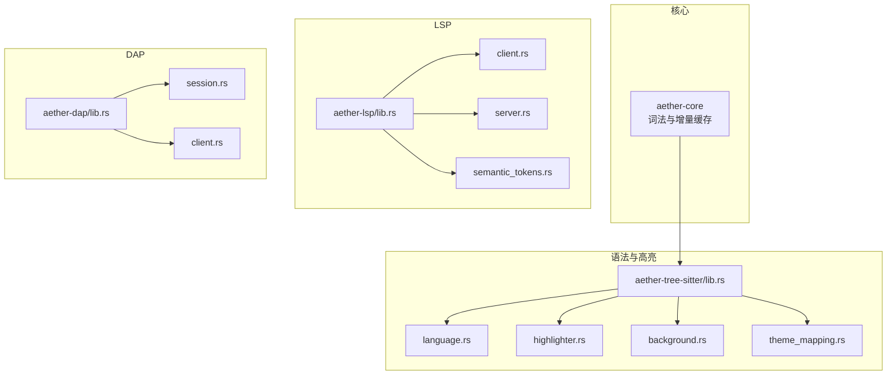
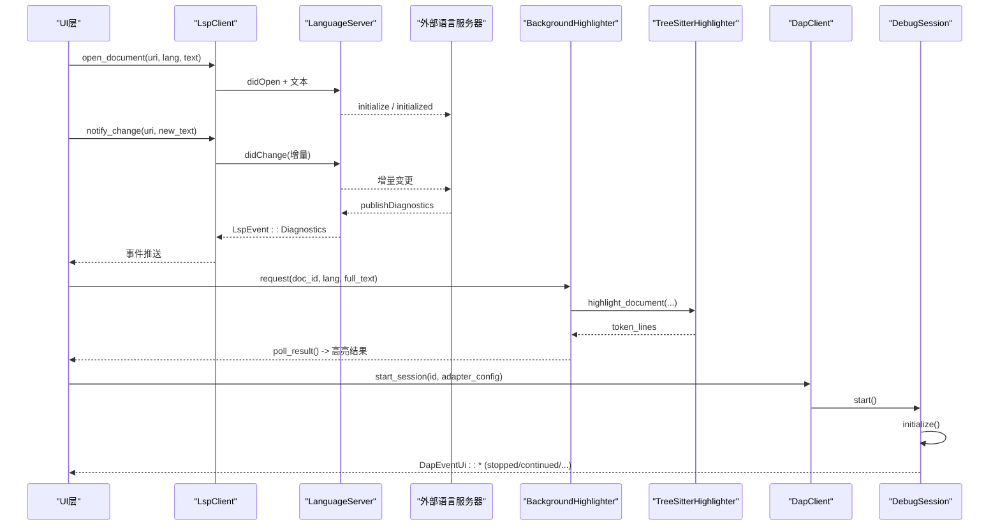
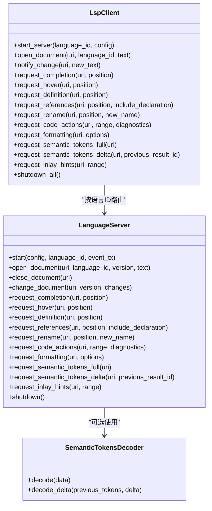
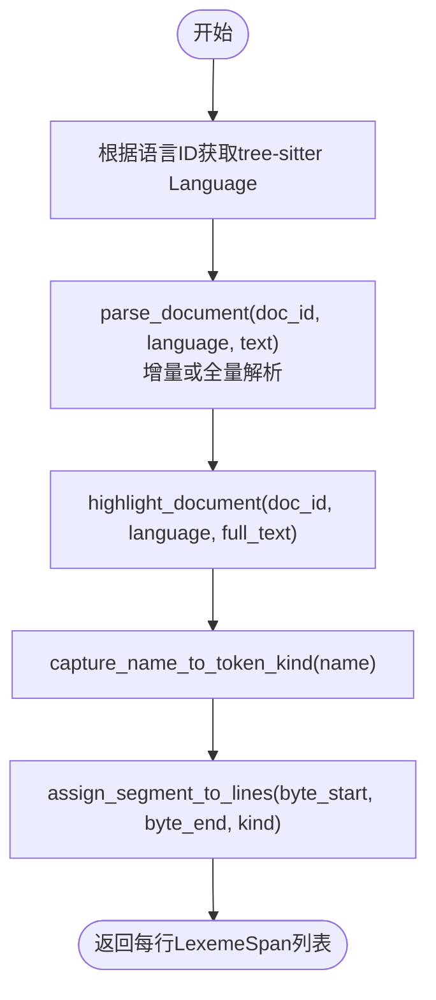
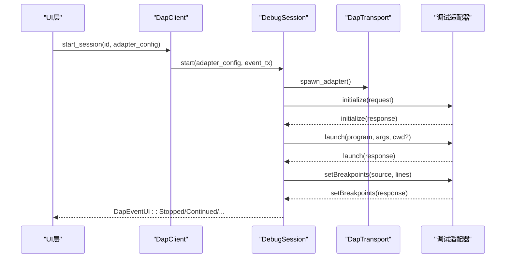
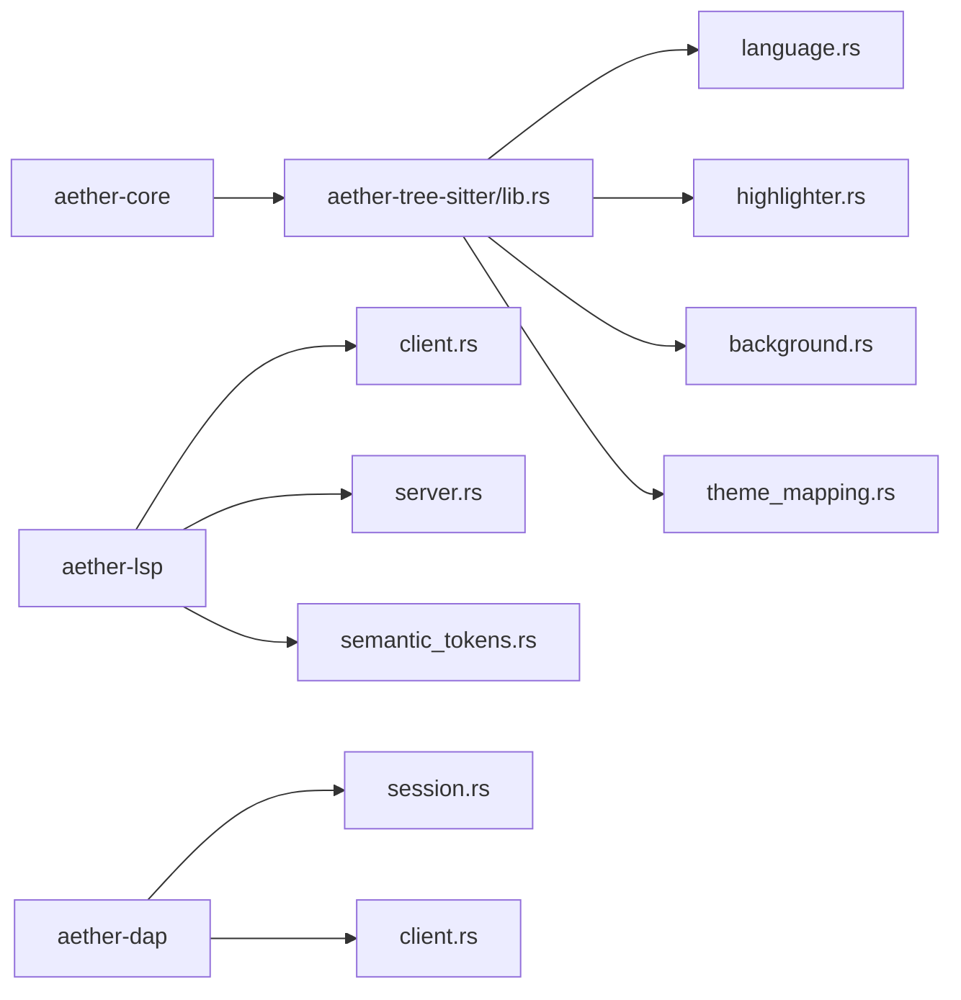

# 语言支持

<cite>
**本文引用的文件**   
- [aether-lsp/src/lib.rs](file://crates/aether-lsp/src/lib.rs)
- [aether-lsp/src/client.rs](file://crates/aether-lsp/src/client.rs)
- [aether-lsp/src/server.rs](file://crates/aether-lsp/src/server.rs)
- [aether-lsp/src/semantic_tokens.rs](file://crates/aether-lsp/src/semantic_tokens.rs)
- [aether-tree-sitter/src/lib.rs](file://crates/aether-tree-sitter/src/lib.rs)
- [aether-tree-sitter/src/language.rs](file://crates/aether-tree-sitter/src/language.rs)
- [aether-tree-sitter/src/highlighter.rs](file://crates/aether-tree-sitter/src/highlighter.rs)
- [aether-tree-sitter/src/theme_mapping.rs](file://crates/aether-tree-sitter/src/theme_mapping.rs)
- [aether-tree-sitter/src/background.rs](file://crates/aether-tree-sitter/src/background.rs)
- [aether-core/src/lexer/mod.rs](file://crates/aether-core/src/lexer/mod.rs)
- [aether-core/src/incremental_lexer.rs](file://crates/aether-core/src/incremental_lexer.rs)
- [aether-dap/src/lib.rs](file://crates/aether-dap/src/lib.rs)
- [aether-dap/src/session.rs](file://crates/aether-dap/src/session.rs)
- [aether-dap/src/client.rs](file://crates/aether-dap/src/client.rs)
</cite>

## 目录
1. [简介](#简介)
2. [项目结构](#项目结构)
3. [核心组件](#核心组件)
4. [架构总览](#架构总览)
5. [详细组件分析](#详细组件分析)
6. [依赖关系分析](#依赖关系分析)
7. [性能考量](#性能考量)
8. [故障排查指南](#故障排查指南)
9. [结论](#结论)
10. [附录：扩展新语言支持流程](#附录扩展新语言支持流程)

## 简介
本文件面向“牧羊人编辑器”的语言支持能力，系统性阐述以下方面：
- LSP（Language Server Protocol）客户端实现：连接管理、消息协议与语义信息处理。
- Tree-sitter 语法解析集成：语言检测、语法树构建与高亮渲染。
- DAP（Debug Adapter Protocol）基础实现：调试会话管理与断点控制。
- 如何添加新语言支持：词法分析器、语法定义配置与主题映射的完整流程与实践示例路径。

## 项目结构
本项目采用多 crate 分层组织，语言相关能力主要分布在如下模块：
- aether-core：通用词法框架与增量词法缓存。
- aether-tree-sitter：Tree-sitter 集成、语言发现、高亮与后台渲染。
- aether-lsp：LSP 客户端、服务器生命周期、文档同步与语义令牌解码。
- aether-dap：DAP 客户端与调试会话管理。

图表来源
- [aether-tree-sitter/src/lib.rs:1-10](file://crates/aether-tree-sitter/src/lib.rs#L1-L10)
- [aether-lsp/src/lib.rs:1-16](file://crates/aether-lsp/src/lib.rs#L1-L16)
- [aether-dap/src/lib.rs:1-8](file://crates/aether-dap/src/lib.rs#L1-L8)

章节来源
- [aether-tree-sitter/src/lib.rs:1-10](file://crates/aether-tree-sitter/src/lib.rs#L1-L10)
- [aether-lsp/src/lib.rs:1-16](file://crates/aether-lsp/src/lib.rs#L1-L16)
- [aether-dap/src/lib.rs:1-8](file://crates/aether-dap/src/lib.rs#L1-L8)

## 核心组件
- 词法与增量缓存
  - 统一 Lexer trait 与 TokenKind，提供 Language 枚举及 from_extension/from_path 语言检测，create_lexer 静态分发到具体语言 lexer。
  - IncrementalLexer 按行缓存 token，编辑后仅重算受影响行；IncrementalLexerManager 管理多文件缓存并限制最大条目数。
- Tree-sitter 高亮与解析
  - language.rs 根据语言 ID 返回对应 tree-sitter Language。
  - highlighter.rs 维护 HighlightConfiguration、Parser 与 Tree 缓存，支持整文档高亮与增量解析。
  - background.rs 将高亮任务迁移至后台线程，主线程非阻塞轮询结果。
  - theme_mapping.rs 将 capture name 映射为 TextMate scope，对接 VS Code 主题生态。
- LSP 客户端与服务端封装
  - client.rs 管理多个语言服务器实例、文档同步、诊断缓存与事件推送。
  - server.rs 负责进程启动、initialize、请求-响应通道、通知转发与优雅关闭。
  - semantic_tokens.rs 解码 LSP 语义令牌与 delta 更新，并提供类型/修饰符映射。
- DAP 客户端与会话
  - session.rs 管理单个调试适配器生命周期、初始化、launch、断点、控制流与事件处理。
  - client.rs 管理多个会话与默认适配器配置发现。

章节来源
- [aether-core/src/lexer/mod.rs:1-182](file://crates/aether-core/src/lexer/mod.rs#L1-L182)
- [aether-core/src/incremental_lexer.rs:1-193](file://crates/aether-core/src/incremental_lexer.rs#L1-L193)
- [aether-tree-sitter/src/language.rs:1-105](file://crates/aether-tree-sitter/src/language.rs#L1-L105)
- [aether-tree-sitter/src/highlighter.rs:1-496](file://crates/aether-tree-sitter/src/highlighter.rs#L1-L496)
- [aether-tree-sitter/src/background.rs:1-126](file://crates/aether-tree-sitter/src/background.rs#L1-L126)
- [aether-tree-sitter/src/theme_mapping.rs:1-210](file://crates/aether-tree-sitter/src/theme_mapping.rs#L1-L210)
- [aether-lsp/src/client.rs:1-603](file://crates/aether-lsp/src/client.rs#L1-L603)
- [aether-lsp/src/server.rs:1-800](file://crates/aether-lsp/src/server.rs#L1-L800)
- [aether-lsp/src/semantic_tokens.rs:1-264](file://crates/aether-lsp/src/semantic_tokens.rs#L1-L264)
- [aether-dap/src/session.rs:1-682](file://crates/aether-dap/src/session.rs#L1-L682)
- [aether-dap/src/client.rs:1-178](file://crates/aether-dap/src/client.rs#L1-L178)

## 架构总览
整体数据与控制流：
- UI 层打开/编辑文档时，通过 LspClient 路由到对应语言的 LanguageServer，发送 didOpen/didChange 等通知。
- LanguageServer 通过 JSON-RPC over stdio 与外部语言服务器通信，并将 diagnostics、completion、hover 等结果以事件形式回推给 UI。
- 高亮由 BackgroundHighlighter 在后台线程调用 TreeSitterHighlighter 完成，结果返回给 UI 渲染。
- 调试由 DapClient 创建 DebugSession，通过 DAP 协议与调试适配器交互，事件驱动 UI 状态更新。

图表来源
- [aether-lsp/src/client.rs:114-249](file://crates/aether-lsp/src/client.rs#L114-L249)
- [aether-lsp/src/server.rs:68-124](file://crates/aether-lsp/src/server.rs#L68-L124)
- [aether-tree-sitter/src/background.rs:46-118](file://crates/aether-tree-sitter/src/background.rs#L46-L118)
- [aether-tree-sitter/src/highlighter.rs:431-496](file://crates/aether-tree-sitter/src/highlighter.rs#L431-L496)
- [aether-dap/src/client.rs:24-43](file://crates/aether-dap/src/client.rs#L24-L43)
- [aether-dap/src/session.rs:40-133](file://crates/aether-dap/src/session.rs#L40-L133)

## 详细组件分析

### LSP 客户端与服务端
- 连接管理
  - LspClient 维护 per-language 的 LanguageServer 实例，使用 tokio::sync::Mutex 避免全局写锁跨 await。
  - DocumentSync 记录已打开文档的 language_id、version 与文本，用于计算增量变更。
- 消息协议
  - LanguageServer 内部使用 oneshot channel 配对请求-响应，reader_loop 独占 stdout 读取并分发 Response/Notification。
  - 支持 workspace/configuration、workspace/workspaceFolders 等反向请求的最小可用响应，避免服务器等待超时。
- 语义信息处理
  - 语义令牌解码：SemanticTokensDecoder 支持 full 与 delta 更新，map_tokens 将类型与修饰符位转换为结构化映射。
  - 诊断缓存：LspClient 提供 update/remove/all/clear 接口，供 UI 快速读取快照。

图表来源
- [aether-lsp/src/client.rs:71-603](file://crates/aether-lsp/src/client.rs#L71-L603)
- [aether-lsp/src/server.rs:63-800](file://crates/aether-lsp/src/server.rs#L63-L800)
- [aether-lsp/src/semantic_tokens.rs:17-86](file://crates/aether-lsp/src/semantic_tokens.rs#L17-L86)

章节来源
- [aether-lsp/src/client.rs:71-603](file://crates/aether-lsp/src/client.rs#L71-L603)
- [aether-lsp/src/server.rs:63-800](file://crates/aether-lsp/src/server.rs#L63-L800)
- [aether-lsp/src/semantic_tokens.rs:17-264](file://crates/aether-lsp/src/semantic_tokens.rs#L17-L264)

### Tree-sitter 语法解析与高亮
- 语言检测
  - language.rs 提供 get_language(language_id) 返回对应 tree-sitter Language。
- 语法树构建与高亮
  - highlighter.rs 维护 Parser 与 Tree 缓存，parse_document 支持增量解析；highlight_document 一次解析全文并按行分配 LexemeSpan。
  - capture_name_to_token_kind 基于 capture 名称映射 TokenKind，兼容不同语言 highlight query。
- 后台渲染
  - background.rs 将高亮任务放入独立线程，主线程通过 request/poll_result 非阻塞获取结果。
- 主题映射
  - theme_mapping.rs 将 capture name 映射为 TextMate scope，便于与 VS Code 主题体系对接。

图表来源
- [aether-tree-sitter/src/language.rs:1-22](file://crates/aether-tree-sitter/src/language.rs#L1-L22)
- [aether-tree-sitter/src/highlighter.rs:286-496](file://crates/aether-tree-sitter/src/highlighter.rs#L286-L496)
- [aether-tree-sitter/src/highlighter.rs:498-533](file://crates/aether-tree-sitter/src/highlighter.rs#L498-L533)
- [aether-tree-sitter/src/highlighter.rs:564-583](file://crates/aether-tree-sitter/src/highlighter.rs#L564-L583)
- [aether-tree-sitter/src/theme_mapping.rs:6-120](file://crates/aether-tree-sitter/src/theme_mapping.rs#L6-L120)

章节来源
- [aether-tree-sitter/src/language.rs:1-105](file://crates/aether-tree-sitter/src/language.rs#L1-L105)
- [aether-tree-sitter/src/highlighter.rs:1-496](file://crates/aether-tree-sitter/src/highlighter.rs#L1-L496)
- [aether-tree-sitter/src/background.rs:1-126](file://crates/aether-tree-sitter/src/background.rs#L1-L126)
- [aether-tree-sitter/src/theme_mapping.rs:1-210](file://crates/aether-tree-sitter/src/theme_mapping.rs#L1-L210)

### DAP 调试会话与断点控制
- 会话管理
  - DapClient 管理多个会话，start_session 创建 DebugSession 并注册。
- 生命周期与协议
  - DebugSession::start 启动子进程，spawn_adapter 建立 stdin/stdout 传输，initialize 握手成功后进入 Running。
  - launch 启动被调试程序；set_breakpoints 设置断点；continue/next/stepIn/stepOut/pause 控制执行；stackTrace/scopes/variables/evaluate 查询运行时信息。
- 事件处理
  - handle_event 处理 stopped/continued/exited/terminated/output/breakpoint 等事件，并通过 DapEventUi 推送给 UI。
- 资源清理
  - disconnect/detach 发送断开请求，finalize_child 等待或强制 kill 子进程，stderr drain 任务中止避免残留。

图表来源
- [aether-dap/src/client.rs:24-43](file://crates/aether-dap/src/client.rs#L24-L43)
- [aether-dap/src/session.rs:40-133](file://crates/aether-dap/src/session.rs#L40-L133)
- [aether-dap/src/session.rs:200-257](file://crates/aether-dap/src/session.rs#L200-L257)
- [aether-dap/src/session.rs:600-681](file://crates/aether-dap/src/session.rs#L600-L681)

章节来源
- [aether-dap/src/client.rs:1-178](file://crates/aether-dap/src/client.rs#L1-L178)
- [aether-dap/src/session.rs:1-682](file://crates/aether-dap/src/session.rs#L1-L682)

## 依赖关系分析
- 模块耦合
  - aether-core 提供通用词法抽象，被 aether-tree-sitter 与渲染管线复用。
  - aether-tree-sitter 依赖 tree-sitter-* 语法 crate，提供语言发现与高亮。
  - aether-lsp 依赖 lsp-types 与 tokio，封装 JSON-RPC 与进程管理。
  - aether-dap 依赖 tokio 进程与异步 IO，实现 DAP 协议。
- 潜在循环依赖
  - 当前各 crate 职责清晰，未见直接循环导入；通过 lib.rs 重新导出公共 API，降低耦合。
- 外部依赖
  - LSP/DAP 均通过外部进程（语言服务器/调试适配器）扩展能力，保持内核轻量。

图表来源
- [aether-tree-sitter/src/lib.rs:1-10](file://crates/aether-tree-sitter/src/lib.rs#L1-L10)
- [aether-lsp/src/lib.rs:1-16](file://crates/aether-lsp/src/lib.rs#L1-L16)
- [aether-dap/src/lib.rs:1-8](file://crates/aether-dap/src/lib.rs#L1-L8)

章节来源
- [aether-tree-sitter/src/lib.rs:1-10](file://crates/aether-tree-sitter/src/lib.rs#L1-L10)
- [aether-lsp/src/lib.rs:1-16](file://crates/aether-lsp/src/lib.rs#L1-L16)
- [aether-dap/src/lib.rs:1-8](file://crates/aether-dap/src/lib.rs#L1-L8)

## 性能考量
- 增量词法
  - IncrementalLexer 按行缓存，编辑后仅重算受影响行，时间复杂度近似 O(k)，k 为受影响行数。
- Tree-sitter 高亮
  - highlight_document 一次解析全文，减少逐行重复初始化开销；tree_cache/parser_cache 限制最大条目数，避免内存无界增长。
- 后台渲染
  - BackgroundHighlighter 将高亮移至后台线程，主线程非阻塞轮询，避免 UI 卡顿。
- LSP 请求-响应
  - reader_loop 独占 stdout 读取，oneshot 配对请求-响应，避免全局锁竞争；合理超时防止阻塞。
- DAP 会话
  - stderr drain 任务避免子进程缓冲区满导致阻塞；disconnect 后超时 kill 防止僵尸进程。

[本节为通用性能讨论，不直接分析具体文件]

## 故障排查指南
- LSP 诊断未显示
  - 检查 LanguageServer 是否成功 initialize 并发送 initialized 通知。
  - 确认 reader_loop 正常转发 publishDiagnostics 事件，LspClient 是否正确更新诊断缓存。
  - 参考路径：[aether-lsp/src/server.rs:68-124](file://crates/aether-lsp/src/server.rs#L68-L124)、[aether-lsp/src/client.rs:172-211](file://crates/aether-lsp/src/client.rs#L172-L211)
- 语义令牌异常
  - 核对 SemanticTokensDecoder.decode/decode_delta 逻辑与 LSP 返回格式一致。
  - 参考路径：[aether-lsp/src/semantic_tokens.rs:17-86](file://crates/aether-lsp/src/semantic_tokens.rs#L17-L86)
- 高亮卡顿或内存增长
  - 检查 BackgroundHighlighter.pending 防重复提交；确认 tree_cache/parser_cache 上限保护生效。
  - 参考路径：[aether-tree-sitter/src/background.rs:79-118](file://crates/aether-tree-sitter/src/background.rs#L79-L118)、[aether-tree-sitter/src/highlighter.rs:286-318](file://crates/aether-tree-sitter/src/highlighter.rs#L286-L318)
- DAP 会话无法终止
  - 检查 disconnect/detach 是否发送 terminateDebuggee 参数；确认 finalize_child 超时 kill 逻辑。
  - 参考路径：[aether-dap/src/session.rs:487-539](file://crates/aether-dap/src/session.rs#L487-L539)

章节来源
- [aether-lsp/src/server.rs:68-124](file://crates/aether-lsp/src/server.rs#L68-L124)
- [aether-lsp/src/client.rs:172-211](file://crates/aether-lsp/src/client.rs#L172-L211)
- [aether-lsp/src/semantic_tokens.rs:17-86](file://crates/aether-lsp/src/semantic_tokens.rs#L17-L86)
- [aether-tree-sitter/src/background.rs:79-118](file://crates/aether-tree-sitter/src/background.rs#L79-L118)
- [aether-tree-sitter/src/highlighter.rs:286-318](file://crates/aether-tree-sitter/src/highlighter.rs#L286-L318)
- [aether-dap/src/session.rs:487-539](file://crates/aether-dap/src/session.rs#L487-L539)

## 结论
本项目通过模块化设计将词法、语法、语义与调试能力解耦：
- LSP 客户端与服务端封装提供了健壮的连接管理与消息协议处理。
- Tree-sitter 集成实现了高效的高亮与语法树构建，并通过后台渲染保障 UI 流畅。
- DAP 会话管理覆盖常见调试场景，具备完善的资源回收与错误恢复。
- 新增语言支持可通过扩展词法分析器、语法定义与主题映射逐步完善。

[本节为总结性内容，不直接分析具体文件]

## 附录：扩展新语言支持流程
以下为添加新语言支持的端到端步骤与对应代码片段路径（不包含具体代码内容）：

- 步骤一：在词法层添加语言识别与默认 lexer
  - 在 Language 枚举中新增语言项，并在 from_extension/from_path/create_lexer/lex_full 中添加映射。
  - 若需要专用 lexer，实现 Lexer trait 并注册到 create_lexer。
  - 参考路径：
    - [aether-core/src/lexer/mod.rs:79-182](file://crates/aether-core/src/lexer/mod.rs#L79-L182)

- 步骤二：集成 Tree-sitter 语法与高亮
  - 在 language.rs 的 get_language 中为新语言返回对应的 tree-sitter Language。
  - 在 highlighter.rs 的 init_configs 中为该语言创建 HighlightConfiguration，并加入 supports_language/get_config 分支。
  - 如需自定义 capture 映射，可在 capture_name_to_token_kind 中补充名称映射。
  - 参考路径：
    - [aether-tree-sitter/src/language.rs:1-22](file://crates/aether-tree-sitter/src/language.rs#L1-L22)
    - [aether-tree-sitter/src/highlighter.rs:68-178](file://crates/aether-tree-sitter/src/highlighter.rs#L68-L178)
    - [aether-tree-sitter/src/highlighter.rs:329-359](file://crates/aether-tree-sitter/src/highlighter.rs#L329-L359)
    - [aether-tree-sitter/src/highlighter.rs:564-583](file://crates/aether-tree-sitter/src/highlighter.rs#L564-L583)

- 步骤三：主题映射（可选）
  - 在 theme_mapping.rs 的 capture_to_textmate_scope 中为新 capture 名称添加 TextMate scope 映射。
  - 参考路径：
    - [aether-tree-sitter/src/theme_mapping.rs:6-120](file://crates/aether-tree-sitter/src/theme_mapping.rs#L6-L120)

- 步骤四：LSP 支持（可选）
  - 在 default_server_config 中为新语言添加默认语言服务器命令与参数。
  - 参考路径：
    - [aether-lsp/src/client.rs:605-638](file://crates/aether-lsp/src/client.rs#L605-L638)

- 步骤五：DAP 支持（可选）
  - 在 default_adapter_config 中为新语言添加默认调试适配器配置。
  - 参考路径：
    - [aether-dap/src/client.rs:45-71](file://crates/aether-dap/src/client.rs#L45-L71)

- 步骤六：验证与测试
  - 使用 IncrementalLexer 与 TreeSitterHighlighter 对示例文本进行高亮与解析验证。
  - 参考路径：
    - [aether-core/src/incremental_lexer.rs:195-301](file://crates/aether-core/src/incremental_lexer.rs#L195-L301)
    - [aether-tree-sitter/src/highlighter.rs:585-800](file://crates/aether-tree-sitter/src/highlighter.rs#L585-L800)

章节来源
- [aether-core/src/lexer/mod.rs:79-182](file://crates/aether-core/src/lexer/mod.rs#L79-L182)
- [aether-tree-sitter/src/language.rs:1-22](file://crates/aether-tree-sitter/src/language.rs#L1-L22)
- [aether-tree-sitter/src/highlighter.rs:68-178](file://crates/aether-tree-sitter/src/highlighter.rs#L68-L178)
- [aether-tree-sitter/src/highlighter.rs:329-359](file://crates/aether-tree-sitter/src/highlighter.rs#L329-L359)
- [aether-tree-sitter/src/highlighter.rs:564-583](file://crates/aether-tree-sitter/src/highlighter.rs#L564-L583)
- [aether-tree-sitter/src/theme_mapping.rs:6-120](file://crates/aether-tree-sitter/src/theme_mapping.rs#L6-L120)
- [aether-lsp/src/client.rs:605-638](file://crates/aether-lsp/src/client.rs#L605-L638)
- [aether-dap/src/client.rs:45-71](file://crates/aether-dap/src/client.rs#L45-L71)
- [aether-core/src/incremental_lexer.rs:195-301](file://crates/aether-core/src/incremental_lexer.rs#L195-L301)
- [aether-tree-sitter/src/highlighter.rs:585-800](file://crates/aether-tree-sitter/src/highlighter.rs#L585-L800)