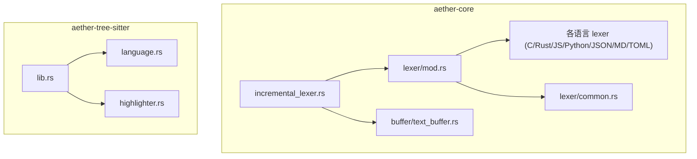
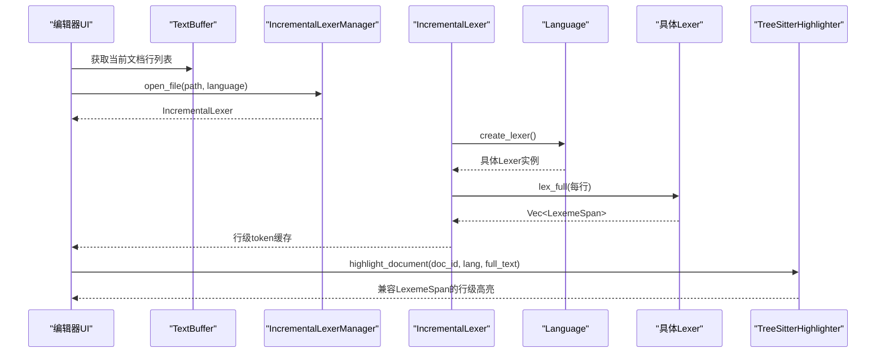
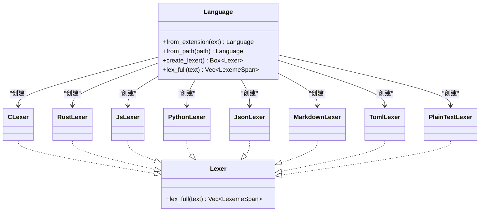
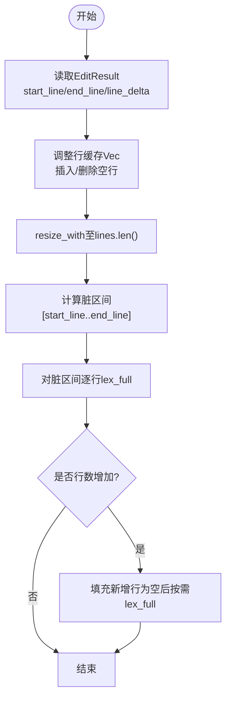
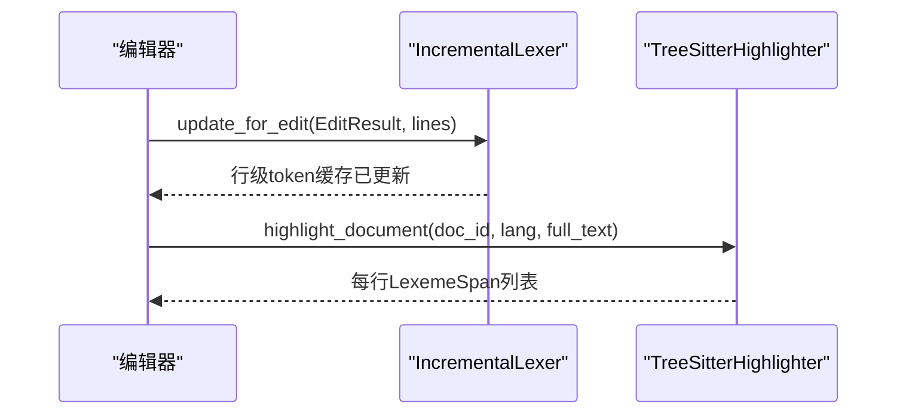
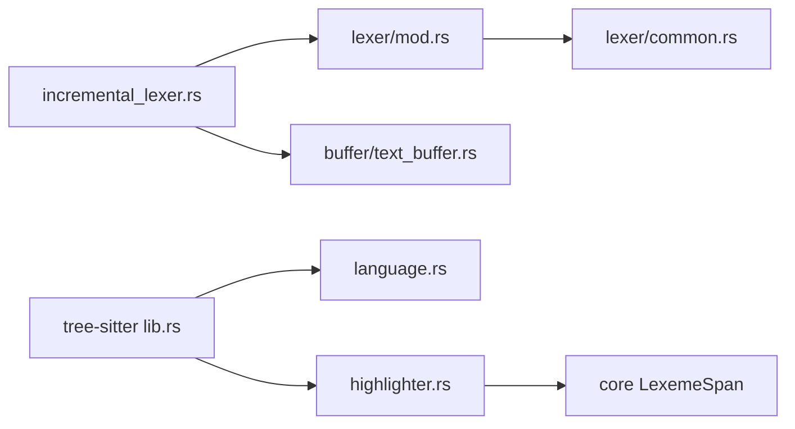

# 语言配置管理

<cite>
**本文引用的文件**   
- [crates/aether-core/src/lib.rs](file://crates/aether-core/src/lib.rs)
- [crates/aether-core/src/lexer/mod.rs](file://crates/aether-core/src/lexer/mod.rs)
- [crates/aether-core/src/lexer/common.rs](file://crates/aether-core/src/lexer/common.rs)
- [crates/aether-core/src/lexer/c_lexer.rs](file://crates/aether-core/src/lexer/c_lexer.rs)
- [crates/aether-core/src/lexer/js_lexer.rs](file://crates/aether-core/src/lexer/js_lexer.rs)
- [crates/aether-core/src/lexer/rust_lexer.rs](file://crates/aether-core/src/lexer/rust_lexer.rs)
- [crates/aether-core/src/lexer/python_lexer.rs](file://crates/aether-core/src/lexer/python_lexer.rs)
- [crates/aether-core/src/lexer/json_lexer.rs](file://crates/aether-core/src/lexer/json_lexer.rs)
- [crates/aether-core/src/lexer/markdown_lexer.rs](file://crates/aether-core/src/lexer/markdown_lexer.rs)
- [crates/aether-core/src/lexer/toml_lexer.rs](file://crates/aether-core/src/lexer/toml_lexer.rs)
- [crates/aether-core/src/incremental_lexer.rs](file://crates/aether-core/src/incremental_lexer.rs)
- [crates/aether-core/src/buffer/text_buffer.rs](file://crates/aether-core/src/buffer/text_buffer.rs)
- [crates/aether-tree-sitter/src/lib.rs](file://crates/aether-tree-sitter/src/lib.rs)
- [crates/aether-tree-sitter/src/language.rs](file://crates/aether-tree-sitter/src/language.rs)
- [crates/aether-tree-sitter/src/highlighter.rs](file://crates/aether-tree-sitter/src/highlighter.rs)
</cite>

## 目录
1. [简介](#简介)
2. [项目结构](#项目结构)
3. [核心组件](#核心组件)
4. [架构总览](#架构总览)
5. [详细组件分析](#详细组件分析)
6. [依赖关系分析](#依赖关系分析)
7. [性能考量](#性能考量)
8. [故障排查指南](#故障排查指南)
9. [结论](#结论)
10. [附录](#附录)

## 简介
本文件面向“语言配置管理系统”，聚焦以下目标：
- 词法分析器的注册与分发机制（语言检测、分析器选择、动态加载）
- 增量词法分析实现（文本变更检测、部分重分析、结果缓存）
- 语言配置的层次结构（全局、项目、文件级覆盖）
- 词法分析结果格式（Token 类型、位置信息、元数据）
- 实践示例（新增语言支持、配置词法规则、优化性能）
- 多语言混合编辑、实时高亮更新与内存优化

## 项目结构
仓库采用多 crate 组织，核心词法与增量分析位于 aether-core，Tree-sitter 高亮与语言映射位于 aether-tree-sitter。编辑器 UI 与 LSP/DAP 等上层模块通过统一接口消费词法结果。

图表来源
- [crates/aether-core/src/lexer/mod.rs:1-296](file://crates/aether-core/src/lexer/mod.rs#L1-L296)
- [crates/aether-core/src/incremental_lexer.rs:1-301](file://crates/aether-core/src/incremental_lexer.rs#L1-L301)
- [crates/aether-core/src/buffer/text_buffer.rs:1-344](file://crates/aether-core/src/buffer/text_buffer.rs#L1-L344)
- [crates/aether-core/src/lexer/common.rs:1-151](file://crates/aether-core/src/lexer/common.rs#L1-L151)
- [crates/aether-tree-sitter/src/lib.rs:1-10](file://crates/aether-tree-sitter/src/lib.rs#L1-L10)
- [crates/aether-tree-sitter/src/language.rs:1-105](file://crates/aether-tree-sitter/src/language.rs#L1-L105)
- [crates/aether-tree-sitter/src/highlighter.rs:1-800](file://crates/aether-tree-sitter/src/highlighter.rs#L1-L800)

章节来源
- [crates/aether-core/src/lib.rs:1-12](file://crates/aether-core/src/lib.rs#L1-L12)

## 核心组件
- 通用 Lexer trait 与 Token 体系：定义跨语言的统一接口与 Token 类型集合，提供行级全量分析能力。
- Language 枚举与分发：基于扩展名/路径进行语言检测，并提供静态分发与动态 Box 分发两种创建方式。
- 增量词法分析器：按行缓存 token，依据 EditResult 精准失效并仅重分析受影响行。
- Tree-sitter 高亮器：为需要更精确语义的高亮场景提供语法树与高亮事件流，并与现有 Lexer 输出兼容。
- 文本缓冲区抽象：以字节偏移为核心，提供行号/列号转换、快照与状态保存，支撑增量分析。

章节来源
- [crates/aether-core/src/lexer/mod.rs:1-296](file://crates/aether-core/src/lexer/mod.rs#L1-L296)
- [crates/aether-core/src/incremental_lexer.rs:1-301](file://crates/aether-core/src/incremental_lexer.rs#L1-L301)
- [crates/aether-tree-sitter/src/highlighter.rs:1-800](file://crates/aether-tree-sitter/src/highlighter.rs#L1-L800)
- [crates/aether-core/src/buffer/text_buffer.rs:1-344](file://crates/aether-core/src/buffer/text_buffer.rs#L1-L344)

## 架构总览
系统由“语言检测 -> 分析器选择 -> 增量缓存 -> 渲染/高亮”的流水线构成。对大文件或复杂语法，可回退到 Tree-sitter 高亮；对轻量或高频场景，优先使用内置 Lexer。

图表来源
- [crates/aether-core/src/incremental_lexer.rs:1-301](file://crates/aether-core/src/incremental_lexer.rs#L1-L301)
- [crates/aether-core/src/lexer/mod.rs:1-296](file://crates/aether-core/src/lexer/mod.rs#L1-L296)
- [crates/aether-tree-sitter/src/highlighter.rs:1-800](file://crates/aether-tree-sitter/src/highlighter.rs#L1-L800)

## 详细组件分析

### 词法分析器注册与分发机制
- 语言检测
  - 基于扩展名映射到 Language 枚举，未知扩展归入纯文本，保证任何文件均可查看。
  - 支持从路径自动推断语言。
- 分析器选择
  - 动态分发：create_lexer() 返回 Box<dyn Lexer>，便于运行时扩展。
  - 静态分发：lex_full(self, text) 直接匹配分支调用具体实现，避免 Box 分配与虚函数开销。
- 动态加载
  - 通过 Language::from_extension/from_path 与 create_lexer 组合，可在不修改调用方的情况下新增语言。

图表来源
- [crates/aether-core/src/lexer/mod.rs:1-296](file://crates/aether-core/src/lexer/mod.rs#L1-L296)

章节来源
- [crates/aether-core/src/lexer/mod.rs:1-296](file://crates/aether-core/src/lexer/mod.rs#L1-L296)

### 增量词法分析实现
- 文本变更检测
  - 基于 EditResult(start_line, end_line, line_delta) 计算受影响的行范围。
- 部分重新分析
  - 先调整内部 Vec 长度与插入/删除行，再对脏区间逐行 lex_full。
- 结果缓存
  - 每行缓存 LexemeSpan 向量，O(1) 访问；版本计数器用于外部失效判断。
- 管理器
  - 维护多个文件的增量分析器，限制最大缓存文件数，避免无界增长。

图表来源
- [crates/aether-core/src/incremental_lexer.rs:1-301](file://crates/aether-core/src/incremental_lexer.rs#L1-L301)
- [crates/aether-core/src/buffer/text_buffer.rs:1-344](file://crates/aether-core/src/buffer/text_buffer.rs#L1-L344)

章节来源
- [crates/aether-core/src/incremental_lexer.rs:1-301](file://crates/aether-core/src/incremental_lexer.rs#L1-L301)
- [crates/aether-core/src/buffer/text_buffer.rs:1-344](file://crates/aether-core/src/buffer/text_buffer.rs#L1-L344)

### 词法分析结果格式定义
- Token 类型
  - 包含关键字、标识符、字符串/字符字面量、数字、注释（行/块/文档）、运算符、标点、预处理、属性、类型名、函数名、宏、生命周期、泛型、正则、格式化字符串、Markdown 标题/链接/代码/强调、JSON 键、TOML 表头、空白、换行、未知、EOF 等。
- 位置信息
  - LexemeSpan 包含 start、len、kind、flags，均以字节为单位，确保与 TextBuffer 一致。
- 元数据
  - flags 字段可用于扩展标记（如 Markdown 标题级别、强调强度等）。

章节来源
- [crates/aether-core/src/lexer/mod.rs:1-296](file://crates/aether-core/src/lexer/mod.rs#L1-L296)

### 多语言混合编辑与实时高亮
- 混合编辑
  - 不同语言文件各自维护独立 IncrementalLexer，切换时通过管理器路由。
- 实时高亮
  - 对单行快速高亮可使用 Tree-sitter 的 highlight_line；整文档高亮使用 highlight_document，内部一次解析全文并按行拆分 LexemeSpan，兼顾正确性与效率。
- 降级策略
  - 未集成 tree-sitter 的语言（如 HTML/Markdown）走自定义 Lexer，保证基础高亮可用。

图表来源
- [crates/aether-core/src/incremental_lexer.rs:1-301](file://crates/aether-core/src/incremental_lexer.rs#L1-L301)
- [crates/aether-tree-sitter/src/highlighter.rs:1-800](file://crates/aether-tree-sitter/src/highlighter.rs#L1-L800)

章节来源
- [crates/aether-tree-sitter/src/highlighter.rs:1-800](file://crates/aether-tree-sitter/src/highlighter.rs#L1-L800)

### 语言配置的层次结构（概念性说明）
- 全局配置：默认语言映射、默认主题、通用规则。
- 项目配置：覆盖全局设置，例如特定扩展名的语言绑定、忽略规则。
- 文件级覆盖：针对单个文件的语言声明或局部规则。
- 优先级：文件级 > 项目级 > 全局。
- 注意：该层次结构为概念性设计说明，当前仓库中未见具体配置文件解析实现。

[本节为概念性内容，不直接分析具体文件，故无章节来源]

### 具体语言分析器要点
- C/C++ 家族
  - 支持预处理指令、块注释/文档注释、数字进制与前缀、复合运算符、UTF-8 安全推进。
- Rust
  - 支持属性、生命周期、宏调用、嵌套块注释、范围语法防合并。
- JavaScript/TypeScript
  - 支持模板字符串、正则表达式上下文判定、BigInt、可选链、空值合并等。
- Python
  - 支持三引号字符串、f-string、复数后缀、双斜杠除法。
- JSON
  - 区分键与值、布尔/空字面量、科学计数法。
- Markdown
  - 标题、代码块/行内代码、链接、强调、列表、HTML 标签。
- TOML
  - 表头、键、字符串、数值/日期、布尔、注释。

章节来源
- [crates/aether-core/src/lexer/c_lexer.rs:1-542](file://crates/aether-core/src/lexer/c_lexer.rs#L1-L542)
- [crates/aether-core/src/lexer/rust_lexer.rs:1-769](file://crates/aether-core/src/lexer/rust_lexer.rs#L1-L769)
- [crates/aether-core/src/lexer/js_lexer.rs:1-778](file://crates/aether-core/src/lexer/js_lexer.rs#L1-L778)
- [crates/aether-core/src/lexer/python_lexer.rs:1-545](file://crates/aether-core/src/lexer/python_lexer.rs#L1-L545)
- [crates/aether-core/src/lexer/json_lexer.rs:1-278](file://crates/aether-core/src/lexer/json_lexer.rs#L1-L278)
- [crates/aether-core/src/lexer/markdown_lexer.rs:1-470](file://crates/aether-core/src/lexer/markdown_lexer.rs#L1-L470)
- [crates/aether-core/src/lexer/toml_lexer.rs:1-374](file://crates/aether-core/src/lexer/toml_lexer.rs#L1-L374)

## 依赖关系分析
- 模块耦合
  - incremental_lexer 依赖 buffer 的 EditResult 与 lexer 的 Language/Lexer。
  - Tree-sitter 高亮器与 core 的 LexemeSpan 保持输出兼容，便于替换或并行使用。
- 外部依赖
  - tree-sitter-* 语法库在 aether-tree-sitter 中集中管理，提供 get_language 映射。

图表来源
- [crates/aether-core/src/incremental_lexer.rs:1-301](file://crates/aether-core/src/incremental_lexer.rs#L1-L301)
- [crates/aether-core/src/lexer/mod.rs:1-296](file://crates/aether-core/src/lexer/mod.rs#L1-L296)
- [crates/aether-core/src/buffer/text_buffer.rs:1-344](file://crates/aether-core/src/buffer/text_buffer.rs#L1-L344)
- [crates/aether-tree-sitter/src/lib.rs:1-10](file://crates/aether-tree-sitter/src/lib.rs#L1-L10)
- [crates/aether-tree-sitter/src/language.rs:1-105](file://crates/aether-tree-sitter/src/language.rs#L1-L105)
- [crates/aether-tree-sitter/src/highlighter.rs:1-800](file://crates/aether-tree-sitter/src/highlighter.rs#L1-L800)

章节来源
- [crates/aether-tree-sitter/src/language.rs:1-105](file://crates/aether-tree-sitter/src/language.rs#L1-L105)

## 性能考量
- 静态分发优先：Language::lex_full 直接 match 分支，避免 Box 分配与虚调用。
- 行级缓存：IncrementalLexer 以 Vec 存储行 token，O(1) 访问，减少重复分析。
- 增量更新：仅重分析脏区间，结合 EditResult 的行列变化，最小化计算量。
- 缓存上限：IncrementalLexerManager 与 TreeSitterHighlighter 均设置最大文档缓存条目，防止长时间运行内存膨胀。
- UTF-8 安全推进：utf8_char_len 保证非法字节也能前进一步，避免死循环。
- 预分配容量：各 Lexer 初始化时预留容量，降低扩容开销。

[本节为通用性能建议，不直接分析具体文件，故无章节来源]

## 故障排查指南
- 症状：中文/Emoji 导致高亮错位
  - 检查 Lexer 是否使用 utf8_char_len 推进未知字符。
- 症状：范围语法被误识别为数字
  - 确认 skip_number 中对点号与后续点的处理逻辑。
- 症状：正则与除号歧义
  - 检查 JS Lexer 的上下文判定与 skip_regex 边界。
- 症状：未闭合块注释导致残余 token
  - 核对 Rust/C 的块注释终止条件与越界保护。
- 症状：内存持续增长
  - 检查增量管理器与高亮器的文档缓存上限是否生效。

章节来源
- [crates/aether-core/src/lexer/mod.rs:223-233](file://crates/aether-core/src/lexer/mod.rs#L223-L233)
- [crates/aether-core/src/lexer/rust_lexer.rs:461-481](file://crates/aether-core/src/lexer/rust_lexer.rs#L461-L481)
- [crates/aether-core/src/lexer/js_lexer.rs:448-473](file://crates/aether-core/src/lexer/js_lexer.rs#L448-L473)
- [crates/aether-core/src/incremental_lexer.rs:139-142](file://crates/aether-core/src/incremental_lexer.rs#L139-L142)
- [crates/aether-tree-sitter/src/highlighter.rs:28-30](file://crates/aether-tree-sitter/src/highlighter.rs#L28-L30)

## 结论
本系统通过统一的 Lexer trait 与 Language 分发层，实现了可扩展的多语言词法分析；借助 EditResult 驱动的增量分析与行级缓存，显著降低了频繁编辑时的开销；同时引入 Tree-sitter 高亮作为高精度补充，形成“轻量优先、精确兜底”的双轨方案。配合严格的缓存上限与 UTF-8 安全推进，系统在性能与稳定性之间取得良好平衡。

[本节为总结性内容，不直接分析具体文件，故无章节来源]

## 附录

### 实践示例：添加新语言支持
- 步骤
  - 新建语言分析器文件，实现 Lexer trait 的 lex_full。
  - 在 Language 枚举中添加新变体，并在 from_extension 与 create_lexer/lex_full 中注册。
  - 如需 Tree-sitter 高亮，在 language.rs 与 highlighter.rs 中补充语言映射与配置。
- 参考路径
  - 新增 Lexer 实现：参考 [crates/aether-core/src/lexer/c_lexer.rs:1-542](file://crates/aether-core/src/lexer/c_lexer.rs#L1-L542)
  - 语言注册与分发：参考 [crates/aether-core/src/lexer/mod.rs:98-182](file://crates/aether-core/src/lexer/mod.rs#L98-L182)
  - Tree-sitter 语言映射：参考 [crates/aether-tree-sitter/src/language.rs:1-105](file://crates/aether-tree-sitter/src/language.rs#L1-L105)
  - Tree-sitter 高亮配置：参考 [crates/aether-tree-sitter/src/highlighter.rs:68-178](file://crates/aether-tree-sitter/src/highlighter.rs#L68-L178)

### 配置词法规则与优化建议
- 复用公共工具：使用 common 中的跳过函数，减少重复代码。
- 控制 Token 粒度：对热点语言细化 Token 类型以提升高亮质量。
- 批量更新：合并多次编辑的 EditResult，减少增量更新次数。
- 预热常用语言：在应用启动时预构建常见语言的 Lexer 实例（若适用）。

章节来源
- [crates/aether-core/src/lexer/common.rs:1-151](file://crates/aether-core/src/lexer/common.rs#L1-L151)
- [crates/aether-core/src/buffer/text_buffer.rs:142-171](file://crates/aether-core/src/buffer/text_buffer.rs#L142-L171)