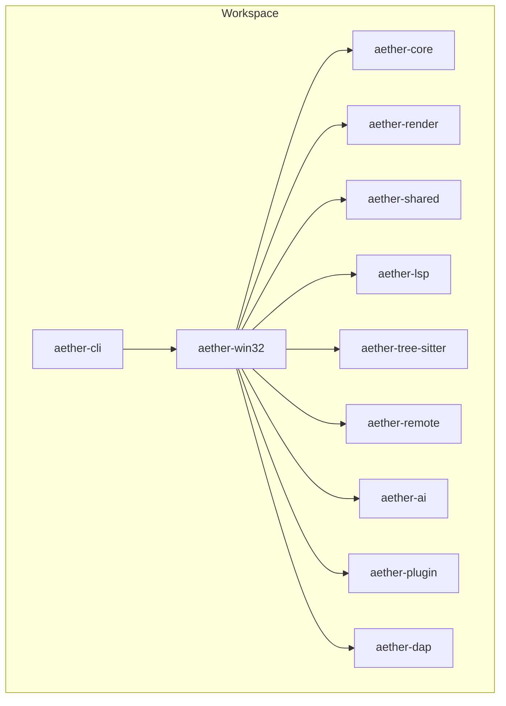
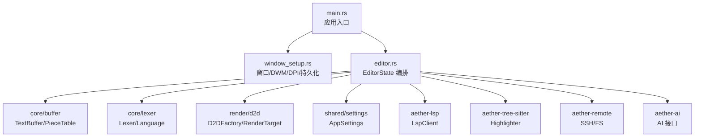
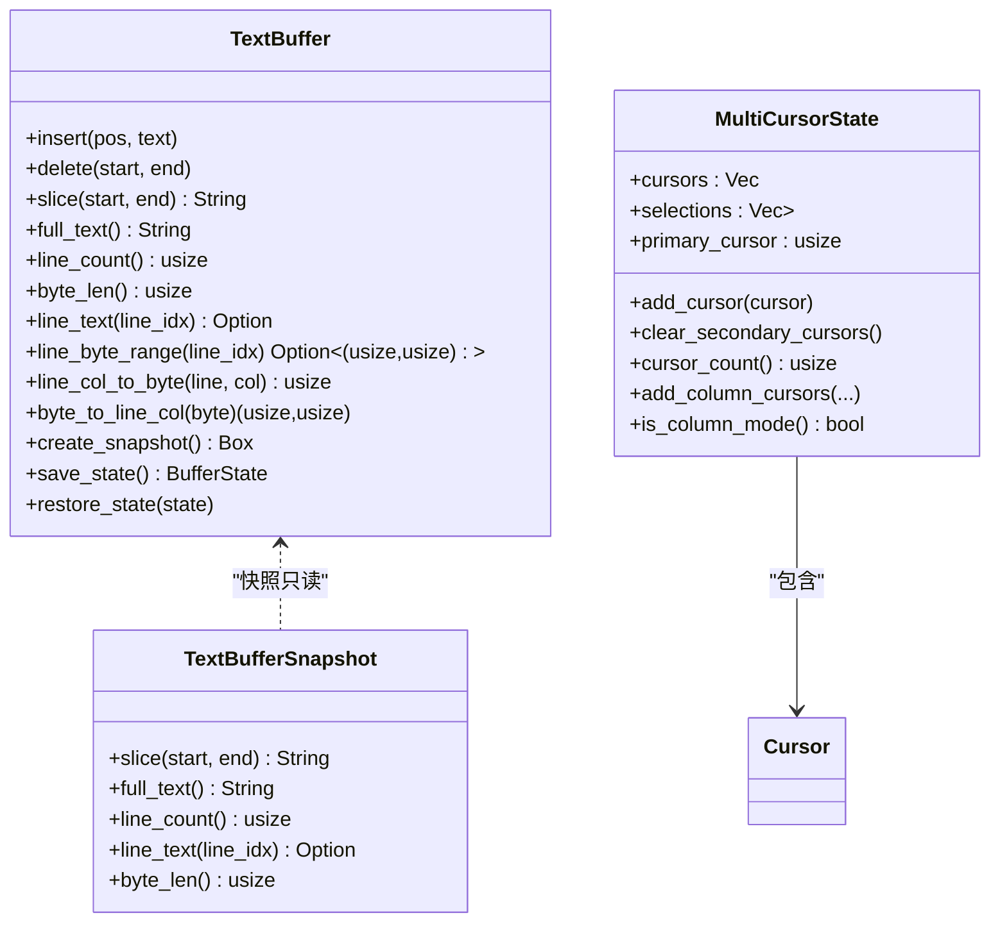
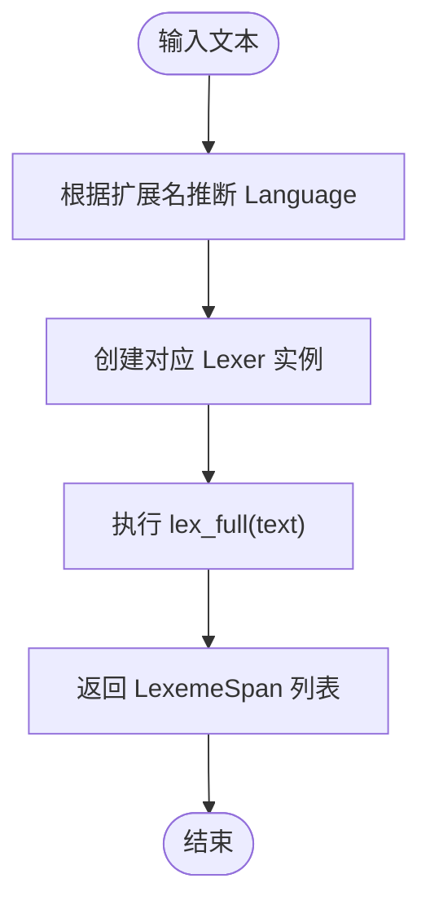
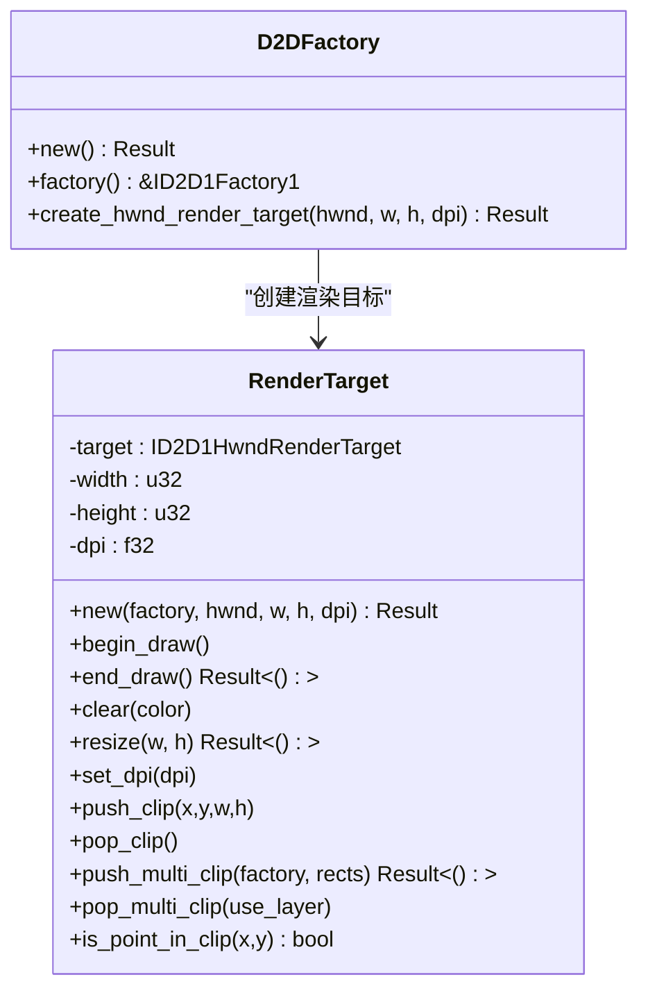
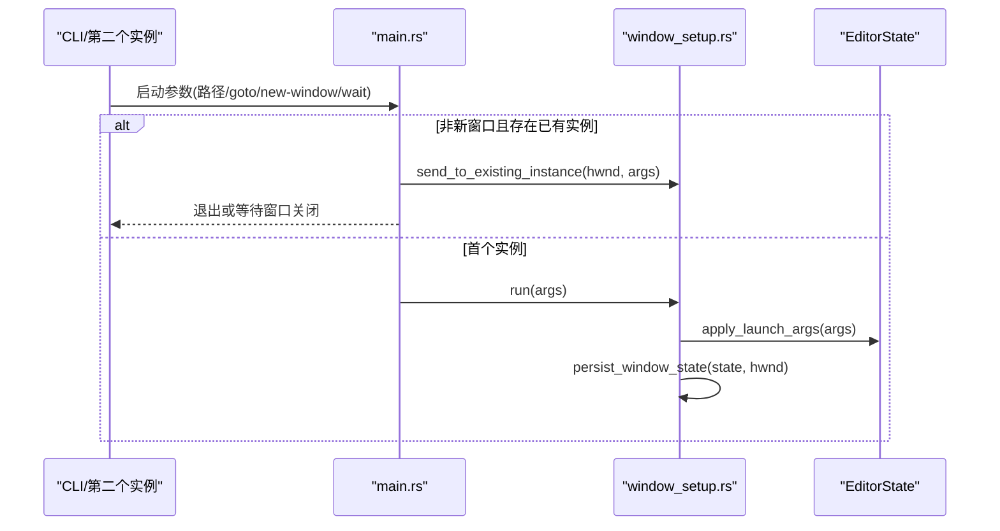
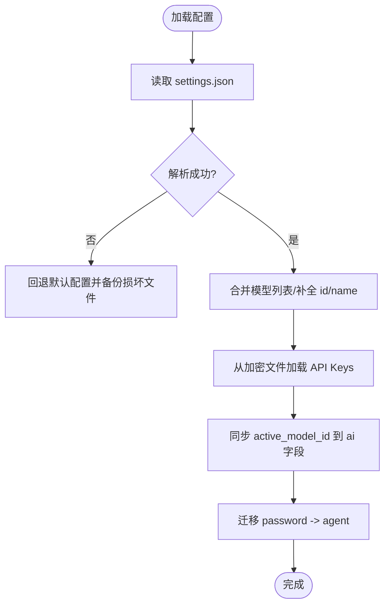
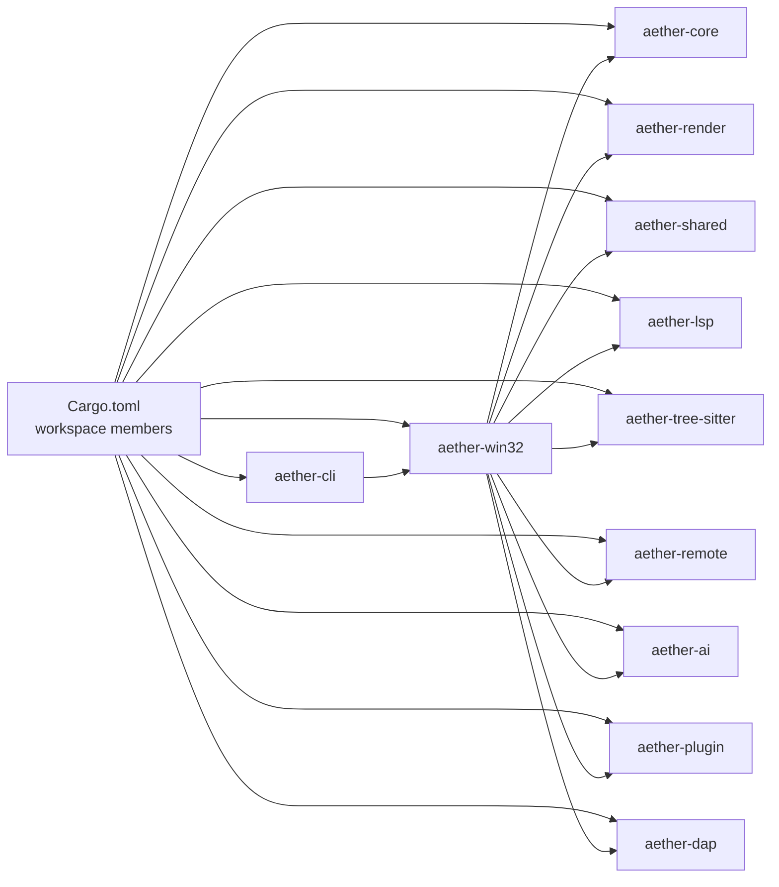

# 项目概述

<cite>
**本文引用的文件**   
- [README.md](file://README.md)
- [Cargo.toml](file://Cargo.toml)
- [crates/aether-win32/src/main.rs](file://crates/aether-win32/src/main.rs)
- [crates/aether-core/src/lib.rs](file://crates/aether-core/src/lib.rs)
- [crates/aether-core/src/buffer/mod.rs](file://crates/aether-core/src/buffer/mod.rs)
- [crates/aether-core/src/buffer/text_buffer.rs](file://crates/aether-core/src/buffer/text_buffer.rs)
- [crates/aether-core/src/lexer/mod.rs](file://crates/aether-core/src/lexer/mod.rs)
- [crates/aether-core/src/lexer/rust_lexer.rs](file://crates/aether-core/src/lexer/rust_lexer.rs)
- [crates/aether-render/src/lib.rs](file://crates/aether-render/src/lib.rs)
- [crates/aether-render/src/d2d/mod.rs](file://crates/aether-render/src/d2d/mod.rs)
- [crates/aether-render/src/d2d/factory.rs](file://crates/aether-render/src/d2d/factory.rs)
- [crates/aether-win32/src/window/window_setup.rs](file://crates/aether-win32/src/window/window_setup.rs)
- [crates/aether-shared/src/lib.rs](file://crates/aether-shared/src/lib.rs)
- [crates/aether-shared/src/settings.rs](file://crates/aether-shared/src/settings.rs)
- [crates/aether-win32/src/editor.rs](file://crates/aether-win32/src/editor.rs)
</cite>

## 目录
1. [简介](#简介)
2. [项目结构](#项目结构)
3. [核心组件](#核心组件)
4. [架构总览](#架构总览)
5. [详细组件分析](#详细组件分析)
6. [依赖关系分析](#依赖关系分析)
7. [性能考量](#性能考量)
8. [故障排查指南](#故障排查指南)
9. [结论](#结论)
10. [附录](#附录)

## 简介
Aether Studio（牧羊人编辑器）是一款面向 Windows 平台的现代化代码编辑器，采用 Rust + Win32 API 构建，基于 Direct2D/DirectWrite 自绘 UI，提供高性能、低延迟、可扩展的编辑与开发体验。项目通过 Cargo Workspace 组织为多个 Crate，将渲染、核心编辑逻辑、平台窗口层、LSP/DAP、远程开发、AI 集成等职责解耦，形成模块化、可测试、易维护的工程结构。

差异化优势：
- 原生 Windows 体验：Win32 窗口 + DWM 沉浸式深色模式、高 DPI、系统高对比度支持
- 自绘渲染管线：Direct2D/DirectWrite 主题、半透明背景、阴影、动画与脏矩形优化
- 高性能文本编辑：Piece Table 缓冲、多光标、撤销/重做历史栈、增量词法与语法高亮
- 模块化 Crate 架构：核心与平台解耦，便于扩展与测试
- 现代开发能力：LSP/DAP/Tree-sitter/插件系统基础框架、SSH 远程、终端面板、AI 助手

[本节不直接分析具体源文件]

## 项目结构
仓库采用 Cargo Workspace，按职责拆分为多个 Crate：
- aether-core：编辑器核心（文本缓冲、历史、词法分析器、工作区数据结构、搜索）
- aether-render：Direct2D/DirectWrite 渲染抽象、主题系统、画笔与文本格式缓存
- aether-win32：Windows 原生 UI 层（窗口、消息循环、菜单、布局、事件处理、应用入口）
- aether-shared：共享配置与持久化设置（UI/AI/最近项目/窗口状态/启动参数）
- aether-lsp：Language Server Protocol 客户端实现（同步、增量同步、语义 token）
- aether-dap：Debug Adapter Protocol 客户端基础实现
- aether-remote：SSH/Git/容器远程操作抽象
- aether-ai：AI 服务接口与请求处理
- aether-tree-sitter：Tree-sitter 语法解析、语言检测、主题映射与高亮
- aether-plugin：插件注册、权限与运行时
- aether-cli：命令行启动器，负责解析参数并拉起 GUI 主程序

图表来源
- [Cargo.toml:1-32](file://Cargo.toml#L1-L32)

章节来源
- [README.md:29-46](file://README.md#L29-L46)
- [Cargo.toml:1-32](file://Cargo.toml#L1-L32)

## 核心组件
- 文本缓冲区与多光标：基于 Piece Table 的高效插入/删除与不可变快照，支持多光标与列选择模式
- 词法分析器：跨语言统一 Token 类型与 Lexer trait，内置 C/Rust/Python/JS/JSON/TOML/HTML/Markdown 等语言分词
- 渲染引擎：Direct2D 工厂与渲染目标管理，支持硬件加速、DPI 更新、脏矩形裁剪与多矩形几何裁剪
- 窗口与消息：Win32 窗口创建、DWM 效果、DPI 感知、窗口状态持久化、单实例与参数传递
- 配置与持久化：AppSettings 统一管理 UI/AI/远程/自动保存等配置，API Key 使用 DPAPI 加密存储，原子写入 settings.json

章节来源
- [crates/aether-core/src/buffer/mod.rs:1-9](file://crates/aether-core/src/buffer/mod.rs#L1-L9)
- [crates/aether-core/src/buffer/text_buffer.rs:1-49](file://crates/aether-core/src/buffer/text_buffer.rs#L1-L49)
- [crates/aether-core/src/lexer/mod.rs:1-96](file://crates/aether-core/src/lexer/mod.rs#L1-L96)
- [crates/aether-render/src/d2d/factory.rs:14-126](file://crates/aether-render/src/d2d/factory.rs#L14-L126)
- [crates/aether-win32/src/window/window_setup.rs:17-86](file://crates/aether-win32/src/window/window_setup.rs#L17-L86)
- [crates/aether-shared/src/settings.rs:214-417](file://crates/aether-shared/src/settings.rs#L214-L417)

## 架构总览
整体架构围绕“平台 UI 层 + 核心编辑 + 渲染 + 工具链”展开：
- aether-win32 作为应用入口与 UI 编排中心，协调 EditorState 与各子系统
- aether-core 提供文本缓冲、词法分析、工作区数据模型
- aether-render 封装 Direct2D/DirectWrite 渲染细节，供 UI 层调用
- aether-shared 提供配置加载/保存与安全存储
- LSP/DAP/Tree-sitter/Remote/AI/Plugin 作为扩展能力被 UI 层组合使用

图表来源
- [crates/aether-win32/src/main.rs:1-26](file://crates/aether-win32/src/main.rs#L1-L26)
- [crates/aether-win32/src/window/window_setup.rs:17-86](file://crates/aether-win32/src/window/window_setup.rs#L17-L86)
- [crates/aether-win32/src/editor.rs:238-478](file://crates/aether-win32/src/editor.rs#L238-L478)
- [crates/aether-core/src/buffer/mod.rs:1-9](file://crates/aether-core/src/buffer/mod.rs#L1-L9)
- [crates/aether-core/src/lexer/mod.rs:1-96](file://crates/aether-core/src/lexer/mod.rs#L1-L96)
- [crates/aether-render/src/d2d/factory.rs:14-126](file://crates/aether-render/src/d2d/factory.rs#L14-L126)
- [crates/aether-shared/src/settings.rs:214-417](file://crates/aether-shared/src/settings.rs#L214-L417)

## 详细组件分析

### 文本缓冲区与多光标
- TextBuffer trait 定义统一的编辑接口（insert/delete/slice/full_text/line_* 转换等），以字节偏移为核心，避免字符索引带来的复杂度
- BufferState 轻量元数据快照用于 Undo/Redo；MultiCursorState 支持多光标与列选择模式，并提供安全钳位访问
- 模块导出集中在 buffer/mod.rs，上层仅依赖稳定接口

图表来源
- [crates/aether-core/src/buffer/text_buffer.rs:1-258](file://crates/aether-core/src/buffer/text_buffer.rs#L1-L258)
- [crates/aether-core/src/buffer/mod.rs:1-9](file://crates/aether-core/src/buffer/mod.rs#L1-L9)

章节来源
- [crates/aether-core/src/buffer/text_buffer.rs:1-258](file://crates/aether-core/src/buffer/text_buffer.rs#L1-L258)
- [crates/aether-core/src/buffer/mod.rs:1-9](file://crates/aether-core/src/buffer/mod.rs#L1-L9)

### 词法分析器与语言分发
- Lexer trait 与 TokenKind 统一跨语言词法单元；Language 枚举根据扩展名推断语言并创建对应 Lexer
- 静态分发 lex_full 避免动态分配开销；RustLexer 示例覆盖注释/属性/生命周期/数字/宏等复杂场景
- PlainTextLexer 作为未知或图片文件的回退

图表来源
- [crates/aether-core/src/lexer/mod.rs:98-182](file://crates/aether-core/src/lexer/mod.rs#L98-L182)
- [crates/aether-core/src/lexer/rust_lexer.rs:339-353](file://crates/aether-core/src/lexer/rust_lexer.rs#L339-L353)

章节来源
- [crates/aether-core/src/lexer/mod.rs:1-182](file://crates/aether-core/src/lexer/mod.rs#L1-L182)
- [crates/aether-core/src/lexer/rust_lexer.rs:1-353](file://crates/aether-core/src/lexer/rust_lexer.rs#L1-L353)

### 渲染引擎（Direct2D）
- D2DFactory 管理 ID2D1Factory1，创建 HWND 渲染目标并支持 DPI 更新
- RenderTarget 封装 BeginDraw/EndDraw/Clear/Resize/SetDpi，以及单矩形和多矩形裁剪（GeometryGroup + PushLayer）
- colors 模块提供默认深色主题颜色常量

图表来源
- [crates/aether-render/src/d2d/factory.rs:14-126](file://crates/aether-render/src/d2d/factory.rs#L14-L126)
- [crates/aether-render/src/d2d/factory.rs:143-271](file://crates/aether-render/src/d2d/factory.rs#L143-L271)

章节来源
- [crates/aether-render/src/d2d/factory.rs:14-271](file://crates/aether-render/src/d2d/factory.rs#L14-L271)
- [crates/aether-render/src/lib.rs:1-4](file://crates/aether-render/src/lib.rs#L1-L4)
- [crates/aether-render/src/d2d/mod.rs:1-5](file://crates/aether-render/src/d2d/mod.rs#L1-L5)

### 窗口与消息（Win32）
- main.rs 实现单实例控制、已有窗口复用与 --wait 等待机制
- window_setup.rs 提供 DPI 感知、DWM Acrylic/Mica 效果、窗口矩形恢复与持久化、WM_COPYDATA 参数接收与应用

图表来源
- [crates/aether-win32/src/main.rs:8-26](file://crates/aether-win32/src/main.rs#L8-L26)
- [crates/aether-win32/src/window/window_setup.rs:219-267](file://crates/aether-win32/src/window/window_setup.rs#L219-L267)
- [crates/aether-win32/src/window/window_setup.rs:180-218](file://crates/aether-win32/src/window/window_setup.rs#L180-L218)

章节来源
- [crates/aether-win32/src/main.rs:1-52](file://crates/aether-win32/src/main.rs#L1-L52)
- [crates/aether-win32/src/window/window_setup.rs:17-86](file://crates/aether-win32/src/window/window_setup.rs#L17-L86)
- [crates/aether-win32/src/window/window_setup.rs:180-267](file://crates/aether-win32/src/window/window_setup.rs#L180-L267)

### 配置与持久化（AppSettings）
- AppSettings 统一管理 AI/UI/远程/自动保存等配置，支持多模型与激活模型切换
- API Key 使用 DPAPI 加密单独存储，settings.json 不包含明文密钥
- 原子写入（临时文件 + fsync + rename），损坏备份与迁移策略

图表来源
- [crates/aether-shared/src/settings.rs:240-338](file://crates/aether-shared/src/settings.rs#L240-L338)
- [crates/aether-shared/src/settings.rs:340-417](file://crates/aether-shared/src/settings.rs#L340-L417)

章节来源
- [crates/aether-shared/src/settings.rs:214-417](file://crates/aether-shared/src/settings.rs#L214-L417)
- [crates/aether-shared/src/lib.rs:1-3](file://crates/aether-shared/src/lib.rs#L1-L3)

### 编辑器编排（EditorState）
- EditorState 集中管理 UI 状态、标签页、查找替换、侧边栏、底部面板、LSP/诊断、远程会话、AI 面板、脏矩形追踪、事件队列、内联补全等
- 通过 swap_tab_content 保证活动标签内容单一归属，减少状态同步错误
- 结合 aether-core 的 TextBuffer 与 aether-tree-sitter 的高亮器进行增量高亮

章节来源
- [crates/aether-win32/src/editor.rs:238-478](file://crates/aether-win32/src/editor.rs#L238-L478)

## 依赖关系分析
- 顶层 workspace 成员由 Cargo.toml 声明，resolver=2，发布配置启用 fat LTO、单 codegen unit、opt-level=3、panic=abort、strip=true
- aether-win32 依赖 aether-core、aether-render、aether-shared、aether-lsp、aether-tree-sitter、aether-remote、aether-ai、aether-plugin、aether-dap
- aether-cli 作为启动器，最终调用 aether-win32 的 run 函数

图表来源
- [Cargo.toml:1-32](file://Cargo.toml#L1-L32)

章节来源
- [Cargo.toml:1-32](file://Cargo.toml#L1-L32)

## 性能考量
- 文本编辑：Piece Table 在大量插入/删除时保持 O(1) 级别局部更新；不可变快照支持后台线程安全读取
- 词法分析：静态分发 lex_full 避免 Box 分配与动态分发开销；UTF-8 首字节快速推断字符长度
- 渲染优化：Direct2D 硬件加速、DPI 更新、脏矩形与多矩形几何裁剪减少重绘面积
- 构建优化：fat LTO、单 codegen unit、opt-level=3、strip=true 提升发布包性能与体积
- 异步 IO：文件夹扫描、SSH 连接、Git 克隆等通过 PostMessage 回传 UI 线程，避免阻塞

[本节为通用指导，不直接分析具体源文件]

## 故障排查指南
- 配置损坏：当 settings.json 解析失败时，会记录警告并备份原文件为 .json.corrupt，随后回退默认配置
- API Key 安全：确保 api_keys.enc 存在且可解密；若为空则删除该文件以避免无效残留
- 窗口状态：窗口位置/尺寸校验失败或显示器断开时会回退默认值；最大化状态优先恢复
- 单实例冲突：若无法找到已有窗口句柄，会回退继续启动；--wait 模式下会轮询等待窗口关闭

章节来源
- [crates/aether-shared/src/settings.rs:327-338](file://crates/aether-shared/src/settings.rs#L327-L338)
- [crates/aether-shared/src/settings.rs:394-417](file://crates/aether-shared/src/settings.rs#L394-L417)
- [crates/aether-win32/src/window/window_setup.rs:110-178](file://crates/aether-win32/src/window/window_setup.rs#L110-L178)
- [crates/aether-win32/src/main.rs:14-26](file://crates/aether-win32/src/main.rs#L14-L26)

## 结论
Aether Studio 以 Rust 的安全与性能为基础，结合 Win32 与 Direct2D 打造原生级 Windows 编辑器体验。通过模块化 Crate 架构与清晰的职责划分，项目在文本编辑、词法分析、渲染、配置持久化、远程开发与 AI 集成等方面具备良好扩展性与可维护性。未来将继续完善 LSP 生态、Tree-sitter 语法支持与插件市场，进一步提升开发者效率与体验。

[本节为总结性内容，不直接分析具体源文件]

## 附录
- 功能特性概览（来自 README）：原生 Windows 体验、自绘渲染引擎、文本编辑器核心、词法分析器、文件树与工作区、侧边栏与面板、AI 集成、远程开发、LSP/DAP/Tree-sitter/插件系统、终端、国际化输入法、命令行工具
- 常用快捷键与构建运行方式详见 README

章节来源
- [README.md:7-26](file://README.md#L7-L26)
- [README.md:49-88](file://README.md#L49-L88)
- [README.md:140-161](file://README.md#L140-L161)