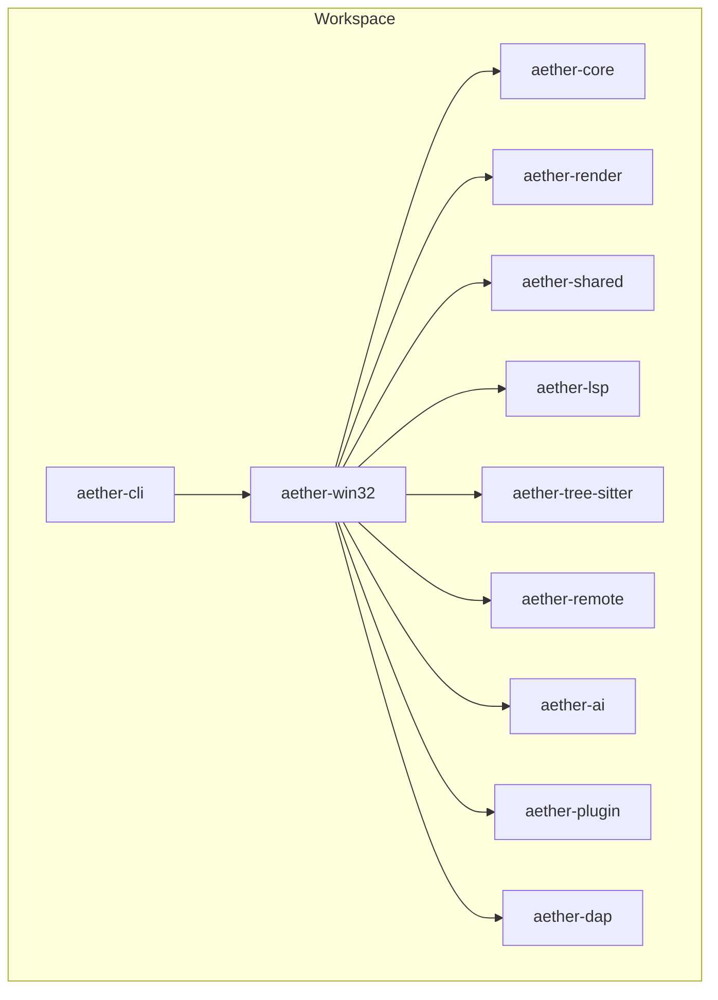

# Aether Studio（牧羊人编辑器）

> 一款基于 Rust + Win32 API 构建的现代化 Windows 原生代码编辑器，采用 Direct2D 自绘 UI，追求极致性能与原生体验。

---

## 项目简介

Aether Studio 是一款面向 Windows 平台的代码编辑器，核心设计理念是**原生体验 + 极致性能**：

- **原生 Windows 体验**：Win32 窗口 + DWM 沉浸式深色模式，支持高 DPI、DPI 缩放与系统高对比度模式
- **自绘渲染引擎**：基于 Direct2D / DirectWrite 的 2D 渲染管线，支持主题、半透明背景、阴影、动画与脏矩形优化
- **高性能文本编辑**：Piece Table 文本缓冲、多光标、选择区、撤销/重做历史栈、语法高亮、查找替换、自动缩进
- **模块化架构**：Cargo Workspace 多 Crate 拆分，核心逻辑与平台层解耦，便于测试与扩展

---

## 功能特性

| 模块 | 状态 | 说明 |
|---|---|---|
| 文本编辑器核心 | ✅ 稳定 | Piece Table 缓冲、多光标、撤销/重做、查找替换、自动缩进 |
| 自绘渲染引擎 | ✅ 稳定 | Direct2D/DirectWrite 主题渲染、脏矩形优化、动画支持 |
| 词法分析器 | ✅ 稳定 | C、Rust、JavaScript、Python、JSON、TOML、HTML、Markdown 等 |
| 文件树与工作区 | ✅ 稳定 | 异步扫描、Git 状态标记、最近项目、拖拽支持 |
| AI 助手面板 | ✅ 可用 | DeepSeek / Kimi 预设配置、代码解释、改写、内联建议 |
| 设置面板 | ✅ 可用 | AI 配置、主题、字体、UI 布局持久化 |
| LSP 客户端 | 🚧 基础 | 文档同步、语义 token、增量同步框架已具备 |
| DAP 调试 | 🚧 基础 | 类型、传输、会话、客户端基础实现 |
| Tree-sitter | 🚧 基础 | 语法解析、语言检测、TextMate 主题映射 |
| 终端面板 | 🚧 基础 | UI 与核心已打通，ConPTY 集成持续完善 |
| 远程开发 | 🚧 基础 | SSH 连接、远程文件系统抽象与 UI 入口 |
| 插件系统 | 🚧 基础 | 插件注册、权限与运行时接口 |
| 多窗口/多工作区 | ⏳ 规划中 | 远期目标 |

> 注：部分高级功能（完整 LSP 补全/诊断链路、插件市场、多窗口）仍处于持续完善阶段，当前版本优先保证编辑核心与渲染管线的稳定性。

---

## 项目架构

仓库采用 Cargo Workspace 组织，按职责拆分为多个 Crate：

| Crate | 职责 | 状态 |
|---|---|---|
| `aether-core` | 编辑器核心：Piece Table 文本缓冲、历史栈、词法分析器、文件树、搜索 | 核心稳定 |
| `aether-render` | Direct2D / DirectWrite 渲染抽象、主题系统、画笔与文本格式缓存 | 核心稳定 |
| `aether-win32` | Windows 原生 UI 层：窗口、消息循环、菜单、布局、事件处理、应用入口 | 核心稳定 |
| `aether-shared` | 共享配置与持久化设置（UI、AI、最近项目、窗口状态、启动参数） | 核心稳定 |
| `aether-lsp` | Language Server Protocol 客户端（同步、增量同步、语义 token） | 持续完善 |
| `aether-dap` | Debug Adapter Protocol 客户端基础实现 | 持续完善 |
| `aether-remote` | SSH / Git / 容器远程操作抽象 | 持续完善 |
| `aether-ai` | AI 服务接口与请求处理 | 持续完善 |
| `aether-tree-sitter` | Tree-sitter 语法解析、语言检测、主题映射与高亮 | 持续完善 |
| `aether-plugin` | 插件注册、权限与运行时 | 持续完善 |
| `aether-cli` | 命令行启动器，解析参数并拉起 GUI 主程序 | 稳定可用 |



---

## 构建与运行

### 环境要求

- Windows 10 1809 或更高版本（推荐 Windows 11）
- Rust 1.70 或更高版本
- Visual Studio 2022（或已安装 Windows SDK 的构建工具）

### 构建命令

```powershell
# 调试构建
cargo build -p aether-win32 --bin aether-app

# 发布构建（启用 fat LTO、单 codegen unit、strip）
cargo build -p aether-win32 --bin aether-app --release

# 命令行工具
cargo build -p aether-cli --bin aether
```

### 运行

```powershell
# 直接启动 GUI
cargo run -p aether-win32 --bin aether-app

# 通过 CLI 打开文件
cargo run -p aether-cli --bin aether -- path/to/file.rs

# 定位到指定行列
cargo run -p aether-cli --bin aether -- file.txt:10:5
```

编译产物路径：

```
target\x86_64-pc-windows-msvc\debug\aether-app.exe
target\x86_64-pc-windows-msvc\release\aether-app.exe
```

---

## 测试与质量

```powershell
# 全 Workspace 单元测试（推荐关闭增量编译以避免 ICE）
$env:CARGO_INCREMENTAL = '0'
cargo test --workspace --no-fail-fast

# 静态检查
cargo clippy --workspace --all-targets -- -D warnings

# 格式化检查
cargo fmt --all -- --check

# GUI 冒烟测试（需 release 构建产物）
cargo build --release -p aether-win32
python tests/gui_smoke.py

# 覆盖率报告（需 llvm-tools-preview）
powershell -File tests/run_final_coverage.ps1
powershell -File tests/generate_coverage_report.ps1
```

### 最新测试快照（2026-07-06）

| 指标 | 结果 |
|---|---|
| 单元测试 | **793 个测试全部通过** |
| 代码覆盖率 | Regions 47.82% / Lines 43.70% / Functions 61.66% |
| Clippy 静态检查 | 通过（`-D warnings`） |
| Release 构建 | 成功 |
| GUI Smoke 测试 | 成功启动、点击、截图、关闭，内存约 67MB |
| Lexer 性能基准 | 约 500–650 MiB/s |

> 覆盖率受大量 Win32 / Direct2D GUI 渲染代码、窗口过程、真实子进程与网络交互代码拖累，可单元测试的业务逻辑模块覆盖率普遍达到 **80–100%**。

---

## 常用快捷键

| 快捷键 | 功能 |
|---|---|
| `Ctrl + N` | 新建文件 |
| `Ctrl + O` | 打开文件 |
| `Ctrl + K` | 打开文件夹 |
| `Ctrl + S` | 保存 |
| `Ctrl + Shift + S` | 另存为 |
| `Ctrl + Z` | 撤销 |
| `Ctrl + Y` / `Ctrl + Shift + Z` | 重做 |
| `Ctrl + F` | 查找 |
| `Ctrl + H` | 替换 |
| `Ctrl + A` | 全选 |
| `Ctrl + Shift + P` | 命令面板 |
| `Ctrl + Shift + F` | 全局搜索 |
| `Ctrl + \`` | 切换终端 |
| `Ctrl + +` | 放大字体 |
| `Ctrl + -` | 缩小字体 |
| `F10` / `Alt` | 菜单栏键盘导航 |
| `Ctrl + 鼠标滚轮` | 横向滚动 |

---

## 设计原则

1. **性能优先**：UI 线程不阻塞，文件 IO 与远程操作异步化；渲染层使用缓存与脏矩形减少重绘
2. **原生体验**：Windows 原生窗口、系统菜单、输入法、DPI 感知、高对比度支持
3. **模块化**：通过 Workspace 与 Crate 拆分，核心逻辑与平台层解耦，便于测试与扩展
4. **可维护**：复杂函数拆分、借用检查合规、避免 unsafe 滥用、完善的单元测试

---

## 路线图

- [x] Piece Table 文本缓冲与撤销/重做历史
- [x] Direct2D 自绘渲染与主题系统
- [x] 多语言词法分析器与增量高亮
- [x] AI 接口、设置面板与内联建议基础
- [x] LSP / DAP / Tree-sitter / 插件系统基础框架
- [x] 命令行启动器 `aether`
- [x] 文件树性能优化（尾指针懒加载）
- [x] 欢迎页与空白页 Logo 渲染
- [ ] 完善 LSP 语言服务器集成（补全、跳转、诊断）
- [ ] 扩展 Tree-sitter 语法解析支持
- [ ] 多窗口与多工作区支持
- [ ] 插件市场与运行时扩展
- [ ] 跨平台渲染抽象（远期）

---

## 开发指南

请阅读 [CONTRIBUTING.md](CONTRIBUTING.md)，了解分支规范、提交前检查清单、CI 失败处理、合并冲突处理以及外部贡献者 Fork 流程。

快速检查：

```powershell
cargo fmt --all -- --check
cargo check -p aether-win32
cargo test --workspace --lib --no-fail-fast
```

---

## 文档

项目内置详细的 Repowiki 文档系统（位于 `.qoder/repowiki/`），涵盖：

- **项目概述**：架构总览、核心组件、依赖关系、性能考量
- **API 参考**：公共接口、命令行接口、插件开发接口、配置接口
- **UI 系统**：主题系统、渲染管线、窗口管理、输入事件处理
- **架构设计**：整体架构、文本缓冲区系统、词法分析器框架、渲染引擎架构、语言服务集成
- **核心组件**：工作区管理、搜索系统、文本缓冲区、渲染引擎
- **性能优化**：SIMD 算法、内存管理、异步 IO、渲染优化
- **扩展系统**：AI 助手集成、插件架构、远程开发支持
- **语言支持**：LSP 客户端、DAP 调试、Tree-sitter 集成
- **测试策略**：单元测试、覆盖率、GUI 冒烟测试、性能基准

---

## 许可证

本项目采用 MIT 许可证。详见 [LICENSE](LICENSE) 文件。

---

## 仓库

- GitHub：[https://github.com/songdiyang/AetherStudio](https://github.com/songdiyang/AetherStudio)
