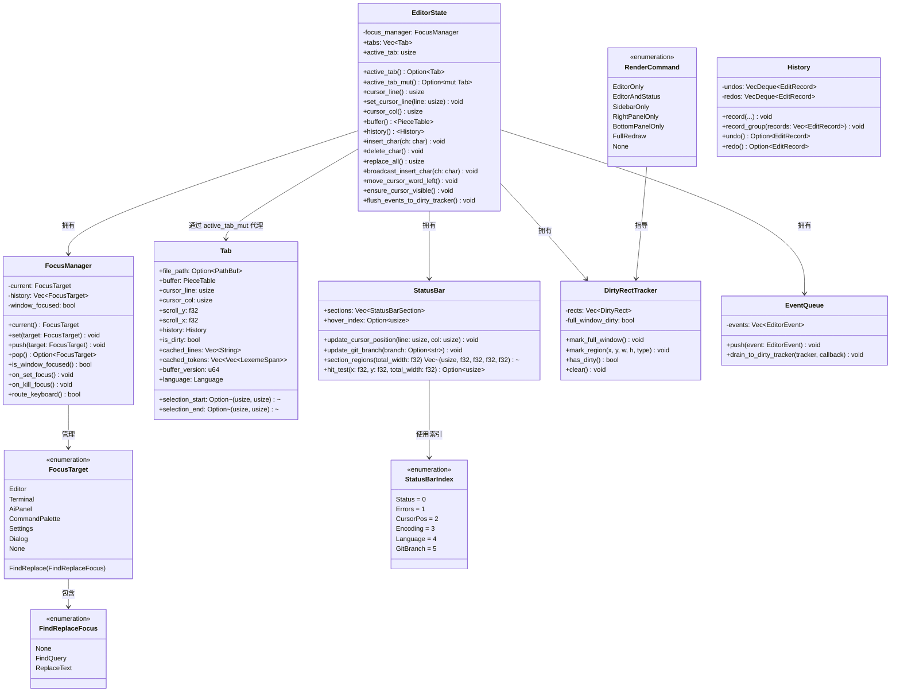
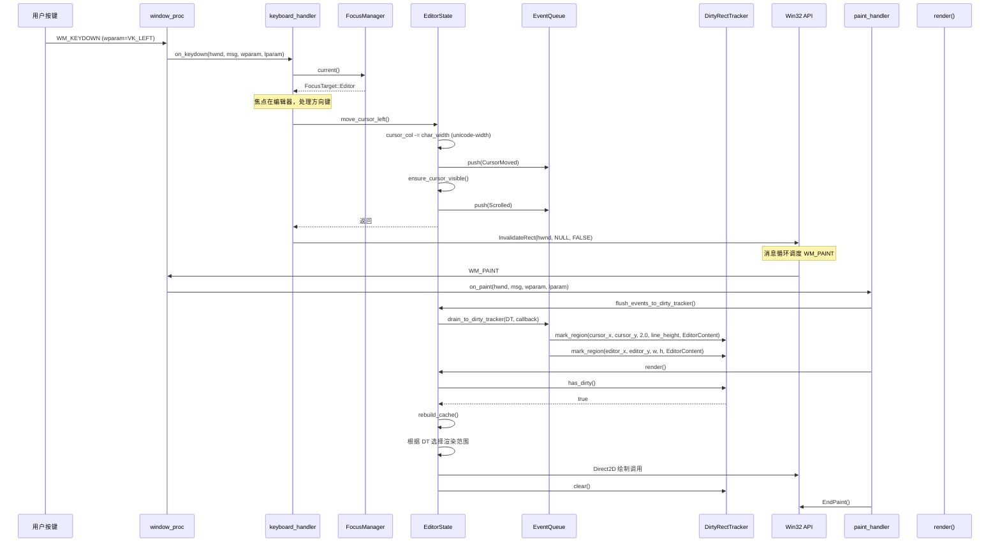
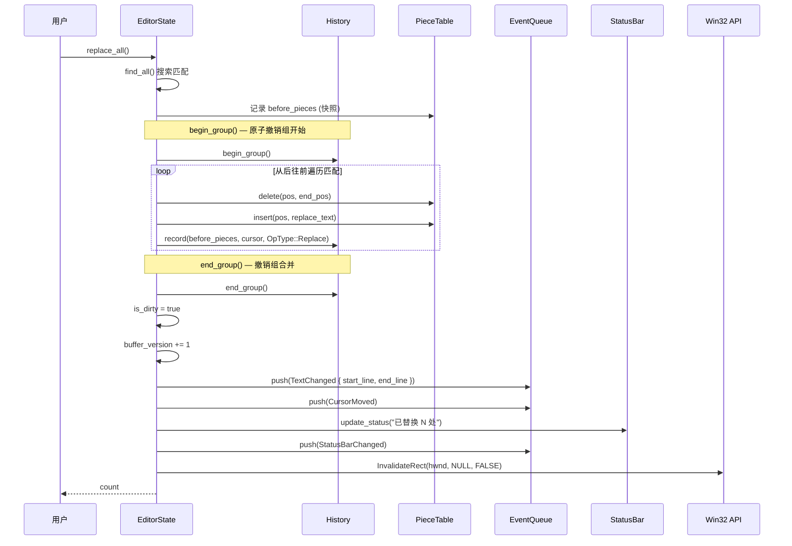
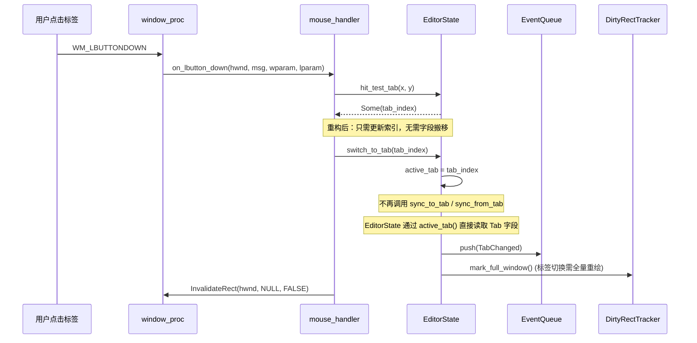
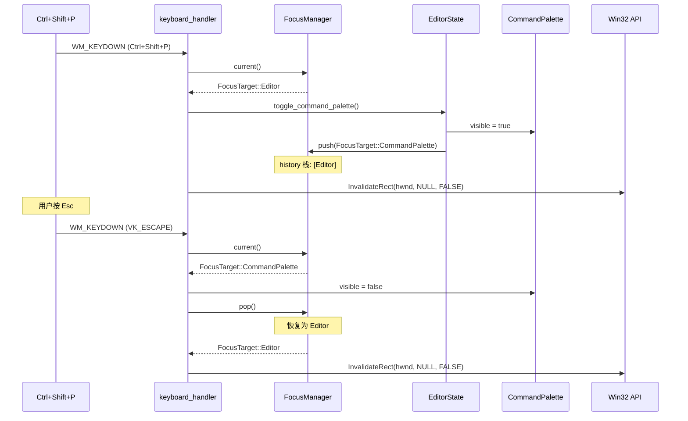
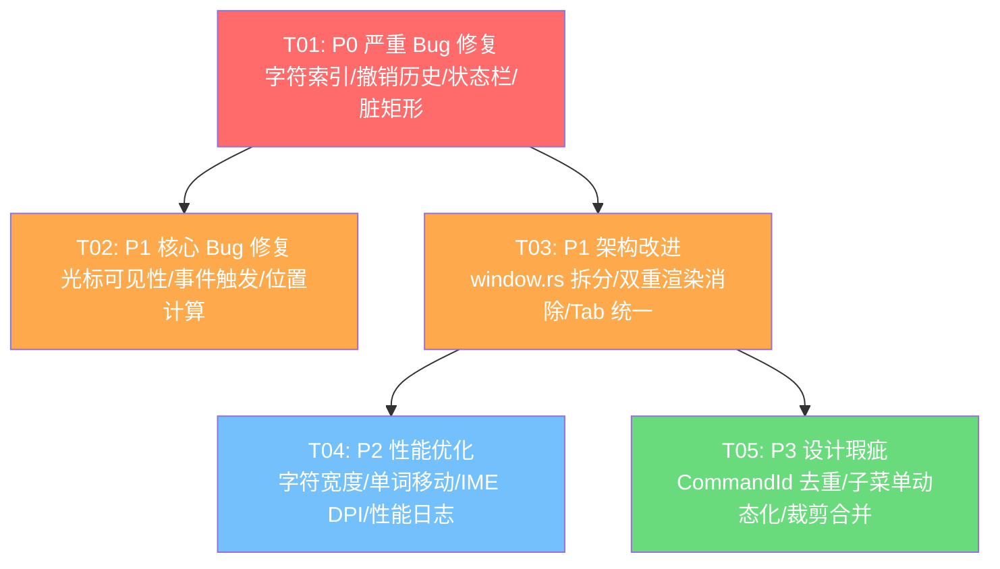

# Aether Studio UX 优化 — 系统架构设计 + 任务分解

> 架构师：高见远（Gao）  
> 日期：2025-07-07  
> 项目：牧羊人编辑器（Aether Studio）  
> 技术栈：Rust + Win32 API + Direct2D 硬件加速  
> Cargo Workspace：11 crate，106 源文件

---

## 目录

- [Part A: 系统设计](#part-a-系统设计)
  - [1. 实现方案 + 框架选型](#1-实现方案--框架选型)
  - [2. 文件列表及相对路径](#2-文件列表及相对路径)
  - [3. 数据结构和接口设计](#3-数据结构和接口设计)
  - [4. 程序调用流程（关键时序图）](#4-程序调用流程关键时序图)
  - [5. 待明确事项](#5-待明确事项)
- [Part B: 任务分解](#part-b-任务分解)
  - [6. 依赖包列表](#6-依赖包列表)
  - [7. 任务列表（有序、含依赖关系）](#7-任务列表有序含依赖关系)
  - [8. 共享知识（跨文件约定）](#8-共享知识跨文件约定)
  - [9. 任务依赖图](#9-任务依赖图)

---

# Part A: 系统设计

## 1. 实现方案 + 框架选型

### 1.1 核心技术挑战分析

经过对代码库的深入审查（editor.rs 5622 行、window.rs 3999 行、render.rs 10405 行），识别出以下核心技术挑战：

| 挑战领域 | 问题描述 | 影响范围 |
|---------|---------|---------|
| **字节/字符索引混淆** | `cursor_col` 存储字节偏移，但多处代码将其当字符索引使用，非 ASCII 文本（中文/日文/emoji）导致崩溃或光标错位 | editor.rs 全文 |
| **撤销历史遗漏** | `replace_all`、多光标广播操作绕过 `history.record()`，用户无法撤销这些操作 | 数据丢失风险 |
| **焦点状态分散** | `find_focus: FindReplaceFocus`、`composition: Option<String>` 等焦点相关状态散落在 EditorState 各处，window_proc 未处理 WM_SETFOCUS/WM_KILLFOCUS | 输入路由不可靠 |
| **Tab/EditorState 双重存储** | EditorState 直接持有 buffer/cursor/history 等字段，Tab 也持有相同字段，`sync_to_tab`/`sync_from_tab` 手动逐字段拷贝，极易遗漏 | 状态不一致 |
| **脏矩形架空** | `mark_full_window()` 在 5+ 处条件分支被调用，`infer_from_state` 无变化时默认返回 `FullRedraw`，局部重绘形同虚设 | 性能浪费 |
| **双重渲染** | 每个事件处理分支末尾调用 `state.borrow_mut().render()`，WM_PAINT 也调用 `render()`，导致同一帧可能渲染两次 | 性能浪费 |
| **window.rs 巨型文件** | 3999 行单文件，函数名被宏拆散为 `on_l_b_u_t_t_o_n_d_o_w_n` 等不可读名称 | 可维护性极差 |

### 1.2 框架与依赖选型

#### 新增依赖

| Crate | 版本 | 用途 | 引入 Crate |
|-------|------|------|-----------|
| `unicode-width` | `^0.2` | 精确计算 Unicode 字符显示宽度（全角/半角/组合字符） | `aether-render` |
| `unicode-segmentation` | `^1.11` | 用户感知字符边界（grapheme cluster）分割，用于单词移动 | `aether-core` |

#### 不引入的依赖及理由

- **不引入 `icu`**：体积过大（~5MB），`unicode-width` + `unicode-segmentation` 已覆盖需求
- **不引入 `ropey`**：项目已有自研 PieceTable，替换成本远大于收益
- **不引入 `tao`/`winit`**：项目深度依赖 Win32 API（DWM、Direct2D），窗口抽象层无收益

### 1.3 关键设计决策

#### 决策 1：FocusManager 枚举状态机（Q1 用户确认）

**问题**：当前焦点状态分散为 `find_focus: FindReplaceFocus`、`composition: Option<String>`、`command_palette.visible: bool` 等多个独立布尔/枚举，且 window_proc 未处理 `WM_SETFOCUS`/`WM_KILLFOCUS`。

**方案**：引入统一焦点状态机：

```rust
/// 统一焦点管理器 — 所有面板的焦点状态归一
#[derive(Clone, Copy, Debug, PartialEq, Eq)]
pub enum FocusTarget {
    /// 编辑器文本区域
    Editor,
    /// 终端面板
    Terminal,
    /// AI 助手面板
    AiPanel,
    /// 查找替换面板
    FindReplace(FindReplaceFocus),
    /// 命令面板
    CommandPalette,
    /// 设置面板
    Settings,
    /// SSH 对话框
    Dialog,
    /// 无焦点（窗口未激活）
    None,
}

pub struct FocusManager {
    current: FocusTarget,
    /// 焦点历史栈，用于 Esc 返回上一个焦点
    history: Vec<FocusTarget>,
    /// 窗口是否拥有系统焦点
    window_focused: bool,
}
```

**焦点路由规则**：
1. `WM_SETFOCUS` → `window_focused = true`，恢复 `current` 焦点
2. `WM_KILLFOCUS` → `window_focused = false`，保存当前焦点
3. 键盘事件先查询 `FocusManager::current()`，路由到对应面板
4. 面板切换（如打开命令面板）时调用 `FocusManager::push()` 压栈
5. `Esc` 键调用 `FocusManager::pop()` 恢复上一个焦点

#### 决策 2：脏矩形分阶段交付（Q2 用户确认）

**第一阶段（本期实施）**：
- 修改 `infer_from_state` 无变化时返回 `None` 而非 `FullRedraw`
- 减少 `mark_full_window()` 调用点，改用精确区域标记
- render() 入口检查 `dirty_tracker.has_dirty()`，无脏区域时跳过渲染

**第二阶段（后续迭代）**：
- 多脏矩形独立裁剪
- 裁剪区域拆分与合并优化

#### 决策 3：Tab/EditorState 状态归属单一化（Q4 用户确认）

**问题**：EditorState 直接持有 `buffer`、`cursor_line`、`cursor_col`、`history` 等 ~20 个编辑字段，Tab 也持有完全相同的字段。`sync_to_tab`/`sync_from_tab` 逐字段 `mem::replace`/拷贝，每次切换标签页涉及大量数据搬移。

**方案**：EditorState 不再直接持有编辑字段，改为通过 `active_tab()` / `active_tab_mut()` 代理访问：

```rust
impl EditorState {
    /// 获取当前活动标签页的只读引用
    pub fn active_tab(&self) -> Option<&Tab> {
        self.tabs.get(self.active_tab)
    }

    /// 获取当前活动标签页的可变引用
    pub fn active_tab_mut(&mut self) -> Option<&mut Tab> {
        self.tabs.get_mut(self.active_tab)
    }

    // 代理方法 — 保持调用方代码不变
    pub fn cursor_line(&self) -> usize {
        self.active_tab().map(|t| t.cursor_line).unwrap_or(0)
    }

    pub fn set_cursor_line(&mut self, line: usize) {
        if let Some(tab) = self.active_tab_mut() {
            tab.cursor_line = line;
        }
    }
    // ... 对 buffer, cursor_col, history, selection 等同理
}
```

**迁移策略**：由于 EditorState 有 ~200 个字段，其中 ~20 个属于编辑状态，采用**代理方法 + 逐步迁移**策略：
1. 先在 EditorState 上添加代理方法
2. 将 `self.cursor_line` 的读取改为 `self.cursor_line()`
3. 将 `self.cursor_line = x` 的写入改为 `self.set_cursor_line(x)`
4. 最终删除 EditorState 上的重复字段和 `sync_to_tab`/`sync_from_tab`

#### 决策 4：window.rs 保守拆分（Q3 用户确认）

将 3999 行的 window.rs 按消息类型拆为 4 个文件：

| 新文件 | 职责 | 预估行数 |
|-------|------|---------|
| `window_setup.rs` | 窗口创建、注册、销毁、DPI、NC 相关 | ~400 |
| `mouse_handler.rs` | WM_LBUTTONDOWN/UP/MOVE/DBLCLK/WHEEL 等 | ~800 |
| `keyboard_handler.rs` | WM_KEYDOWN/CHAR/IME 系列 | ~1000 |
| `paint_handler.rs` | WM_PAINT、WM_ERASEBKGND、render 调度 | ~300 |
| `window.rs`（保留） | window_proc 分发 + 共享状态/辅助函数 | ~500 |

**函数命名修复**：将 `on_l_b_u_t_t_o_w_n_d_o_w_n` 恢复为 `on_lbutton_down`。这些名字是被某个工具/宏拆散的，恢复后可读性大幅提升。

#### 决策 5：渲染流程重构

**当前流程**（双重渲染）：
```
事件处理 → state.borrow_mut().render() → [直接渲染]
WM_PAINT → state.borrow_mut().render() → [再次渲染]
```

**目标流程**（事件驱动 + WM_PAINT 统一）：
```
事件处理 → 标记脏区域 + InvalidateRect(hwnd, None, FALSE)
WM_PAINT → render() → [唯一渲染入口]
```

**关键改动**：
1. 所有事件处理分支末尾的 `state.borrow_mut().render()` 替换为 `invalidate_window(hwnd)`
2. `invalidate_window()` 调用 `InvalidateRect(hwnd, None, FALSE)` 触发 WM_PAINT
3. `on_paint()` 作为唯一渲染入口，调用 `render()`
4. `render()` 入口增加 `if !self.dirty_tracker.has_dirty() { return; }` 守卫

#### 决策 6：StatusBar 索引安全化

**问题**：`get_mut(5)`、`get_mut(2)` 等魔法索引，且 `section_regions()` 的 `.rev()` 导致 hit_test 返回的索引与 sections 原始索引不一致。

**方案**：引入具名常量枚举 + 修复 region 顺序：

```rust
/// 状态栏区域索引 — 替代魔法数字
#[repr(usize)]
#[derive(Clone, Copy, Debug, PartialEq, Eq)]
pub enum StatusBarIndex {
    Status = 0,
    Errors = 1,
    CursorPos = 2,
    Encoding = 3,
    Language = 4,
    GitBranch = 5,
}

impl StatusBar {
    pub fn update_cursor_position(&mut self, line: usize, col: usize) {
        if let Some(section) = self.sections.get_mut(StatusBarIndex::CursorPos as usize) {
            section.label = format!("Ln {}, Col {}", line + 1, col + 1);
        }
    }
    // ... 其他 update 方法同理
}
```

`section_regions()` 修复：右侧区域不再 `.rev()`，而是按原始索引顺序生成，但 x 坐标从右向左计算：

```rust
pub fn section_regions(&self, total_width: f32) -> Vec<(usize, f32, f32, f32, f32)> {
    let mut regions = Vec::with_capacity(self.sections.len());
    let mut left_x = 10.0f32;
    let mut right_x = total_width - 10.0f32;

    for (i, section) in self.sections.iter().enumerate() {
        if i < 3 {
            // 左侧区域
            regions.push((i, left_x, 0.0, section.width, 22.0));
            left_x += section.width + 10.0;
        } else {
            // 右侧区域 — 从右向左排列，但索引保持原始顺序
            right_x -= section.width;
            regions.push((i, right_x, 0.0, section.width, 22.0));
            right_x -= 10.0;
        }
    }
    regions
}
```

---

## 2. 文件列表及相对路径

### 2.1 新建文件

| 文件路径 | 说明 |
|---------|------|
| `crates/aether-win32/src/focus_manager.rs` | **[新建]** FocusManager 枚举状态机，统一管理所有面板焦点 |
| `crates/aether-win32/src/mouse_handler.rs` | **[新建]** 从 window.rs 拆分：鼠标消息处理（WM_LBUTTONDOWN/UP/MOVE/DBLCLK/WHEEL 等） |
| `crates/aether-win32/src/keyboard_handler.rs` | **[新建]** 从 window.rs 拆分：键盘消息处理（WM_KEYDOWN/CHAR/IME 系列） |
| `crates/aether-win32/src/paint_handler.rs` | **[新建]** 从 window.rs 拆分：WM_PAINT/WM_ERASEBKGND 处理 + render 调度 |
| `crates/aether-win32/src/window_setup.rs` | **[新建]** 从 window.rs 拆分：窗口创建/注册/销毁/DPI/NC 相关 |

### 2.2 修改文件

#### aether-win32 crate

| 文件路径 | 说明 |
|---------|------|
| `crates/aether-win32/src/editor.rs` | **[修改]** 核心编辑逻辑修复：P0-01~06、P1-02~05、Tab/EditorState 代理方法、多光标 history、delete_char emit_edit_events |
| `crates/aether-win32/src/window.rs` | **[修改]** window_proc 分发重构、WM_SETFOCUS/WM_KILLFOCUS 处理、函数名恢复、移除直接 render() 调用改为 invalidate |
| `crates/aether-win32/src/status_bar.rs` | **[修改]** StatusBarIndex 枚举、section_regions() 修复、魔法索引消除 |
| `crates/aether-win32/src/render.rs` | **[修改]** render() 入口脏区域守卫、flush_events_to_dirty_tracker 字符宽度修正、性能日志 |
| `crates/aether-win32/src/dirty_rect.rs` | **[修改]** infer_from_state 返回 None、RenderCommand 增加 None 变体 |
| `crates/aether-win32/src/events.rs` | **[修改]** 增加 UndoRedo 事件类型 |
| `crates/aether-win32/src/tabs.rs` | **[修改]** Tab 结构体作为唯一编辑状态源、移除冗余字段 |
| `crates/aether-win32/src/lib.rs` | **[修改]** 注册新模块（focus_manager、mouse_handler、keyboard_handler、paint_handler、window_setup） |
| `crates/aether-win32/src/ime.rs` | **[修改]** IME DPI 自适应、接入 FocusManager |
| `crates/aether-win32/src/layout.rs` | **[修改]** DPI 缩放修正 |
| `crates/aether-win32/src/hit_test.rs` | **[修改]** cfg 门控优化 |
| `crates/aether-win32/src/menu_bar.rs` | **[修改]** CommandId 去重、子菜单动态化 |
| `crates/aether-win32/Cargo.toml` | **[修改]** 添加 unicode-width 间接依赖（通过 aether-render） |

#### aether-core crate

| 文件路径 | 说明 |
|---------|------|
| `crates/aether-core/src/buffer/mod.rs` | **[修改]** 添加 char_width 辅助方法（委托 aether-render） |
| `crates/aether-core/src/buffer/history.rs` | **[修改]** OpType 增加 ReplaceAll 变体、record_group 批量记录方法 |

#### aether-render crate

| 文件路径 | 说明 |
|---------|------|
| `crates/aether-render/Cargo.toml` | **[修改]** 添加 unicode-width 依赖 |
| `crates/aether-render/src/d2d/text.rs` | **[修改]** char_width 改用 unicode-width 精确计算 |
| `crates/aether-render/src/theme.rs` | **[修改]** 主题重复代码提取为宏/函数 |

---

## 3. 数据结构和接口设计

### 3.1 类图



### 3.2 关键数据结构详解

#### 3.2.1 FocusManager 完整定义

```rust
// crates/aether-win32/src/focus_manager.rs

/// 查找替换面板内部焦点
#[derive(Clone, Copy, Debug, PartialEq, Eq)]
pub enum FindReplaceFocus {
    None,
    FindQuery,
    ReplaceText,
}

/// 统一焦点目标
#[derive(Clone, Copy, Debug, PartialEq, Eq)]
pub enum FocusTarget {
    Editor,
    Terminal,
    AiPanel,
    FindReplace(FindReplaceFocus),
    CommandPalette,
    Settings,
    Dialog,
    None,
}

/// 焦点管理器
pub struct FocusManager {
    current: FocusTarget,
    history: Vec<FocusTarget>,
    window_focused: bool,
}

impl FocusManager {
    pub fn new() -> Self {
        Self {
            current: FocusTarget::Editor,
            history: Vec::with_capacity(8),
            window_focused: true,
        }
    }

    /// 获取当前焦点目标
    pub fn current(&self) -> FocusTarget {
        if !self.window_focused {
            FocusTarget::None
        } else {
            self.current
        }
    }

    /// 设置当前焦点（不压栈）
    pub fn set(&mut self, target: FocusTarget) {
        self.current = target;
    }

    /// 压入新焦点（保存上一个）
    pub fn push(&mut self, target: FocusTarget) {
        self.history.push(self.current);
        self.current = target;
    }

    /// 弹出焦点（恢复上一个）
    pub fn pop(&mut self) -> Option<FocusTarget> {
        if let Some(prev) = self.history.pop() {
            self.current = prev;
            Some(self.current)
        } else {
            self.current = FocusTarget::Editor;
            None
        }
    }

    /// WM_SETFOCUS 处理
    pub fn on_set_focus(&mut self) {
        self.window_focused = true;
    }

    /// WM_KILLFOCUS 处理
    pub fn on_kill_focus(&mut self) {
        self.window_focused = false;
    }

    /// 键盘事件路由：返回 true 表示已处理，false 表示未处理
    pub fn route_keyboard(&self, _wparam: u32, _lparam: isize) -> bool {
        match self.current() {
            FocusTarget::Editor => false,       // 交给编辑器默认处理
            FocusTarget::Terminal => true,      // 终端拦截
            FocusTarget::AiPanel => true,       // AI 面板拦截
            FocusTarget::CommandPalette => true, // 命令面板拦截
            FocusTarget::FindReplace(_) => false, // 查找面板需特殊处理
            FocusTarget::Settings => true,
            FocusTarget::Dialog => true,
            FocusTarget::None => false,
        }
    }
}
```

#### 3.2.2 EditorState 代理方法（Tab/EditorState 统一）

```rust
// crates/aether-win32/src/editor.rs — 新增代理方法

impl EditorState {
    /// 获取当前活动标签页的只读引用
    #[inline]
    pub fn active_tab(&self) -> Option<&Tab> {
        self.tabs.get(self.active_tab)
    }

    /// 获取当前活动标签页的可变引用
    #[inline]
    pub fn active_tab_mut(&mut self) -> Option<&mut Tab> {
        self.tabs.get_mut(self.active_tab)
    }

    // ===== 代理方法：读取 =====
    
    #[inline]
    pub fn cursor_line(&self) -> usize {
        self.active_tab().map(|t| t.cursor_line).unwrap_or(0)
    }

    #[inline]
    pub fn cursor_col(&self) -> usize {
        self.active_tab().map(|t| t.cursor_col).unwrap_or(0)
    }

    #[inline]
    pub fn buffer(&self) -> &PieceTable {
        // fallback: 返回空 PieceTable 的静态引用（不理想，但过渡期需要）
        self.active_tab().map(|t| &t.buffer).unwrap_or(&self.empty_buffer)
    }

    // ===== 代理方法：写入 =====

    #[inline]
    pub fn set_cursor_line(&mut self, line: usize) {
        if let Some(tab) = self.active_tab_mut() {
            tab.cursor_line = line;
        }
    }

    #[inline]
    pub fn set_cursor_col(&mut self, col: usize) {
        if let Some(tab) = self.active_tab_mut() {
            tab.cursor_col = col;
        }
    }

    // ===== 移除 sync_to_tab / sync_from_tab =====
    // 标签页切换只需更新 active_tab 索引，不再需要字段搬移
    pub fn switch_to_tab(&mut self, index: usize) {
        if index < self.tabs.len() {
            self.active_tab = index;
            // 更新关联状态（语言、脏标记等）
            self.emit_event(crate::events::EditorEvent::TabChanged);
        }
    }
}
```

#### 3.2.3 ensure_cursor_visible 统一方法

```rust
// crates/aether-win32/src/editor.rs — 新增

/// 确保光标在可见区域内（垂直 + 水平）
/// move_cursor_up/down/word_left/word_right 等方法结束后应调用此方法
pub fn ensure_cursor_visible(&mut self) {
    let line_height = self.text_renderer.line_height();
    let editor_region = self.layout.editor_region();
    let editor_height = editor_region.height.max(1.0);

    let cursor_line = self.cursor_line();
    let cursor_y = cursor_line as f32 * line_height;

    // 垂直滚动
    let scroll_y = self.active_tab().map(|t| t.scroll_y).unwrap_or(0.0);
    let mut new_scroll_y = scroll_y;
    if cursor_y < scroll_y {
        new_scroll_y = cursor_y;
    } else if cursor_y + line_height > scroll_y + editor_height {
        new_scroll_y = (cursor_y + line_height - editor_height).max(0.0);
    }

    if let Some(tab) = self.active_tab_mut() {
        tab.scroll_y = new_scroll_y;
    }

    // 水平滚动
    self.ensure_cursor_visible_horizontal();

    self.emit_event(crate::events::EditorEvent::Scrolled);
}
```

#### 3.2.4 History 批量记录方法

```rust
// crates/aether-core/src/buffer/history.rs — 新增

impl History {
    /// 批量记录多个编辑操作为一个撤销组
    /// 用于 replace_all、多光标广播等需要原子撤销的场景
    pub fn begin_group(&mut self) {
        // 标记下一个 record 为组开始
        self.merge_state = MergeState::GroupStart;
    }

    pub fn end_group(&mut self) {
        // 标记组结束，后续 record 不再合并
        self.merge_state = MergeState::Idle;
    }
}

/// 合并状态增加 GroupStart/Grouping 变体
#[derive(Clone, Copy, Debug, PartialEq)]
enum MergeState {
    Idle,
    Inserting { last_time: Instant, last_pos: usize },
    Deleting { last_time: Instant, last_pos: usize },
    /// 组开始标记 — 下一个 record 触发组合并
    GroupStart,
    /// 组进行中 — 后续 record 合并到同一组
    Grouping { first_time: Instant, first_pos: usize },
}
```

### 3.3 渲染流程重构后的调用关系

```
事件处理（keyboard_handler / mouse_handler）
    │
    ├── 修改 EditorState（编辑操作、光标移动等）
    │   └── EditorState 内部 emit_event() → EventQueue
    │
    ├── 调用 invalidate_window(hwnd)
    │   └── InvalidateRect(hwnd, NULL, FALSE)  ← Win32 API
    │
    └── 返回（不直接调用 render()）
                    │
                    ▼
            Win32 消息循环调度
                    │
                    ▼
            WM_PAINT → on_paint()
                    │
                    ├── EditorState::flush_events_to_dirty_tracker()
                    │   └── EventQueue → DirtyRectTracker
                    │
                    ├── if !dirty_tracker.has_dirty() { return; }
                    │
                    ├── EditorState::render()  ← 唯一渲染入口
                    │   ├── 重建缓存
                    │   ├── 根据 RenderCommand 选择性渲染
                    │   │   ├── EditorOnly → 只渲染编辑器区域
                    │   │   ├── EditorAndStatus → 编辑器 + 状态栏
                    │   │   ├── SidebarOnly → 只渲染侧边栏
                    │   │   └── FullRedraw → 全量渲染
                    │   └── dirty_tracker.clear()
                    │
                    └── EndPaint()
```

---

## 4. 程序调用流程（关键时序图）

### 4.1 键盘输入 → 焦点路由 → 编辑器操作 → 事件触发 → 脏矩形标记 → WM_PAINT 渲染



### 4.2 替换全部（replace_all）完整流程



### 4.3 标签页切换流程（重构后）



### 4.4 焦点切换流程（打开命令面板）



---

## 5. 待明确事项

### 5.1 设计假设

| 编号 | 假设 | 风险 |
|------|------|------|
| A-01 | EditorState 代理方法迁移期间，保留旧字段以避免编译错误，通过 `#[deprecated]` 标记逐步移除 | 迁移期间存在两套访问路径，需确保不混用 |
| A-02 | `unicode-width` 的 `UnicodeWidthChar::width()` 返回 `Option<usize>`，其中 `None` 表示控制字符，假设按 0 宽度处理 | 需验证特殊字符（如零宽连接符 ZWJ）的行为 |
| A-03 | window.rs 拆分后，`thread_local! EDITOR_STATE` 仍定义在 window.rs 中，各 handler 文件通过 `use crate::window::EDITOR_STATE` 访问 | 需确认跨文件访问 thread_local 的安全性 |
| A-04 | History 的 `begin_group`/`end_group` 采用 MergeState 扩展实现，不改变现有 `record()` 签名 | 需确保嵌套 group 不会导致状态混乱 |

### 5.2 需 PM/QA 确认的问题

1. **Q-Arch-01**：`replace_all` 替换文本含换行时，当前代码从后往前替换以避免位置偏移（REQ-P1-04），但换行符导致行号变化后 `find_results` 中的 `(line, col)` 坐标失效。建议改为基于全局字节偏移的替换策略，是否认可？

2. **Q-Arch-02**：Tab/EditorState 统一后，`switch_to_tab` 不再需要 `sync_to_tab`/`sync_from_tab` 的字段搬移，但缓存重建（`rebuild_cache`）仍需在切换后触发。是否接受切换标签页时有轻微延迟（首次渲染需重建缓存）？

3. **Q-Arch-03**：window.rs 拆分为 5 个文件后，`window_proc` 中的 match 分发仍保留在 window.rs 中。是否需要进一步将 match 分发逻辑也移入各 handler 文件（通过 trait）？当前方案倾向保守保留在 window.rs。

4. **Q-Arch-04**：`RenderCommand::None` 变体表示无变化时跳过渲染，但 WM_TIMER 驱动的光标闪烁需要定期重绘。建议光标闪烁使用独立的 `InvalidateRect` 触发，不受 `None` 影响。是否认可？

---

# Part B: 任务分解

## 6. 依赖包列表

### 新增 Cargo 依赖

```toml
# crates/aether-render/Cargo.toml — 新增
[dependencies]
unicode-width = "0.2"

# crates/aether-core/Cargo.toml — 新增
[dependencies]
unicode-segmentation = "1.11"
```

### 现有依赖（无需变更）

| Crate | 版本 | 用途 |
|-------|------|------|
| `windows` | 0.58 | Win32 API 绑定（已有） |
| `tokio` | 1.35 | 异步运行时（已有） |
| `serde` / `serde_json` | 1.0 | 序列化（已有） |
| `tracing` | 0.1 | 日志（已有） |

---

## 7. 任务列表（有序、含依赖关系）

### 分批交付概览

| 批次 | 任务 | 覆盖需求 | 优先级 |
|------|------|---------|--------|
| **批次 1：P0 修复** | T01 | REQ-P0-01~06 | P0 |
| **批次 2：P1 核心 Bug** | T02 | REQ-P1-01~05 | P1 |
| **批次 3：P1 架构改进** | T03 | REQ-P1-06~09 + Q1/Q3/Q4 决策 | P1 |
| **批次 4：P2 性能优化** | T04 | REQ-P2 全部 + Q5/Q6 决策 | P2 |
| **批次 5：P3 设计瑕疵** | T05 | REQ-P3-01~03 | P3 |

---

### T01: P0 严重 Bug 修复 — 字符索引/撤销历史/状态栏/脏矩形

| 属性 | 值 |
|------|-----|
| **Task ID** | T01 |
| **优先级** | P0 |
| **依赖** | 无（基础设施） |
| **覆盖需求** | REQ-P0-01, REQ-P0-02, REQ-P0-03, REQ-P0-04, REQ-P0-05, REQ-P0-06 |

**源文件**：

| 文件 | 操作 | 改动内容 |
|------|------|---------|
| `crates/aether-win32/src/editor.rs` | 修改 | REQ-P0-01: `move_cursor_word_left` 字节偏移修复 — 将 `idx` 初始化从 `self.cursor_col.min(text.len())` 改为先转字符索引再操作（参照 `move_cursor_word_right` 的 `text[..idx].chars().count()` 模式） |
| `crates/aether-win32/src/editor.rs` | 修改 | REQ-P0-02: `replace_all` 增加 `history.begin_group()`/`end_group()` + 每次替换调用 `history.record()` |
| `crates/aether-win32/src/editor.rs` | 修改 | REQ-P0-03: `broadcast_insert_char`/`broadcast_delete_char`/`broadcast_insert_newline` 增加 `history.record()` 调用 |
| `crates/aether-win32/src/status_bar.rs` | 修改 | REQ-P0-04: `section_regions()` 修复 `.rev()` 导致的索引错乱 — 右侧区域按原始索引顺序生成，返回 `(usize, f32, f32, f32, f32)` 含原始索引 |
| `crates/aether-win32/src/window.rs` | 修改 | REQ-P0-05: window_proc 增加 `WM_SETFOCUS`/`WM_KILLFOCUS` 分支，调用 `FocusManager::on_set_focus()`/`on_kill_focus()` |
| `crates/aether-win32/src/dirty_rect.rs` | 修改 | REQ-P0-06: `infer_from_state` 无变化时返回 `RenderCommand::None` 而非 `FullRedraw`；增加 `None` 变体 |
| `crates/aether-win32/src/render.rs` | 修改 | REQ-P0-06: `mark_full_window()` 调用点审查 — 侧边栏/右侧面板变化改用精确区域标记 |
| `crates/aether-win32/src/focus_manager.rs` | 新建 | FocusManager 枚举状态机基础结构（FocusTarget、FocusManager） |
| `crates/aether-win32/src/lib.rs` | 修改 | 注册 `focus_manager` 模块 |
| `crates/aether-core/src/buffer/history.rs` | 修改 | 新增 `begin_group()`/`end_group()` 方法和 `MergeState::GroupStart`/`Grouping` 变体 |

**验收标准**：
- `move_cursor_word_left` 在中文文本中不崩溃，光标位置正确
- `replace_all` 后可通过 Ctrl+Z 一次性撤销全部替换
- 多光标插入/删除后可通过 Ctrl+Z 撤销
- StatusBar 点击 Git 分支区域返回索引 5（而非其他值）
- 窗口失焦后恢复焦点时，键盘输入路由到正确面板
- 无状态变化时 `infer_from_state` 返回 `None`，render() 跳过渲染

---

### T02: P1 核心 Bug 修复 — 光标可见性/事件触发/位置计算

| 属性 | 值 |
|------|-----|
| **Task ID** | T02 |
| **优先级** | P1 |
| **依赖** | T01 |
| **覆盖需求** | REQ-P1-01, REQ-P1-02, REQ-P1-03, REQ-P1-04, REQ-P1-05 |

**源文件**：

| 文件 | 操作 | 改动内容 |
|------|------|---------|
| `crates/aether-win32/src/editor.rs` | 修改 | REQ-P1-01: `move_cursor_up`/`move_cursor_down` 末尾增加 `self.ensure_cursor_visible()` 调用（新增统一方法，合并垂直+水平滚动） |
| `crates/aether-win32/src/editor.rs` | 修改 | REQ-P1-02: `delete_char` 行内退格分支增加 `self.emit_edit_events()` 调用（当前缺失，导致脏矩形未标记） |
| `crates/aether-win32/src/editor.rs` | 修改 | REQ-P1-03: `flush_events_to_dirty_tracker` 中 `cursor_x` 计算改用字符宽度而非字节偏移 — `self.cursor_col` 是字节偏移，需先转为字符列再乘 `char_width()` |
| `crates/aether-win32/src/editor.rs` | 修改 | REQ-P1-04: `replace_all` 替换文本含换行时，改为基于全局字节偏移的替换，避免行号坐标失效 |
| `crates/aether-win32/src/editor.rs` | 修改 | REQ-P1-05: `try_auto_pair` 包裹选区时更新光标位置到选区末尾（当前光标位置未更新） |
| `crates/aether-win32/src/render.rs` | 修改 | REQ-P1-03: 脏矩形光标位置计算修正 — 引入 `byte_col_to_display_col()` 辅助函数 |

**验收标准**：
- 方向键移动光标超出可见区域时，编辑器自动滚动
- 行内退格后编辑器内容立即更新（不再需要手动触发重绘）
- 中文文本中光标闪烁位置正确（不再偏移）
- `replace_all` 替换文本含 `\n` 时，后续替换位置正确
- 选中文本后输入括号包裹，光标位置在闭合括号后

---

### T03: P1 架构改进 — window.rs 拆分/双重渲染消除/Tab 状态统一/StatusBar 安全化

| 属性 | 值 |
|------|-----|
| **Task ID** | T03 |
| **优先级** | P1 |
| **依赖** | T01 |
| **覆盖需求** | REQ-P1-06, REQ-P1-07, REQ-P1-08, REQ-P1-09 + Q1 焦点管理 + Q3 window.rs 拆分 + Q4 Tab/EditorState 统一 |

**源文件**：

| 文件 | 操作 | 改动内容 |
|------|------|---------|
| `crates/aether-win32/src/window_setup.rs` | 新建 | 从 window.rs 拆分：窗口注册 `register_window_class()`、创建 `create_window()`、销毁 `on_destroy()`、DPI `on_dpichanged()`、NC 相关 `on_ncactivate()`/`on_nccalcsize()`/`on_nchittest()` |
| `crates/aether-win32/src/mouse_handler.rs` | 新建 | 从 window.rs 拆分：`on_lbutton_down()`/`on_lbutton_up()`/`on_mousemove()`/`on_lbutton_dblclk()`/`on_mousewheel()`/`on_mousehwheel()` 等，函数名恢复可读形式 |
| `crates/aether-win32/src/keyboard_handler.rs` | 新建 | 从 window.rs 拆分：`on_keydown()`/`on_char()`/IME 系列，接入 FocusManager 路由 |
| `crates/aether-win32/src/paint_handler.rs` | 新建 | 从 window.rs 拆分：`on_paint()`/`on_erasebkgnd()`，作为唯一 render() 调用入口 |
| `crates/aether-win32/src/window.rs` | 修改 | 保留 `window_proc()` 分发 + `EDITOR_STATE` thread_local + `invalidate_window()` 辅助函数。所有事件处理分支末尾的 `state.borrow_mut().render()` 替换为 `invalidate_window(hwnd)` |
| `crates/aether-win32/src/status_bar.rs` | 修改 | REQ-P1-08: 引入 `StatusBarIndex` 枚举，替换所有 `get_mut(5)`/`get_mut(2)` 等魔法索引 |
| `crates/aether-win32/src/editor.rs` | 修改 | REQ-P1-09: 新增 `active_tab()`/`active_tab_mut()` 代理方法 + `cursor_line()`/`set_cursor_line()` 等访问器；`switch_to_tab()` 替代 `sync_to_tab`/`sync_from_tab`；EditorState 添加 `focus_manager: FocusManager` 字段 |
| `crates/aether-win32/src/tabs.rs` | 修改 | REQ-P1-09: Tab 作为唯一编辑状态持有者，确认所有编辑字段归属 |
| `crates/aether-win32/src/lib.rs` | 修改 | 注册 `mouse_handler`/`keyboard_handler`/`paint_handler`/`window_setup` 模块 |
| `crates/aether-win32/src/focus_manager.rs` | 修改 | 完善 FocusManager：`push()`/`pop()`/`route_keyboard()` 完整实现，接入 EditorState |

**验收标准**：
- window.rs 从 3999 行降至 ~500 行，函数名恢复可读（`on_lbutton_down` 而非 `on_l_b_u_t_t_o_n_d_o_w_n`）
- 同一帧只渲染一次（InvalidateRect 触发 WM_PAINT，事件处理不再直接调用 render()）
- StatusBar 使用枚举索引，编译器可检查索引合法性
- 标签页切换不再调用 sync_to_tab/sync_from_tab，直接通过 active_tab 索引访问
- 焦点切换（打开/关闭命令面板、查找面板等）通过 FocusManager 统一管理

---

### T04: P2 性能优化 — 字符宽度/单词移动/IME DPI/布局缩放/主题去重/性能日志

| 属性 | 值 |
|------|-----|
| **Task ID** | T04 |
| **优先级** | P2 |
| **依赖** | T01, T03 |
| **覆盖需求** | REQ-P2-01~10 + Q5 字符宽度 + Q6 性能验证 |

**源文件**：

| 文件 | 操作 | 改动内容 |
|------|------|---------|
| `crates/aether-render/Cargo.toml` | 修改 | 添加 `unicode-width = "0.2"` 依赖 |
| `crates/aether-core/Cargo.toml` | 修改 | 添加 `unicode-segmentation = "1.11"` 依赖 |
| `crates/aether-render/src/d2d/text.rs` | 修改 | REQ-P2-03 + Q5: `char_width()` 改用 `UnicodeWidthChar::width()` 精确计算全角/半角字符宽度；新增 `display_width(text: &str) -> f32` 批量计算方法 |
| `crates/aether-win32/src/editor.rs` | 修改 | REQ-P2-02: `move_cursor_word_left`/`move_cursor_word_right` 避免堆分配 — 不再 `text.chars().collect::<Vec<char>>()`，改用 `text[char_byte_range..].chars()` 迭代器直接遍历 |
| `crates/aether-win32/src/editor.rs` | 修改 | REQ-P2-01: `rebuild_cache` 变化检测优化 — 增加 `line_cache_versions` 版本号比对，跳过未变化行 |
| `crates/aether-win32/src/editor.rs` | 修改 | REQ-P2-06: 多光标同行删除修正 — `broadcast_delete_char` 中同行多光标位置偏移计算修正 |
| `crates/aether-win32/src/ime.rs` | 修改 | REQ-P2-04: IME 候选窗口位置 DPI 自适应 — `set_composition_window()` 使用 `dpi_scale` 缩放坐标 |
| `crates/aether-win32/src/layout.rs` | 修改 | REQ-P2-07: 布局 DPI 缩放修正 — 所有固定像素值乘以 `dpi_scale` |
| `crates/aether-render/src/theme.rs` | 修改 | REQ-P2-08: 主题重复代码提取为 `fn mix_color()`/`fn darken()` 等通用方法 |
| `crates/aether-win32/src/render.rs` | 修改 | REQ-P2-09: 面板切换重复渲染消除 — 利用 `RenderCommand` 精确控制渲染区域 |
| `crates/aether-win32/src/hit_test.rs` | 修改 | REQ-P2-10: `cfg` 门控优化 — hit_test 区域记录仅在 debug 构建启用 |
| `crates/aether-win32/src/render.rs` | 修改 | REQ-P2-05 + Q6: 新增性能日志 — `tracing::debug!` 记录每帧渲染耗时、脏矩形数量、缓存命中率；新增 `RenderStats` 结构体收集帧率数据 |
| `crates/aether-win32/src/events.rs` | 修改 | REQ-P2-05: 增加 `EditorEvent::UndoPerformed`/`RedoPerformed` 事件类型 |
| `crates/aether-win32/src/dirty_rect.rs` | 修改 | REQ-P2-09: `RenderCommand` 增加 `TabBarOnly` 变体用于标签栏局部重绘 |

**验收标准**：
- 全角字符（中文/日文）显示宽度为半角字符的 2 倍
- `move_cursor_word_left`/`right` 不再分配 `Vec<char>`
- IME 候选窗口在高 DPI（150%/200%）下位置正确
- 布局元素在高 DPI 下按比例缩放
- 性能日志输出帧率（FPS）和渲染耗时（ms）
- 主题代码无重复的颜色混合逻辑

---

### T05: P3 设计瑕疵修复 — CommandId 去重/子菜单动态化/裁剪区域合并

| 属性 | 值 |
|------|-----|
| **Task ID** | T05 |
| **优先级** | P3 |
| **依赖** | T03 |
| **覆盖需求** | REQ-P3-01, REQ-P3-02, REQ-P3-03 |

**源文件**：

| 文件 | 操作 | 改动内容 |
|------|------|---------|
| `crates/aether-win32/src/menu_bar.rs` | 修改 | REQ-P3-01: `CommandId` 枚举增加 `#[repr(u16)]` 并审计去重 — 当前存在重复的 CommandId 值导致菜单项冲突 |
| `crates/aether-win32/src/menu_bar.rs` | 修改 | REQ-P3-02: 子菜单构建从硬编码改为 `Vec<MenuItem>` 动态生成 — 支持运行时增删菜单项（如插件注册的命令） |
| `crates/aether-win32/src/dirty_rect.rs` | 修改 | REQ-P3-03: `DirtyRectTracker::merge_all()` 优化 — 相邻同类型脏矩形合并为更大区域，减少 Direct2D 裁剪调用次数 |
| `crates/aether-win32/src/render.rs` | 修改 | REQ-P3-03: 渲染时根据合并后的脏矩形设置 Direct2D 裁剪区域，而非逐个矩形裁剪 |

**验收标准**：
- 所有 CommandId 值唯一，无冲突
- 子菜单可通过代码动态配置（不依赖硬编码常量）
- 多个相邻脏矩形合并为 1 个，减少裁剪调用

---

## 8. 共享知识（跨文件约定）

### 8.1 字节偏移 vs 字符索引 — 全局约定

```
┌─────────────────────────────────────────────────────────────────┐
│                    全局编码约定（MUST FOLLOW）                     │
├─────────────────────────────────────────────────────────────────┤
│                                                                 │
│  1. PieceTable / buffer 内部：使用字节偏移（UTF-8）              │
│     - buffer.insert(pos: usize, ...)  // pos 是字节偏移          │
│     - buffer.delete(start: usize, end: usize)  // 字节偏移       │
│     - buffer.get_line(n) -> &str  // 返回 UTF-8 字符串           │
│                                                                 │
│  2. cursor_col 字段：存储字节偏移（与 buffer 一致）              │
│     - self.cursor_col = byte_offset  // NOT char index           │
│     - 但所有基于 cursor_col 的字符级操作必须先转换               │
│                                                                 │
│  3. 字节偏移 → 字符索引转换（MUST USE）：                        │
│     - text[..byte_offset].chars().count()  // 得到字符索引       │
│     - 不要直接用 byte_offset 作为 chars[] 的索引                 │
│                                                                 │
│  4. 字符索引 → 字节偏移转换（MUST USE）：                        │
│     - text.char_indices().nth(char_idx).map(|(b, _)| b)         │
│     - 或迭代累加 char.len_utf8()                                │
│                                                                 │
│  5. 字符宽度（显示列）计算（MUST USE unicode-width）：           │
│     - UnicodeWidthChar::width(c).unwrap_or(0)                   │
│     - display_width(text) = text.chars().map(|c|                │
│         UnicodeWidthChar::width(c).unwrap_or(0)).sum()          │
│                                                                 │
│  6. 脏矩形中的光标位置：                                         │
│     - cursor_x = editor_x + gutter_width + padding              │
│               + display_width(&line_text[..cursor_col])         │
│               * char_width  // NOT cursor_col * char_width       │
│                                                                 │
└─────────────────────────────────────────────────────────────────┘
```

### 8.2 事件触发约定

```
┌─────────────────────────────────────────────────────────────────┐
│                    事件触发约定（MUST FOLLOW）                     │
├─────────────────────────────────────────────────────────────────┤
│                                                                 │
│  1. 所有修改文本内容的操作必须调用 emit_edit_events()：          │
│     - insert_char / delete_char / insert_newline               │
│     - broadcast_insert_char / broadcast_delete_char / ...       │
│     - replace_all / replace_one                                │
│     - try_auto_pair                                            │
│     - toggle_comment                                           │
│     emit_edit_events() 内部触发 TextChanged + CursorMoved       │
│                                                                 │
│  2. 所有移动光标的操作必须触发 CursorMoved：                     │
│     - move_cursor_up/down/left/right/word_left/word_right       │
│     - move_cursor_home/end                                     │
│     - goto_position                                            │
│                                                                 │
│  3. 所有修改选择区域的操作必须触发 SelectionChanged：            │
│     - start_selection / update_selection / clear_selection      │
│                                                                 │
│  4. 所有修改滚动位置的操作必须触发 Scrolled：                    │
│     - scroll / ensure_cursor_visible                           │
│                                                                 │
│  5. 所有修改状态栏的操作必须触发 StatusBarChanged：              │
│     - status_bar.update_cursor_position / update_git_branch    │
│       / update_language / update_status                        │
│     （StatusBar 更新方法内部触发，调用方无需手动触发）            │
│                                                                 │
│  6. 事件触发后，调用方负责 invalidate_window(hwnd)               │
│     — 不再直接调用 render()                                     │
│                                                                 │
└─────────────────────────────────────────────────────────────────┘
```

### 8.3 脏矩形标记约定

```
┌─────────────────────────────────────────────────────────────────┐
│                    脏矩形标记约定（MUST FOLLOW）                   │
├─────────────────────────────────────────────────────────────────┤
│                                                                 │
│  1. mark_full_window() 仅用于以下场景（其他场景禁止使用）：      │
│     - 窗口 resize / DPI 变化                                    │
│     - 标签页切换（涉及多区域变化）                               │
│     - 底部面板可见性变化（布局重大变更）                         │
│     - 对话框显示/隐藏                                           │
│                                                                 │
│  2. 其他场景使用 mark_region() 精确标记：                        │
│     - 光标移动：mark_region(cursor_x, cursor_y, 2, line_h)      │
│     - 文本编辑：mark_region(editor_x, editor_y, w, h)           │
│     - 状态栏更新：mark_region(0, status_y, width, 22)           │
│     - 侧边栏变化：mark_region(sidebar_x, sidebar_y, w, h)       │
│                                                                 │
│  3. render() 入口必须检查 has_dirty()：                          │
│     if !self.dirty_tracker.has_dirty() { return; }              │
│                                                                 │
│  4. render() 结束后必须 clear()：                                │
│     self.dirty_tracker.clear();                                 │
│                                                                 │
│  5. infer_from_state() 无变化时返回 None（不渲染）：             │
│     - 修改前：返回 FullRedraw（导致无谓全量重绘）                │
│     - 修改后：返回 None（render() 跳过）                        │
│                                                                 │
│  6. 侧边栏/右侧面板内容变化（非可见性变化）：                    │
│     - 修改前：mark_full_window()                                │
│     - 修改后：mark_region(panel_x, panel_y, panel_w, panel_h)   │
│     （仅在玻璃主题半透明背景下保留 mark_full_window）            │
│                                                                 │
└─────────────────────────────────────────────────────────────────┘
```

### 8.4 渲染调用约定

```
┌─────────────────────────────────────────────────────────────────┐
│                    渲染调用约定（MUST FOLLOW）                     │
├─────────────────────────────────────────────────────────────────┤
│                                                                 │
│  1. 事件处理函数中禁止直接调用 render()：                        │
│     // ❌ 错误                                                   │
│     state.borrow_mut().render();                                │
│     // ✅ 正确                                                   │
│     invalidate_window(hwnd);  // 触发 WM_PAINT                  │
│                                                                 │
│  2. render() 只在 on_paint() 中调用：                            │
│     fn on_paint(hwnd, ...) {                                    │
│         EDITOR_STATE.with(|s| {                                 │
│             if let Some(state) = s.borrow().as_ref() {          │
│                 let mut st = state.borrow_mut();                │
│                 st.flush_events_to_dirty_tracker();             │
│                 st.render();  // 唯一渲染入口                    │
│             }                                                   │
│         });                                                     │
│         EndPaint(hwnd, &ps);                                    │
│     }                                                           │
│                                                                 │
│  3. invalidate_window() 定义（window.rs）：                      │
│     fn invalidate_window(hwnd: HWND) {                          │
│         unsafe {                                                │
│             let _ = InvalidateRect(hwnd, None, false);          │
│         }                                                       │
│     }                                                           │
│                                                                 │
│  4. WM_TIMER 光标闪烁：                                          │
│     - 直接 invalidate_window(hwnd)，不受 has_dirty() 影响       │
│     - render() 中光标闪烁逻辑独立于脏矩形                        │
│                                                                 │
└─────────────────────────────────────────────────────────────────┘
```

### 8.5 Tab/EditorState 访问约定

```
┌─────────────────────────────────────────────────────────────────┐
│              Tab/EditorState 访问约定（MUST FOLLOW）               │
├─────────────────────────────────────────────────────────────────┤
│                                                                 │
│  1. 编辑状态（buffer, cursor, history 等）的唯一源是 Tab：       │
│     // ❌ 错误（EditorState 不再直接持有这些字段）                │
│     self.cursor_line                                            │
│     // ✅ 正确                                                   │
│     self.cursor_line()  // 代理到 active_tab().cursor_line      │
│                                                                 │
│  2. 读取编辑状态使用代理方法：                                   │
│     self.cursor_line()  // -> usize                             │
│     self.cursor_col()   // -> usize                             │
│     self.buffer()       // -> &PieceTable                       │
│     self.history()      // -> &History                          │
│                                                                 │
│  3. 写入编辑状态使用 setter 代理方法：                           │
│     self.set_cursor_line(line)                                  │
│     self.set_cursor_col(col)                                    │
│     self.set_selection(start, end)                              │
│                                                                 │
│  4. 标签页切换不再搬移字段：                                     │
│     // ❌ 错误                                                   │
│     self.sync_to_tab();                                         │
│     self.active_tab = new_index;                                │
│     self.sync_from_tab();                                       │
│     // ✅ 正确                                                   │
│     self.switch_to_tab(new_index);  // 只更新索引               │
│                                                                 │
│  5. 直接操作 Tab（需要批量修改时）：                             │
│     if let Some(tab) = self.active_tab_mut() {                  │
│         tab.cursor_line = line;                                 │
│         tab.cursor_col = col;                                   │
│         tab.is_dirty = true;                                    │
│     }                                                           │
│                                                                 │
└─────────────────────────────────────────────────────────────────┘
```

---

## 9. 任务依赖图



**依赖说明**：
- **T01 → T02**：P1 核心 Bug 修复依赖 P0 中的 `ensure_cursor_visible` 和 `emit_edit_events` 基础设施
- **T01 → T03**：架构改进依赖 P0 中的 FocusManager 基础结构和 History 批量记录方法
- **T03 → T04**：性能优化依赖架构改进后的渲染流程（统一 WM_PAINT 入口）和代理方法
- **T03 → T05**：P3 设计瑕疵修复依赖 window.rs 拆分后的模块化结构

**并行可能性**：
- T02 和 T03 可以在 T01 完成后并行开发（两者修改 editor.rs 的不同区域）
- T04 和 T05 可以在 T03 完成后并行开发

---

## 附录：需求与任务映射矩阵

| 需求 ID | 优先级 | 任务 ID | 关键改动文件 |
|---------|--------|---------|-------------|
| REQ-P0-01 | P0 | T01 | editor.rs |
| REQ-P0-02 | P0 | T01 | editor.rs, history.rs |
| REQ-P0-03 | P0 | T01 | editor.rs, history.rs |
| REQ-P0-04 | P0 | T01 | status_bar.rs |
| REQ-P0-05 | P0 | T01 | window.rs, focus_manager.rs |
| REQ-P0-06 | P0 | T01 | dirty_rect.rs, render.rs |
| REQ-P1-01 | P1 | T02 | editor.rs |
| REQ-P1-02 | P1 | T02 | editor.rs |
| REQ-P1-03 | P1 | T02 | editor.rs, render.rs |
| REQ-P1-04 | P1 | T02 | editor.rs |
| REQ-P1-05 | P1 | T02 | editor.rs |
| REQ-P1-06 | P1 | T03 | window.rs → 4 新文件 |
| REQ-P1-07 | P1 | T03 | window.rs, paint_handler.rs |
| REQ-P1-08 | P1 | T03 | status_bar.rs |
| REQ-P1-09 | P1 | T03 | editor.rs, tabs.rs |
| REQ-P2-01 | P2 | T04 | editor.rs |
| REQ-P2-02 | P2 | T04 | editor.rs |
| REQ-P2-03 | P2 | T04 | text.rs |
| REQ-P2-04 | P2 | T04 | ime.rs |
| REQ-P2-05 | P2 | T04 | events.rs |
| REQ-P2-06 | P2 | T04 | editor.rs |
| REQ-P2-07 | P2 | T04 | layout.rs |
| REQ-P2-08 | P2 | T04 | theme.rs |
| REQ-P2-09 | P2 | T04 | render.rs, dirty_rect.rs |
| REQ-P2-10 | P2 | T04 | hit_test.rs |
| REQ-P3-01 | P3 | T05 | menu_bar.rs |
| REQ-P3-02 | P3 | T05 | menu_bar.rs |
| REQ-P3-03 | P3 | T05 | dirty_rect.rs, render.rs |
| Q1 焦点管理 | 决策 | T01, T03 | focus_manager.rs, window.rs |
| Q2 脏矩形策略 | 决策 | T01, T04 | dirty_rect.rs, render.rs |
| Q3 window.rs 拆分 | 决策 | T03 | 4 新文件 + window.rs |
| Q4 Tab/EditorState | 决策 | T03 | editor.rs, tabs.rs |
| Q5 字符宽度 | 决策 | T04 | text.rs, Cargo.toml |
| Q6 性能验证 | 决策 | T04 | render.rs |
